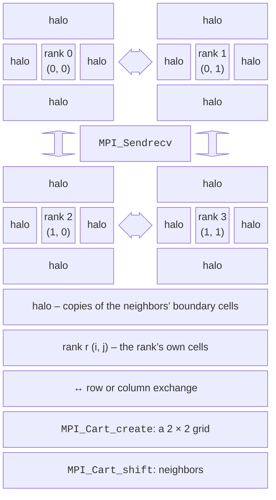

# Collective operations and communicators

## Collective operations

A **collective** operation is performed by **all** processes of a communicator: each process calls the same function with consistent arguments. Collectives are simpler and usually faster than loops with `MPI_Send`/`MPI_Recv`: the implementation chooses an algorithm for the number of processes and the data size. The main operations are shown in Fig. 12.5 and Table 12.7.

```mermaid
block-beta
  columns 1
  block:op0
    columns 9
    op0t["<code>MPI_Bcast</code>"]:9
    space:4 op0ar<["&nbsp;"]>(right) space:4
    op0x00["A"] op0x01[" "] op0x02[" "] op0x03[" "] op0p0["P0"] op0y00["A"] op0y01[" "] op0y02[" "] op0y03[" "]
    op0x10[" "] op0x11[" "] op0x12[" "] op0x13[" "] op0p1["P1"] op0y10["A"] op0y11[" "] op0y12[" "] op0y13[" "]
    op0x20[" "] op0x21[" "] op0x22[" "] op0x23[" "] op0p2["P2"] op0y20["A"] op0y21[" "] op0y22[" "] op0y23[" "]
    op0x30[" "] op0x31[" "] op0x32[" "] op0x33[" "] op0p3["P3"] op0y30["A"] op0y31[" "] op0y32[" "] op0y33[" "]
  end
  block:op1
    columns 9
    op1t["<code>MPI_Scatter</code>"]:9
    space:4 op1ar<["&nbsp;"]>(right) space:4
    op1x00["A"] op1x01["B"] op1x02["C"] op1x03["D"] op1p0["P0"] op1y00["A"] op1y01[" "] op1y02[" "] op1y03[" "]
    op1x10[" "] op1x11[" "] op1x12[" "] op1x13[" "] op1p1["P1"] op1y10["B"] op1y11[" "] op1y12[" "] op1y13[" "]
    op1x20[" "] op1x21[" "] op1x22[" "] op1x23[" "] op1p2["P2"] op1y20["C"] op1y21[" "] op1y22[" "] op1y23[" "]
    op1x30[" "] op1x31[" "] op1x32[" "] op1x33[" "] op1p3["P3"] op1y30["D"] op1y31[" "] op1y32[" "] op1y33[" "]
  end
  block:op2
    columns 9
    op2t["<code>MPI_Gather</code>"]:9
    space:4 op2ar<["&nbsp;"]>(right) space:4
    op2x00["A"] op2x01[" "] op2x02[" "] op2x03[" "] op2p0["P0"] op2y00["A"] op2y01["B"] op2y02["C"] op2y03["D"]
    op2x10["B"] op2x11[" "] op2x12[" "] op2x13[" "] op2p1["P1"] op2y10[" "] op2y11[" "] op2y12[" "] op2y13[" "]
    op2x20["C"] op2x21[" "] op2x22[" "] op2x23[" "] op2p2["P2"] op2y20[" "] op2y21[" "] op2y22[" "] op2y23[" "]
    op2x30["D"] op2x31[" "] op2x32[" "] op2x33[" "] op2p3["P3"] op2y30[" "] op2y31[" "] op2y32[" "] op2y33[" "]
  end
  block:op3
    columns 9
    op3t["<code>MPI_Allgather</code>"]:9
    space:4 op3ar<["&nbsp;"]>(right) space:4
    op3x00["A"] op3x01[" "] op3x02[" "] op3x03[" "] op3p0["P0"] op3y00["A"] op3y01["B"] op3y02["C"] op3y03["D"]
    op3x10["B"] op3x11[" "] op3x12[" "] op3x13[" "] op3p1["P1"] op3y10["A"] op3y11["B"] op3y12["C"] op3y13["D"]
    op3x20["C"] op3x21[" "] op3x22[" "] op3x23[" "] op3p2["P2"] op3y20["A"] op3y21["B"] op3y22["C"] op3y23["D"]
    op3x30["D"] op3x31[" "] op3x32[" "] op3x33[" "] op3p3["P3"] op3y30["A"] op3y31["B"] op3y32["C"] op3y33["D"]
  end
  block:op4
    columns 9
    op4t["<code>MPI_Reduce</code>"]:9
    space:4 op4ar<["&nbsp;"]>(right) space:4
    op4x00["1"] op4x01[" "] op4x02[" "] op4x03[" "] op4p0["P0"] op4y00["10"] op4y01[" "] op4y02[" "] op4y03[" "]
    op4x10["2"] op4x11[" "] op4x12[" "] op4x13[" "] op4p1["P1"] op4y10[" "] op4y11[" "] op4y12[" "] op4y13[" "]
    op4x20["3"] op4x21[" "] op4x22[" "] op4x23[" "] op4p2["P2"] op4y20[" "] op4y21[" "] op4y22[" "] op4y23[" "]
    op4x30["4"] op4x31[" "] op4x32[" "] op4x33[" "] op4p3["P3"] op4y30[" "] op4y31[" "] op4y32[" "] op4y33[" "]
  end
  block:op5
    columns 9
    op5t["<code>MPI_Allreduce</code>"]:9
    space:4 op5ar<["&nbsp;"]>(right) space:4
    op5x00["1"] op5x01[" "] op5x02[" "] op5x03[" "] op5p0["P0"] op5y00["10"] op5y01[" "] op5y02[" "] op5y03[" "]
    op5x10["2"] op5x11[" "] op5x12[" "] op5x13[" "] op5p1["P1"] op5y10["10"] op5y11[" "] op5y12[" "] op5y13[" "]
    op5x20["3"] op5x21[" "] op5x22[" "] op5x23[" "] op5p2["P2"] op5y20["10"] op5y21[" "] op5y22[" "] op5y23[" "]
    op5x30["4"] op5x31[" "] op5x32[" "] op5x33[" "] op5p3["P3"] op5y30["10"] op5y31[" "] op5y32[" "] op5y33[" "]
  end
  n["P0–P3 – processes (root – P0);<br>columns – data elements;<br>reduction operation – sum"]
```



Figure 12.5. MPI collective operations {.caption}

Table 12.7. Collective operations {.caption}

| **Operation** | **Action** |
| --- | --- |
| `MPI_Bcast` | broadcast the root’s data to all processes |
| `MPI_Scatter` | split the root’s array into equal parts: part $i$ goes to process $i$ |
| `MPI_Gather` | gather equal parts from all processes into the root’s array |
| `MPI_Scatterv`, `MPI_Gatherv` | the same for parts of **different** sizes: arrays of counts `counts` and displacements `displs` |
| `MPI_Allgather` | gather the parts in all processes |
| `MPI_Alltoall` | each process sends part $i$ to process $i$ (“transpose”) |
| `MPI_Reduce` | combine values with an operation (`MPI_SUM`, `MPI_PROD`, `MPI_MIN`, `MPI_MAX`, `MPI_LAND`, `MPI_MINLOC` …) at the root |
| `MPI_Allreduce` | the same with the result in all processes |
| `MPI_Scan` | prefix reduction: process $i$ receives the result for processes $0 \dots i$ |
| `MPI_Barrier` | synchronization without data |

```cpp
// Root 0 has size · 2 numbers; each process receives 2.
std::vector<int> send, recv(size), mine(2);
if (rank == 0)
    for (int i = 0; i < size * 2; ++i) send.push_back(i * 10);
MPI_Scatter(send.data(), 2, MPI_INT, mine.data(), 2, MPI_INT, 0,
            MPI_COMM_WORLD);
int local = mine[0] + mine[1];
MPI_Gather(&local, 1, MPI_INT, recv.data(), 1, MPI_INT, 0,
           MPI_COMM_WORLD);                // on rank 0: 10 50 90 130
```

In `MPI_Scatter` and `MPI_Gather`, the element count is given **per process**, and the root’s array has `size` parts. The `MPI_IN_PLACE` value in place of the send buffer means “the data is already in the result buffer”: `MPI_Allreduce(MPI_IN_PLACE, &sum, 1, MPI_DOUBLE, MPI_SUM, comm)` replaces the local sum with the global one.

Rules for collective operations:

- **all** processes of the communicator call them in the **same order**; if one process skips a call (for example, because of `if (rank != 0)`), the program hangs;
- collective operations have no tags and do not mix with point-to-point operations;
- except for `MPI_Barrier`, they do not necessarily synchronize processes: the root of `MPI_Bcast` may return before the others receive the data;
- reductions on floating-point numbers combine values in an order that depends on the number of processes, so the last digits of a sum differ (as with OpenMP reductions).

**Algorithms.** A naive `MPI_Bcast` implemented as sequential `MPI_Send` calls from the root takes $p - 1$ transfers. Implementations use a **binomial tree**: at each step, every process that already has the data passes it to another, and all $p$ processes receive the data in $\log_{2} p$ steps. For large arrays, `MPI_Allreduce` runs as a **ring**: the array is split into $p$ parts that travel around the ring so that each process transfers only about $2 n$ elements regardless of $p$. Open MPI chooses the algorithm automatically (the `coll/tuned` component).

The MPI-3 standard added **nonblocking collective operations** such as `MPI_Ibcast` and `MPI_Iallreduce`, which return an `MPI_Request` and complete with `MPI_Wait`, and MPI-4.0 added **persistent** collectives for exchanges that repeat in a loop.

## Derived types, communicators, and topologies

### Derived datatypes

To send a structure or non-contiguous array elements in one message, you create a **derived datatype**: a description of how the data is laid out in memory. The type is created, registered with `MPI_Type_commit`, and freed after use with `MPI_Type_free`:

- `MPI_Type_contiguous(n, old, &t)` describes $n$ contiguous elements;
- `MPI_Type_vector(count, blocklen, stride, old, &t)` describes `count` blocks of `blocklen` elements with stride `stride`; this is how a **column** of a row-major matrix is described;
- `MPI_Type_create_struct` describes a structure with fields of different types.

```cpp
struct Sale
{
    int shop;          // store number
    double amount;     // amount, UAH
    char date[11];     // "2026-09-18"
};

int lengths[3] = {1, 1, 11};
MPI_Aint offsets[3] = {offsetof(Sale, shop), offsetof(Sale, amount),
                       offsetof(Sale, date)};
MPI_Datatype types[3] = {MPI_INT, MPI_DOUBLE, MPI_CHAR};
MPI_Datatype saleType;
MPI_Type_create_struct(3, lengths, offsets, types, &saleType);
MPI_Type_commit(&saleType);
MPI_Send(sales, 2, saleType, 1, 0, MPI_COMM_WORLD);   // 2 records
// …
MPI_Type_free(&saleType);
```

Field offsets are taken with the `offsetof` macro (header `<cstddef>`) rather than computed by hand: the compiler aligns fields, and there are 4 unused bytes between `int` and `double`. The type’s *extent*, returned by `MPI_Type_get_extent`, equals `sizeof(Sale)` = 32 bytes here, so an array of records is transferred correctly. Structures with `std::string` or `std::vector` cannot be sent this way: they contain pointers into the process’s memory.

### New communicators

The `MPI_Comm_split(comm, color, key, &newcomm)` function divides processes into groups: processes with the same `color` end up in one new communicator, and `key` sets the order of ranks in it. Collective operations in the new communicator involve only its processes.

```cpp
int color = rank % 2;                     // even and odd ranks
MPI_Comm half;
MPI_Comm_split(MPI_COMM_WORLD, color, rank, &half);
int halfRank, halfSize, sum = 0;
MPI_Comm_rank(half, &halfRank);
MPI_Comm_size(half, &halfSize);
MPI_Allreduce(&rank, &sum, 1, MPI_INT, MPI_SUM, half);
std::println("world {} -> group {}: rank {} of {}, sum {}",
             rank, color, halfRank, halfSize, sum);
MPI_Comm_free(&half);
```

```
world 0 -> group 0: rank 0 of 2, sum 2
world 1 -> group 1: rank 0 of 2, sum 4
world 2 -> group 0: rank 1 of 2, sum 2
world 3 -> group 1: rank 1 of 2, sum 4
```

This is how, for example, computations along the rows and columns of a process grid, or separate groups for independent subtasks, are organized. The `MPI_Comm_split_type` function with `MPI_COMM_TYPE_SHARED` creates a communicator of processes on **the same node**, which is useful for hybrid programs.

### Cartesian topologies

For grid problems, it is convenient to arrange processes in a **Cartesian topology**, a grid of dimension 1, 2, or 3 (Fig. 12.6):

```cpp
int dims[2] = {0, 0}, periods[2] = {1, 1};  // torus: edges wrap around
MPI_Dims_create(size, 2, dims);             // 4 → 2 × 2, 8 → 4 × 2
MPI_Comm grid;
MPI_Cart_create(MPI_COMM_WORLD, 2, dims, periods, 1, &grid);
int up, down, left, right;
MPI_Cart_shift(grid, 0, 1, &up, &down);     // neighbors along rows
MPI_Cart_shift(grid, 1, 1, &left, &right);  // neighbors along columns
```

`MPI_Dims_create` picks the most “square” grid possible, `MPI_Cart_create` creates a communicator with the topology (the `reorder = 1` parameter lets the library renumber processes, so the rank is taken from the new communicator), `MPI_Cart_coords` returns a process’s coordinates, and `MPI_Cart_shift` returns the ranks of the neighbors in a given dimension. At the edge of a non-periodic grid, the neighbor equals `MPI_PROC_NULL`: an exchange with it does nothing, so boundary processes need no special conditions.



Figure 12.6. Domain decomposition and halo exchange {.caption}

**Domain decomposition** divides a grid into blocks, one per process. Computing the boundary nodes of a block requires values from neighboring blocks, so each block has a frame of **halo** cells (*halo, ghost cells*) with copies of the neighbors’ boundary nodes. Before each step, processes exchange halos (`MPI_Sendrecv` with each neighbor) and then compute their own nodes independently. The amount of communication is proportional to the block’s **perimeter**, and the amount of computation to its **area**, so a two-dimensional decomposition beats strips when there are many processes. An example of a Cartesian topology for the Game of Life is given in the lab.

## Parallel algorithms with message passing

Most MPI programs follow a few typical schemes (Table 12.8).

Table 12.8. Typical schemes of MPI parallel algorithms {.caption}

| **Scheme** | **Implementation with MPI** |
| --- | --- |
| integration, Monte Carlo | each process handles its share of steps or random points (a generator with a separate seed per rank), and `MPI_Reduce` sums the results; only a few numbers are exchanged |
| manager–worker (*master–worker*) | rank 0 hands out tasks one at a time, and a worker receives the next one after replying (`MPI_ANY_SOURCE`, “work”/“stop” tags); dynamic distribution for uneven tasks |
| matrix multiplication | `MPI_Bcast` of matrix $B$, `MPI_Scatter` of rows of $A$, local multiplication, `MPI_Gather` of rows of $C$; for large matrices, blocks on a process grid (Cannon’s algorithm) |
| odd–even sort | each process sorts its part; $p$ phases of exchange with a neighbor (`MPI_Sendrecv` of the parts), and after merging, the lower process keeps the smaller elements |
| Jacobi method, cellular automata | domain decomposition, halo exchange with neighbors at every step, `MPI_Allreduce` for the error norm |

The common rule is to **minimize the number and volume of messages**. Every message has a fixed latency, so one message of 1000 numbers is much cheaper than 1000 messages of one number each; data needed by everyone is distributed with a collective operation rather than from each process separately. The Mandelbrot set in the lab is an example of the manager–worker scheme, and the Jacobi method with decomposition is shown in the “Program examples” section.
