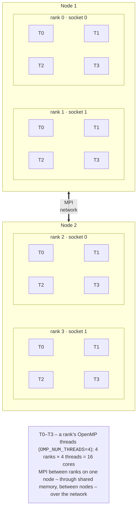

# Hybrid programs and performance

## Hybrid MPI + OpenMP programs

A **hybrid** program combines two models: MPI between processes (usually one or two per node, one per socket) and OpenMP between threads inside a process (Fig. 12.7). Advantages over “pure” MPI, where a rank occupies every core:

- fewer processes mean fewer messages and fewer copies of halos and auxiliary arrays in a node’s memory;
- threads share data without copying, and the load inside a node can be balanced with `schedule(dynamic)`;
- collective operations on thousands of nodes involve fewer participants.

Disadvantages: programming is harder, OpenMP parallelizes only loops, part of the code (communication) runs in a single thread, and incorrect binding easily wipes out the gain.



Figure 12.7. A hybrid MPI + OpenMP program {.caption}

### Thread support levels

If a program has threads, MPI is initialized with `MPI_Init_thread`, specifying how threads will call MPI functions (Table 12.9). The library returns in `provided` the level it actually supports; if it is lower than required, the program must terminate.

Table 12.9. Thread support levels in MPI {.caption}

| **Level** | **Who calls MPI functions** |
| --- | --- |
| `MPI_THREAD_SINGLE` | the process has only one thread |
| `MPI_THREAD_FUNNELED` | there are many threads, but only the main thread calls MPI (outside parallel regions or in `masked`) |
| `MPI_THREAD_SERIALIZED` | any thread, but not concurrently (for example, in `critical`) |
| `MPI_THREAD_MULTIPLE` | any threads concurrently; the most convenient but the slowest |

```cpp
int provided = 0;
MPI_Init_thread(&argc, &argv, MPI_THREAD_FUNNELED, &provided);
if (provided < MPI_THREAD_FUNNELED)
    MPI_Abort(MPI_COMM_WORLD, 1);
// …
for (int it = 0; it < iters; ++it)
{
    ExchangeHalo(u);                      // MPI – main thread only
    #pragma omp parallel for              // computation – by threads
    for (long i = 1; i <= local; ++i) v[i] = Update(u, i);
    u.swap(v);
}
```

The most common scheme is `MPI_THREAD_FUNNELED`: communication runs between parallel regions, that is, sequentially, while loops run in parallel. Open MPI 5.0 in the Ubuntu package returns exactly this level when `MPI_THREAD_MULTIPLE` is requested (verified by printing `provided` = 3), but `FUNNELED` is sufficient for the programs in this course.

### Rank placement and binding

To keep processes and threads from interfering with each other, each rank is bound to a **separate set of cores**, and OpenMP threads are bound to cores within that set (Topic 10). In Open MPI 5.0, placement is controlled by the `--map-by` and `--bind-to` options; the default binding is described in the `mpirun` documentation: to a core for 1–2 processes, to a socket (*package*) for more, and no binding with `--oversubscribe`. In version 5.0.10 in WSL, processes were bound to cores even with `-np 4` and `-np 8`, so always check the actual binding with the `--report-bindings` option.

Table 12.10. Rank placement and binding in Open MPI 5.0 {.caption}

| **Option** | **Placement** |
| --- | --- |
| `--map-by core` (default) | ranks in turn on cores: 0, 1, 2, … |
| `--map-by slot:PE=4` | 4 consecutive cores (*processing elements*) for each rank |
| `--map-by ppr:2:package:PE=4` | 2 ranks per socket, 4 cores each |
| `--map-by node` | ranks in turn on nodes (round-robin distribution) |
| `--map-by …:HWTCPUS`, `--use-hwthread-cpus` | the placement unit is a logical processor |
| `--bind-to core`, `package`, `none` | bind to a core or socket, or do not bind |

The command for 2 ranks with 4 threads each on 8 cores:

```bash
export OMP_NUM_THREADS=4 OMP_PLACES=cores OMP_PROC_BIND=close
mpirun -np 2 --map-by slot:PE=4 --report-bindings ./build/jacobi
```

```
[Intel:10420] Rank 0 bound to package[0][core:L0-3]
[Intel:10420] Rank 1 bound to package[0][core:L4-7]
```

Rank 0 got cores 0–3, and rank 1 got cores 4–7; OpenMP threads with `OMP_PLACES=cores` are placed only within their rank’s cores (Fig. 12.8). The `-x OMP_NUM_THREADS` option passes the variable to processes on other nodes; on a single computer, processes inherit the environment anyway.

::: info Screenshot
Ubuntu terminal (WSL2): `OMP_NUM_THREADS=4 mpirun -np 2 --map-by slot:PE=4 --report-bindings ./build/jacobi`; the two “Rank N bound to package[0][core:L…]” lines and the program output
:::

Figure 12.8. Binding the ranks of a hybrid program to cores {.caption}

::: tip Warning
A single process `mpirun -np 1` is bound to **one** core by default, and all its OpenMP threads compete for that core. In this lecture’s measurements, the Jacobi method with 8 threads ran 3.3 times slower this way than with `--bind-to none` or `--map-by slot:PE=8`. The rule: the number of cores per rank (`PE`) must equal `OMP_NUM_THREADS`.
:::

## Running on multiple computers

On multiple computers (virtual machines or cluster nodes), `mpirun` launches processes over SSH (<https://docs.open-mpi.org/en/v5.0.x/launching-apps/ssh.html>). The Open MPI 5.0 documentation requires:

1. every node can log in to every node over SSH **without a password or passphrase**: processes are launched as a tree, that is, not only from the first node;
2. all nodes have the same version of Open MPI installed **at the same path** (in the Ubuntu packages, `/usr/bin`), so `mpirun`, the libraries, and the program are found without configuring `PATH` and `LD_LIBRARY_PATH`;
3. the program resides on all nodes at the same path: in a shared NFS folder (Topic 13) or copied to each node;
4. the nodes can see each other by name (`/etc/hosts` or DNS), and the firewall allows TCP connections between them (Open MPI uses dynamic ports).

The steps for three virtual machines `node1`–`node3` running Ubuntu 26.04 (4 cores each) connected by a 1 Gbit/s network:

```bash
# On each VM: the same user, Open MPI, a compiler.
sudo apt install openmpi-bin libopenmpi-dev g++ cmake ninja-build
# On node1: a key without a passphrase, copied to all nodes (and itself).
ssh-keygen -t ed25519 -N "" -f ~/.ssh/id_ed25519
for h in node1 node2 node3; do ssh-copy-id $h; done
for h in node1 node2 node3; do ssh $h hostname; done  # no password
# The same key on node2 and node3 (every node to every node).
for h in node2 node3; do scp ~/.ssh/id_ed25519* $h:.ssh/; done
```

The *hostfile* lists names and slot counts; lines starting with `#` are comments:

```
# hosts – nodes of the lab setup
node1 slots=4
node2 slots=4
node3 slots=4
```

```bash
mpirun --hostfile hosts -np 12 ./build/hello
mpirun --host node1:4,node2:4 -np 8 ./build/pi
mpirun --hostfile hosts -np 3 --map-by node ./build/pingpong
# Only the VM network 192.168.50.0/24 for MPI and the launch services:
mpirun --hostfile hosts -np 12 \
    --mca btl_tcp_if_include 192.168.50.0/24 \
    --prtemca oob_tcp_if_include 192.168.50.0/24 ./build/pi
```

Without `slots=` in the hostfile, Open MPI treats each node’s cores as slots, and with `--host` without `:N`, one slot per node. The `--map-by node` option places ranks one per node in turn (to measure network communication between two ranks on different nodes). If the VMs have several network adapters (NAT and an internal network), communication must be explicitly directed to the internal network with the `btl_tcp_if_include` (for MPI messages) and `oob_tcp_if_include` (for PRRTE service connections) parameters; otherwise the launch hangs on an unreachable address. The result of running on three VMs is shown in Fig. 12.9.

::: info Screenshot
Terminal on node1 (Ubuntu 26.04 VM): `cat hosts`, `mpirun --hostfile hosts -np 12 ./build/hello`; “Rank N of 12 on node1/node2/node3” lines from all three VMs
:::

Figure 12.9. Running an MPI program on three virtual machines {.caption}

On a cluster with a job scheduler, `mpirun` takes nodes and slots from the scheduler’s allocation, and jobs are launched with `srun --mpi=pmix` in an `sbatch` script; this is covered in Topic 13.

## Performance analysis

### The α–β model

The time to transfer a message of $m$ bytes is estimated with the **α–β model** (Hockney’s model):

$$
T (m) = \alpha + \beta m ,
$$

where $\alpha$ is the **latency**, the time for a message without data (library calls, the network stack), and $\beta$ is the time to transfer one byte, the inverse of the **bandwidth** $B = 1 / \beta$. For small messages $\alpha$ dominates, and for large ones $\beta m$ does. The parameters are measured with a “ping-pong” program: rank 0 sends a message to rank 1, which returns it, and half of the round-trip time equals $T (m)$.

```cpp
for (int r = 0; r < reps; ++r)
{
    if (rank == 0)
    {
        MPI_Send(buffer.data(), bytes, MPI_CHAR, 1, 0,
                 MPI_COMM_WORLD);
        MPI_Recv(buffer.data(), bytes, MPI_CHAR, 1, 0, MPI_COMM_WORLD,
                 MPI_STATUS_IGNORE);
    }
    else if (rank == 1)
    {
        MPI_Recv(buffer.data(), bytes, MPI_CHAR, 0, 0, MPI_COMM_WORLD,
                 MPI_STATUS_IGNORE);
        MPI_Send(buffer.data(), bytes, MPI_CHAR, 0, 0,
                 MPI_COMM_WORLD);
    }
}
double t = (MPI_Wtime() - start) / reps / 2;   // one way
```

The complete `pingpong.cpp` program (sizes from 1 byte to 16 MB in steps of ×16, 1000 repetitions for small and 50 for large messages) was run with two ranks in WSL: through shared memory (Open MPI’s default choice on a single computer) and through TCP on the loopback interface (`--mca pml ob1 --mca btl self,tcp`), which imitates the network stack without an actual network (Table 12.11).

Table 12.11. “Ping-pong” message transfer time in WSL {.caption}

| **Bytes** | **Shared memory, µs** | **MB/s** | **TCP (loopback), µs** | **MB/s** |
| --- | --- | --- | --- | --- |
| 1 | 0.14 | 7 | 2.89 | 0 |
| 4096 | 1.20 | 3418 | 3.69 | 1111 |
| 65,536 | 5.56 | 11,796 | 18.43 | 3555 |
| 1,048,576 | 59.41 | 17,649 | 109.59 | 9568 |
| 16,777,216 | 1875.23 | 8947 | 2200.45 | 7624 |

In shared memory, $\alpha \approx 0 {,} 14$ µs, and the highest bandwidth is about 17 GB/s for 1 MB messages (16 MB no longer fits in the L3 cache, and the speed halves). The TCP network stack adds about 3 µs to the latency even without a network. On a real 1 Gbit/s Ethernet network between virtual machines, typical values are much worse: $\alpha$ is tens of microseconds, and $B$ is at most 117 MB/s (the theoretical limit of 125 MB/s minus frame headers). These values are a guideline for prediction; students measure the actual parameters of their setup with the same program and `--map-by node`.

**A prediction example.** The Jacobi method on a $4000 \times 4000$ grid of floating-point numbers divided into 4 strips sends each neighbor a row of 4000 numbers (32,000 bytes) at every step. With $\alpha = 50$ µs and $B = 110$ MB/s, one exchange takes $50 + 32000 / 110 \approx 340$ µs, while computing a strip of 4 million nodes takes a few milliseconds, so communication takes about 10 % of the time. On 64 processes, a strip becomes 16 times narrower and computation shrinks 16 times, but the exchange does not, and communication dominates. That is why, for many processes, one moves to two-dimensional decomposition and hybrid programs.

### Strong and weak scaling

**Strong scaling**: the problem size is fixed and the number of processes grows; ideally, time decreases by a factor of $p$, and the limit is set by Amdahl’s law (Topic 1). **Weak scaling**: the problem size grows in proportion to $p$ (a constant amount per process); ideally, time does not change, and the efficiency $E = T_{1} / T_{p}$ shows the losses to communication (Gustafson’s law). For MPI programs, the **communication fraction** is also measured: the part of the time spent in communication functions (in the lecture examples, the total `MPI_Sendrecv` time, `Tcomm`). On a single computer, this time also includes waiting for slower neighbors, that is, load imbalance.

While the program runs, the rank processes are visible in `htop` (Fig. 12.10): each rank is a separate process, a child of `prterun` (the name of `mpirun` in Open MPI 5.0). On a cluster, node load is viewed the same way on each node or with monitoring tools (Topic 13).

::: info Screenshot
Ubuntu terminal (WSL2): `htop` in tree view (F5) while `mpirun -np 8 ./build/jacobi 8000000 5000` runs in a second terminal; eight `jacobi` processes under `prterun`, eight loaded cores
:::

Figure 12.10. MPI rank processes on the computer {.caption}

Time measured on a single computer does not transfer directly to a cluster: in WSL, processes communicate through shared memory (latency under a microsecond), but they share one memory bus and the L3 cache, and the processor frequency drops when all cores are loaded. On a cluster, the situation is the opposite: each node’s memory is separate, and the network is two orders of magnitude slower.
