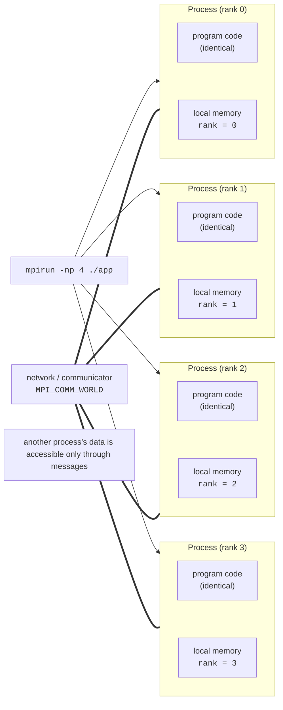

# The MPI standard and running programs

## The distributed-memory model and the MPI standard

In Topics 9–11, all threads worked in the **shared memory** of a single computer: any thread could read any variable of the program. A compute cluster (Topic 13) consists of many **nodes**, separate computers connected by a network. Each node has its own RAM, and a process on one node cannot access the memory of another. This is the **distributed-memory** model: processes exchange data only through **messages**, which one process explicitly sends and another receives.

**MPI** (*Message Passing Interface*) is a standard message-passing library for C, C++, and Fortran. The standard describes functions (`MPI_Send`, `MPI_Recv`, `MPI_Bcast`, and so on), and standard-compliant implementations provide the library and launch tools. An MPI program usually follows the **SPMD** model (*Single Program, Multiple Data*): the launcher creates $p$ **processes** running the same program, and each process receives its own number, a **rank** from 0 to $p - 1$, which it uses to decide which part of the data to process (Fig. 12.1). The processes are grouped into a **communicator**, a group of processes within which they exchange messages; the communicator of all processes of the program is called `MPI_COMM_WORLD`.



Figure 12.1. The SPMD model with distributed memory {.caption}

Unlike threads, MPI processes share nothing: each has its own copies of all variables, so there are no data races between processes, and every exchange is visible in the program text. The price is explicit data partitioning and the time spent passing messages. The same processes can run on a single computer (exchange through shared memory, fast) or on several cluster nodes (exchange over the network, slower) without changing the program.

### The standard and its implementations

The standard is developed by the **MPI Forum** (<https://www.mpi-forum.org/docs/>), which includes implementation developers, hardware vendors, and supercomputing centers (Table 12.1).

Table 12.1. Versions of the MPI standard {.caption}

| **Version** | **Adopted** | **Main new features** |
| --- | --- | --- |
| MPI-3.1 | June 2015 | nonblocking collective operations, one-sided communication (RMA), additions to MPI-3.0; the basis of most implementations |
| MPI-4.0 | June 2021 | sessions, partitioned communication, “large” counts `MPI_Count`, persistent collective operations |
| MPI-4.1 | November 2023 | clarifications and corrections to MPI-4.0 |
| MPI-5.0 | June 2025 | for the first time, a standard binary interface (*ABI*): a program built with one implementation can run with another |

The most widely used open implementations:

- **Open MPI** (<https://www.open-mpi.org/>) is the implementation used in this course. In September 2026 the current branch is 5.0.x (latest version 5.0.11, with 6.0 in preparation); the developers claim full compliance with MPI-3.1 and many MPI-4.0 features. Processes are launched by the **PRRTE** runtime through the **PMIx** interface (*Process Management Interface for Exascale*), which job schedulers such as Slurm (Topic 13) also use to work with Open MPI.
- **MPICH** (<https://www.mpich.org/>) is the reference implementation from Argonne National Laboratory; the 5.0 branch (stable version 5.0.1) fully supports MPI-5.0. Intel MPI and supercomputer vendors’ implementations are based on MPICH.
- **Microsoft MPI** (<https://learn.microsoft.com/message-passing-interface/microsoft-mpi>) is an implementation for Windows compatible with MPICH (latest version 10.1.3); it lags behind newer versions of the standard, and cluster nodes run Linux, so in this course MPI programs are built and run in Ubuntu (in WSL2 or on virtual machines).

A program written to the standard builds with any implementation without changes; only the launchers and their parameters differ. All commands below are given for Open MPI 5.0.

## Installing, building, and running

### Installing on Ubuntu

On Ubuntu 26.04, Open MPI is installed from the distribution packages (version 5.0.10 with PMIx 5.0.9):

```bash
sudo apt install openmpi-bin libopenmpi-dev   # mpirun, headers
ompi_info --version                           # Open MPI v5.0.10
mpicxx --showme                               # what the wrapper adds
```

The `openmpi-bin` package contains the `mpirun` launcher (aliases `mpiexec`, `prterun`) and the **wrapper compilers** `mpicc` and `mpicxx`, and `libopenmpi-dev` contains the `mpi.h` header and the libraries. The wrapper calls the ordinary `g++` and adds the paths to the MPI headers and library; the `mpicxx --showme` command shows this call:

```
g++ -I/usr/lib/x86_64-linux-gnu/openmpi/include
    -I/usr/lib/x86_64-linux-gnu/openmpi/include/openmpi
    -L/usr/lib/x86_64-linux-gnu/openmpi/lib -lmpi
```

Check the version with `ompi_info --version`. In the Ubuntu 26.04 packages, `mpirun --version` prints the message `Sorry! You were supposed to get help about: version But I couldn't open the help file` instead of the version: the PRRTE help files did not make it into the package. Other `mpirun` error messages are printed “without text” in the same way, so the important part is the word after `help about:`, which is the error name (see examples in the “Common mistakes” section).

### A CMake project

A single-file program can be built with the wrapper: `mpicxx -std=c++23 -O2 hello.cpp -o hello`. In a CMake project, the `FindMPI` module (<https://cmake.org/cmake/help/latest/module/FindMPI.html>) finds the MPI library and creates the imported target `MPI::MPI_CXX`, which adds all the necessary flags without the wrapper. Hybrid programs also add `OpenMP::OpenMP_CXX` (Topic 10). A single `CMakeLists.txt` builds all the lecture examples:

```cmake
cmake_minimum_required(VERSION 3.28)
project(MpiExamples LANGUAGES CXX)

set(CMAKE_CXX_STANDARD 23)
set(CMAKE_CXX_STANDARD_REQUIRED ON)
if(NOT CMAKE_BUILD_TYPE)
    set(CMAKE_BUILD_TYPE Release)
endif()

find_package(MPI REQUIRED)
find_package(OpenMP REQUIRED)

foreach(name hello pi ring pingpong jacobi)
    add_executable(${name} ${name}.cpp)
    target_link_libraries(${name} PRIVATE MPI::MPI_CXX)
endforeach()
# Hybrid program: MPI between processes, OpenMP inside.
target_link_libraries(jacobi PRIVATE OpenMP::OpenMP_CXX)
```

During configuration (`cmake -S . -B build -G Ninja`), CMake prints the lines `Found MPI_CXX: …/libmpi.so (found version "3.1")` and `Found OpenMP_CXX: -fopenmp (found version "4.5")`: the MPI version is the version of the standard that the implementation fully claims (the `MPI_VERSION` and `MPI_SUBVERSION` macros, and the `MPI API: 3.1.0` line in `ompi_info`), not the Open MPI version. The module also sets the variables `MPIEXEC_EXECUTABLE` (the path to `mpiexec`) and `MPIEXEC_NUMPROC_FLAG` (`-n`), which are used for CTest tests.

### A first program

Every MPI program starts with a call to `MPI_Init` and ends with `MPI_Finalize`; between them, a process learns the number of processes and its own rank:

```cpp
#include <mpi.h>
#include <print>
#include <string_view>

int main(int argc, char* argv[])
{
    MPI_Init(&argc, &argv);

    int size = 0, rank = 0;
    MPI_Comm_size(MPI_COMM_WORLD, &size);   // number of processes
    MPI_Comm_rank(MPI_COMM_WORLD, &rank);   // number of this process

    char host[MPI_MAX_PROCESSOR_NAME];
    int length = 0;
    MPI_Get_processor_name(host, &length);

    if (rank == 0)
    {
        char version[MPI_MAX_LIBRARY_VERSION_STRING];
        MPI_Get_library_version(version, &length);
        std::string_view text(version);       // up to the first comma
        std::println("MPI {}.{}, {}", MPI_VERSION, MPI_SUBVERSION,
                     text.substr(0, text.find(',')));
    }
    std::println("Rank {} of {} on {}", rank, size, host);

    MPI_Finalize();
}
```

The program is built and run with four processes (Fig. 12.2):

```bash
cmake -S . -B build -G Ninja && cmake --build build
mpirun -np 4 ./build/hello
```

```
Rank 1 of 4 on Intel
Rank 3 of 4 on Intel
Rank 2 of 4 on Intel
MPI 3.1, Open MPI v5.0.10
Rank 0 of 4 on Intel
```

Each process prints its own line, and the launcher forwards the output of all processes to the terminal in the order it arrives, so the order of lines differs every time. `Intel` is the computer name (in WSL, it matches the name of the Windows computer). On a cluster, the `MPI_Get_processor_name` function shows which node a process runs on.

::: info Screenshot
Windows Terminal, Ubuntu 26.04 (WSL2): `cmake --build build`, then `mpirun -np 4 ./build/hello`; unordered “Rank N of 4 on …” lines
:::

Figure 12.2. Building and running an MPI program {.caption}

### The mpirun launcher

The launcher places processes into **slots**, places for processes. For the local computer, Open MPI treats a **physical core** as a slot by default, so on the i9-11900KF (8 cores, 16 logical processors) the command `mpirun -np 16` fails with the error `prte-rmaps-base:alloc-error` (“not enough slots”). The main `mpirun` options (<https://docs.open-mpi.org/en/v5.0.x/man-openmpi/man1/mpirun.1.html>) are listed in Table 12.2.

Table 12.2. Main `mpirun` options in Open MPI 5.0 {.caption}

| **Option** | **Purpose** |
| --- | --- |
| `-np N` (`-n N`) | number of processes |
| `--use-hwthread-cpus` | logical processors are treated as slots (16 instead of 8); processes are bound to logical processors |
| `--oversubscribe` | allow more processes than slots; the processes are then **not bound** to cores and wait in a “yielding” mode |
| `--hostfile file`, `--host a:4,b:4` | nodes and the number of slots on them (see “Running on multiple computers”) |
| `--map-by …`, `--bind-to …` | process placement and binding to cores (see “Hybrid programs”) |
| `--report-bindings` | print the binding of each rank |
| `--output tag` | tag each output line with the rank: `[1,0]<stdout>:` |
| `-x NAME[=value]` | pass an environment variable to processes on other nodes |
| `--mca parameter value` | set an Open MPI component (MCA) parameter, for example the network |

The SPMD model is not mandatory: `mpirun -np 1 ./master : -np 4 ./worker` launches **different** programs in one `MPI_COMM_WORLD` (the MPMD model), and ranks are numbered consecutively.

### MPI in CLion

A project with a `CMakeLists.txt` is opened in CLion (Topic 9) with the WSL toolchain: *File → Settings → Build, Execution, Deployment → Toolchains*, the *+* button → *WSL*, distribution `Ubuntu-26.04` (<https://www.jetbrains.com/help/clion/how-to-use-wsl-development-environment-in-product.html>). The *Run* button runs the program as a single process without `mpirun` (rank 0 of 1). To run with several processes, the CLion documentation (<https://www.jetbrains.com/help/clion/openmpi.html>) recommends a *Shell Script* configuration: *Run → Edit Configurations → +  → Shell Script*, *Execute: Script text*, the text `mpirun -np 4 ./build/hello`, and a *Build* step in the *Before launch* section (Fig. 12.3). An individual rank is debugged by attaching to its process (*Run → Attach to Process*, **Ctrl+Alt+F5**).

::: info Screenshot
CLion: `CMakeLists.txt` with `find_package(MPI REQUIRED)` and `MPI::MPI_CXX`; Shell Script run configuration `mpirun -np 4 …/hello`; Run window with four “Rank N of 4” lines; WSL toolchain in the status bar
:::

Figure 12.3. An MPI project in CLion with the WSL toolchain {.caption}
