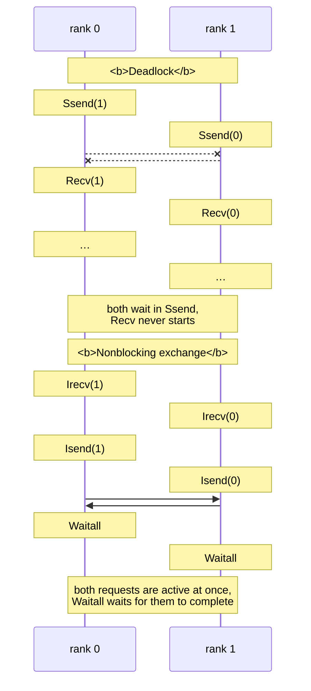

# Point-to-point and nonblocking communication

## The structure of an MPI program

MPI functions have the `MPI_` prefix and return an error code (`MPI_SUCCESS` means success). By default, an error in any function aborts the whole program (the `MPI_ERRORS_ARE_FATAL` handler), so return codes are usually not checked. The main environment functions are listed in Table 12.3.

Table 12.3. Main MPI environment functions {.caption}

| **Function** | **Purpose** |
| --- | --- |
| `MPI_Init(&argc, &argv)` | initialize MPI; called once, before other functions |
| `MPI_Init_thread(…, required, &provided)` | the same with a required level of thread support (see “Hybrid programs”) |
| `MPI_Finalize()` | finish working with MPI; MPI functions must not be called after it |
| `MPI_Comm_size(comm, &size)` | number of processes in the communicator |
| `MPI_Comm_rank(comm, &rank)` | rank of the current process in the communicator |
| `MPI_Get_processor_name(name, &len)` | node name |
| `MPI_Wtime()`, `MPI_Wtick()` | time in seconds (`double`) and clock resolution (in WSL, $10^{- 9}$ s) |
| `MPI_Barrier(comm)` | wait until all processes of the communicator reach the barrier |
| `MPI_Abort(comm, code)` | abort **all** processes with exit code `code` |

**Measuring time.** Process clocks are not synchronized, and processes may start at different times. Therefore `MPI_Barrier` is called before measuring, and the time of the parallel part is taken as the time of the **slowest** process: local intervals are combined with `MPI_Reduce` and `MPI_MAX` (the “Computing π” example).

**Data types.** Communication functions take not bytes but an **element count** and an **MPI type**, so the library correctly transfers data between computers with different number representations (Table 12.4).

Table 12.4. Correspondence between basic MPI and C++ types {.caption}

| **MPI type** | **C++ type** | **MPI type** | **C++ type** |
| --- | --- | --- | --- |
| `MPI_CHAR` | `char` | `MPI_DOUBLE` | `double` |
| `MPI_INT` | `int` | `MPI_FLOAT` | `float` |
| `MPI_LONG_LONG` | `long long` | `MPI_UINT8_T` | `std::uint8_t` |
| `MPI_UNSIGNED` | `unsigned` | `MPI_CXX_BOOL` | `bool` |
| `MPI_BYTE` | raw bytes without conversion | `MPI_INT64_T` | `std::int64_t` |

The C++ bindings (`MPI::Comm` and so on) were removed as early as MPI-3.0, so C++ code calls the C functions; a `std::vector` is passed as `v.data()` and `(int)v.size()`.

## Point-to-point operations

A **point-to-point** operation transfers a message from one process to another. The blocking send and receive functions:

```cpp
int MPI_Send(const void* buf, int count, MPI_Datatype type,
             int dest, int tag, MPI_Comm comm);
int MPI_Recv(void* buf, int count, MPI_Datatype type,
             int source, int tag, MPI_Comm comm, MPI_Status* status);
```

A message consists of **data** (`buf`, `count`, `type`) and an **envelope**: the sender’s rank, the receiver’s rank, a **tag** (an integer that distinguishes kinds of messages), and the communicator. `MPI_Recv` receives a message with a matching envelope; its `count` is the buffer size, that is, the **maximum** number of elements. Messages between two processes with the same tag do not overtake each other: they arrive in the order they were sent.

Instead of specific values, `MPI_Recv` can take `MPI_ANY_SOURCE` (from any process) and `MPI_ANY_TAG` (with any tag). The actual sender and tag are then written to the `MPI_Status` structure (fields `MPI_SOURCE`, `MPI_TAG`, `MPI_ERROR`), and `MPI_Get_count` returns the actual number of elements. If the status is not needed, pass `MPI_STATUS_IGNORE`.

```cpp
if (rank != 0)
{   // Each rank sends rank · 10 numbers with tag 7.
    std::vector<int> data(rank * 10, rank);
    MPI_Send(data.data(), (int)data.size(), MPI_INT, 0, 7,
             MPI_COMM_WORLD);
}
else
{   // Rank 0 receives in order of arrival.
    std::vector<int> buffer(1000);
    for (int k = 1; k < size; ++k)
    {
        MPI_Status status;
        MPI_Recv(buffer.data(), 1000, MPI_INT, MPI_ANY_SOURCE,
                 MPI_ANY_TAG, MPI_COMM_WORLD, &status);
        int count = 0;
        MPI_Get_count(&status, MPI_INT, &count);
        std::println("from {} tag {}: {} numbers", status.MPI_SOURCE,
                     status.MPI_TAG, count);
    }
}
```

For 4 processes, the fragment prints `from 1 tag 7: 10 numbers`, `from 2 tag 7: 20 numbers`, `from 3 tag 7: 30 numbers` (the order may differ). If the message size is not known in advance, it can be found without receiving the data: `MPI_Probe(source, tag, comm, &status)` waits for a message and fills in the status, after which a buffer of the required size is allocated (`MPI_Get_count`) and `MPI_Recv` is called. This is how variable-length `std::string` values are transferred.

### Send modes

When `MPI_Send` returns, the `buf` buffer may be modified, but this does **not mean** that the receiver has already received the message. The standard defines four send modes (Table 12.5).

Table 12.5. Message send modes {.caption}

| **Function** | **When it completes** |
| --- | --- |
| `MPI_Send` | standard mode: the implementation decides whether to copy a small message into a buffer and return immediately or to wait for the receiver |
| `MPI_Ssend` | synchronous: only after the receiver has **started** receiving (`MPI_Recv`) |
| `MPI_Bsend` | buffered: copies the data into a buffer provided by `MPI_Buffer_attach` and returns immediately |
| `MPI_Rsend` | ready mode: correct only if the receiver has **already** called `MPI_Recv`; otherwise the result is undefined |

Implementations run standard mode with two protocols. A small message is sent **eagerly**: the data and envelope are copied into the receiver’s buffer, and `MPI_Send` completes even if `MPI_Recv` has not yet been called. A large message is transferred using the **rendezvous protocol**: the sender waits until the receiver is ready, so `MPI_Send` behaves like `MPI_Ssend`. The threshold between the protocols is set by the implementation; in Open MPI 5.0, for processes on the same computer (the `sm` component), it is 4096 bytes including the header (`ompi_info --param btl sm --level 9`, parameter `btl_sm_eager_limit`). A program that works only thanks to buffering of small messages is **incorrect**: it will hang as the data grows (the “Ring exchange” example).

## Deadlocks and nonblocking communication

A **deadlock** (Topic 3) in MPI occurs when processes wait for each other in blocking operations. A typical case is an exchange between neighbors in which every process first sends and then receives (Fig. 12.4, left): both processes block in `MPI_Ssend` (or in a large `MPI_Send`), and neither reaches `MPI_Recv`. The program never finishes and prints no error.



Figure 12.4. A point-to-point exchange deadlock and how to eliminate it {.caption}

Ways to avoid a deadlock:

- **change the order**: even ranks send first, odd ranks receive first (a ring with an odd number of processes requires care);
- the **combined operation** `MPI_Sendrecv`: send and receive in one call, which the library performs without deadlock:

  ```cpp
  MPI_Sendrecv(out, n, MPI_DOUBLE, right, 0,   // what and to whom
               in, n, MPI_DOUBLE, left, 0,     // what and from whom
               MPI_COMM_WORLD, MPI_STATUS_IGNORE);
  ```

- **nonblocking operations** (Fig. 12.4, right).

### Nonblocking operations

The `MPI_Isend` and `MPI_Irecv` functions (*I* stands for *immediate*) only **start** an exchange and immediately return a **request** of type `MPI_Request`. Until the request completes, the buffer must not be modified (after `MPI_Isend`) or read (after `MPI_Irecv`). Completion is checked with the functions in Table 12.6.

Table 12.6. Completing nonblocking operations {.caption}

| **Function** | **Action** |
| --- | --- |
| `MPI_Wait(&req, &status)` | wait for one request to complete |
| `MPI_Waitall(n, reqs, statuses)` | wait for all `n` requests |
| `MPI_Waitany(n, reqs, &index, &status)` | wait for any request; its number is `index` |
| `MPI_Test(&req, &flag, &status)` | check without waiting: `flag` = 1 if completed |
| `MPI_Testall(n, reqs, &flag, statuses)` | check all requests without waiting |

```cpp
MPI_Request requests[2];
MPI_Irecv(in.data(), n, MPI_DOUBLE, left, 0, MPI_COMM_WORLD,
          &requests[0]);
MPI_Isend(out.data(), n, MPI_DOUBLE, right, 0, MPI_COMM_WORLD,
          &requests[1]);
// Here you can compute anything that does not depend on in and out.
MPI_Waitall(2, requests, MPI_STATUSES_IGNORE);
```

Between starting the exchange and `MPI_Waitall`, a process can do useful work: this achieves **overlap of computation and communication**. For example, in a grid method, you first start the halo exchange, then compute the **interior** nodes that do not need the halo, and only after `MPI_Waitall` compute the boundary ones. Whether the transfer really proceeds in the background depends on the implementation and the network; in shared memory, Open MPI mostly advances communication during MPI calls, so it is useful to call `MPI_Test` occasionally inside a long computation.
