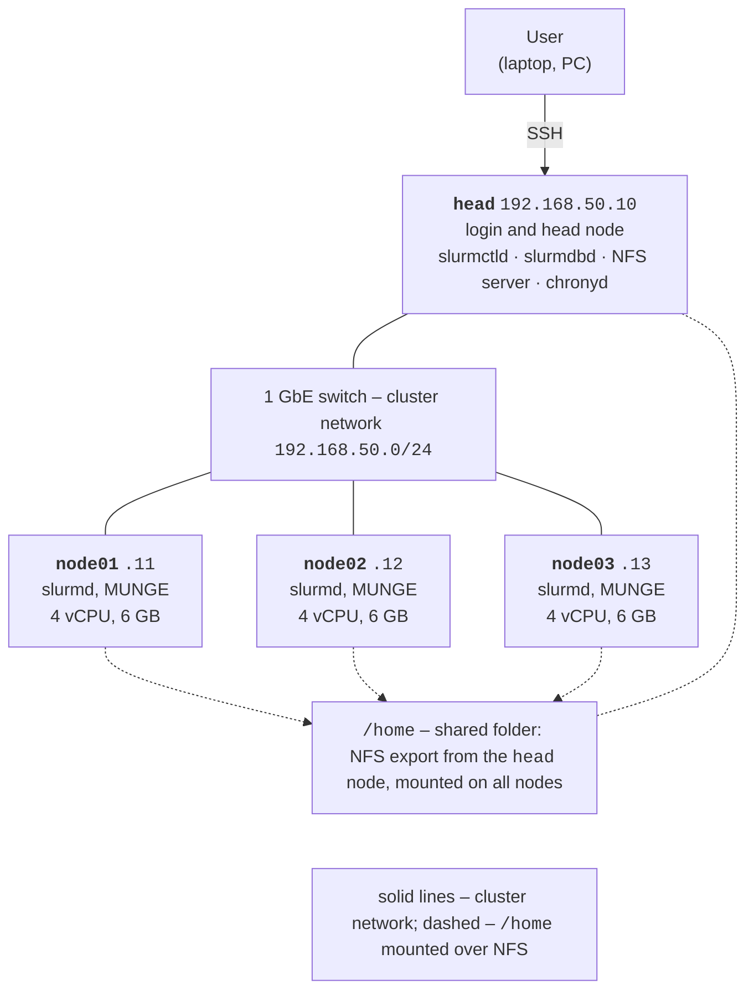

# Cluster architecture and nodes

## Compute cluster architecture

A **computing cluster** is a group of computers (**nodes**) connected by a network that the user sees as a single system for parallel computing. Each node has its own processors, memory, and copy of the operating system, so a program for a cluster works with distributed memory: processes on different nodes exchange messages (MPI, Topic 12). Such clusters built from commodity Linux computers are called Beowulf clusters; most supercomputers on the TOP500 list (<https://top500.org/>) are built this way.

Cluster nodes have different roles:

- the **login node** is where users connect over SSH, edit and build programs, and submit jobs to the queue; heavy computations must not be run on it;
- the **head node** (*head, management node*) runs the scheduler services (`slurmctld`), job accounting, monitoring, and often the time and file servers;
- **compute nodes** execute jobs and run only a minimal set of services;
- **storage nodes** serve the shared filesystem.

Nodes are connected by two types of networks: a **management network** (1 Gbit/s Ethernet) for SSH, services, and files, and a low-latency **interconnect** for MPI: InfiniBand or 100–400 Gbit/s Ethernet. In a small cluster, one network plays both roles. A shared **filesystem** makes home directories and programs identical on all nodes: in small clusters this is NFS, and in large ones, parallel filesystems such as Lustre, BeeGFS, or IBM Storage Scale.

### The lab setup

The lab cluster of this course consists of four Hyper-V virtual machines (VMs) running Ubuntu Server 26.04 LTS (Fig. 13.1, Table 13.1). The `head` node combines the roles of the login and head node and the NFS server, and three compute nodes `node01`–`node03` execute jobs. All nodes are connected to a single 1 GbE network; students have administrator rights (`sudo`) on all VMs and build the cluster themselves.



Figure 13.1. Architecture of the lab compute cluster {.caption}

Table 13.1. Virtual machines of the lab cluster {.caption}

| **VM** | **Role** | **IP address** | **vCPU** | **Memory** |
| --- | --- | --- | --- | --- |
| `head` | login and head node, NFS, accounting | `192.168.50.10` | 2 | 4 GB |
| `node01` | compute node | `192.168.50.11` | 4 | 6 GB |
| `node02` | compute node | `192.168.50.12` | 4 | 6 GB |
| `node03` | compute node | `192.168.50.13` | 4 | 6 GB |

In total, the VMs need 14 virtual processors and 22 GB of memory, so all four fit on the lab PC with an i9-11900KF (16 logical processors) and 32 GB of memory. Another option is one VM on each of several lab PCs connected by a 1 GbE switch: then communication between nodes goes over a real network, and scalability measurements are closer to a real cluster.

**Why not WSL2?** In WSL2 you can run Slurm on a single “node” (this is how the lab PC is configured: node `Intel`, partition `debug`), and that is enough to learn the commands and job scripts. However, a cluster cannot be built from WSL2:

- one distribution is one node, and the WSL2 network works through NAT and does not let nodes see each other;
- the WSL configuration uses `ProctrackType=proctrack/linuxproc` and `TaskPlugin=task/none`: Slurm does not bind tasks to processors and does not limit memory;
- the distribution stops 15 s after the last WSL session is closed (the `instanceIdleTimeout` parameter in the `.wslconfig` file, <https://learn.microsoft.com/windows/wsl/wsl-config>), and running jobs are killed; while preparing this lecture, a test job was interrupted this way twice, and `squeue` still showed it in state `R` for several minutes.

::: tip Tip
To check a configuration without VMs, you can run a cluster from Docker containers (the `ubuntu:26.04` image with the same packages, a shared volume instead of NFS). Some of the output in this lecture was obtained this way, on nodes named `head` and `node01`–`node03`. Program run times in containers are not representative: they all share the processors of one PC.
:::

## Preparing the nodes

### Hyper-V virtual machines

Hyper-V is included in Windows 11 Pro, Enterprise, and Education (the Home edition does not have it). The role is enabled in PowerShell as an administrator, after which the computer is restarted (<https://learn.microsoft.com/virtualization/hyper-v-on-windows/quick-start/enable-hyper-v>):

```powershell
Enable-WindowsOptionalFeature -Online `
    -FeatureName Microsoft-Hyper-V -All
```

For VMs on a single PC, you create an **internal virtual switch** and a NAT network (<https://learn.microsoft.com/virtualization/hyper-v-on-windows/user-guide/setup-nat-network>): the nodes get addresses in `192.168.50.0/24`, and the PC gets the gateway address `192.168.50.1` and provides internet access for installing packages. Then a loop creates four generation 2 VMs with 40 GB disks and dynamic memory disabled (Slurm must know a node’s fixed amount of memory):

```powershell
New-VMSwitch -SwitchName ClusterNet -SwitchType Internal
$if = Get-NetAdapter -Name "vEthernet (ClusterNet)"
New-NetIPAddress -IPAddress 192.168.50.1 -PrefixLength 24 `
    -InterfaceIndex $if.ifIndex
New-NetNat -Name ClusterNAT `
    -InternalIPInterfaceAddressPrefix 192.168.50.0/24

$iso = "D:\ISO\ubuntu-26.04-live-server-amd64.iso"
foreach ($vm in "head", "node01", "node02", "node03") {
    $cpu = if ($vm -eq "head") { 2 } else { 4 }
    $ram = if ($vm -eq "head") { 4GB } else { 6GB }
    New-VM -Name $vm -Generation 2 -MemoryStartupBytes $ram `
        -NewVHDPath "D:\HyperV\$vm.vhdx" -NewVHDSizeBytes 40GB `
        -SwitchName ClusterNet
    Set-VMProcessor -VMName $vm -Count $cpu
    Set-VMMemory -VMName $vm -DynamicMemoryEnabled $false
    Add-VMDvdDrive -VMName $vm -Path $iso
    Set-VMFirmware -VMName $vm -EnableSecureBoot Off `
        -FirstBootDevice (Get-VMDvdDrive -VMName $vm)
}
```

*Secure Boot* is disabled as Microsoft recommends for Linux VMs (<https://learn.microsoft.com/windows-server/virtualization/hyper-v/supported-ubuntu-virtual-machines-on-hyper-v>). If the VMs are on different PCs, you create an **external** switch bound to a 1 GbE network card instead of an internal one: `New-VMSwitch -Name ClusterNet -NetAdapterName "Ethernet"`, and the lab network administrator assigns the node addresses.

Ubuntu Server 26.04 LTS is installed on each VM from the ISO image (<https://ubuntu.com/download/server>): a minimal installation, an administrator user, and the *Install OpenSSH server* option checked. You can install a node just once: after configuring `node01`, its disk is copied (or the VM is exported), and then the name and IP address are changed. Before each risky step (installing Slurm, changing kernel parameters), it is convenient to create a VM checkpoint: `Checkpoint-VM -Name node01 -SnapshotName slurm`.

### Networking, node names, and users

A static address in Ubuntu is set by **Netplan** (<https://documentation.ubuntu.com/server/explanation/networking/about-netplan/>), a YAML file in the `/etc/netplan/` directory, for example for `node01`:

```yaml
# /etc/netplan/50-cluster.yaml
network:
  version: 2
  ethernets:
    eth0:
      addresses: [192.168.50.11/24]
      routes:
        - to: default
          via: 192.168.50.1
      nameservers:
        addresses: [1.1.1.1, 8.8.8.8]
```

The `ip -br addr` command shows the network interface name (usually `eth0` in a Hyper-V VM). The file is applied with `sudo netplan apply`, and the node name is set with `sudo hostnamectl set-hostname node01`. So that nodes can find each other without DNS, the same lines are added to the `/etc/hosts` file of every node:

```
192.168.50.10  head
192.168.50.11  node01
192.168.50.12  node02
192.168.50.13  node03
```

**Identical users.** Slurm starts a job’s processes on a compute node as the user identified by their numeric ID (UID), and NFS also checks access rights by UID and GID. Therefore every cluster user must have **the same UID and GID on all nodes**. In a small cluster, users are created with identical commands on each node (large clusters use LDAP or FreeIPA):

```bash
sudo groupadd -g 2001 hpc
sudo useradd -m -u 2001 -g hpc -s /bin/bash student
```

The `slurm` and `munge` service users are created when the packages are installed. In the Ubuntu packages, the `slurm` user has a fixed UID of 64030 on all nodes (`id slurm` → `uid=64030(slurm)`), while the UID of `munge` may differ, because MUNGE checks only the key.

### Time synchronization

MUNGE credentials (see below) are valid for 300 s, and a node with the wrong time rejects them, so the clocks of all nodes must be synchronized. Starting with Ubuntu 25.10, time synchronization is handled by the **chrony** service (<https://documentation.ubuntu.com/server/how-to/networking/serve-ntp-with-chrony/>). The `head` node synchronizes with the internet and serves time to the other nodes:

```bash
# head: /etc/chrony/conf.d/cluster.conf
allow 192.168.50.0/24
# node01–node03: /etc/chrony/conf.d/cluster.conf
server head iburst prefer
```

After `sudo systemctl restart chrony`, the state is checked with `chronyc sources` (the `head` line should show `^*`, the selected source) and `chronyc tracking` (the offset, *System time*).

### Firewall

The **ufw** firewall (<https://documentation.ubuntu.com/server/how-to/security/firewalls/>) in a cluster is configured so that nodes fully trust each other and only SSH is open from outside. Slurm services use ports 6817 (`slurmctld`), 6818 (`slurmd`), and 6819 (`slurmdbd`), and `srun` and MPI also use random ports, so it is simpler to allow the entire cluster subnet:

```bash
sudo ufw allow OpenSSH
sudo ufw allow from 192.168.50.0/24
sudo ufw enable
sudo ufw status numbered
```

On VMs accessible only through an internal switch, ufw can be left disabled; on a real cluster with a node exposed to the internet, a firewall is mandatory.
