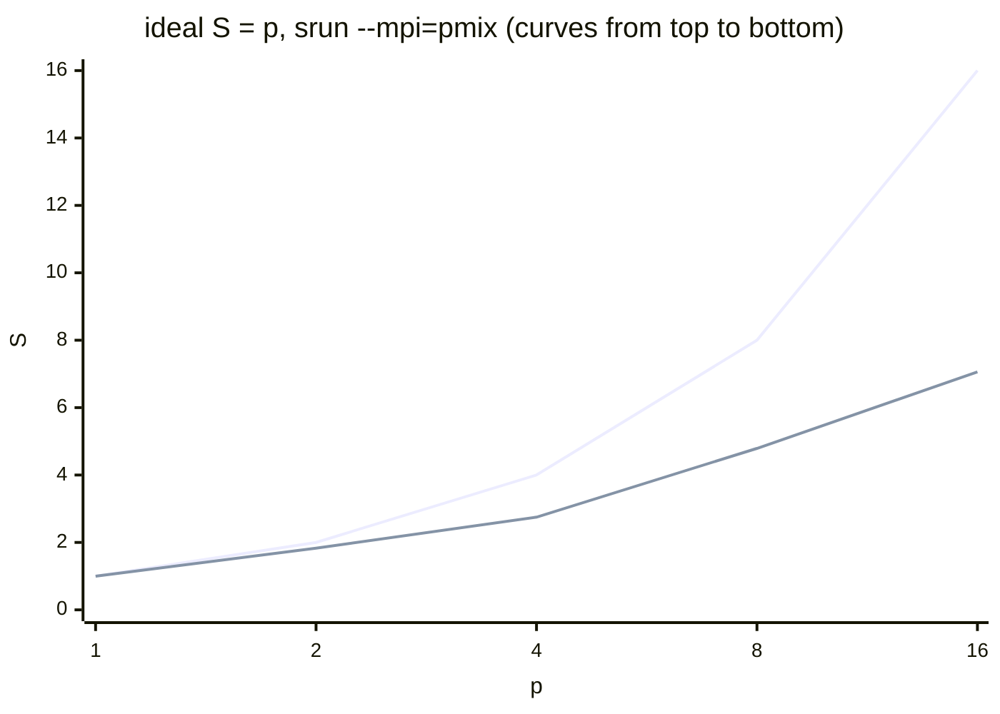

# Configuration, monitoring, and common mistakes

## Operating system tuning for high-performance computing

A compute node has one job: to compute as fast as possible. Ubuntu’s default settings target a general-purpose server (power saving, fast response), so they are changed on cluster nodes (Table 13.7). Every change is verified by measurement: some parameters speed up some programs and slow down others.

Table 13.7. OS tuning of compute nodes {.caption}

| **Parameter** | **Setting** | **Goal** |
| --- | --- | --- |
| frequency governor | `cpupower frequency-set -g performance` | the highest frequency without ramp-up delay |
| SMT (Hyper-Threading) | `/sys/devices/system/cpu/smt/control`: `off` | one task per physical core for programs bound by the FPU or memory |
| interrupts | the `irqbalance` service | spreading network interrupts across cores |
| transparent huge pages | `/sys/kernel/mm/transparent_hugepage/enabled` | fewer TLB misses for large arrays |
| swap | `vm.swappiness=10` | do not page computation memory out to disk |
| NUMA | `kernel.numa_balancing=0` | do not migrate pages when threads are bound |
| process limits | `memlock`, `nofile` in `/etc/security/limits.d/` | memory pinning for RDMA, many open files and MPI connections |
| network | MTU 9000 (jumbo frames) | fewer packets and interrupts for large messages |
| services | disable unnecessary ones: `snapd`, automatic updates | less OS “noise” during computation |

### Frequency governor and SMT

The Linux kernel changes the processor frequency with a **governor**: `powersave` or `schedutil` raise the frequency only under load, while `performance` keeps it at the maximum. In Ubuntu, the `cpupower` utility is part of the `linux-tools-common` package together with the package for the current kernel:

```bash
sudo apt install linux-tools-common linux-tools-$(uname -r)
cpupower frequency-info            # driver, governor, frequency limits
sudo cpupower frequency-set -g performance
cpupower frequency-info | grep -A2 "current policy"
```

The setting lasts until reboot; to make it permanent, use, for example, the **tuned** service (see below). In a Hyper-V VM, the host controls the frequency: the guest system has no `cpufreq` driver (in WSL2 on the lab PC, there is not even a `/sys/devices/system/cpu/cpu0/cpufreq` directory), and `cpupower` cannot change the governor. Therefore the governor is configured on physical nodes (Fig. 13.11), and for VMs, in the Windows host’s power plan. Likewise, Slurm can change the frequency for individual jobs (the `srun --cpu-freq` option) if the nodes have a `cpufreq` driver (in the WSL configuration, `CpuFreqGovernors=OnDemand,Performance,UserSpace`).

::: info Screenshot
Terminal on a physical Ubuntu 26.04 node: `cpupower frequency-info` before and after `sudo cpupower frequency-set -g performance`; driver, available governors, current policy (not available in Hyper-V VMs)
:::

Figure 13.11. The processor frequency governor {.caption}

The SMT logical processors of one core share its execution units and cache. For programs bound by floating-point arithmetic or memory bandwidth, the second thread of a core adds almost nothing (in Topic 10, 16 threads on 8 cores gave the same as 8), so many clusters disable SMT in the BIOS or with `echo off | sudo tee /sys/devices/system/cpu/smt/control`, after which `ThreadsPerCore=1` is set in `slurm.conf`. Another approach is to keep SMT and allocate whole cores to jobs (`CR_Core`) or use the `srun --hint=nomultithread` option.

### Memory: huge pages, swap, NUMA

**Transparent Huge Pages** (THP) let the kernel map memory with 2 MB pages instead of 4 KB, so a program with large arrays misses the TLB less often. The `always` mode enables them for all processes, `madvise` only for regions marked by the program (`madvise(MADV_HUGEPAGE)`), and `never` disables them. The current values can be read without administrator rights (output in WSL on the lab PC):

```
$ cat /sys/kernel/mm/transparent_hugepage/enabled
always [madvise] never
$ cat /proc/sys/vm/swappiness
60
$ ulimit -l -n
max locked memory           (kbytes, -l) 65536
open files                          (-n) 10240
```

Persistent kernel parameters are written to the `/etc/sysctl.d/90-hpc.conf` file and applied with `sudo sysctl --system`:

```
vm.swappiness = 10
kernel.numa_balancing = 0
vm.zone_reclaim_mode = 1
```

`vm.swappiness` sets how eagerly the kernel pages process memory out to swap: 60 (the default) suits desktop systems, while for compute nodes 10 or less is used. **Automatic NUMA balancing** periodically migrates pages closer to the threads that use them; for programs that bind threads themselves and place data with a first-touch policy (Topic 10), it only adds overhead, so it is disabled.

**tuned.** The `tuned` service (package `tuned`) applies ready-made tuning profiles. The `hpc-compute` profile from the Ubuntu 26.04 package inherits `latency-performance` (the `performance` governor, `vm.swappiness=10`) and adds `transparent_hugepages=always`, `kernel.numa_balancing=0`, `vm.zone_reclaim_mode=1`, and network busy polling instead of interrupts:

```bash
sudo apt install tuned
sudo tuned-adm profile hpc-compute
tuned-adm active
```

### Process limits

MPI libraries for InfiniBand and RDMA networks *pin* buffers in memory, and with a `memlock` limit of 64 MB (the default), the program fails with a memory registration error. Large MPI programs open thousands of connections and files. The limits are set in `/etc/security/limits.d/90-hpc.conf`:

```
*   soft  memlock  unlimited
*   hard  memlock  unlimited
*   soft  nofile   65536
*   hard  nofile   65536
```

By default, Slurm **propagates** the user’s limits from the node where `sbatch` was run to the compute nodes (`PropagateResourceLimits=ALL`), so the limits are changed on all nodes. The `slurmd` service in the Ubuntu package already starts with `LimitMEMLOCK=infinity` (the `/usr/lib/systemd/system/slurmd.service` file). You can check the limits inside a job with `srun bash -c 'ulimit -l -n'`.

### Networking and unnecessary services

**Jumbo frames.** The standard Ethernet frame size (MTU) is 1500 bytes; an MTU of 9000 reduces the number of packets and interrupts for large MPI messages. The MTU must be the same on all nodes and on the switch; otherwise, large packets are lost. In Netplan, `mtu: 9000` is added for the interface, and it is checked with a non-fragmented packet: `ping -M do -s 8972 node02` (8972 bytes of data + 28 bytes of headers = 9000). In Hyper-V, jumbo frames must also be enabled in the host network card’s properties (*Jumbo Packet*) for an external switch.

**Unnecessary services.** Every service on a node periodically takes the processor and increases the variation in MPI step times (when one rank is delayed, everyone waits). On compute nodes, unneeded services are disabled: `systemctl list-units --type=service --state=running` shows the running services, and `sudo systemctl disable --now snapd unattended-upgrades` stops, for example, snap and automatic updates (updates are installed on schedule, when the nodes are free).

## Monitoring and diagnostics

**Node load.** The `htop` utility shows the load of each processor and the threads of processes, `mpstat -P ALL 1` (package `sysstat`) shows processor load every second, and `sar` keeps a load history: after `sudo systemctl enable --now sysstat`, the `sar -u` command shows processor load for the day at 10 min intervals. For all nodes at once: `pdsh -w node[01-03] uptime`.

**Slurm logs.** `slurmctld` writes to `/var/log/slurm/slurmctld.log`, and `slurmd` to `/var/log/slurm/slurmd.log` on each node; service messages are also visible with `journalctl -u slurmd`. The log verbosity is changed with the `SlurmctldDebug` and `SlurmdDebug` parameters (`info`, `debug`), and to find a startup error, the service is stopped and run in the terminal: `sudo slurmd -D -vvv`.

**Node states.** The main states shown by `sinfo` are collected in Table 13.8.

Table 13.8. Slurm node states {.caption}

| **State** | **Meaning** |
| --- | --- |
| `IDLE` | the node is free |
| `ALLOCATED`, `MIXED` | fully / partially busy |
| `PLANNED` | free but reserved by backfill for a queued job |
| `DRAIN`, `DRAINING` | the administrator is taking the node out of service: no new jobs, the current ones (in `DRAINING`) are finishing |
| `DOWN` | the node is unavailable; jobs on it ended with the `NODE_FAIL` state |
| `*` after the state | `slurmd` is not responding (`idle*`, `down*`) |

To service a node, it is put into the `DRAIN` state with a reason and returned to service afterward (`RESUME`); `sinfo -R` shows the reason. In the example below, the reason was entered in Ukrainian (“memory module replacement”):

```
$ sudo scontrol update nodename=node02 state=drain \
      reason="заміна модуля пам’яті"
$ sinfo -R -o "%30E %8u %20H %N"
REASON                         USER     TIMESTAMP            NODELIST
заміна модуля па root     2026-09-18T19:22:02  node02
$ sudo scontrol update nodename=node02 state=resume
```

The width of the `%30E` column is counted in bytes, so a reason in non-Latin script (here, Ukrainian, two bytes per letter) is truncated and misaligned; short reasons in plain ASCII (`reason="RAM replacement"`) read better.

**Node failure.** On the test cluster, node `node03` was “frozen” while a job was running. After `SlurmdTimeout` (300 s), `slurmctld` marked it `DOWN`, and the job ended with the `NODE_FAIL` state (with the `--no-requeue` option; without it, a batch job is returned to the queue):

```
$ sinfo -R
REASON               USER      TIMESTAMP           NODELIST
Not responding       slurm     2026-09-18T19:28:49 node03
$ sacct -j 48 --format=JobID,JobName,State%12,Elapsed,NodeList
JobID           JobName        State    Elapsed        NodeList
------------ ---------- ------------ ---------- ---------------
48             nodefail    NODE_FAIL   00:06:51          node03
48.batch          batch    CANCELLED   00:06:51          node03
$ grep -o "Killing.*\|error: Nodes.*DOWN" /var/log/slurm/slurmctld.log
Killing JobId=48 on failed node node03
error: Nodes node03 not responding, setting DOWN
```

After the node was restored and `slurmd` restarted, the node registered and, with `ReturnToService=1`, automatically returned to the `idle` state. If a node is marked `DOWN` for another reason (for example, `Low RealMemory`), after fixing the configuration it is returned with `scontrol update nodename=node03 state=resume`.

## Scalability of an MPI program

The speedup $S_{p} = T_{1} / T_{p}$ and efficiency $E_{p} = S_{p} / p$ on a cluster are measured the same way as in Topics 1 and 10, but $p$ is the number of MPI processes on one or several nodes. It is convenient to get a single allocation and launch steps with different numbers of processes so that all measurements run on the same nodes:

```bash
#!/bin/bash
#SBATCH --job-name=pi-scan
#SBATCH --nodes=1
#SBATCH --exclusive
#SBATCH --time=00:20:00
#SBATCH --output=pi-scan-%j.out

for p in 1 2 4 8 16; do
    for run in 1 2 3 4 5 6; do          # run 1 is the warmup
        srun --mpi=pmix -n $p ./pi_mpi 2000000000 | grep processes
    done
done
```

The script was run on the lab PC in WSL (one node `Intel`, 16 logical processors, `task/none`, that is, without task binding) twice, 20 min apart. Table 13.9 shows the medians of 5 runs after warmup for both series, and Fig. 13.12 shows the speedup chart of the first series.

Table 13.9. Time and speedup of the MPI π program on one node (WSL, i9-11900KF, $2 \cdot 10^{9}$ steps), two series of measurements {.caption}

| **$p$** | **$T_{p}$, s (1)** | **$S_{p}$** | **$E_{p}$, %** | **$T_{p}$, s (2)** | **$S_{p}$** |
| --- | --- | --- | --- | --- | --- |
| 1 | 1.764 | 1.00 | 100 | 1.624 | 1.00 |
| 2 | 0.963 | 1.83 | 92 | 0.883 | 1.84 |
| 4 | 0.641 | 2.75 | 69 | 0.629 | 2.58 |
| 8 | 0.368 | 4.79 | 60 | 0.380 | 4.27 |
| 16 | 0.250 | 7.06 | 44 | 0.296 | 5.49 |



Figure 13.12. Speedup of the MPI π program on one node (WSL, i9-11900KF) {.caption}

Efficiency drops already at 4 processes: without task binding (`TaskPlugin=task/none` in WSL), Linux may place two processes on the logical processors of one core, and the variation between runs for 2 and 4 processes reached 30 %, while the speedup for 16 processes in the two series was 7.06 and 5.49. Measurements on a PC running other programs must be repeated, and the spread must be reported. The speedup does not exceed 7 on 8 physical cores, just like the OpenMP version from Topic 10: SMT adds almost nothing for floating-point division. On a cluster with `task/affinity`, Slurm binds tasks to separate cores, and the speedup up to the number of cores is closer to ideal. The **launch overhead** was measured in the same place: an `srun --mpi=pmix` step with 8 processes and 1000 computation steps took 0.46 s of wall-clock time, while `mpirun -n 8` inside the same allocation took 0.26 s (medians of 6 runs). For jobs lasting minutes, the difference is negligible, but thousands of short `srun` steps are better merged into one.

For a multi-node cluster, the script sets `--nodes=3` and steps `srun -N1`, `-N2`, `-N3` with the same number of processes per node. For the π program, communication between processes is a single `MPI_Reduce` of 8 bytes, so the 1 GbE network barely affects the time, and the speedup on three nodes is close to $3 \cdot S_{\text{node}}$. Programs that exchange data at every step (the Jacobi problem, Topic 12) scale worse: message latency on a 1 GbE network is tens of microseconds versus fractions of a microsecond in the memory of a single node. Comparing one node with several at the same total number of processes shows the share of time taken by the network.

## Common mistakes

The most common mistakes when building a cluster and running jobs are collected in Table 13.10.

Table 13.10. Common mistakes in a Slurm cluster {.caption}

| **Problem** | **Cause and fix** |
| --- | --- |
| `Invalid credential` / `Munge decode failed` in the logs | different `munge.key` on the nodes or a time difference of more than 5 min; copy the key, check `chronyc tracking` |
| a node in the `DRAIN` state with the reason `Low RealMemory` | `RealMemory` in `slurm.conf` is larger than the actual memory; take the value from `slurmd -C` with a margin |
| `sinfo` shows `down*`, the node does not respond | `slurmd` is not running, the firewall blocks port 6818, the node name does not resolve; `systemctl status slurmd`, `/etc/hosts`, `ufw status` |
| every MPI process prints “rank 0 of 1” | `srun` without PMIx; `--mpi=pmix` or `MpiDefault=pmix` |
| the job is `COMPLETED`, but there is no output file | the `--output` directory does not exist or is not accessible on the node; create it, check NFS |
| `Permission denied` on a compute node | different user UIDs on the nodes; identical `useradd -u` |
| `PD (Resources)` forever | the request exceeds any node (`--mem`, `--cpus-per-task`); check `sinfo -N -l` |
| `PD (DependencyNeverSatisfied)` | the preceding job failed; `scancel` or `--kill-on-invalid-dep=yes` |
| an OpenMP program in a job is slow | `OMP_NUM_THREADS=$SLURM_CPUS_PER_TASK` is not set, and threads oversubscribe the cores |
| a job in WSL was interrupted, `squeue` shows `R` | the distribution stopped after the session was closed; keep a session open or set `instanceIdleTimeout=-1` in `.wslconfig` |
