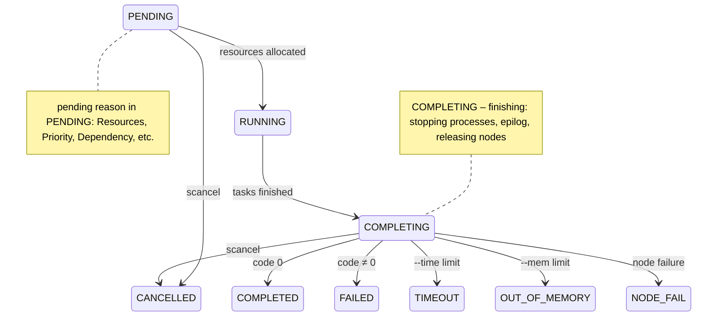

# Job scripts and accounting

## Job scripts

A **batch job** is a shell script that `sbatch` places in the queue. At the beginning of the script, `#SBATCH` lines set the job parameters (they are comments to bash but directives to `sbatch`); the same options can be passed on the command line, where they take precedence. When resources are allocated, Slurm runs the script on the **first** node of the allocation, in the directory from which it was submitted; `srun` commands in the script launch parallel steps on all allocated nodes. The main options are collected in Table 13.4 (<https://slurm.schedmd.com/archive/slurm-25.11-latest/sbatch.html>).

Table 13.4. `sbatch` options {.caption}

| **Option** | **Meaning** |
| --- | --- |
| `-J`, `--job-name=name` | job name in the queue |
| `-p`, `--partition=partition` | partition (without it, the default partition) |
| `-N`, `--nodes=n` | number of nodes (a range such as `2-4` is allowed) |
| `-n`, `--ntasks=n` | number of tasks (processes, MPI ranks) |
| `--ntasks-per-node=n` | tasks on each node |
| `-c`, `--cpus-per-task=n` | CPUs per task (OpenMP threads) |
| `--mem=4G`, `--mem-per-cpu=500M` | memory per node or per CPU |
| `-t`, `--time=hh:mm:ss` | time limit: `30`, `2:00:00`, `1-12:00:00` |
| `-o`, `--output=file` | output file; `%j` job number, `%x` name, `%A`/`%a` array / element number |
| `-a`, `--array=1-10%4` | job array (`%4` means at most 4 at a time) |
| `-d`, `--dependency=afterok:123` | dependency on other jobs |
| `--exclusive` | nodes for this job only |

The `--time` limit should be realistic: the scheduler starts jobs with short limits earlier (backfill), and Slurm stops a job that exceeds its limit with the `TIMEOUT` state. Without `--time`, the partition’s `DefaultTime` or `MaxTime` applies.

**Environment variables.** Slurm passes `SLURM_*` variables to the job and to each task (Table 13.5), from which the script and the program learn about the allocated resources.

Table 13.5. Slurm environment variables {.caption}

| **Variable** | **Meaning** |
| --- | --- |
| `SLURM_JOB_ID` | job number |
| `SLURM_JOB_NODELIST` | allocated nodes: `node[01-02]` |
| `SLURM_NTASKS`, `SLURM_CPUS_PER_TASK` | number of tasks and CPUs per task |
| `SLURM_PROCID` | task number in the step (0…n – 1), like an MPI rank |
| `SLURM_LOCALID` | task number on its node |
| `SLURM_NODEID` | node number in the allocation |
| `SLURM_ARRAY_JOB_ID`, `SLURM_ARRAY_TASK_ID` | array and element number |
| `SLURM_SUBMIT_DIR` | the directory from which the job was submitted |

### Example: a first job

The job takes two nodes with two tasks each. The script prints the allocation parameters, and `srun` prints a line with the number, node, and processor of each task.

```bash
#!/bin/bash
#SBATCH --job-name=hello
#SBATCH --nodes=2
#SBATCH --ntasks-per-node=2
#SBATCH --cpus-per-task=1
#SBATCH --mem-per-cpu=500M
#SBATCH --time=00:02:00
#SBATCH --output=hello-%j.out

# Only the first node of the allocation runs this part.
echo "Job $SLURM_JOB_ID ($SLURM_JOB_NAME) in partition" \
     "$SLURM_JOB_PARTITION"
echo "Nodes: $SLURM_JOB_NODELIST, tasks: $SLURM_NTASKS," \
     "directory: $SLURM_SUBMIT_DIR"
echo "The script runs on $(hostname)"

# Job step: srun launches a task on each allocated CPU.
srun bash -c 'echo "task $SLURM_PROCID (local $SLURM_LOCALID)" \
    "on $(hostname), CPU $(taskset -c -p $$ | cut -d: -f2)"'
```

The command `sbatch hello.sbatch` replies `Submitted batch job 8` and returns immediately; the result appears in the `hello-8.out` file:

```
Job 8 (hello) in partition debug
Nodes: node[01-02], tasks: 4, directory: /home/student
The script runs on node01
task 1 (local 1) on node01, CPU  1
task 0 (local 0) on node01, CPU  0
task 2 (local 0) on node02, CPU  0
task 3 (local 1) on node02, CPU  1
```

Each task is bound to **one** logical processor (`task/affinity`): a node has 4 of them, and there are 2 tasks. In WSL on the lab PC (`task/none`), the same command shows all processors `0-15` for each task.

### The job life cycle

A submitted job is in the `PENDING` state until the scheduler allocates resources, then `RUNNING`, and after the tasks finish, the intermediate state `COMPLETING` (stopping processes, releasing nodes) and one of the final states (Fig. 13.7, <https://slurm.schedmd.com/archive/slurm-25.11-latest/job_state_codes.html>).



Figure 13.7. The Slurm job life cycle {.caption}

Final states of test jobs in `sacct` (their setup is shown below): successful, finished with code 3, exceeded a 1 min limit, cancelled with `scancel`, exceeded `--mem=200M`:

```
$ sacct -j 24,25,26,27,29 -o JobID,JobName,State%14,ExitCode,Elapsed
JobID           JobName          State ExitCode    Elapsed
------------ ---------- -------------- -------- ----------
24                   ok      COMPLETED      0:0   00:00:06
24.batch          batch      COMPLETED      0:0   00:00:06
25                 fail         FAILED      3:0   00:00:01
25.batch          batch         FAILED      3:0   00:00:01
26              timeout        TIMEOUT      0:0   00:01:15
26.batch          batch      CANCELLED     0:15   00:01:16
27               cancel CANCELLED by +      0:0   00:00:04
27.batch          batch      CANCELLED     0:15   00:00:05
29                  oom  OUT_OF_MEMORY    0:125   00:00:01
29.batch          batch  OUT_OF_MEMORY    0:125   00:00:01
```

`ExitCode` has the form `code:signal`: `3:0` means the program returned 3, and `0:15` means the process was stopped by signal 15 (`SIGTERM`). The `timeout` job ran for 1 min 15 s with a 1 min limit: Slurm checks limits periodically and gives processes time to exit after `SIGTERM`.

### Running MPI programs

An MPI program (Topic 12) consists of rank processes that need to learn their number, the number of processes, and the addresses of the other ranks. This information is provided by the **process manager** through the PMI interface (*Process Management Interface*). Open MPI 5 supports only **PMIx**, so with Slurm from the Ubuntu packages, MPI programs are launched like this (<https://slurm.schedmd.com/archive/slurm-25.11-latest/mpi_guide.html>):

```
$ srun --mpi=list
MPI plugin types are...
	none
	pmi2
	cray_shasta
	pmix
specific pmix plugin versions available: pmix_v5
$ srun --mpi=pmix -n4 ./pi_mpi 400000000
rank 0 of 4 on node Intel
processes  4: pi = 3.141592653590, error 1.3e-13, time 0.085 s
rank 1 of 4 on node Intel
rank 2 of 4 on node Intel
rank 3 of 4 on node Intel
```

If `MpiDefault=pmix` is not set in `slurm.conf` (as in WSL on the lab PC) and the `--mpi` option is omitted, `srun` launches $n$ **independent** copies of the program, each of which considers itself the only rank:

```
$ srun -n2 ./pi_mpi 100000000
rank 0 of 1 on node Intel
processes  1: pi = 3.141592653590, error 6.3e-13, time 0.081 s
rank 0 of 1 on node Intel
processes  1: pi = 3.141592653590, error 6.3e-13, time 0.081 s
```

With `--mpi=pmi2`, Open MPI warns `No PMIx server was reachable, but a PMI1/2 was detected` and also launches independent copies. The `mpirun` command also works inside an allocation: it takes the node list and slot counts from the Slurm variables (`salloc -n4 mpirun ./pi_mpi`), but the ranks are launched by its own services (PRRTE), so Slurm does not see individual tasks and does not confine them with per-task cgroups. In addition, `mpirun` places ranks on **cores** by default: on a node with 8 cores and 16 logical processors, `mpirun -n 16` refuses to start (message `allocation-overload`) without the `--use-hwthread-cpus` option, while `srun -n 16` launches 16 tasks.

### Example: MPI on the cluster

The program computes $\pi$ as the integral of $4 / (1 + x^{2})$ over $[ 0 ; 1 ]$ with the midpoint rule: each rank adds every $p$-th rectangle, and `MPI_Reduce` collects the sum on rank 0.

```cpp
// π as the integral of 4/(1 + x²) over [0; 1]: each MPI process
// computes its share of the steps, and MPI_Reduce adds the parts.
#include <mpi.h>
#include <cmath>
#include <cstdlib>
#include <numbers>
#include <print>
#include <unistd.h>

int main(int argc, char* argv[])
{
    MPI_Init(&argc, &argv);
    int rank, size;
    MPI_Comm_rank(MPI_COMM_WORLD, &rank);
    MPI_Comm_size(MPI_COMM_WORLD, &size);

    char host[64];
    gethostname(host, sizeof host);
    std::println("rank {} of {} on node {}", rank, size, host);

    const long long steps =
        argc > 1 ? std::atoll(argv[1]) : 2'000'000'000LL;
    const double h = 1.0 / steps;

    MPI_Barrier(MPI_COMM_WORLD);
    double start = MPI_Wtime();
    double sum = 0.0;
    for (long long i = rank; i < steps; i += size)
    {
        double x = (i + 0.5) * h;
        sum += 4.0 / (1.0 + x * x);
    }
    double part = sum * h, pi = 0.0;
    MPI_Reduce(&part, &pi, 1, MPI_DOUBLE, MPI_SUM, 0,
               MPI_COMM_WORLD);
    double time = MPI_Wtime() - start;

    if (rank == 0)
        std::println("processes {:>2}: pi = {:.12f}, error {:.1e},"
                     " time {:.3f} s", size, pi,
                     std::abs(pi - std::numbers::pi), time);
    MPI_Finalize();
}
```

The program is built on `head` in the shared directory with `mpicxx -std=c++23 -O2 pi_mpi.cpp -o pi_mpi`, so the executable is immediately available on all nodes. The job script takes three nodes with four ranks each:

```bash
#!/bin/bash
#SBATCH --job-name=pi-mpi
#SBATCH --nodes=3
#SBATCH --ntasks-per-node=4
#SBATCH --time=00:05:00
#SBATCH --output=pi-%j.out

echo "Nodes: $SLURM_JOB_NODELIST, processes: $SLURM_NTASKS"
srun --mpi=pmix ./pi_mpi 3000000000
```

Output (Fig. 13.8; rank lines are printed in arbitrary order, some are omitted):

```
Nodes: node[01-03], processes: 12
rank 3 of 12 on node node01
rank 8 of 12 on node node03
rank 9 of 12 on node node03
rank 6 of 12 on node node02
rank 1 of 12 on node node01
rank 0 of 12 on node node01
processes 12: pi = 3.141592653590, error 2.0e-14, time 3.725 s
rank 4 of 12 on node node02
rank 11 of 12 on node node03
…
```

Ranks 0–3 run on `node01`, 4–7 on `node02`, and 8–11 on `node03` (the default `block` distribution). The time on the container-based test cluster is not representative: all the “nodes” shared the PC’s four processors. Scalability measurement is covered in the last section.

::: info Screenshot
Terminal on head: `cat pi.sbatch`, `sbatch pi.sbatch`, `squeue -u $USER`, then `cat pi-<id>.out` with the rank lines of node01–node03 and the timing line
:::

Figure 13.8. Submitting a job and its result {.caption}

### Hybrid MPI + OpenMP jobs

In a hybrid program, each MPI rank creates several OpenMP threads (Topic 10). The layout is set by three parameters: the number of nodes, ranks per node (`--ntasks-per-node`), and CPUs per rank (`--cpus-per-task`), and the number of OpenMP threads is taken from a Slurm variable:

```bash
#SBATCH --nodes=3
#SBATCH --ntasks-per-node=2
#SBATCH --cpus-per-task=2
export OMP_NUM_THREADS=$SLURM_CPUS_PER_TASK
srun --mpi=pmix ./hybrid
```

Without `OMP_NUM_THREADS`, each rank would create as many threads as there are processors on the node, and 2 ranks on a node with 4 CPUs would start 8 threads. `srun` in the script inherits `--cpus-per-task` from `sbatch`, so with `task/affinity` each rank is bound to its own 2 CPUs (verified with the `sched_getaffinity` function in the lab example). A program with OpenMP is built with the `-fopenmp` option: `mpicxx -std=c++23 -O2 -fopenmp hybrid.cpp -o hybrid`.

### Job arrays

A **job array** runs the same script for many values of a parameter: each **element** of the array is a separate job with number `SLURM_ARRAY_TASK_ID`, which the scheduler places independently (<https://slurm.schedmd.com/archive/slurm-25.11-latest/job_array.html>). An array is submitted with a single `sbatch` with the `--array` option: `1-10`, `0-99:5` (step 5), `1,4,9`, `1-100%10` (at most 10 at a time). In the queue, the array is shown as a single line `9_[1-10]`, and elements as `9_3`.

### Example: a job array

The program simulates the flight of a ball with air resistance using the Euler method and prints the range for a given angle and speed. An array of 10 elements iterates over the angles 5°, 10°, …, 50°, and the results are collected into one file.

```cpp
// Flight of a ball with air resistance: range for a given angle.
// Arguments: angle in degrees, initial speed in m/s.
// Output (CSV): angle, range in m, flight time in s.
#include <cmath>
#include <cstdlib>
#include <numbers>
#include <print>

int main(int argc, char* argv[])
{
    if (argc < 3)
    {
        std::println(stderr, "Usage: throw <angle> <v0>");
        return 1;
    }
    const double angle = std::atof(argv[1]);
    const double v0 = std::atof(argv[2]);
    const double g = 9.81, k = 0.02;      // k – drag, 1/m
    const double dt = 1e-6;               // Euler method step, s

    double a = angle * std::numbers::pi / 180;
    double x = 0, y = 0, vx = v0 * std::cos(a), vy = v0 * std::sin(a);
    double t = 0;
    while (y >= 0)
    {
        double v = std::hypot(vx, vy);    // drag ~ v²
        vx -= k * v * vx * dt;
        vy -= (g + k * v * vy) * dt;
        x += vx * dt;
        y += vy * dt;
        t += dt;
    }
    std::println("{},{:.2f},{:.3f}", angle, x, t);
}
```

```bash
#!/bin/bash
#SBATCH --job-name=throw
#SBATCH --array=1-10
#SBATCH --ntasks=1
#SBATCH --time=00:05:00
#SBATCH --output=out/throw-%A_%a.out

# Array element number 1..10 checks the angle 5, 10, ..., 50°.
ANGLE=$(( SLURM_ARRAY_TASK_ID * 5 ))
echo "# job ${SLURM_ARRAY_JOB_ID}_${SLURM_ARRAY_TASK_ID}" \
     "on $(hostname)" >&2
./throw "$ANGLE" 30
```

The `out` directory must be created before submitting (`mkdir -p out`): Slurm does not create directories for output files, and without the directory the output is simply lost (in a test, a job with `-o nodir/x-%j.out` had the `COMPLETED` state, but there was no file). After all elements finish, the CSV lines are collected and sorted by range:

```
$ cat out/throw-9_*.out | grep -v '^#' | sort -t, -k2 -n | tail -3
45,41.55,3.365
35,41.88,2.804
40,42.19,3.096
$ grep -h '^#' out/throw-9_*.out | head -3
# job 9_1 on node01
# job 9_10 on node01
# job 9_2 on node02
```

Without air resistance, the greatest range is achieved at 45°, and with resistance at 40° (42.19 m). The ten elements ran on three nodes in parallel. Compared with a loop in a script, an array has an advantage: each element waits for only one free CPU, and the failure of one element does not stop the others.

### Job dependencies

The `--dependency` (`-d`) option delays a job’s start until a condition on other jobs is met (Table 13.6). `sbatch --parsable` returns the number of the preceding job, so a chain is built in a script: `jid=$(sbatch --parsable prepare.sbatch)`, then `sbatch -d afterok:$jid compute.sbatch`.

Table 13.6. Types of job dependencies {.caption}

| **Condition** | **The job starts when** |
| --- | --- |
| `after:id` | job `id` has started or been cancelled |
| `afterok:id` | job `id` has finished successfully (code 0) |
| `afternotok:id` | job `id` has finished with an error, `TIMEOUT`, or a node failure |
| `afterany:id` | job `id` has finished in any state |
| `aftercorr:id` | the corresponding element of array `id` has finished successfully |
| `singleton` | all previous jobs of the user with the same name have finished |

For an array, the `afterok` condition is met only when **all** elements succeed. If the condition can no longer be met (the preceding job failed), the job stays in the queue with the reason `DependencyNeverSatisfied` until it is cancelled; the `--kill-on-invalid-dep=yes` option cancels such a job automatically. An example of a “prepare → compute → report” chain is given in the lab.

## Accounting and scheduling

### Accounting of completed jobs: sacct

The `sacct` command (<https://slurm.schedmd.com/archive/slurm-25.11-latest/sacct.html>) reads history from the `slurmdbd` database: for each job, a line for the job itself and lines for its steps (`.batch` is the script, `.0`, `.1`, … are `srun` steps). Without options, it shows the current user’s jobs for today; `-S`/`-E` set the time interval, `-u`/`--allusers` the users, `-X` shows only jobs without steps, and `--format` sets the columns (Fig. 13.9):

```
$ sacct -j 50 -o JobID,JobName,NNodes,NCPUS,Elapsed,State
JobID           JobName   NNodes      NCPUS    Elapsed      State
------------ ---------- -------- ---------- ---------- ----------
50               pi-mpi        3         12   00:00:04  COMPLETED
50.batch          batch        1          4   00:00:04  COMPLETED
50.0             pi_mpi        3         12   00:00:03  COMPLETED
```

For processing by a program, the `--parsable2` option is convenient: columns are separated by the `|` character without alignment, and `--noheader` removes the header. Useful fields: `Submit`, `Start`, `End` (the wait time is `Start` minus `Submit`), `CPUTimeRAW` (CPU seconds = `NCPUS` × `ElapsedRaw`), `MaxRSS` (the largest task memory, for steps only), `State`, `ExitCode`. Running jobs are also shown by `sstat -j <number>`.

::: info Screenshot
Terminal on head: `sacct -j <id> --format=JobID,JobName,Partition,NNodes,NCPUS,Elapsed,State,ExitCode` for a completed MPI job; the job line, `.batch` and `.0` step lines
:::

Figure 13.9. Accounting of completed jobs {.caption}

### FIFO and backfill scheduling

The simplest order is **FIFO** (*first in, first out*): jobs start in order of arrival (more precisely, of priority), and if the first job in the queue cannot start, all the following ones wait. A large job that needs all the nodes forces nodes that became free earlier to sit idle.

**Backfill scheduling** (<https://slurm.schedmd.com/archive/slurm-25.11-latest/sched_config.html>) fixes this: the scheduler computes a future start time (a **reservation**) for each higher-priority job from the `--time` limits of running jobs, and starts a lower-priority job earlier **if it can finish before the reservation** without delaying it. The `sched/backfill` module scans the queue every 30 s (the `bf_interval` parameter). Therefore a realistic `--time` benefits the user: a short job “slips” into the gaps.

An example on a test cluster of three nodes (jobs took whole nodes, `--exclusive`, Fig. 13.10): `model-R` (1 node, 4 min limit) is running; `big-A` needs 3 nodes for 5 min and waits for `model-R`; then `long-B` (1 node, 10 min) and `short-C` (1 node, 2 min) arrived. The queue at that moment is shown above in the `squeue` description.

```mermaid
gantt
  title Time, min. R, A, B, C – jobs in order of arrival. C (2 min limit) finishes before A starts, so it starts ahead of the queue. B (10 min limit) would delay A and waits until A ends
  dateFormat x
  axisFormat %-M
  tickInterval 1minute
  now : vert, 18000, 0ms
  section node01
    R (limit 4 min) : 0, 240000
    A – reserved, 3 nodes, 5 min : 240000, 540000
    B → : 540000, 618000
  section node02
    C (backfill) : 18000, 138000
    A – reserved, 3 nodes, 5 min : 240000, 540000
  section node03
    A – reserved, 3 nodes, 5 min : 240000, 540000
```



Figure 13.10. Backfill scheduling {.caption}

`squeue --start` shows the expected start time of queued jobs (`%S` is the start time, `%Y` the nodes they are scheduled on), and the `slurmctld` log shows who started a job:

```
$ squeue --start -o "%.5i %.8j %.2t %.19S %.5D %Y"
JOBID     NAME ST          START_TIME NODES SCHEDNODES
   60    big-A PD 2026-09-18T19:47:40     3 node[01-03]
   61   long-B PD 2026-09-18T19:53:00     1 node01
$ grep -o "backfill.*" /var/log/slurm/slurmctld.log | tail -1
backfill: _start_job: Started JobId=62 in debug on node02
```

The `short-C` job started 30 s after submission, during the next backfill pass, even though it was queued after `big-A` and `long-B`: it will finish before 19:47:40, when the `model-R` limit expires and `node01` becomes free for `big-A`. The `long-B` job with a 10 min limit would delay `big-A`, so it waits with the reason `Priority` and starts after it. The `node03` node is in the `planned` state: it is free but reserved for `big-A`. The time margin must be noticeable: in one of the earlier experiments (a 3 min limit for `model-R`), the backfill pass happened when the margin before the reservation was less than a minute, and `short-C` stayed in the queue until `big-A` finished: backfill plans time in blocks of `bf_resolution` (60 s by default).

### Priorities, partitions, and QoS

The order in the queue is determined by a job’s **priority**. In Slurm 25.11, the `priority/multifactor` module is used by default (<https://slurm.schedmd.com/archive/slurm-25.11-latest/priority_multifactor.html>): the priority is a weighted sum of factors

$$P = w_{\text{age}} \cdot A + w_{\text{fs}} \cdot F + w_{\text{size}} \cdot J + w_{\text{part}} \cdot R + w_{\text{qos}} \cdot Q ,$$

where $A$ is the wait time, $F$ is the **fair share** (whoever has used fewer of their account’s resources has a higher priority), $J$ is the job size, and $R$ and $Q$ are the partition and QoS priorities; all factors are normalized to $[ 0 ; 1 ]$. The weights are set by the `PriorityWeightAge`, `PriorityWeightFairshare`, and similar parameters; by default they are zero, and all jobs have the same priority, that is, FIFO order with backfill, as on the test cluster. The `sprio` command shows the priority components, and `sshare` shows account usage.

**Partitions** group nodes and set limits: the `debug` partition of the lab cluster allows jobs of up to 30 min, and `long` up to 2 days on the same nodes. On real clusters, separate partitions contain nodes with GPUs or large memory. A **QoS** (*Quality of Service*, <https://slurm.schedmd.com/archive/slurm-25.11-latest/qos.html>) is a set of limits and a priority that is created with `sacctmgr` and granted to accounts: for example, a QoS `short` with a maximum duration of 1 h and a higher priority, or a limit on a user’s number of simultaneous jobs (`MaxJobsPerUser`). For Slurm to enforce such limits, `slurm.conf` sets `AccountingStorageEnforce=associations,limits,qos`.
