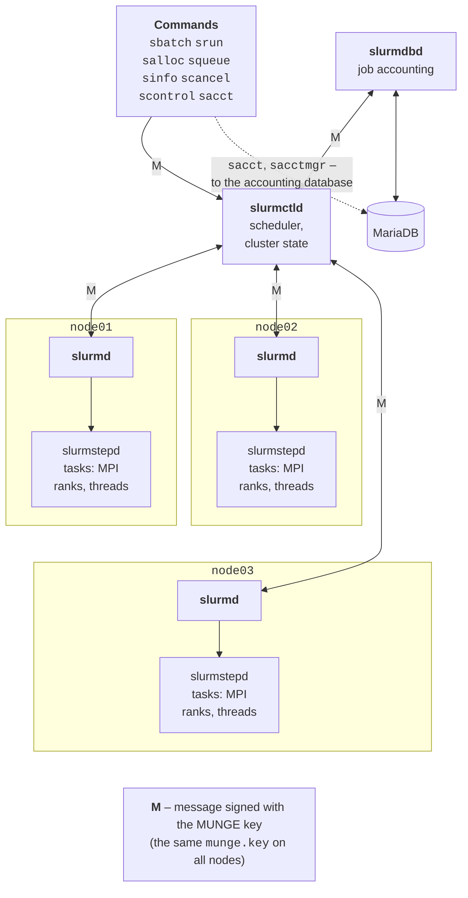

# The Slurm scheduler and commands

## The Slurm scheduler

**Slurm** (*Simple Linux Utility for Resource Management*, <https://slurm.schedmd.com/documentation.html>) is an open-source resource manager and job scheduler used by most TOP500 supercomputers. It is developed by SchedMD; new versions come out twice a year and are numbered by year and month: 25.11 (November 2025), 26.05 (May 2026). Ubuntu 26.04 ships version 25.11.2, so the links in this lecture point to the 25.11 documentation (<https://slurm.schedmd.com/archive/slurm-25.11-latest/>). Slurm performs three functions:

- it **allocates resources**: nodes, processors, memory, and GPUs for a given time;
- it **launches and monitors** tasks on the allocated resources;
- it **manages the queue**: it decides which job to start next.

### Components

Slurm consists of several services (Fig. 13.4):

- `slurmctld` is the central service on the control node: it stores the state of nodes and jobs and schedules the queue; it can have a backup on another node;
- `slurmd` is the service on each compute node: it receives jobs, launches and monitors tasks, and reports the node’s state;
- `slurmstepd` is a process that `slurmd` creates for each job step; it launches the user’s tasks and collects their output and statistics;
- `slurmdbd` is the accounting service: it records job history in a MariaDB or MySQL database;
- user commands (`sbatch`, `srun`, `squeue`, and others) contact `slurmctld` over the network.



Figure 13.4. Slurm components {.caption}

**MUNGE** (*MUNGE Uid 'N' Gid Emporium*, <https://dun.github.io/munge/>) is an authentication service: every message between Slurm components contains a *credential* with the sender’s UID and GID, encrypted and signed with the shared key `/etc/munge/munge.key`. Therefore **the key must be the same on all nodes**, the `munged` service must start before the Slurm services, and the node clocks must be synchronized (<https://slurm.schedmd.com/archive/slurm-25.11-latest/quickstart_admin.html>).

### Installation

The Ubuntu packages split the services by node role: on `head`, `slurmctld` and `slurm-client` (the commands), plus `slurmdbd` and `mariadb-server` for accounting; on the compute nodes, `slurmd` and `slurm-client`. The `munge` package is installed as a dependency, and its key is generated during installation on each node **separately**, so the key from `head` is copied to the other nodes:

```bash
# head
sudo apt install slurmctld slurm-client munge
# node01–node03
sudo apt install slurmd slurm-client munge
# head: the same MUNGE key on all nodes
for n in node01 node02 node03; do
  sudo cat /etc/munge/munge.key |
    ssh $n 'sudo tee /etc/munge/munge.key >/dev/null &&
            sudo chown munge:munge /etc/munge/munge.key &&
            sudo chmod 400 /etc/munge/munge.key &&
            sudo systemctl restart munge'
done
munge -n | ssh node02 unmunge    # check between nodes
```

`sudo` on a remote node without a terminal works only if it does not prompt for a password; otherwise, the key is copied with `scp` to the home directory and moved into place on each node manually. A successful check prints `STATUS: Success (0)`, the sender node’s address, the UID, and the GID:

```
STATUS:          Success (0)
ENCODE_HOST:     pro12-head.pro12-net (172.18.0.5)
ENCODE_TIME:     2026-09-18 19:13:42 +0000 (1789758822)
DECODE_TIME:     2026-09-18 19:13:42 +0000 (1789758822)
TTL:             300
CIPHER:          aes128 (4)
MAC:             sha256 (5)
ZIP:             none (0)
UID:             student (2001)
GID:             hpc (2001)
LENGTH:          0
```

`sinfo --version` shows the Slurm version: `slurm-wlm 25.11.2`. The Ubuntu packages keep the configuration in `/etc/slurm/`, the service state in `/var/lib/slurm/`, and the logs in `/var/log/slurm/`.

### The slurm.conf configuration

The main file `/etc/slurm/slurm.conf` describes the cluster: the control node, the *plugins*, the nodes, and the **partitions**, queues with sets of nodes and limits. The file must be **identical on all nodes**. A template is conveniently created with the web configurator (<https://slurm.schedmd.com/archive/slurm-25.11-latest/configurator.html>) and then extended. For the lab cluster:

```
# /etc/slurm/slurm.conf – identical on all cluster nodes
ClusterName=hpclab
SlurmctldHost=head
AuthType=auth/munge
SlurmUser=slurm
StateSaveLocation=/var/lib/slurm/slurmctld
SlurmdSpoolDir=/var/lib/slurm/slurmd
SlurmctldLogFile=/var/log/slurm/slurmctld.log
SlurmdLogFile=/var/log/slurm/slurmd.log
MpiDefault=pmix
ProctrackType=proctrack/cgroup
TaskPlugin=task/cgroup,task/affinity
ReturnToService=1
# Scheduling and resource allocation
SchedulerType=sched/backfill
SelectType=select/cons_tres
SelectTypeParameters=CR_Core_Memory
DefMemPerCPU=1000
# Accounting through slurmdbd
AccountingStorageType=accounting_storage/slurmdbd
AccountingStorageHost=head
JobAcctGatherType=jobacct_gather/cgroup
# Nodes and partitions
NodeName=node[01-03] CPUs=4 Boards=1 SocketsPerBoard=1 \
    CoresPerSocket=2 ThreadsPerCore=2 RealMemory=5800
PartitionName=debug Nodes=node[01-03] Default=YES MaxTime=00:30:00
PartitionName=long Nodes=node[01-03] MaxTime=2-00:00:00
```

The main parameters are explained in Table 13.2 (full description: <https://slurm.schedmd.com/archive/slurm-25.11-latest/slurm.conf.html>). A long line is continued on the next line with the `\` character.

Table 13.2. Main `slurm.conf` parameters {.caption}

| **Parameter** | **Meaning** |
| --- | --- |
| `SlurmctldHost` | the node running the `slurmctld` service |
| `MpiDefault=pmix` | `srun` launches MPI programs through PMIx without the `--mpi` option |
| `ProctrackType`, `TaskPlugin` | tracking a job’s processes and limiting processors and memory with cgroups; `task/affinity` binds tasks to cores |
| `ReturnToService=1` | a node that stopped responding returns to service after it registers again (0 means manually only) |
| `SchedulerType` | `sched/backfill` is a queue with gap filling (the default) |
| `SelectType`, `SelectTypeParameters` | allocation of individual cores and memory (`CR_Core_Memory`) rather than whole nodes |
| `DefMemPerCPU` | memory (MB) per CPU if the job did not specify `--mem` |
| `NodeName` | nodes and their resources: CPUs, sockets, cores, threads, memory (MB) |
| `PartitionName` | a partition: nodes, `Default`, the maximum time `MaxTime` |

**Node resources.** The `NodeName` line is not written by guesswork: the `slurmd -C` command on a compute node prints the detected hardware configuration in exactly the `slurm.conf` format (Fig. 13.5). On the lab PC in WSL2 (the `fmt` utility only wraps the long line so it fits on the page):

```
$ slurmd -C | fmt -w 64
Exception caught: rsmi_init.
NodeName=Intel CPUs=16 Boards=1 SocketsPerBoard=1 CoresPerSocket=8
ThreadsPerCore=2 RealMemory=31997 UpTime=0-01:43:31
```

The `Exception caught` line is printed by the module that looks for AMD GPUs (ROCm SMI), which the PC does not have; it does not affect the result. `RealMemory` in the configuration is set slightly lower than the detected value (30000 instead of 31997 on the lab PC) to leave memory for the operating system. If the configuration is **larger** than the available resources, the node goes into the `DRAIN` state with the reason `Low RealMemory` or `Low socket*core*thread count`; if it is smaller, `slurmd` writes the warning `Node configuration differs from hardware` to the log.

::: info Screenshot
Terminal on node02 (Hyper-V VM): `slurmd -C`; the line `NodeName=node02 CPUs=… Boards=… SocketsPerBoard=… CoresPerSocket=… ThreadsPerCore=… RealMemory=…` and UpTime
:::

Figure 13.5. Node parameters for slurm.conf {.caption}

### Resource limits: cgroup.conf

Ubuntu 26.04 uses only **cgroup v2**, a Linux kernel mechanism that constrains a group of processes. With `ProctrackType=proctrack/cgroup` and `TaskPlugin=task/cgroup`, Slurm creates a separate group for each job and step, so a job cannot take other jobs’ cores or memory, and all its processes are guaranteed to be killed when it finishes. The `/etc/slurm/cgroup.conf` file (<https://slurm.schedmd.com/archive/slurm-25.11-latest/cgroup.conf.html>):

```
CgroupPlugin=autodetect
ConstrainCores=yes
ConstrainRAMSpace=yes
ConstrainSwapSpace=yes
```

`ConstrainCores` confines tasks to the allocated cores, `ConstrainRAMSpace` limits memory to the `--mem` value, and `ConstrainSwapSpace` prevents “borrowing” memory from swap. Without the last parameter, a test job that exceeded `--mem=200M` did not fail but started running slowly with swapping; with it, Slurm terminated the job with the `OUT_OF_MEMORY` state.

### Starting the services

The services are started by `systemd`; MUNGE first, then Slurm:

```bash
# head
sudo systemctl enable --now munge slurmctld
# node01–node03 (or clush -w node[01-03])
sudo systemctl enable --now munge slurmd
# any node
sinfo
```

After changing `slurm.conf`, the file is copied to all nodes (`clush -w node[01-03] --copy /etc/slurm/slurm.conf`) and `sudo scontrol reconfigure` is run; changes to nodes and ports require restarting the services. To avoid copying the file, Slurm supports a *configless* mode on the nodes: `SlurmctldParameters=enable_configless` in `slurm.conf` and `SLURMD_OPTIONS="--conf-server head"` in `/etc/default/slurmd`.

### Job accounting: slurmdbd (overview)

Without accounting, the `sacct` command reports `Slurm accounting storage is disabled` (this is how WSL is configured on the lab PC), and the queue does not know how many resources users have already consumed. Accounting is enabled with the `slurmdbd` service on `head`: it stores job history in a MariaDB database, and `slurmctld` sends data to it (the `AccountingStorage*` parameters in `slurm.conf`). The `/etc/slurm/slurmdbd.conf` file (permissions `600`, owner `slurm`) contains the database password (<https://slurm.schedmd.com/archive/slurm-25.11-latest/accounting.html>):

```
AuthType=auth/munge
DbdHost=head
SlurmUser=slurm
LogFile=/var/log/slurm/slurmdbd.log
PidFile=/run/slurmdbd.pid
StorageType=accounting_storage/mysql
StorageHost=localhost
StorageUser=slurm
StoragePass=db_password
StorageLoc=slurm_acct_db
```

After creating the database user and starting `slurmdbd` (before `slurmctld`), the administrator registers the cluster, the **accounts** (groups, labs, projects), and the users with the `sacctmgr` command:

```bash
sudo sacctmgr -i add cluster hpclab
sudo sacctmgr -i add account lab Description="Laboratory"
sudo sacctmgr -i add user student account=lab
sacctmgr show assoc format=cluster,account,user
```

The “cluster – account – user” link is called an **association**; limits and resource shares used by the scheduler are attached to it (see “Accounting and scheduling”).

## User commands

A user works with the cluster only through Slurm commands (Table 13.3); help is available with `man <command>` or on the documentation page (<https://slurm.schedmd.com/archive/slurm-25.11-latest/quickstart.html>).

Table 13.3. Slurm user commands {.caption}

| **Command** | **Purpose** |
| --- | --- |
| `sinfo` | state of partitions and nodes; `-N -l` per node, `-R` reasons for unavailability |
| `squeue` | job queue; `-u $USER`, `--start` for the expected start time |
| `sbatch` | submit a job script to the queue (a batch job) |
| `srun` | launch parallel tasks: a separate job or a step inside an allocation |
| `salloc` | obtain a resource allocation for interactive work |
| `scancel` | cancel a job: `scancel 123`, `scancel -u $USER` |
| `scontrol` | details and control: `show job 123`, `show node node01`, `hold`, `release`, `update` |
| `sacct` | accounting of completed jobs and steps (requires `slurmdbd`) |

**sinfo.** Partitions and nodes of the test cluster while several jobs are running (in the `STATE` column, `alloc` means the node is fully busy, `idle` means free, and `plnd` (`planned`) means free but reserved for a waiting job). The `-o` option sets the columns: `%N` nodes, `%T` state, `%c` CPUs, `%z` sockets, cores, and threads per core, `%m` memory (MB):

```
$ sinfo
PARTITION AVAIL  TIMELIMIT  NODES  STATE NODELIST
debug*       up      30:00      1   plnd node03
debug*       up      30:00      2  alloc node[01-02]
long         up 2-00:00:00      1   plnd node03
long         up 2-00:00:00      2  alloc node[01-02]
$ sinfo -N -p debug -o "%8N %10T %5c %8z %8m"
NODELIST STATE      CPUS  S:C:T    MEMORY
node01   allocated  4     1:2:2    3700
node02   allocated  4     1:2:2    3700
node03   planned    4     1:2:2    3700
```

The asterisk after `debug` marks the default partition. For a node that does not respond, `sinfo` appends `*` to the state (`down*`). `sinfo -N -l` prints a detailed node table with all columns.

**squeue.** The queue with jobs of three users at the same moment (the `ST` column: `R` running, `PD` pending; the **pending reason** is in parentheses; `TIME_L` is the time limit):

```
$ squeue -o "%.5i %.8j %.7u %.2t %.6l %.5M %.5D %R"
JOBID     NAME    USER ST TIME_L  TIME NODES NODELIST(REASON)
   61   long-B student PD  10:00  0:00     1 (Priority)
   60    big-A   olena PD   5:00  0:00     3 (Resources)
   62  short-C student  R   2:00  0:01     1 node02
   59  model-R    ivan  R   4:00  0:31     1 node01
```

The reason `Resources` means there are not enough free resources, `Priority` means there is a higher-priority job ahead, `Dependency` means the job is waiting for another job, and `QOSMaxJobsPerUserLimit` and similar mean a limit has been reached. Without the `-o` option, `squeue` prints the columns `JOBID`, `PARTITION`, `NAME`, `USER`, `ST`, `TIME`, `NODES`, `NODELIST(REASON)`. The screenshot in Fig. 13.6 shows both commands on the VM cluster.

::: info Screenshot
Terminal on head: `sinfo -N -l` and `squeue -l` while several test users have running and pending jobs; node states idle/alloc/mix and reasons (Resources, Priority)
:::

Figure 13.6. State of partitions and the job queue {.caption}

**srun and salloc.** Outside an allocation, `srun` creates a job itself, waits for resources, launches the tasks, and prints their output to the terminal. The `salloc` command only allocates resources and opens a shell on the login node; each `srun` inside it launches a **job step** on the allocated nodes, and `exit` releases the resources (a session on the test cluster; the `salloc` commands were fed from a file, and the prompts were added for clarity):

```
student@head$ srun -N2 hostname
node02
node01
student@head$ salloc -N2 -n4 -t 10
salloc: Granted job allocation 100
salloc: Nodes node[01-02] are ready for job
student@head$ echo "$SLURM_JOB_ID: $SLURM_JOB_NODELIST, $SLURM_NTASKS"
100: node[01-02], 4
student@head$ srun hostname
node01
node02
node02
node01
student@head$ exit
salloc: Relinquishing job allocation 100
```

`srun --pty bash` gives an interactive shell directly on a compute node (for example, to build a program on a node with a different processor); it should also be closed, because the resources stay occupied while the shell is open.

**scontrol.** The `scontrol show job 13` command shows all job parameters: the state and reason, the submit and start times, the allocated nodes and CPUs, and the output file. A fragment for a job on the lab PC:

```
JobId=13 JobName=pi-mpi
   UserId=vano(1000) GroupId=vano(1000) MCS_label=N/A
   Priority=1 Nice=0 Account=(null) QOS=(null)
   JobState=RUNNING Reason=None Dependency=(null)
   …
   RunTime=00:00:03 TimeLimit=00:10:00 TimeMin=N/A
   SubmitTime=2026-09-18T18:57:43 EligibleTime=2026-09-18T18:57:43
   …
   Partition=debug AllocNode:Sid=localhost:6902
   ReqNodeList=(null) ExcNodeList=(null)
   NodeList=Intel
   BatchHost=Intel
   NumNodes=1 NumCPUs=16 NumTasks=16 CPUs/Task=1 ReqB:S:C:T=0:0:*:*
   …
   Command=/home/vano/pro12/pi.sbatch
   …
   StdOut=/home/vano/pro12/pi-13.out
```

The `StartTime` line (omitted) also contains `EndTime`; for a running job, this is the moment its time limit expires. The same `scontrol` lets the owner reduce the time limit (`scontrol update job=13 TimeLimit=5`; only an administrator can increase it), hold a job in the queue (`scontrol hold 13`), and release it (`scontrol release 13`).
