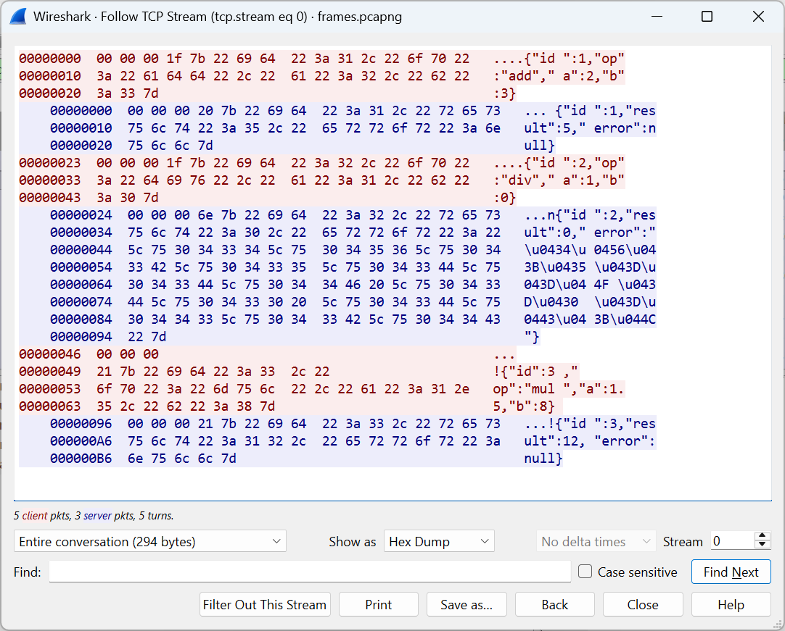

# Examples and common mistakes

## Program examples

All programs were tested with .NET SDK 10.0.401 in Release configuration on Windows 11; the server and the client run on the same computer (`localhost`). Each example is a separate console project (`dotnet new console`), and the gRPC example is a solution with two projects.

### TCP echo

An asynchronous `TcpListener` server serves many clients at once: each connection is handled by a separate task, and messages are separated by a newline character. Without arguments, the program runs a server and two clients in one process; with the `server` argument, only the server (it is checked with the commands from the “Diagnostic utilities” section, Fig. 14.1).

```cs
using System.Net;
using System.Net.Sockets;
using System.Text;

Console.OutputEncoding = Encoding.UTF8;
const int Port = 5000;

if (args is ["server"])          // server only, until the window closes
{
    await RunServerAsync(CancellationToken.None);
    return;
}

// Demonstration: a server and two clients in one process.
using CancellationTokenSource stop = new();
Task server = RunServerAsync(stop.Token);
await Task.WhenAll(
    RunClientAsync("Olena", 0, ["hello", "how are you?"]),
    RunClientAsync("Bohdan", 30, ["sockets"]));
await stop.CancelAsync();
await server;

static async Task RunServerAsync(CancellationToken token)
{
    TcpListener listener = new(IPAddress.Loopback, Port);
    listener.Start();                        // Bind + Listen
    Log($"server listening on {listener.LocalEndpoint}");
    List<Task> sessions = [];
    try
    {
        while (true)
        {
            TcpClient client =
                await listener.AcceptTcpClientAsync(token);
            sessions.Add(ServeAsync(client, token));   // do not await
        }
    }
    catch (OperationCanceledException) { }
    finally
    {
        listener.Stop();
        await Task.WhenAll(sessions);
        Log($"server stopped, clients: {sessions.Count}");
    }
}

static async Task ServeAsync(TcpClient client,
    CancellationToken token)
{
    using (client)
    {
        EndPoint who = client.Client.RemoteEndPoint!;
        Log($"  connected {who}");
        NetworkStream stream = client.GetStream();
        using StreamReader reader = new(stream, Encoding.UTF8);
        StreamWriter writer = new(stream, new UTF8Encoding(false));
        writer.AutoFlush = true;
        try
        {
            string? line;
            while ((line = await reader.ReadLineAsync(token)) != null)
            {
                Log($"  {who} → {line}");
                await writer.WriteLineAsync($"ECHO {line.ToUpper()}");
            }
            Log($"  {who} closed the connection");
        }
        catch (Exception ex) when (ex is IOException
            or OperationCanceledException)
        {
            Log($"  {who} aborted: {ex.GetType().Name}");
        }
    }
}

static async Task RunClientAsync(string name, int delay,
    string[] lines)
{
    await Task.Delay(delay);
    using TcpClient client = new();
    await client.ConnectAsync(IPAddress.Loopback, Port);
    NetworkStream stream = client.GetStream();
    using StreamReader reader = new(stream, Encoding.UTF8);
    StreamWriter writer = new(stream, new UTF8Encoding(false));
    writer.AutoFlush = true;
    foreach (string line in lines)
    {
        await writer.WriteLineAsync($"{name}: {line}");
        string? reply = await reader.ReadLineAsync();
        Log($"{name} receives \"{reply}\"");
        await Task.Delay(100);
    }
}                                // Dispose closes the connection

static void Log(string text) => Console.WriteLine(text);
```

The accept loop does not await `ServeAsync`, so both clients are served at the same time, and their messages interleave. `UTF8Encoding(false)` disables the byte order mark (BOM), `AutoFlush` sends a line immediately, and when a client leaves its `using` block, `ReadLineAsync` on the server returns `null`. Output (the OS assigns client ports arbitrarily, and the order of lines may differ):

```
server listening on 127.0.0.1:5000
  connected 127.0.0.1:50176
  127.0.0.1:50176 → Olena: hello
Olena receives "ECHO OLENA: HELLO"
  connected 127.0.0.1:50177
  127.0.0.1:50177 → Bohdan: sockets
Bohdan receives "ECHO BOHDAN: SOCKETS"
  127.0.0.1:50176 → Olena: how are you?
Olena receives "ECHO OLENA: HOW ARE YOU?"
  127.0.0.1:50177 closed the connection
  127.0.0.1:50176 closed the connection
server stopped, clients: 2
```

### A framed protocol

Framing with a length prefix was tested with a separate “calculator” program: the client sends JSON requests in frames and then sends one frame in three pieces (3, 10, and 24 bytes) with pauses. The server assembles the frame using the length field and replies only after the last piece:

```
frame 3: 00000021 + {"id":3,"op":"mul","a":1.5,"b":8}
client: sent 3 bytes
client: sent 10 bytes
client: sent 24 bytes
server: request 3 (mul)
client: Response { Id = 3, Result = 12, Error =  }
```

The complete code of this protocol (header, `ReadExactlyAsync`, length check) is given in Lab 14, Example 1. The protocol’s bytes can be seen in Wireshark: *Analyze → Follow → TCP Stream* shows the four-byte headers and the JSON (Fig. 14.10).



Figure 14.10. The TCP stream of the framed protocol in Wireshark {.caption}

### A gRPC order service

The `Orders` solution contains the projects `Orders.Server` (`dotnet new web`) and `Orders.Client` (`dotnet new console`); the packages and `Protobuf` elements are given in the “Packages and code generation” section, and the `Protos/orders.proto` file in the “The `.proto` file” section.

The server (`Program.cs`):

```cs
using Microsoft.AspNetCore.Server.Kestrel.Core;
using Orders.Server;

Console.OutputEncoding = System.Text.Encoding.UTF8;
WebApplicationBuilder builder = WebApplication.CreateBuilder(args);

// HTTP/2 without TLS for local development only.
builder.WebHost.ConfigureKestrel(kestrel =>
    kestrel.ListenLocalhost(5001,
        listen => listen.Protocols = HttpProtocols.Http2));

builder.Services.AddGrpc();
builder.Services.AddGrpcReflection();

WebApplication app = builder.Build();
app.MapGrpcService<OrderApi>();
app.MapGrpcReflectionService();      // for grpcurl and Rider
Console.WriteLine("gRPC server: http://localhost:5001");
app.Run();
```

The service implementation (`OrderApi.cs`):

```cs
using Grpc.Core;
using Orders;

namespace Orders.Server;

public class OrderApi : OrderService.OrderServiceBase
{
    static readonly Order[] Orders =
    [
        Create(1, "Sigma LLC", OrderStatus.Paid,
            ("A4 paper", 10, 245)),
        Create(2, "Ivan Koval", OrderStatus.New,
            ("64 GB USB drive", 2, 320), ("Mouse", 1, 450)),
        Create(3, "Melnyk Store", OrderStatus.Shipped,
            ("Cable", 3, 60)),
        Create(4, "School No. 5", OrderStatus.Paid,
            ("Projector", 1, 18900)),
    ];

    public override Task<Order> GetOrder(OrderRequest request,
        ServerCallContext context)
    {
        Order? order = Orders.FirstOrDefault(o => o.Id == request.Id);
        if (order is null)
        {
            throw new RpcException(new Status(StatusCode.NotFound,
                $"order {request.Id} not found"));
        }
        return Task.FromResult(order);
    }

    public override async Task ListOrders(ListRequest request,
        IServerStreamWriter<Order> responseStream,
        ServerCallContext context)
    {
        string client = context.RequestHeaders
            .GetValue("client-name") ?? "unknown";
        int sent = 0;
        try
        {
            foreach (Order order in Orders)
            {
                // A slow store; the token fires after the deadline
                // or when the client disconnects.
                await Task.Delay(400, context.CancellationToken);
                if (Total(order) >= request.MinTotal)
                {
                    await responseStream.WriteAsync(order);
                    sent++;
                }
            }
            Console.WriteLine($"  [server] {client}: total {sent}");
        }
        catch (OperationCanceledException)
        {
            Console.WriteLine(
                $"  [server] {client}: cancelled after {sent}");
            throw;
        }
    }

    static double Total(Order order) =>
        order.Lines.Sum(line => line.Quantity * line.Price);

    static Order Create(int id, string customer, OrderStatus status,
        params (string Product, int Quantity, double Price)[] lines)
    {
        Order order = new() { Id = id, Customer = customer,
            Status = status };
        foreach (var (product, quantity, price) in lines)
        {
            order.Lines.Add(new OrderLine
            {
                Product = product, Quantity = quantity, Price = price,
            });
        }
        return order;
    }
}
```

The client (`Orders.Client/Program.cs`):

```cs
using Grpc.Core;
using Grpc.Net.Client;
using Orders;

Console.OutputEncoding = System.Text.Encoding.UTF8;
using GrpcChannel channel = GrpcChannel.ForAddress(
    "http://localhost:5001");
OrderService.OrderServiceClient client = new(channel);
Metadata headers = new() { { "client-name", "lecture-demo" } };

// 1. Unary calls: success and an error with a status code.
foreach (int id in new[] { 2, 42 })
{
    try
    {
        Print(await client.GetOrderAsync(new() { Id = id }, headers));
    }
    catch (RpcException ex)
    {
        Fail(ex);
    }
}

// 2. A server stream without a deadline and with a 1 s deadline.
await ListAsync("From UAH 1000:", new() { MinTotal = 1000 }, null);
DateTime deadline = DateTime.UtcNow.AddSeconds(1);
await ListAsync("All, deadline 1 s:", new(), deadline);

async Task ListAsync(string title, ListRequest req, DateTime? until)
{
    Console.WriteLine(title);
    try
    {
        using var call = client.ListOrders(req, headers, until);
        await foreach (var item in call.ResponseStream.ReadAllAsync())
        {
            Print(item);
        }
    }
    catch (RpcException ex)
    {
        Fail(ex);
    }
}

static void Print(Order o)
{
    double total = o.Lines.Sum(line => line.Quantity * line.Price);
    Console.WriteLine($"  #{o.Id} {o.Customer,-14} " +
        $"{o.Lines.Count} ln. {total,9:N2} UAH  {o.Status}");
}

static void Fail(RpcException ex) =>
    Console.WriteLine($"error {ex.StatusCode} {ex.Status.Detail}");
```

The generated names follow C# conventions: the `min_total` field became the `MinTotal` property, and the value `ORDER_STATUS_PAID` became `OrderStatus.Paid`. The `repeated` field `Lines` is read-only, so lines are added with the `Add` method. The server is started first (`dotnet run -c Release` in the `Orders.Server` folder), then the client in another window. The server reads the `client-name` metadata from `RequestHeaders`. The server stream returns orders from UAH 1000 one at a time every 400 ms. With a 1 s deadline, the client manages to receive two orders and gets `DeadlineExceeded` (without a description), and on the server, `Task.Delay` is cancelled by the token. The client’s output:

```
  #2 Ivan Koval     2 ln.  1,090.00 UAH  New
error NotFound order 42 not found
From UAH 1000:
  #1 Sigma LLC      1 ln.  2,450.00 UAH  Paid
  #2 Ivan Koval     2 ln.  1,090.00 UAH  New
  #4 School No. 5   1 ln. 18,900.00 UAH  Paid
All, deadline 1 s:
  #1 Sigma LLC      1 ln.  2,450.00 UAH  Paid
  #2 Ivan Koval     2 ln.  1,090.00 UAH  New
error DeadlineExceeded 
```

The server’s output:

```
gRPC server: http://localhost:5001
  [server] lecture-demo: total 3
  [server] lecture-demo: cancelled after 2
```

## Common mistakes

Table 14.4. Common mistakes in network programming {.caption}

| **Problem** | **Cause and fix** |
| --- | --- |
| messages “stick together” or arrive in pieces | TCP does not preserve message boundaries; use framing (a delimiter or a length prefix) and read until the buffer is full |
| the server serves only one client | the accept loop waits for a client to be processed; start `ServeAsync` as a separate task without `await` |
| the client “hangs” forever | there is no timeout or deadline; pass a token with `CancelAfter` to network operations, and set a `deadline` in gRPC |
| `SocketException`: `AddressAlreadyInUse` or `AccessDenied` on `Bind` | the port is taken by another process (including a previous run of the server); find the process with `Get-NetTCPConnection` / `ss -tlnp`, change the port |
| the gRPC client gets an HTTP protocol error | Kestrel without TLS did not enable HTTP/2; set `HttpProtocols.Http2` or use `https://` |
| after a `.proto` change, the client receives wrong values | field numbers were changed; numbers are never changed, and new fields are added with new numbers |
| the server keeps working after the client’s deadline | `context.CancellationToken` was not passed to the service’s asynchronous operations |
