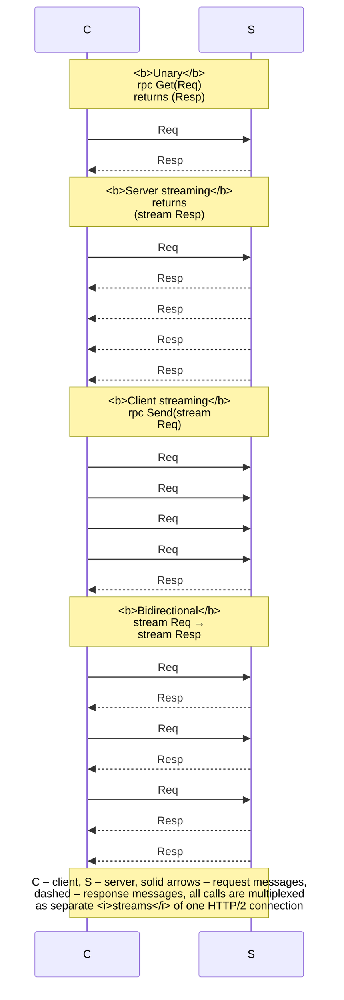

# gRPC and technology comparisons

## gRPC and Protocol Buffers

**gRPC** is an open-source RPC framework created at Google and developed further under the CNCF (<https://grpc.io/docs/what-is-grpc/core-concepts/>). Its foundation:

- the **HTTP/2** transport: one TCP connection multiplexes many simultaneous calls (each is a separate HTTP/2 stream), headers are compressed, and data is transferred in binary frames;
- the **Protocol Buffers** (protobuf) contract and message format, a compact binary serialization with a schema in a `.proto` file (<https://protobuf.dev/programming-guides/proto3/>);
- generation of clients and servers for many languages: C#, C++, Java, Go, Python, and others.

### The `.proto` file

```proto
syntax = "proto3";
option csharp_namespace = "Orders";
package orders;

// Order service: a unary call and a server stream.
service OrderService {
  rpc GetOrder (OrderRequest) returns (Order);
  rpc ListOrders (ListRequest) returns (stream Order);
}

message OrderRequest {
  int32 id = 1;
}

message ListRequest {
  double min_total = 1;      // only orders from this total up
}

message Order {
  int32 id = 1;
  string customer = 2;
  repeated OrderLine lines = 3;
  OrderStatus status = 4;
}

message OrderLine {
  string product = 1;
  int32 quantity = 2;
  double price = 3;
}

enum OrderStatus {
  ORDER_STATUS_UNSPECIFIED = 0;
  ORDER_STATUS_NEW = 1;
  ORDER_STATUS_PAID = 2;
  ORDER_STATUS_SHIPPED = 3;
}
```

`message` describes a data structure, and `service` a set of `rpc` methods. Each field has a **number** (`= 1`), which is transmitted in binary form instead of the name. Numbers must not be changed after a contract is published: new fields are added with new numbers, and old clients simply ignore them. The types are `int32`, `int64`, `double`, `bool`, `string`, `bytes`, nested messages, `repeated` (lists), `map<K, V>`, and `enum` (the first value must be 0). In proto3, scalar fields have no “null”: a missing field reads as its default value (0, an empty string).

### Packages and code generation

ASP.NET Core uses the gRPC implementation for .NET (<https://learn.microsoft.com/aspnet/core/grpc/>):

- `Grpc.AspNetCore` (2.83.0 in the examples) for the server: a metapackage with `Grpc.Tools` and `Google.Protobuf`;
- `Grpc.Net.Client` (2.83.0), `Google.Protobuf` (3.36.1), and `Grpc.Tools` (2.84.0) for a console client.

During the build, the `Grpc.Tools` package calls the `protoc` compiler and generates C# classes from the files included with the `Protobuf` element in the `.csproj`. The `GrpcServices` attribute determines what to generate: `Server` (the abstract base class `OrderService.OrderServiceBase`), `Client` (the `OrderService.OrderServiceClient` class), `Both`, or `None` (messages only):

```xml
<!-- Orders.Server.csproj -->
<Protobuf Include="Protos\orders.proto" GrpcServices="Server" />

<!-- Orders.Client.csproj: a link to the same file -->
<Protobuf Include="..\Orders.Server\Protos\orders.proto"
          GrpcServices="Client" Link="Protos\orders.proto" />
```

The generated code goes into the `obj` folder and is not edited. A solution with two projects in Rider is shown in Fig. 14.6; Rider highlights `.proto` syntax and navigates from a C# class to the message.

::: info Screenshot
Rider: solution Orders with projects Orders.Server and Orders.Client in Solution Explorer; editor split: `Protos/orders.proto` and `Orders.Server.csproj` with the `<Protobuf Include=… GrpcServices="Server" />` line
:::

Figure 14.6. The `orders.proto` file in a Rider solution {.caption}

The service inherits the generated base class and overrides its methods, and it is registered in `Program.cs`: `builder.Services.AddGrpc()` and `app.MapGrpcService<OrderApi>()`. gRPC requires HTTP/2; for local development without TLS, Kestrel is configured for HTTP/2 explicitly (`listen.Protocols = HttpProtocols.Http2`), and the client connects to `http://localhost:5001`. Browsers cannot call gRPC directly; gRPC-Web exists for them (<https://learn.microsoft.com/aspnet/core/grpc/grpcweb>).

## gRPC call types, deadlines, and interceptors

gRPC supports four types of methods (Fig. 14.7):

- **unary**: one request, one response; the client calls `await client.GetOrderAsync(request)`;
- **server streaming** (`returns (stream Order)`): the server writes several messages through `IServerStreamWriter<T>.WriteAsync`, and the client reads `call.ResponseStream.ReadAllAsync()` with an `await foreach` loop;
- **client streaming** (`rpc Send (stream Req)`): the client writes `call.RequestStream.WriteAsync(...)`, finishes with `CompleteAsync()`, and receives a single response; the server reads an `IAsyncStreamReader<T>`;
- **bidirectional streaming**: both sides read and write independently (chat, games, telemetry with commands).



Figure 14.7. gRPC call types {.caption}

### Deadlines, cancellation, and metadata

A **deadline** is a point in time (UTC) after which the call is cancelled: `client.ListOrders(request, deadline: DateTime.UtcNow.AddSeconds(1))`. By default there is **no** deadline, so a call can wait forever; a deadline should always be set. The deadline is sent to the server in a header; when it expires, the client gets an `RpcException` with the `DeadlineExceeded` code, and on the server `ServerCallContext.CancellationToken` fires. The server must pass this token to its asynchronous operations; otherwise, it will keep doing useless work. The client can also cancel a call with a token (`cancellationToken:`) or by calling `Dispose()` on the call, which gives the `Cancelled` code (<https://learn.microsoft.com/aspnet/core/grpc/deadlines-cancellation>).

**Metadata** are key–value pairs in HTTP/2 headers: the client passes `Metadata` (an authentication token, a request identifier, the client name), and the server reads `context.RequestHeaders.GetValue("client-name")`.

### Status codes

The result of every call is a **status code** (the full list of 17 codes: <https://grpc.io/docs/guides/status-codes/>). A service reports an error with an exception `throw new RpcException(new Status(StatusCode.NotFound, "…"))`; the client catches `RpcException` and reads `StatusCode` and `Status.Detail`. An unhandled service exception turns into the `Unknown` code without details unless `EnableDetailedErrors` is enabled (it is `false` by default, because details can reveal internal information).

The most important codes: `OK`; `Cancelled` (cancelled by the client); `InvalidArgument`; `DeadlineExceeded`; `NotFound` and `AlreadyExists`; `PermissionDenied` and `Unauthenticated`; `ResourceExhausted` (a limit was exhausted, including messages larger than 4 MB by default); `Unavailable` (temporary unavailability; the request can be retried); `Unimplemented`, `Internal`, `Unknown` (errors on the server).

### Interceptors

An **interceptor** is a class derived from `Grpc.Core.Interceptors.Interceptor` that wraps calls on the server or the client: logging, timing, token validation, retries. A server interceptor overrides `UnaryServerHandler`, `ServerStreamingServerHandler`, and so on, does its work, and calls `continuation` (the next handler). It is registered with `options.Interceptors.Add<LoggingInterceptor>()` in `AddGrpc`, and a client interceptor with `channel.Intercept(new ClientLogger())`. Documentation: <https://learn.microsoft.com/aspnet/core/grpc/interceptors>.

## Tools and technology comparisons

### gRPC reflection and `grpcurl`

Tools need to know the service contract. You can give them the `.proto` file or enable **gRPC reflection** on the server, a service that returns the description of all services: the `Grpc.AspNetCore.Server.Reflection` package and the calls `builder.Services.AddGrpcReflection()` and `app.MapGrpcReflectionService()`. Reflection exposes the list of APIs, so in production it is enabled only for development (<https://learn.microsoft.com/aspnet/core/grpc/test-tools>).

The `grpcurl` command-line utility (<https://github.com/fullstorydev/grpcurl>) converts JSON to protobuf and back (Fig. 14.8). The `-plaintext` option is needed for a server without TLS, and `-d` (the request JSON) is written before the address; in PowerShell, quotes inside the JSON are escaped as `\"`:

```powershell
grpcurl -plaintext localhost:5001 list
grpcurl -plaintext localhost:5001 describe orders.OrderService
grpcurl -plaintext -d '{\"id\": 2}' localhost:5001 `
    orders.OrderService/GetOrder
```

::: info Screenshot
Windows Terminal, Orders.Server running: `grpcurl -plaintext localhost:5001 list`, `describe orders.OrderService`, unary call GetOrder with -d id 2; JSON response with customer “Ivan Koval” and two lines visible
:::

Figure 14.8. Calling a gRPC service from the command line {.caption}

### HTTP Client in Rider

Rider’s built-in HTTP Client runs requests from `.http` files, including gRPC requests with the `GRPC` keyword (the *Protocol Buffers* and *gRPC* plugins are required; unary calls and server streams are supported; for TLS, `grpcs://` is written before the address). Completion works from the `.proto` file or through server reflection (<https://www.jetbrains.com/help/rider/Http_client_in__product__code_editor.html>):

Such a request and the server’s response are shown in Fig. 14.9.

```
### Order No. 2
GRPC localhost:5001/orders.OrderService/GetOrder
client-name: rider

{
  "id": 2
}
```

::: info Screenshot
Rider: file `orders.http` with the GRPC request above, gutter Run icon clicked; Services / response panel with JSON of order 2; Orders.Server running
:::

Figure 14.9. A gRPC request in the Rider HTTP Client {.caption}

In production, gRPC and HTTP are used only with **TLS** (the `https://` address; for development, the certificate from `dotnet dev-certs https --trust`), and authentication is done with tokens in metadata (<https://learn.microsoft.com/aspnet/core/grpc/security>).

### Comparing the technologies

The characteristics of the approaches are summarized in Table 14.2.

Table 14.2. Comparing sockets, WCF, gRPC, and REST {.caption}

| **Criterion** | **Sockets** | **WCF / CoreWCF** | **gRPC** | **REST (HTTP API)** |
| --- | --- | --- | --- | --- |
| contract | custom protocol | WSDL, `[ServiceContract]` | `.proto` | OpenAPI |
| format | any | SOAP XML, binary in NetTcp | protobuf | JSON |
| transport | TCP, UDP | HTTP, TCP | HTTP/2 | HTTP/1.1, 2, 3 |
| streaming | manual | limited | 4 call types | no |
| uses | games, custom protocols | existing WCF services | calls between services | public APIs, browsers |

**Latency** is the time of one call (median and 99th percentile), and **throughput** is the number of calls per second. For illustration, the author measured an “add two numbers” call with different technologies on an i9-11900KF: server and client in one process on `localhost`, 20,000 sequential calls after warmup, then 16 concurrent clients for 3 s (Table 14.3).

Table 14.3. Latency and throughput on localhost (i9-11900KF) {.caption}

| **Technology** | **Median, ms** | **p99, ms** | **Calls/s (16 clients)** |
| --- | --- | --- | --- |
| TCP socket, JSON frames | 0.046 | 0.073 | 262,198 |
| REST (HTTP/1.1, JSON) | 0.110 | 0.178 | 162,101 |
| gRPC (HTTP/2, protobuf) | 0.144 | 0.258 | 121,883 |
| CoreWCF (BasicHttp, SOAP) | 0.160 | 0.342 | 84,136 |

For tiny messages on the loopback interface, a “bare” socket is the fastest, and gRPC is even slower than REST: the overhead of HTTP/2 exceeds the gain from protobuf, and the 16 gRPC clients shared a single connection. The advantages of gRPC are large messages, a real network, streaming calls, and a strict contract (<https://learn.microsoft.com/aspnet/core/grpc/comparison>); always measure your own scenario.
