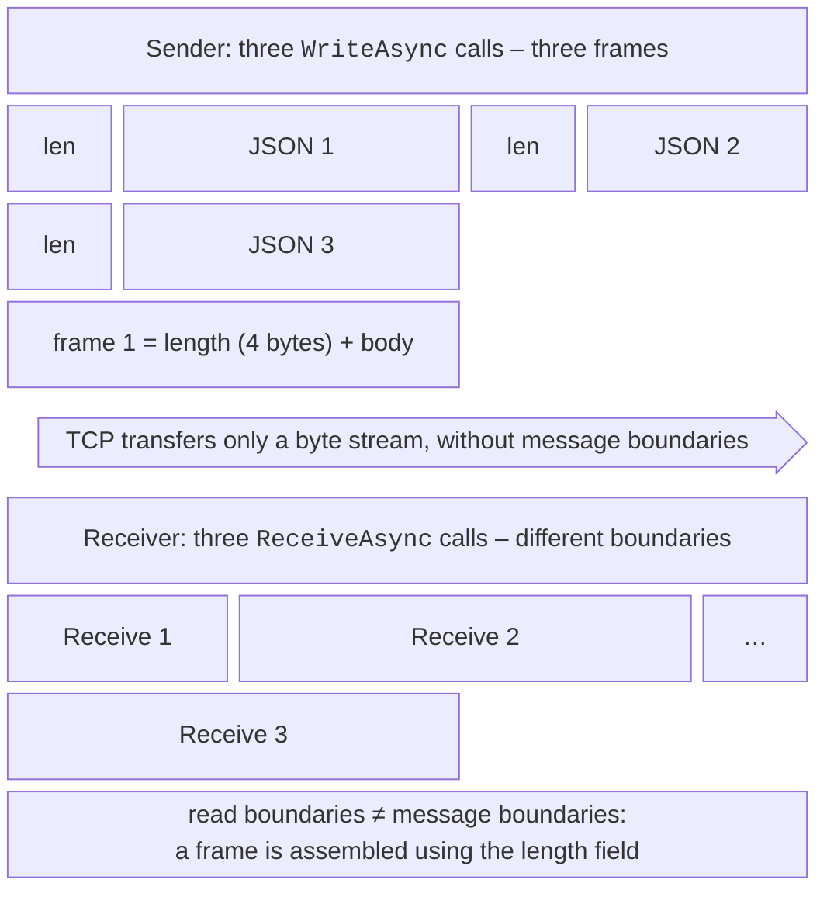

# Protocols and reliability

## An application-layer protocol

TCP transfers a **byte stream**: the sender’s three `WriteAsync` calls may arrive in a single read, or, conversely, one message may arrive in several (Fig. 14.3). Therefore a custom **application protocol** is needed on top of TCP to define where a message ends (**framing**), how data is encoded (**serialization**), and which messages are allowed.



Figure 14.3. Message framing in a TCP stream {.caption}

Two common ways of framing:

- a **delimiter**: each message ends with the `\n` character (`StreamReader.ReadLineAsync`); this is simple, but the text cannot contain the delimiter, and an attacker can send an endless line;
- a **length prefix**: the body is preceded by its length, for example 4 bytes in big-endian order (`BinaryPrimitives.WriteInt32BigEndian`); the receiver reads exactly 4 bytes and then exactly that many bytes of the body. Before allocating a buffer, the length must be checked against a maximum.

Reading exactly `n` bytes is done with a loop that fills the buffer or with the `Stream.ReadExactlyAsync` method (.NET 7 and later), which throws `EndOfStreamException` if the stream ends early.

### Serialization

The frame body is encoded in a text or binary format:

- **JSON** (`System.Text.Json`, <https://learn.microsoft.com/dotnet/standard/serialization/system-text-json/overview>): `JsonSerializer.SerializeToUtf8Bytes(message, JsonSerializerOptions.Web)` is human-readable and easy to debug, but larger. The default encoder escapes non-ASCII characters such as Cyrillic (`\u041E…`), so the object `{ id = 7, name = "Олена", score = 12.5 }` with a Ukrainian name takes 61 bytes;
- a **binary** format through `BinaryWriter`/`BinaryReader`: the calls `writer.Write(7)`, `writer.Write("Олена")`, `writer.Write(12.5)` produce 23 bytes (`int` takes 4, the string takes a length byte and 10 bytes of UTF-8, `double` takes 8), but both sides must know the order of the fields in the same way;
- **Protocol Buffers** is a compact binary format with a schema, used by gRPC (see “gRPC and Protocol Buffers”).

High-load servers (Kestrel in particular) read from the network through the `System.IO.Pipelines` library (<https://learn.microsoft.com/dotnet/standard/io/pipelines>): `PipeReader` returns all accumulated bytes as a `ReadOnlySequence<byte>`, the program cuts out complete frames, and an incomplete frame stays in a pooled buffer until the next read without copying.

## The UDP protocol

UDP sends individual **datagrams** without a connection. The `UdpClient` class has the methods `SendAsync(bytes, endpoint)` and `ReceiveAsync(token)`; the `UdpReceiveResult` result contains the bytes and the sender’s address. Description: <https://learn.microsoft.com/dotnet/api/system.net.sockets.udpclient>.

- **Unicast** sends to a specific endpoint.
- **Broadcast** sends to the address `255.255.255.255` (`IPAddress.Broadcast`), to all hosts of the local network; it requires the `EnableBroadcast = true` property, and routers do not forward such packets.
- **Multicast** sends to a group address `224.0.0.0`–`239.255.255.255`; only the group members receive the packets:

```cs
IPAddress group = IPAddress.Parse("239.0.0.222");
using UdpClient receiver = new(5060);        // group port
receiver.JoinMulticastGroup(group);
using UdpClient sender = new() { MulticastLoopback = true };
await sender.SendAsync("announcement"u8.ToArray(),
    new IPEndPoint(group, 5060));
UdpReceiveResult r = await receiver.ReceiveAsync(token);
```

An application on top of UDP decides for itself what to do about losses, duplicates, and ordering: it numbers datagrams, repeats important messages, and ignores stale ones. A datagram larger than 65,507 bytes is not even sent: `SendAsync` throws a `SocketException` with the `MessageSize` code (verified). In practice, datagrams are kept smaller than the network MTU (about 1400 bytes) to avoid fragmentation.

## Reliability of network communication

### Timeouts

A network call without a timeout can wait forever: the server “hung,” a cable was disconnected, a packet was lost. The `ReceiveTimeout` and `SendTimeout` properties of the `Socket` and `TcpClient` classes (0 by default, meaning no limit) apply only to **synchronous** methods. Asynchronous operations are limited with a cancellation token (Topic 5):

```cs
using CancellationTokenSource timeout = new(TimeSpan.FromSeconds(3));
await client.ConnectAsync(host, port, timeout.Token);
int n = await stream.ReadAsync(buffer, timeout.Token);
```

After a read operation is cancelled, the connection state is undefined (part of a frame may have been read), so such a connection is closed.

### Retries

Transient failures (the server is restarting, the network is congested) are handled by a **retry** with **exponential back-off** and a random addition (*jitter*), so that thousands of clients do not repeat requests at the same time. Only transient errors are retried, and only a limited number of times:

```cs
static async Task<TcpClient> ConnectWithRetryAsync(string host,
    int port, int attempts)
{
    for (int attempt = 1; ; attempt++)
    {
        TcpClient client = new();
        try
        {
            using CancellationTokenSource timeout =
                new(TimeSpan.FromSeconds(3));
            await client.ConnectAsync(host, port, timeout.Token);
            return client;
        }
        catch (Exception ex) when (attempt < attempts
            && ex is OperationCanceledException or SocketException
            {
                SocketErrorCode: SocketError.ConnectionRefused
                    or SocketError.TimedOut
            })
        {
            client.Dispose();
            int delay = 200 * (1 << (attempt - 1))   // 200, 400, 800…
                + Random.Shared.Next(100);           // "jitter"
            string reason = ex is SocketException se
                ? se.SocketErrorCode.ToString() : "timeout";
            Console.WriteLine($"attempt {attempt}: {reason}, " +
                $"retrying in {delay} ms");
            await Task.Delay(delay);
        }
        catch
        {
            client.Dispose();       // the last attempt or another error
            throw;
        }
    }
}
```

The call `ConnectWithRetryAsync("127.0.0.1", 5999, attempts: 3)` to a port that nobody listens on prints “attempt 1: ConnectionRefused, retrying in 201 ms” and “attempt 2: ConnectionRefused, retrying in 484 ms,” and the third error propagates to the caller. Interestingly, on Windows a refused connection to `127.0.0.1` is reported not instantly but after about 2 s (the stack retries SYN several times), and with the name `localhost` after 4 s, because both addresses `::1` and `127.0.0.1` are tried. For retries in HTTP clients, ready-made resilience libraries are used (the `Microsoft.Extensions.Http.Resilience` package), and gRPC has built-in retries (<https://learn.microsoft.com/aspnet/core/grpc/retries>).

### Keep-alive and closing a connection

If a client disappears without closing (power loss), the server finds out only on its next write. The TCP **keep-alive** mechanism periodically sends empty probe packets; it is enabled with `socket.SetSocketOption(SocketOptionLevel.Socket, SocketOptionName.KeepAlive, true)`, and the parameters `TcpKeepAliveTime` (seconds of silence), `TcpKeepAliveInterval`, and `TcpKeepAliveRetryCount` are set at the `SocketOptionLevel.Tcp` level. Application protocols often add their own **heartbeats**, “I am alive” messages every few seconds. A graceful shutdown works like this: the sender calls `Shutdown(SocketShutdown.Send)` (a FIN packet, “no more data”), the receiver reads the remaining data until `ReceiveAsync == 0`, replies, and closes its side, after which both call `Dispose`.

### Handling `SocketException`

Socket errors are reported by `SocketException` with the `SocketErrorCode` property of type `SocketError` (<https://learn.microsoft.com/dotnet/api/system.net.sockets.socketerror>). When reading and writing through `NetworkStream`, the same errors are wrapped in `IOException` (`InnerException`). The most common codes: `ConnectionRefused` (nobody listens on the port), `ConnectionReset` (the other side closed the connection abnormally), `TimedOut`, `AddressAlreadyInUse` (the port is taken by another process), `AccessDenied` (the port is held by another program in exclusive mode; UDP port 5050 behaved this way while the example was being prepared), `HostNotFound`.
