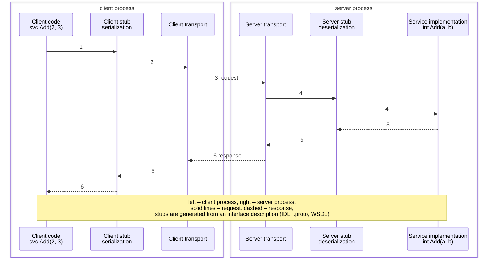
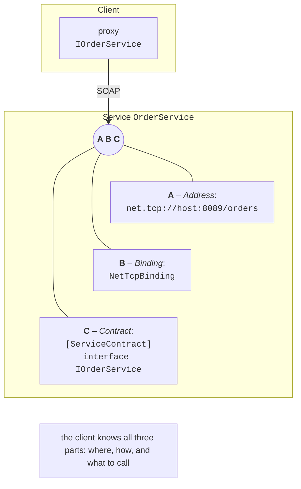

# Remote procedure calls and WCF

## Remote procedure calls

A custom protocol over sockets gives full control but requires a lot of boilerplate code. A **Remote Procedure Call** (RPC) hides the network: the client calls a method as if the service were local, and generated code does everything else (Fig. 14.4).



Figure 14.4. A remote procedure call {.caption}

1. The client code calls a method of the **client stub** (*stub*, *proxy*) with the same signature.
2. The stub **marshals** the call: it serializes the method name and arguments into a message.
3. The transport sends the message over the network.
4. The **server stub** (*skeleton*) deserializes the message and calls the service implementation.
5. The result or exception is serialized into a response.
6. The client stub returns the result or throws the exception in the client code.

Stubs are generated from an **Interface Definition Language** (IDL) that is independent of the programming language: WSDL in WCF SOAP services, `.proto` files in gRPC, OpenAPI for REST.

### Call semantics and idempotency

A local call executes exactly once. A remote one does not: if no response arrives, the client does not know whether the request reached the server. Call **semantics** are distinguished:

- **at-most-once**: no retries; the operation may not have been executed;
- **at-least-once**: the client repeats the request until it gets a response; the operation may have been executed several times;
- **exactly-once** is achieved only by combining retries on the client with **deduplication** on the server.

An operation is **idempotent** if repeating it does not change the result: “set the balance to 100,” “delete order 7,” reads. Non-idempotent operations (“withdraw 100”) are made safe with a **request identifier**: the client generates a `Guid` once and repeats the request with it, and the server remembers the identifiers it has already executed and returns the stored result. In server memory, this can be done with a `ConcurrentDictionary<Guid, Lazy<Task<T>>>` dictionary and the `GetOrAdd` method: `Lazy<T>` guarantees that even under a race (Topic 4) the operation is started once (in a test, three simultaneous requests with the same identifier executed the operation once). In a real service, identifiers are stored in a database with an expiration time.

## WCF and CoreWCF

**Windows Communication Foundation** (WCF) is a .NET Framework framework (since 2006) for SOAP services and RPC (<https://learn.microsoft.com/dotnet/framework/wcf/>). The main concept of WCF is the **endpoint**, which consists of three parts, “ABC” (Fig. 14.5):

- **A – Address**: where the service is, for example `net.tcp://host:8089/orders` or `http://host/orders.svc`;
- **B – Binding**: how messages are transferred, that is, the transport, encoding, and security (`BasicHttpBinding` is SOAP 1.1 over HTTP, `WSHttpBinding`, `NetTcpBinding` is binary encoding over TCP, `NetNamedPipeBinding`);
- **C – Contract**: what can be called, that is, an interface with the `[ServiceContract]` attribute, methods with `[OperationContract]`, and data types with `[DataContract]` and `[DataMember]`.



Figure 14.5. A WCF endpoint: address, binding, contract {.caption}

One service can have several endpoints with the same contract and different bindings. WCF generates a WSDL description, from which `svcutil` or `dotnet-svcutil` creates the client proxy (<https://learn.microsoft.com/dotnet/core/additional-tools/dotnet-svcutil-guide>).

### WCF in modern .NET

The server side of WCF was not ported to .NET Core and .NET 5+: it exists only in .NET Framework 4.x. For modern .NET, there are two paths:

- the WCF **client libraries**: the `System.ServiceModel.Http`, `System.ServiceModel.NetTcp`, and other packages (<https://github.com/dotnet/wcf>), version 10.0.652802 as of September 2026; they let you call existing SOAP services from .NET 10;
- **CoreWCF** (<https://github.com/CoreWCF/CoreWCF>), a community project supported by Microsoft that implements the WCF server side on ASP.NET Core. The current version 1.9 (released April 24, 2026, with the 1.9.1 fix) supports .NET 8, 9, 10 and .NET Framework 4.6.2+ (<https://dotnet.microsoft.com/platform/support/policy/corewcf>); the packages are `CoreWCF.Primitives`, `CoreWCF.Http`, `CoreWCF.NetTcp`, and others.

CoreWCF is intended primarily for **migrating** existing WCF services: contracts and implementations carry over almost unchanged (the `CoreWCF` namespace instead of `System.ServiceModel`), and endpoint configuration is written in code. Adding a `NetTcpBinding` endpoint to the warehouse service from Lab 14 (verified together with a client on `System.ServiceModel.NetTcp`):

```cs
builder.WebHost.UseNetTcp(8089);              // CoreWCF.NetTcp package
builder.Services.AddServiceModelServices();
// …
app.UseServiceModel(model =>
{
    model.AddService<WarehouseService>();
    model.AddServiceEndpoint<WarehouseService, IWarehouseService>(
        new NetTcpBinding(), "net.tcp://localhost:8089/warehouse");
});
```

The client uses the same contract with `new NetTcpBinding()` and `new EndpointAddress("net.tcp://localhost:8089/warehouse")`.

For **new** services, Microsoft recommends gRPC (calls between services) or HTTP APIs; a guide for WCF developers: <https://learn.microsoft.com/dotnet/architecture/grpc-for-wcf-developers/>.
