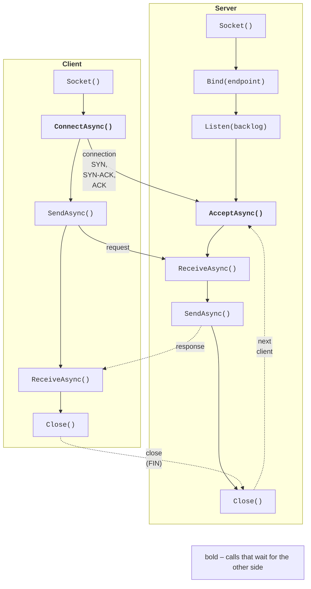

# Network communication and sockets

## Interaction models in distributed systems

In Topics 2–7, parallel computations ran in **a single process** with shared memory. A **distributed system** is several processes on the same or different computers that have no shared memory and exchange **messages** over a network. Web services, clusters (Topics 12–13), message brokers (Topic 15), and cloud applications (Topics 16–17) are built this way.

The main interaction models:

- **client–server**: the server waits for requests at a well-known address, and clients establish connections themselves; the server serves many clients at the same time;
- **multi-tier architecture**: a client calls an application server, which in turn calls a database server or other services; each tier is a client of the next one;
- **peer-to-peer** (P2P): every node is both a client and a server (file sharing, blockchain, distributed hash tables).

By the way they wait, interactions are **synchronous** (the client waits for a response, as in an ordinary method call) or **asynchronous** (the client sends a message and continues working; the response arrives later or is not needed at all). In .NET, logically synchronous interaction is implemented with asynchronous `async`/`await` code (Topic 5) so that waiting for the network does not occupy threads.

::: tip Fallacies of distributed computing
L. Peter Deutsch and his colleagues at Sun Microsystems formulated eight false assumptions that newcomers make: the network is reliable; latency is zero; bandwidth is infinite; the network is secure; topology does not change; there is one administrator; transport cost is zero; the network is homogeneous. Each of them is false in a real system, so network code always has timeouts, retries, data validation, and channel protection.
:::

## The TCP/IP protocol stack

Network programs run on top of the TCP/IP stack: the **link** layer (Ethernet, Wi-Fi), the **network** layer (IP, delivering packets between hosts), the **transport** layer (TCP or UDP, delivering data between processes), and the **application** layer (HTTP, SMTP, gRPC, or a custom protocol).

- An **IP address** identifies a host: IPv4 has 32 bits (`192.168.0.10`, loopback address `127.0.0.1`), and IPv6 has 128 bits (`2001:db8::1`, loopback `::1`). The address `0.0.0.0` (`IPAddress.Any`) in a bind means “all network interfaces.”
- A **port** (0–65535) identifies a process on a host. Ports up to 1023 are reserved for well-known services (80 is HTTP, 443 is HTTPS); the examples in this topic use ports 5000–5055.
- An **endpoint** is an “address, port” pair, the `IPEndPoint` class in .NET.
- **DNS** converts a name into addresses: `await Dns.GetHostAddressesAsync("localhost")` on the author’s computer returned two addresses: `::1` (`InterNetworkV6`) and `127.0.0.1` (`InterNetwork`).

The transport protocols are compared in Table 14.1.

Table 14.1. Comparing the TCP and UDP protocols {.caption}

| **Property** | **TCP** | **UDP** |
| --- | --- | --- |
| connection | established (three-way handshake SYN, SYN-ACK, ACK) | none: each datagram is independent |
| reliability | acknowledgments, retransmission, checksums | a datagram may be lost or arrive twice |
| ordering | bytes arrive in the order they were sent | order is not guaranteed |
| message boundaries | none: a **byte stream** | preserved: one datagram is one message (up to 65,507 bytes in IPv4) |
| flow control | yes (window, congestion control) | no |
| uses | HTTP/1.1, HTTP/2, gRPC, databases, SSH | DNS, video streaming, games, service discovery, HTTP/3 (QUIC) |

### Diagnostic utilities

You can check whether a server is listening on a port with these commands (Fig. 14.1):

```powershell
Get-NetTCPConnection -LocalPort 5000 -State Listen
Test-NetConnection 127.0.0.1 -Port 5000   # TcpTestSucceeded : True
ss -tlnp | grep 5000                      # Linux (bash)
```

`Get-NetTCPConnection` shows the address, port, `Listen` state, and process number (`OwningProcess`), `Test-NetConnection` tries to connect, and `ss` on Linux replaces the outdated `netstat`. Packets are inspected with the **Wireshark** analyzer (<https://www.wireshark.org/docs/>); on Windows, `localhost` traffic is captured on the *Adapter for loopback traffic capture* adapter.

::: info Screenshot
Windows Terminal: `dotnet run -c Release -- server` of the echo example in one tab; in another `Get-NetTCPConnection -LocalPort 5000 -State Listen` and `Test-NetConnection 127.0.0.1 -Port 5000`; optionally Ubuntu `ss -tlnp | grep 5000`
:::

Figure 14.1. A server listening on port 5000 {.caption}

## Sockets in .NET

A **socket** is an operating system object through which a process sends and receives data over the network. .NET has two levels of API (<https://learn.microsoft.com/dotnet/fundamentals/networking/sockets/sockets-overview>):

- the `Socket` class from the `System.Net.Sockets` namespace, a thin wrapper over OS sockets (Winsock on Windows, BSD sockets on Linux): `Bind`, `Listen`, `AcceptAsync`, `ConnectAsync`, `SendAsync`, `ReceiveAsync`, `Shutdown`;
- the `TcpListener`, `TcpClient`, and `UdpClient` classes, simplified wrappers for typical scenarios; `TcpClient` provides a `NetworkStream`, that is, an ordinary `Stream` that works with `StreamReader`, `StreamWriter`, `CopyToAsync`, and serializers.

The sequence of calls for a TCP server and client is shown in Fig. 14.2. The server creates a socket, binds it to an endpoint (`Bind`), switches it to listening mode (`Listen`, whose parameter is the length of the queue of pending connections), and accepts connections (`AcceptAsync`). Each accepted connection is a **new** socket, and the listening socket waits for the next client again.



Figure 14.2. The sequence of TCP socket calls {.caption}

```cs
// Server: one request and one response.
using Socket listener = new(AddressFamily.InterNetwork,
    SocketType.Stream, ProtocolType.Tcp);
listener.Bind(new IPEndPoint(IPAddress.Loopback, 5000));
listener.Listen(backlog: 100);
using Socket handler = await listener.AcceptAsync();
byte[] buffer = new byte[1024];
int received = await handler.ReceiveAsync(buffer, SocketFlags.None);
string request = Encoding.UTF8.GetString(buffer, 0, received);
byte[] reply = Encoding.UTF8.GetBytes($"pong: {request}");
await handler.SendAsync(reply, SocketFlags.None);
handler.Shutdown(SocketShutdown.Both);    // graceful shutdown
```

The client creates the same kind of socket, calls `ConnectAsync(endpoint)`, sends `"ping"`, and receives `pong: ping`; the client’s next `ReceiveAsync` returns 0.

`ReceiveAsync` returns the number of bytes read; **zero** means that the other side has closed the connection. The method may return **fewer** bytes than were sent: TCP does not preserve message boundaries (see “An application-layer protocol”). For IPv6, an `AddressFamily.InterNetworkV6` socket is created; the `DualMode = true` property lets such a socket accept IPv4 connections as well (it is `false` by default).

### Serving many clients

A server that processes a client inside its accept loop serves only one client at a time. The classic “thread per client” solution (Topic 2) scales poorly: a thousand clients means a thousand threads with their stacks. In .NET, each connection is served by an **asynchronous task**: the accept loop calls `sessions.Add(ServeAsync(client, token))` without `await` and immediately returns to `AcceptTcpClientAsync`, while `ServeAsync` reads and writes with `await`. While a client is silent, its task does not occupy a thread, so a server serves thousands of connections on a few pool threads. The tasks are kept in a list so that they can be awaited on shutdown (`Task.WhenAll`) and their exceptions are not lost (the “TCP echo” example). A description of the `TcpListener` and `TcpClient` classes: <https://learn.microsoft.com/dotnet/fundamentals/networking/sockets/tcp-classes>.

::: tip Pitfall
The server’s shared data (the client list, counters, chat rooms) is modified by different tasks at the same time, so it requires synchronization or thread-safe collections (Topics 3–4). Writing to the same `NetworkStream` from two tasks at once interleaves the bytes of messages: each connection must have a single writer or a write lock.
:::
