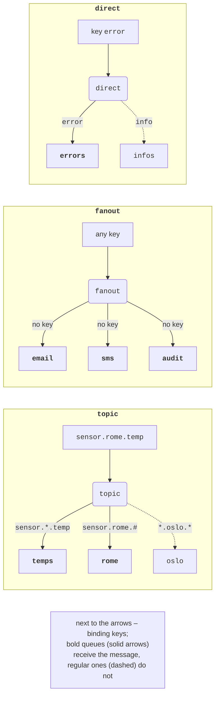
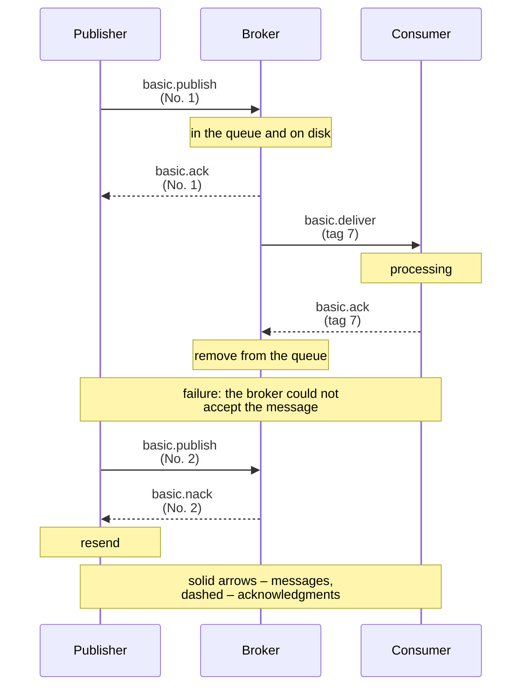

# Routing and delivery guarantees

## Exchanges and routing

The exchange type determines how a message’s routing key is compared with the binding keys (<https://www.rabbitmq.com/docs/exchanges>, Fig. 15.6):

- **direct** routes to the queues whose binding key **exactly matches** the message key (routing by log level: `error`, `warning`, `info`);
- **fanout** routes to **all** bound queues, and the key is ignored (broadcasting events to several independent services);
- **topic**: the key consists of words separated by dots (`sensor.rome.temp`), and a binding is a pattern where `*` replaces exactly one word and `#` replaces zero or more words (`sensor.*.temp`, `sensor.rome.#`);
- **headers** routes by headers instead of the key: the binding argument `x-match` with the value `all` (all specified headers match) or `any` (at least one);
- the **default** exchange `""` (a kind of direct) delivers to the queue whose name equals the key.



Figure 15.6. Exchange types {.caption}

An exchange is declared with `ExchangeDeclareAsync`, and a binding is created with `QueueBindAsync`:

```cs
await channel.ExchangeDeclareAsync("events", ExchangeType.Topic,
    durable: true);
QueueDeclareOk q = await channel.QueueDeclareAsync(queue: "",
    durable: false, exclusive: true, autoDelete: true);
await channel.QueueBindAsync(q.QueueName, "events", "orders.#");
```

A queue with an empty name gets a unique name from the broker, such as `amq.gen-4GM2fGEr7AevNGZYauPcAQ` (the `QueueName` property). Such an **exclusive** queue is the typical way to subscribe to events while the program is running. If a subscriber must also receive events while it is down, it needs a named durable queue (Lab 15, Example 3).

For a headers exchange, it was verified that a binding with `x-match = all` on `class = 10-A` and `role = parent` received only the `10-A/parent` message, and one with `x-match = any` on `class = 10-A` and `role = teacher` received all three: `10-A/parent`, `10-A/student`, `11-B/teacher`.

An exchange silently **discards** a message that matched no binding. To find out about this, the publisher publishes with `mandatory: true`: the broker will return the message (see “Delivery guarantees”). An exchange’s bindings are visible in the web console (Fig. 15.7).

::: info Screenshot
Management UI → Exchanges → `events` (type topic) while the “Event log” example waits for Enter: Bindings section with three amq.gen-… queues and routing keys `*.error`, `*.critical`, `orders.#`, `#`
:::

Figure 15.7. Bindings of the `events` topic exchange {.caption}

## Delivery guarantees

A message can be lost in three places: between the publisher and the broker (a connection loss), in the broker (a restart, a disk failure), and between the broker and the consumer (a crash during processing). Each place is protected by its own mechanism (Fig. 15.8, <https://www.rabbitmq.com/docs/reliability>).

### Durability

For a message to survive a broker restart, both conditions are required: a **durable queue** (`durable: true`) and a **persistent message** (`Persistent = true`). Quorum queues and streams always store messages on disk. Durable exchanges and bindings also survive a restart.

### Publisher confirms

**Publisher confirms** report that the broker has **taken responsibility** for a message: for a persistent message, after it is written to all queues and to disk; for a quorum queue, after it is confirmed by a majority of replicas. In client 7, they are enabled when the channel is created:

```cs
CreateChannelOptions options = new(
    publisherConfirmationsEnabled: true,
    publisherConfirmationTrackingEnabled: true);
await using IChannel channel =
    await connection.CreateChannelAsync(options);
try
{
    await channel.BasicPublishAsync("", "payments", mandatory: true,
        basicProperties: props, body: body);  // waits for basic.ack
}
catch (PublishException ex)       // basic.nack or a return
{
    Console.WriteLine($"not accepted (return: {ex.IsReturn})");
}
```

With tracking (`publisherConfirmationTrackingEnabled`), `BasicPublishAsync` completes only after the broker’s confirmation, and a refusal (`basic.nack`) or the return of an unroutable message (`mandatory: true`) turns into a `PublishException`. The property `IsReturn = true` means that the message did not reach any queue (verified by publishing to a queue with the misspelled name `paymnts`), and `false` means that the broker refused it (verified by overflowing a queue with `x-overflow = reject-publish`). For tracking, the client adds the `x-dotnet-pub-seq-no` header with the publish sequence number to the message.



Figure 15.8. Publisher and consumer acknowledgments {.caption}

Waiting for the confirmation of every message costs a full round trip and a disk write. It is faster to publish in **batches**: start several publications and only then wait for all of them (the `ValueTask` values are stored in a list, as in the example below). The measurements (20,000 messages of 256 bytes, the median of 5 runs) are given in Table 15.4.

```cs
List<ValueTask> batch = new(100);
for (int i = 0; i < count; i++)
{
    batch.Add(channel.BasicPublishAsync("", queue, false, props,
        body));
    if (batch.Count == 100)
    {
        foreach (ValueTask t in batch) await t;   // 100 confirmations
        batch.Clear();
    }
}
foreach (ValueTask t in batch) await t;
```

Table 15.4. Publishing rate (i9-11900KF, Docker Desktop, 10,000 messages) {.caption}

| **Publisher mode** | **Classic queue, msg/s** | **Quorum queue, msg/s** |
| --- | --- | --- |
| no confirms, transient | 88,182 | 18,999 |
| no confirms, persistent | 101,295 | 18,695 |
| confirm each message | 1,478 | 189 |
| confirm in batches of 100 | 36,883 | 5,067 |

Confirming messages one at a time slows publishing down 70–100 times; batches recover most of the speed. A quorum queue is slower than a classic one because each message goes through the Raft log with a disk sync (in Docker Desktop, the disk of the WSL 2 virtual machine is relatively slow). Documentation on publisher confirms: <https://www.rabbitmq.com/docs/publishers>.

### Delivery semantics and idempotency

As with RPC (Topic 14), **delivery semantics** are distinguished:

- **at-most-once**: `autoAck: true` without publisher confirms is fast, but messages can be lost;
- **at-least-once**: publisher confirms plus republishing after an error, and manual acks after processing; messages are not lost but may arrive **twice**: the publisher republished because a confirmation was lost, or the consumer crashed after processing but before `BasicAck`;
- **exactly-once** cannot be guaranteed by the broker; the “exactly once” effect is achieved at the application level by an **idempotent consumer**, which remembers the identifiers of processed messages and skips duplicates.

An example of an idempotent consumer for crediting payments: the publisher sets `MessageId`, and the consumer checks it against a “table” of processed identifiers (in the program, a `ConcurrentDictionary`; in a real system, a database table with a unique key updated in the same transaction as the data):

```cs
consumer.ReceivedAsync += async (_, ea) =>
{
    string id = ea.BasicProperties.MessageId!;
    string mark = ea.Redelivered ? ", redelivery" : "";
    // TryAdd is atomic: only the first delivery "wins."
    if (processed.TryAdd(id, true))
    {
        balance += decimal.Parse(Encoding.UTF8.GetString(
            ea.Body.Span));
        Console.WriteLine($"{name}: {id} credited{mark}");
    }
    else
    {
        Console.WriteLine($"{name}: {id} – duplicate{mark}");
    }
    await ch.BasicAckAsync(ea.DeliveryTag, false);
};
```

In the test, the publisher sent `dep-1`, `dep-2`, `dep-1` again (a simulated retry), and `dep-3`, each for UAH 100; consumer A processed `dep-3` but “crashed” before `BasicAck` (the channel was closed), and the broker redelivered `dep-3` to consumer B:

```
A: dep-1 credited
A: dep-2 credited
A: dep-1 – duplicate
A: dep-3 credited
A: failure before BasicAck
B: dep-3 – duplicate, redelivery
balance: UAH 300
```
