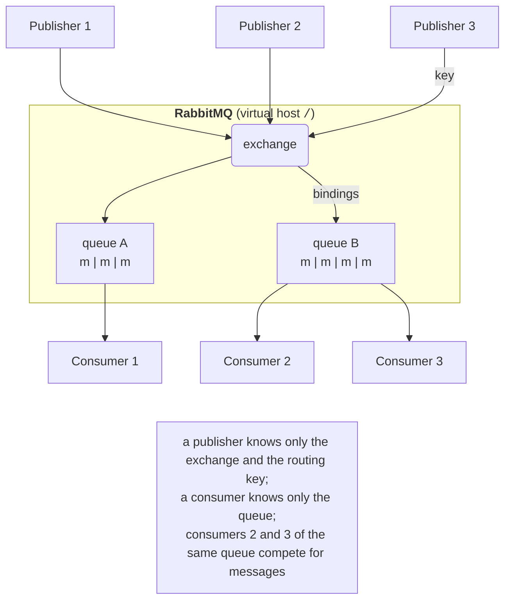

# Messaging and RabbitMQ

## Asynchronous messaging

In Topic 14, the client and the server communicated **directly**: through a socket or a gRPC call. Such coupling is **tight**: the client must know the server’s address, the server must be running at the moment of the call, and if it is slow or overloaded, the client waits. **Messaging** adds an intermediary between them, a **message broker**. The sender puts a message into the broker and continues working, and the receiver picks it up when it is ready.

The advantages of such **loose coupling**:

- **in space**: the sender does not know who will process the message or how many receivers there are; new services connect without changing the sender;
- **in time**: a receiver may be temporarily down, and messages wait in the queue;
- **in speed**: a queue **buffers** load peaks (*load levelling*). A website takes 10,000 orders in a minute of a sale, while the warehouse processes 50 per second, so the orders simply stay in the queue longer;
- **scaling**: to process faster, it is enough to start a few more receivers on the same queue.

The price is an additional infrastructure component, delivery latency, and **asynchrony**: the sender does not get a response immediately, and a message may be delivered more than once. A comparison with direct calls is given in Table 15.1.

Table 15.1. A direct call versus messaging through a broker {.caption}

| **Property** | **Direct call (RPC, gRPC, REST)** | **Message broker** |
| --- | --- | --- |
| interaction | synchronous: request and response | asynchronous: “fire and forget” or a response in a separate message |
| receiver availability | must be running at the time of the call | may be down; messages wait |
| number of receivers | one | one (work queue) or many (publish–subscribe) |
| peak load | failures or timeouts | smoothed out by the queue |
| typical use | data queries, short operations | background jobs, events, service integration |

Common brokers and platforms: **RabbitMQ**, Apache ActiveMQ, Apache Kafka (a distributed event log), NATS, and the cloud services Azure Service Bus and Amazon SQS. This topic uses RabbitMQ, one of the most widely used open-source brokers.

## RabbitMQ architecture and the AMQP 0-9-1 model

**RabbitMQ** (<https://www.rabbitmq.com/>) is an open-source message broker (MPL 2.0 license) written in Erlang, a language created for reliable distributed systems. In September 2026 the current series is 4.3 (release 4.3.0 of April 23, 2026, fix 4.3.6 of September 16, 2026; <https://www.rabbitmq.com/release-information>). RabbitMQ’s main protocol is **AMQP 0-9-1** (*Advanced Message Queuing Protocol*); since version 4.0 the broker also supports AMQP 1.0 “natively,” and MQTT, STOMP, and its own streams protocol through plugins.

The AMQP 0-9-1 model (<https://www.rabbitmq.com/tutorials/amqp-concepts>) consists of the following entities (Fig. 15.1):

- a **publisher** (*producer*) is a program that sends messages;
- a **message** consists of a **body** (a byte array: text, JSON, protobuf) and **properties**: content type, identifier, priority, *headers*, and so on;
- an **exchange** is the broker’s “post office”: a publisher sends a message not to a queue but to an exchange, together with a **routing key**;
- a **binding** is an “exchange → queue” rule with a key or a pattern; based on the bindings, the exchange decides which queues to put copies of a message into;
- a **queue** is an ordered buffer of messages (FIFO) that stores them until they are processed;
- a **consumer** is a program that has subscribed to a queue; the broker itself **delivers** (*pushes*) messages to it.



Figure 15.1. Interaction through a message broker {.caption}

A publisher knows nothing about queues and consumers, and a consumer knows nothing about publishers: they are connected only by exchanges and bindings, which can be changed without changing code.

### Connections and channels

A client opens one long-lived TCP **connection** to the broker (port 5672, or 5671 with TLS). Establishing a connection is expensive (a TCP handshake, authentication), so lightweight **channels** are created inside it, logical connections multiplexed over a single TCP stream (<https://www.rabbitmq.com/docs/channels>). Every protocol operation (declaring a queue, publishing, acknowledging) is performed on a channel. By default, up to 2047 channels per connection are allowed. The rule: one connection per process and a separate channel for each independent publisher or consumer. A protocol error (for example, accessing a nonexistent queue) **closes the channel**, not the connection.

### Virtual hosts, users, and permissions

A **virtual host** (vhost) is an isolated namespace inside the broker with its own exchanges, queues, and permissions (<https://www.rabbitmq.com/docs/vhosts>). The default vhost is `/`. This way, one broker serves several applications or student groups. A **user** has a password and permissions in each vhost (<https://www.rabbitmq.com/docs/access-control>): three regular expressions for the actions **configure** (create and delete entities), **write** (publish), and **read** (consume). The built-in user `guest` (password `guest`) can by default connect only from `localhost`; in a Docker container (next section), connections from Windows through a forwarded port are also accepted.

The broker’s metadata (vhosts, users, queues, bindings) is kept in the **Khepri** store, based on the Raft consensus algorithm; since version 4.3, it is the only metadata store (<https://www.rabbitmq.com/docs/metadata-store>).

## Deploying RabbitMQ and management tools

On the lab PCs, RabbitMQ is run in **Docker Desktop** from the official image (<https://hub.docker.com/_/rabbitmq>); containers are covered in detail in Topic 17. The image with the `4-management` tag contains the latest version of the 4 series (4.3.6 as of September 2026) with the web console plugin enabled:

```powershell
docker run -d --name rabbit --hostname rabbit `
    -p 5672:5672 -p 15672:15672 `
    -v rabbit-data:/var/lib/rabbitmq rabbitmq:4-management
docker ps          # STATUS: Up …, PORTS: 0.0.0.0:5672->5672/tcp …
docker logs rabbit # … Server startup complete
```

The `-p 5672:5672` option opens the AMQP port, and `-p 15672:15672` the web console port. The `rabbit-data` volume keeps the broker’s data (durable queues, messages, users) when the container is recreated, and the fixed node name `--hostname rabbit` is required because RabbitMQ stores data in a folder named after the node. Verified: a vhost created in the first container remained in a new container with the same volume. Startup takes a few seconds (Fig. 15.2). To stop and start it again: `docker stop rabbit`, `docker start rabbit`. On an Ubuntu server, the broker is installed from the RabbitMQ team’s apt repositories (<https://www.rabbitmq.com/docs/install-debian>).

::: info Screenshot
Windows Terminal: the `docker run … rabbitmq:4-management` command above, then `docker ps` showing container `rabbit`, image `rabbitmq:4-management`, status Up, ports 5672 and 15672
:::

Figure 15.2. Running RabbitMQ in a Docker container {.caption}

### The management web console

The web console (<https://www.rabbitmq.com/docs/management>) is opened in a browser at `http://localhost:15672` (user `guest`, password `guest`). Its tabs: *Overview* (the version, message rate charts, the number of connections and queues), *Connections*, *Channels*, *Exchanges*, *Queues and Streams* (the contents and consumers of each queue, the *Publish message*, *Get messages*, and *Purge* buttons), and *Admin* (users, vhosts, policies) (Fig. 15.3).

::: info Screenshot
Browser `http://localhost:15672` after login guest/guest → Overview while the Orders example runs: RabbitMQ 4.3.6, Erlang 27, Queued messages and Message rates charts, Global counts, node `rabbit@rabbit`
:::

Figure 15.3. The RabbitMQ management web console {.caption}

### Command-line utilities

The broker’s utilities are run inside the container with `docker exec` (<https://www.rabbitmq.com/docs/cli>): `rabbitmqctl` manages entities, `rabbitmq-diagnostics` checks the node’s health, and `rabbitmq-plugins` enables plugins. Example: a separate vhost and user for a student group.

```powershell
docker exec rabbit rabbitmq-diagnostics ping    # Ping succeeded
docker exec rabbit rabbitmqctl add_vhost pi-41
docker exec rabbit rabbitmqctl add_user student 'S3cret!'
docker exec rabbit rabbitmqctl set_permissions -p pi-41 `
    student '.*' '.*' '.*'
docker exec rabbit rabbitmqctl list_queues name type messages
docker exec rabbit rabbitmq-plugins list -e      # enabled plugins
```

The three `'.*'` expressions give the user all configure, write, and read permissions in the `pi-41` vhost. The `list_queues` command prints a table of queues with their type and number of messages (more columns can be added: `consumers`, `messages_unacknowledged`).
