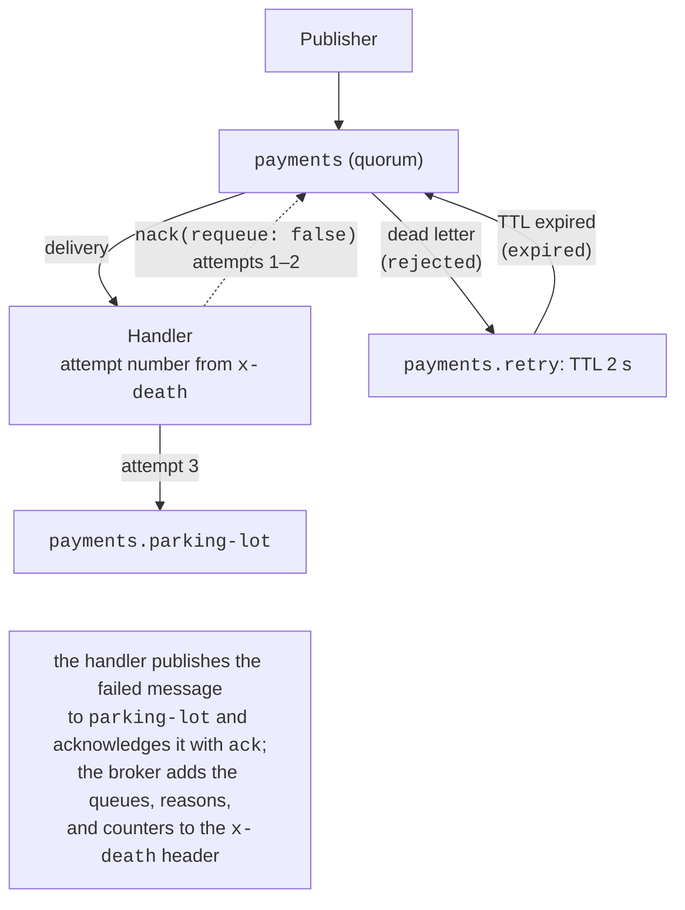

# Queue types, RPC, and operations

## Queue types, dead letter exchanges, and TTL

The queue type is set by the `x-queue-type` argument at declaration (<https://www.rabbitmq.com/docs/queues>); a comparison is given in Table 15.5.

Table 15.5. RabbitMQ queue types {.caption}

| **Property** | **Classic** (`classic`) | **Quorum** (`quorum`) | **Stream** (`stream`) |
| --- | --- | --- | --- |
| storage | on a single node | replicated with the Raft algorithm (3 replicas by default) | a replicated append-only log |
| reading | a message is removed after ack | removed after ack | not removed; read from any position (*offset*) |
| durability | optional | always | always |
| features | exclusive and temporary queues, priorities `x-max-priority` | delivery limit (20 by default), at-least-once dead lettering | re-reading history, millions of messages, many readers |
| uses | temporary queues, RPC replies | important job and event queues | event logs, telemetry, auditing |

A **quorum queue** (<https://www.rabbitmq.com/docs/quorum-queues>) is the recommended type for data that must not be lost: in a cluster, it keeps working as long as a majority of replicas is available. A quorum queue counts **failed deliveries** in the `x-delivery-count` header and, after the **delivery limit** (`x-delivery-limit`, 20 by default since version 4.0), drops a *poison message* or passes it to a dead letter exchange. Verified with a limit of 3: `BasicRejectAsync(requeue: true)` and a consumer crash increase the counter, and the fourth delivery becomes the last. However, `BasicNackAsync(requeue: true)` in RabbitMQ 4.3 is treated as an **explicit return** and is not counted: in 1.5 s, one message was delivered 254 times without being moved to the DLX. Such a “hot loop” uselessly loads the broker and the consumer.

A **stream** (<https://www.rabbitmq.com/docs/streams>) is read from the position given by the consumer argument `x-stream-offset` (`"first"`, `"last"`, a number, a time); prefetch and manual acknowledgments are mandatory for a stream: without prefetch, the broker closes the channel with the error `PRECONDITION_FAILED` (“consumer prefetch count is not set”). Verified: after five messages were published, a reader starting from `"first"` received all five (positions 0–4), and a reader starting from position 3 received only the last two; the messages remain in the stream for subsequent readers.

::: tip Pitfall
The parameters of an existing queue cannot be changed by declaring it again: `QueueDeclareAsync` with different arguments closes the channel with the error `406 PRECONDITION_FAILED` (“inequivalent arg 'x-max-length'”, verified). The queue is deleted (`QueueDeleteAsync`, the web console) and created again, or its parameters are changed with **policies** (`rabbitmqctl set_policy`).
:::

### Time-to-live and length limits

- **Message TTL** (<https://www.rabbitmq.com/docs/ttl>): the queue argument `x-message-ttl` (ms) or the message property `Expiration`. Verified: of two messages with `Expiration` of 500 and 60,000 ms, one remained in the queue after 1 s.
- **Queue TTL** `x-expires`: an unused queue is deleted.
- **Length limits** (<https://www.rabbitmq.com/docs/maxlength>): `x-max-length` (messages) or `x-max-length-bytes`. The default overflow strategy `drop-head` drops the oldest messages (verified: of five messages in a queue with a limit of 3, `m3`, `m4`, `m5` remained), while `x-overflow = reject-publish` rejects new ones (a publisher with confirms gets a `PublishException`).
- **Priorities** (<https://www.rabbitmq.com/docs/priority>): a classic queue with `x-max-priority` and the `Priority` property. Verified: messages with priorities 1, 5, 0, 3, 5 were delivered in the order 5, 5, 3, 1, 0.

### Dead letter exchanges and retries

A **dead letter exchange** (DLX, <https://www.rabbitmq.com/docs/dlx>) is an exchange to which the broker redirects the “dead” messages of a queue with the `x-dead-letter-exchange` argument (and, optionally, `x-dead-letter-routing-key`). A message “dies” if it is rejected with `requeue: false` (reason `rejected`), its TTL expires (`expired`), the queue overflows (`maxlen`), or the delivery limit is exhausted (`delivery_limit`). The broker adds the `x-death` header: an array of records with the queue, the reason, a `count`, and the time.

**Delayed retries** are built on this (Fig. 15.9). A failed message from the `payments` queue is rejected and, through the DLX, goes to the `payments.retry` queue, which has no consumers and a TTL of 2 s; when the TTL expires, the message returns to `payments` through the DLX again. The handler computes the attempt number from `x-death`, and after three failures publishes the message to a **parking-lot** queue for manual analysis (Fig. 15.10). This approach distinguishes **transient** failures (a timeout of an external service, where a retry will help) from **permanent** ones (a card was declined, where a retry will not help). The complete code is the “Reliable publishing” example at the end of the lecture. In RabbitMQ 4.3, quorum queues also got built-in **delayed retries** (the arguments `x-delayed-retry-type`, `x-delayed-retry-min`, `x-delayed-retry-max`); in a test with a minimum delay of 500 ms, messages returned with `BasicNackAsync` arrived again after 0.5 s.

Figure 15.9. Retries through a dead letter exchange {.caption}

::: info Screenshot
Management UI → Queues and Streams → `payments.parking-lot` → Get messages (Ack mode: Nack message requeue true) → Get Message(s): headers x-death with two entries (payments / rejected / count 2 and payments.retry / expired / count 2), x-first-death-reason rejected, payload `{"Id":"P-3",…}`
:::

Figure 15.10. A message in the `payments.parking-lot` queue {.caption}

## The RPC pattern over queues

Sometimes a request with a response is needed through a broker: the broker smooths the load and distributes requests among several servers. The **RPC over queues** pattern:

1. the client creates its own exclusive **reply queue** (one for the whole client);
2. it publishes a request to the service queue with the properties `ReplyTo` (the name of the reply queue) and `CorrelationId` (a unique request identifier, for example a `Guid`);
3. the server processes the request and publishes the response through the default exchange to the `ReplyTo` queue, copying the `CorrelationId`;
4. the client finds the waiter (`TaskCompletionSource`) by `CorrelationId` and completes it; a response with an unknown identifier (a late one) is ignored;
5. waiting is limited by a **timeout**, and the request is given an `Expiration` so that the broker removes it if no server takes the request in time.

Several requests can wait at the same time: the responses are distinguished by `CorrelationId`. Instead of a dedicated reply queue, you can use **direct reply-to**, the pseudo-queue `amq.rabbitmq.reply-to`, which does not create a queue in the broker (<https://www.rabbitmq.com/docs/direct-reply-to>). The complete program (computing Fibonacci numbers) is given in Lab 15, Example 1. If a broker is not needed, gRPC (Topic 14) is better suited for RPC: lower latency and a strict contract.

## Distributed computing through a broker

A work queue naturally implements **task parallelism** across processes and computers (compare with the thread pool in Topic 5):

- the **coordinator** splits a problem into parts and publishes them to a durable `tasks` queue with `ReplyTo` pointing to its own result queue and a common `CorrelationId` for the problem;
- **workers** (any number of processes on any computers) with the same prefetch compute the parts, publish the results, and acknowledge the jobs;
- the coordinator collects the results and combines them (reduction, Topic 6).

Load balancing is provided by prefetch: a faster worker simply takes more parts. Fault tolerance comes from manual acknowledgments: a part that was being processed by a worker that crashed returns to the queue and goes to another one. Scaling is done by starting additional workers without changing the coordinator. There should be several times more parts than workers, and each should take much longer than sending a message.

The author measured the computation of $\int_{0}^{1} 4 / (1 + x^{2}) \mathrm{d} x = \pi$ with the midpoint rule (2.56 · 109 steps, 64 parts) with the program from Lab 15 (Example 2): the workers are separate processes on the same PC, median of 5 runs (Table 15.6).

Table 15.6. Computing an integral with workers through RabbitMQ (i9-11900KF) {.caption}

| **Variant** | **Time, s** | **Speedup** |
| --- | --- | --- |
| sequential in one process | 2.28 | 1.00 |
| 1 worker | 2.60 | 0.88 |
| 2 workers | 2.32 | 0.98 |
| 4 workers | 1.10 | 2.1 |
| 8 workers | 0.58 | 3.9 |
| 16 workers | 0.44 | 5.2 |

The speedup is much lower than the number of workers. The eight physical cores are shared by the workers, the broker in Docker, and the coordinator, and each part adds the transfer of two messages. The measurements also revealed the main source of losses: with prefetch 1, after each part (36 ms of computation), a worker waited about another 40 ms for the next one, and the computation with one worker took 5.1 s instead of 2.3 s. A worker sends two small frames in a row (the result and `BasicAck`), and the path through Docker Desktop’s forwarded port delays the second of them, while the broker hands out the next part only after the acknowledgment. The RPC server from Lab 15 (Example 1), run in a container next to the broker, did not have this delay. Prefetch 2 mostly hides the delay (the next part is already waiting at the worker), but not completely: with two workers, the speedup in different series of measurements varied from 1.5 to almost 1 (the table shows the series measured under the lowest background load). Conclusions: parts must be much longer than the transfer time, and “latency is zero” is a fallacy (Topic 14); measure on real infrastructure and repeat your measurements.

## Monitoring and operations

**Metrics.** For each queue, the web console shows the number of *Ready* and *Unacked* messages, the publish, deliver, and acknowledge rates, the number of consumers, and their *consumer utilisation*. A queue that keeps growing is a signal to add consumers or look for a bug. For monitoring systems, the image contains the `rabbitmq_prometheus` plugin (metrics on port 15692, <https://www.rabbitmq.com/docs/prometheus>).

**Diagnostics** (<https://www.rabbitmq.com/docs/monitoring>): the `rabbitmq-diagnostics` utility has the commands `ping`, `check_running`, `status` (versions, memory, disk, plugins), and `list_deprecated_features`, and `rabbitmqctl` has `list_connections`, `list_consumers`, and `list_queues`. When the broker’s memory or free disk space crosses a threshold, an **alarm** is raised, and the broker blocks all publishers until the situation is resolved; therefore queues must not grow without bound.

**Connection recovery.** The .NET client with `AutomaticRecoveryEnabled` restores connections, channels, declared queues, bindings, and consumers. Verified by restarting the container (`docker restart`) while the “Hello, RabbitMQ” consumer was running: after the restart, it received a message sent to a durable queue without any intervention. The client does not repeat messages that were being published at the moment of the disconnection: that is the application’s job (publisher confirms + retry).

**Clustering.** For fault tolerance, RabbitMQ is deployed as a cluster of an odd number of nodes (usually 3): the Khepri metadata and quorum queues are replicated and keep working as long as a majority of nodes is available (<https://www.rabbitmq.com/docs/clustering>). The former “mirrored” classic queues were removed in version 4.0 and replaced with quorum queues. A checklist for production: <https://www.rabbitmq.com/docs/production-checklist>.

**Higher-level libraries.** **MassTransit** (<https://masstransit.massient.com/>) hides the broker topology: messages are C# classes, consumers are `IConsumer<T>` classes, and retries, dead lettering, sagas, and the “outbox” are configured declaratively; it supports RabbitMQ, Azure Service Bus, and Amazon SQS. Version 9 (since January 2026, 9.2.2 as of September) is distributed under a commercial license from Massient, while version 8 remains open source (Apache 2.0). The course uses “plain” `RabbitMQ.Client` so you can see what happens at the protocol level.
