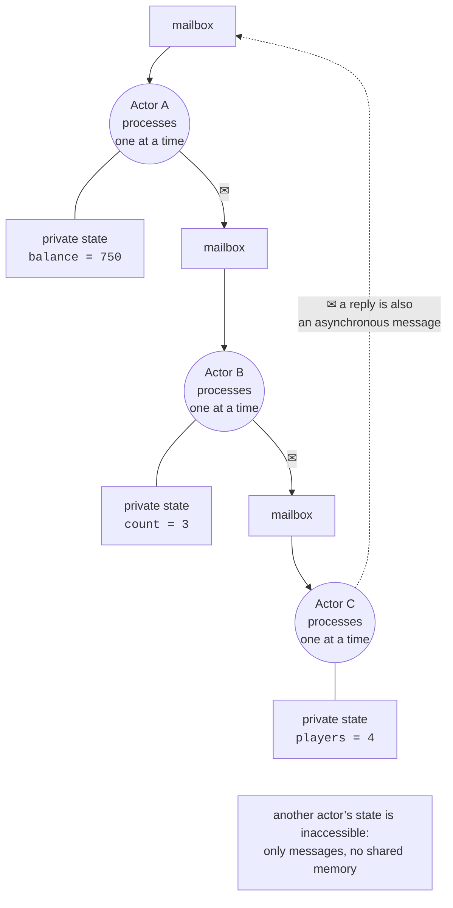
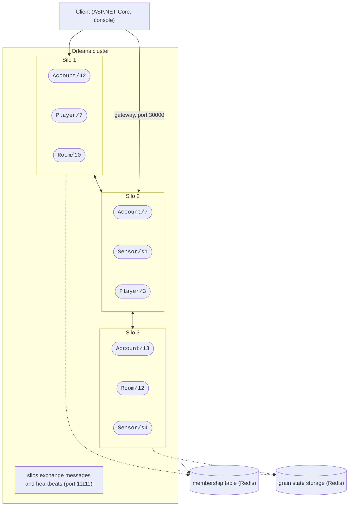
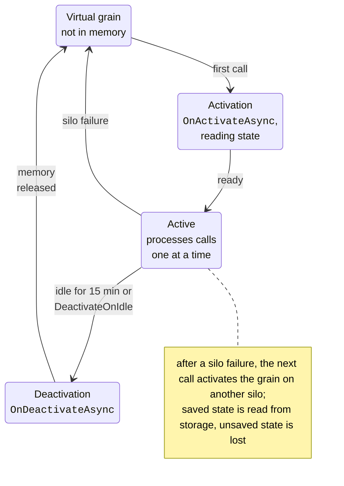

# The actor model and the Orleans project

## The actor model

In Topics 3–4, several threads modified shared data, and locks protected it from races. In a distributed system there is no shared memory at all (Topic 14), so a different model is needed. The **actor model** was proposed by Carl Hewitt in 1973. Its concepts:

- an **actor** is an independent entity with **private state** that nobody else can access;
- actors interact only through **asynchronous messages**: the sender puts a message into the receiver’s **mailbox** and does not wait (Fig. 16.1);
- an actor processes messages **one at a time**: it reads one, changes its state, sends messages to other actors, and creates new actors;
- the location of an actor is transparent: the address is the same for an actor in the same process and on another computer.



Figure 16.1. The actor model {.caption}

Since only the actor itself changes its state, and only in a single processing thread, **no locks are needed**, and data races do not occur. Parallelism comes from the number of actors: thousands of actors process their mailboxes at the same time on all cores. An error in one actor does not corrupt the state of the others.

The model is implemented by the **Erlang** language (Ericsson, 1986; telephone switches, WhatsApp; <https://www.erlang.org/>) with its “let it crash” principle and trees of **supervisors** that restart actors; by **Akka** for the JVM and **Akka.NET** (<https://getakka.net/>), where actors are created and addressed explicitly; and by **Microsoft Orleans**, which is covered below.

The simplest actor in .NET is a class with a private field, a `Channel<T>` (Topic 4) as a mailbox, and a single task that reads the channel (the full code is the “Counter actor without Orleans” example). The sender calls `SendAsync` (*tell*, “fire and forget”) or `AskAsync` (*ask*, “request – reply” through `TaskCompletionSource<int>`). Sixteen tasks of 100,000 `Increment` messages each gave exactly 1,600,000, whereas an ordinary `counter++` with `Parallel.For` without synchronization gave only 322,214–537,622 in three runs.

::: tip Comparison with locks
A lock protects **data**, and everyone who modifies it must remember to use `lock`. An actor protects data **architecturally**: there is no path to the state other than a message. The price is a message queue and asynchrony: even reading the state becomes a message with a reply, and a “hot” mailbox of a single actor limits throughput.
:::

## Orleans virtual actors

**Orleans** is Microsoft’s framework for distributed .NET applications, created at Microsoft Research (<https://learn.microsoft.com/dotnet/orleans/overview>). It is used by Azure services, Xbox, Skype, PlayFab, and the Halo and Gears of War games. Orleans introduced **virtual actors**: an actor **always** exists logically, it is not created or destroyed explicitly, and a physical instance in memory appears on the first call.

- A **grain** is a virtual actor: an **identity** (a type and a key, for example `account/UA-001`), **behavior** (the interface methods), and **state**.
- An **activation** is an instance of the grain class in the memory of one server. The Orleans runtime creates it automatically and removes it after it has been idle (15 min by default, `GrainCollectionOptions.CollectionAge`).
- A **silo** is a host process in which grain activations live (Fig. 16.2).
- A **cluster** is a group of silos with the same `ClusterId`; silos find each other through the **membership table** and distribute grains among themselves.
- A **client** is an application that calls grains through a silo’s **gateway**; the client can run in a separate process or in the same process as the silo (*co-hosting*).



Figure 16.2. An Orleans cluster {.caption}

**Placement** decides on which silo to activate a grain (since Orleans 9.2, the default `ResourceOptimizedPlacement` strategy takes processor and memory load into account; there are also `[RandomPlacement]`, `[PreferLocalPlacement]`, and others). The distributed **grain directory** remembers where each activation lives and guarantees that there is at most one activation of a grain in the cluster at a time (since version 9.0, the directory is strongly consistent). The caller sees none of this: it has only a grain reference and calls a method, and Orleans finds or creates the activation. The grain life cycle is shown in Fig. 16.3.



Figure 16.3. The grain life cycle {.caption}

## An Orleans project on .NET 10

The current stable version is **Orleans 10.3.1** (August 28, 2026), which supports .NET 8, 9, and 10 (<https://www.nuget.org/packages/Microsoft.Orleans.Server>). The main packages:

- `Microsoft.Orleans.Sdk`: attributes, base interfaces, and the serialization code generator (in all projects with grain interfaces and classes);
- `Microsoft.Orleans.Server`: the silo (it contains `Microsoft.Orleans.Runtime`, where `IPersistentState<T>` is declared);
- `Microsoft.Orleans.Client`: an external client;
- providers: `Microsoft.Orleans.Persistence.Redis`, `Microsoft.Orleans.Clustering.Redis`, `Microsoft.Orleans.Reminders.Redis`, `Microsoft.Orleans.Streaming`, `Microsoft.Orleans.Reminders`.

A typical solution consists of four projects (Fig. 16.4): the `Bank.Abstractions` interface library (`Sdk`), the `Bank.Grains` implementation library (`Sdk`, `Runtime`), the `Bank.Silo` console silo (`Server`, `Persistence.Redis`), and the `Bank.Client` console client (`Client`). The client references only the interfaces.

::: info Screenshot
Rider: solution Bank (Bank.slnx) with Bank.Abstractions, Bank.Grains, Bank.Silo, Bank.Client in Solution Explorer; `IAccountGrain.cs` open; NuGet references of Bank.Silo expanded
:::

Figure 16.4. An Orleans solution in Rider {.caption}

### The grain interface

The interface inherits a key type marker: `IGrainWithStringKey`, `IGrainWithGuidKey`, `IGrainWithIntegerKey`, or the compound `IGrainWithGuidCompoundKey` and `IGrainWithIntegerCompoundKey`. Methods return `Task`, `Task<T>`, `ValueTask`, or `ValueTask<T>`: each call is a message, and the reply arrives asynchronously. Types passed between processes are marked with `[GenerateSerializer]`, and their fields with `[Id(n)]` (as in protobuf, the numbers are not changed after publication); `[Immutable]` allows the object not to be copied within a single silo.

```cs
namespace Bank;

// The grain contract: the key is the account number (a string).
public interface IAccountGrain : IGrainWithStringKey
{
    Task<decimal> GetBalance();
    Task Deposit(decimal amount);
    Task Withdraw(decimal amount);
    Task Transfer(string toAccount, decimal amount);
    Task<AccountInfo> GetInfo();
}

// Data passed between the client and the silo.
[GenerateSerializer, Immutable]
public sealed record AccountInfo(
    [property: Id(0)] string Number,
    [property: Id(1)] decimal Balance,
    [property: Id(2)] int Operations,
    [property: Id(3)] string Silo);
```

### The grain class

The class inherits `Grain` and implements the interface. The account state is injected into the constructor as `IPersistentState<AccountState>` (see “Grain state and persistence”). Properties of the base class: `GrainFactory` (references to other grains) and `RuntimeIdentity` (the silo address); the extension method `this.GetPrimaryKeyString()` returns the key.

```cs
using Orleans.Runtime;

namespace Bank;

// State stored by the "bank" provider (memory or Redis).
[GenerateSerializer]
public sealed class AccountState
{
    [Id(0)] public decimal Balance { get; set; }
    [Id(1)] public int Operations { get; set; }
}

public sealed class AccountGrain(
    [PersistentState("account", "bank")]
    IPersistentState<AccountState> account) : Grain, IAccountGrain
{
    string Number => this.GetPrimaryKeyString();

    public override Task OnActivateAsync(CancellationToken token)
    {
        Console.WriteLine($"  [silo] activating {Number}, " +
            $"balance {account.State.Balance}");
        return Task.CompletedTask;
    }

    public Task<decimal> GetBalance() =>
        Task.FromResult(account.State.Balance);

    public async Task Deposit(decimal amount)
    {
        if (amount <= 0)
            throw new ArgumentOutOfRangeException(nameof(amount));
        account.State.Balance += amount;
        account.State.Operations++;
        await account.WriteStateAsync();
    }

    public async Task Withdraw(decimal amount)
    {
        if (amount > account.State.Balance)
            throw new InvalidOperationException(
                $"{Number}: insufficient funds " +
                $"({account.State.Balance} < {amount})");
        account.State.Balance -= amount;
        account.State.Operations++;
        await account.WriteStateAsync();
    }

    public async Task Transfer(string toAccount, decimal amount)
    {
        await Withdraw(amount);
        IAccountGrain target =
            GrainFactory.GetGrain<IAccountGrain>(toAccount);
        await target.Deposit(amount);   // a call to another grain
    }

    public Task<AccountInfo> GetInfo() => Task.FromResult(
        new AccountInfo(Number, account.State.Balance,
            account.State.Operations, RuntimeIdentity));
}
```

A grain exception is serialized and rethrown in the caller’s code, so the client catches `InvalidOperationException` just like a local one. The `Transfer` method is not atomic: if `Deposit` fails, the money has already been withdrawn. For atomic operations on several grains, Orleans has distributed ACID transactions (<https://learn.microsoft.com/dotnet/orleans/grains/transactions>), and in practice a **saga** with compensating actions is often used.

### The silo and the client

A silo is an ordinary .NET host (`Host.CreateApplicationBuilder`), to which the `UseOrleans` method adds the Orleans runtime. `UseLocalhostClustering` configures a single-silo cluster on `localhost` (silo port 11111, gateway port 30000), for development only.

```cs
using Microsoft.Extensions.Hosting;
using Microsoft.Extensions.Logging;
using StackExchange.Redis;

Console.OutputEncoding = System.Text.Encoding.UTF8;
bool redis = args.Contains("--redis");

HostApplicationBuilder builder = Host.CreateApplicationBuilder(args);
builder.Logging.SetMinimumLevel(LogLevel.Warning);
builder.UseOrleans(silo =>
{
    silo.UseLocalhostClustering();   // ports 11111 and 30000
    if (redis)
    {
        silo.AddRedisGrainStorage("bank", options =>
            options.ConfigurationOptions =
                ConfigurationOptions.Parse("localhost:6379"));
    }
    else
    {
        silo.AddMemoryGrainStorage("bank");
    }
});

using IHost host = builder.Build();
await host.StartAsync();
Console.WriteLine($"Silo started, storage: " +
    (redis ? "Redis" : "memory") + ". Ctrl+C to stop.");
await host.WaitForShutdownAsync();
```

Without `<ServerGarbageCollection>true</ServerGarbageCollection>` in the `.csproj`, the silo warns in its log that it is running without the server garbage collector; this mode is recommended for silos. The client connects with the `UseOrleansClient` method and gets an `IClusterClient`:

```cs
using System.Diagnostics;
using Bank;
using Microsoft.Extensions.DependencyInjection;
using Microsoft.Extensions.Hosting;
using Microsoft.Extensions.Logging;

Console.OutputEncoding = System.Text.Encoding.UTF8;
HostApplicationBuilder builder = Host.CreateApplicationBuilder(args);
builder.Logging.SetMinimumLevel(LogLevel.Warning);
builder.UseOrleansClient(client => client.UseLocalhostClustering());
using IHost host = builder.Build();
await host.StartAsync();               // connect to the silo gateway
IClusterClient cluster =
    host.Services.GetRequiredService<IClusterClient>();

if (args is ["balance", var number])   // only view the account
{
    Print(await cluster.GetGrain<IAccountGrain>(number).GetInfo());
}
else
{
    await RunDemoAsync(cluster);
}
await host.StopAsync();                // disconnect gracefully

static async Task RunDemoAsync(IClusterClient cluster)
{
    IAccountGrain olena = cluster.GetGrain<IAccountGrain>("UA-001");
    IAccountGrain bohdan = cluster.GetGrain<IAccountGrain>("UA-002");
    await olena.Deposit(1000);

    // 1000 simultaneous calls to one grain without locks.
    Stopwatch clock = Stopwatch.StartNew();
    await Task.WhenAll(Enumerable.Range(0, 1000)
        .Select(_ => bohdan.Deposit(1)));
    Console.WriteLine($"1000 deposits of UAH 1: " +
        $"{clock.ElapsedMilliseconds} ms");

    await olena.Transfer("UA-002", 250);
    try
    {
        await bohdan.Transfer("UA-001", 5000);
    }
    catch (InvalidOperationException ex)
    {
        Console.WriteLine($"Rejected: {ex.Message}");
    }
    Print(await olena.GetInfo());
    Print(await bohdan.GetInfo());
}

static void Print(AccountInfo a) => Console.WriteLine(
    $"{a.Number}: {a.Balance,8:N2} UAH, operations {a.Operations}, " +
    $"silo {a.Silo}");
```

`GetGrain` does not go to the network: it only creates a **grain reference**, a generated proxy similar to an RPC stub (Topic 14). The silo is started first, then the client; both with `dotnet run -c Release` in their project folder (Fig. 16.5). The client’s output:

```
1000 deposits of UAH 1: 262 ms
Rejected: UA-002: insufficient funds (1250 < 5000)
UA-001:   750.00 UAH, operations 2, silo S127.0.0.1:11111:148759967
UA-002: 1,250.00 UAH, operations 1001, silo S127.0.0.1:11111:148759967
```

The silo printed `[silo] activating UA-001, balance 0` and `[silo] activating UA-002, balance 0`: each grain was activated once, on the first call. A thousand simultaneous deposits gave exactly 1000 operations without a single `lock`. The silo address `S127.0.0.1:11111:148759967` contains the IP, the port, and the **epoch** (the start time), so a restarted silo has a different address.

::: info Screenshot
Windows Terminal split into two panes: left – `dotnet run -c Release` in Bank.Silo (line “Silo started…” and two “[silo] activating” lines); right – `dotnet run -c Release` in Bank.Client with the four result lines
:::

Figure 16.5. Starting the silo and activating grains {.caption}
