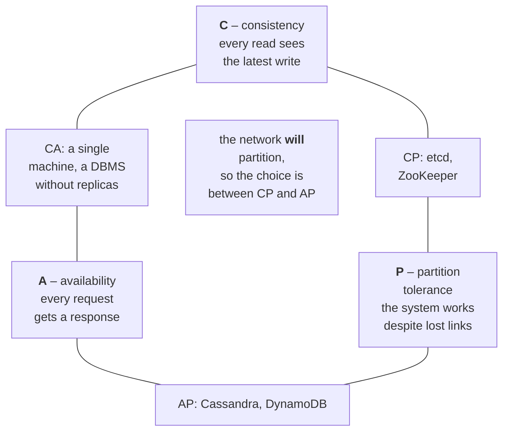
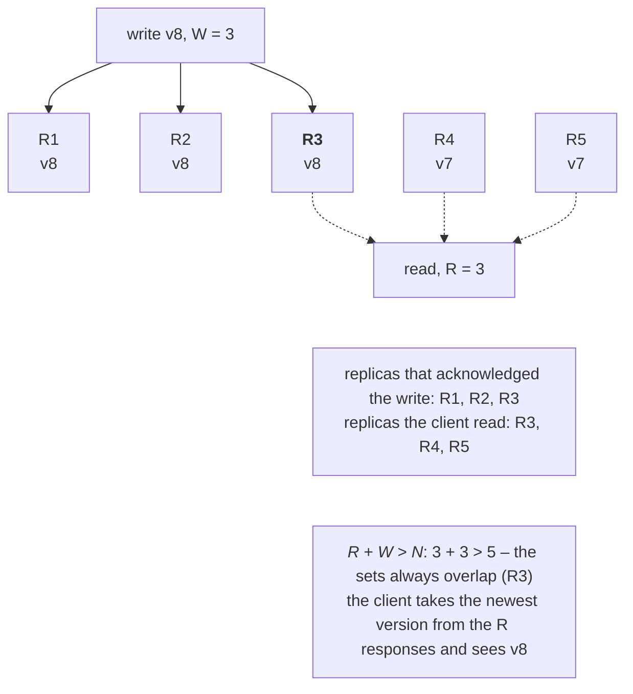

# CAP, consistency, and fault tolerance

## The CAP theorem and PACELC

A silo failure forces a choice: wait until the cluster figures out who is alive (and refuse service meanwhile), or respond immediately at the risk of working with stale data. This choice is formalized by the **CAP theorem** (Eric Brewer, 2000; proved by Seth Gilbert and Nancy Lynch, 2002). A distributed system with replicated data cannot guarantee all three properties at once (Fig. 16.9):

- **C – consistency** (in the sense of linearizability): every read returns the result of the latest successful write, as if there were a single copy of the data;
- **A – availability**: every request to a working node gets a response (not an error and not an endless wait);
- **P – partition tolerance**: the system keeps working when the network splits into parts that cannot see each other.

Figure 16.9. The CAP theorem {.caption}

Network partitions are inevitable (Topic 14: “the network is reliable” is a fallacy), so in reality the choice is **how to behave during a partition**:

- **CP**: the part without a quorum refuses writes (and often reads), but the data does not diverge: etcd, ZooKeeper, Consul, relational DBMSs with synchronous replication;
- **AP**: each part keeps accepting requests, and divergences are reconciled after connectivity is restored: Cassandra, DynamoDB in its default mode, DNS, caches.

**PACELC** (Daniel Abadi, 2010) extends CAP: **if** there is a partition (P), the choice is between A and C; **else** (E), even when everything works, the choice is between **latency** (L) and consistency (C), because synchronous replication is slower. Cassandra and DynamoDB are PA/EL, and Azure Cosmos DB offers a choice of five consistency levels (<https://learn.microsoft.com/azure/cosmos-db/consistency-levels>).

For an individual grain, Orleans is closer to CP: the directory guarantees a single activation, and while the fate of a silo is being determined, calls to its grains fail (11 s in the measurement above). State in storage is protected by the ETag: a second activation will not overwrite someone else’s write.

## Consistency models and quorums

A **consistency model** is an agreement about what a read can see after a write (from strong to weak):

- **strong** (linearizability): operations appear to execute instantaneously in a single global order;
- **sequential**: everyone sees the same order of operations, which preserves each client’s order but not necessarily real time;
- **causal**: causally related operations (a reply after a message) are seen by everyone in the right order, while independent ones may appear in any order; it is implemented, among other ways, with **vector clocks**;
- **read-your-writes**: a client always sees its own changes (session consistency);
- **eventual**: if writes stop, all replicas eventually converge to the same value. To merge divergent replicas automatically, **CRDTs** (conflict-free replicated data types, for example a counter that keeps each replica’s contribution separately) are used.

### Replication and N/R/W quorums

In **leader–follower** replication, all writes go through the leader, and followers get a copy synchronously (consistency, but latency) or asynchronously (fast, but a read from a follower may be stale). In **leaderless** replication (Dynamo, Cassandra), a client writes to several replicas at once, and consistency is controlled with **quorums**: $N$ is the number of replicas, $W$ is how many must acknowledge a write, and $R$ is how many to read from (Fig. 16.10). If $R + W \gt N$, the sets of replicas for the write and the read necessarily overlap, and the read sees the latest version.

Figure 16.10. Replication with quorums {.caption}

The simulator from the “Quorum simulator” example performed 100,000 operations each (half writes, half reads) for $N = 5$ with different $W$, $R$, and numbers of cut-off replicas (Table 16.3).

Table 16.3. Quorums with N = 5: failures and stale reads {.caption}

| **Cut off** | **W** | **R** | **R + W &gt; N** | **Failures** | **Stale reads** |
| --- | --- | --- | --- | --- | --- |
| 0 of 5 | 3 | 3 | yes | 0 % | 0 % |
| 0 of 5 | 1 | 1 | no | 0 % | 80.0 % |
| 0 of 5 | 2 | 2 | no | 0 % | 30.0 % |
| 2 of 5 | 3 | 3 | yes | 0 % | 0 % |
| 2 of 5 | 5 | 1 | yes | 50.0 % | 0 % |
| 3 of 5 | 3 | 3 | yes | 100 % | 0 % |
| 3 of 5 | 1 | 1 | no | 0 % | 49.9 % |

The result agrees with theory: with $W = R = 1$, a read hits the single updated replica with probability 1/5 (80 % stale); with $W = R = 2$, the probability of seeing the write is $1 - C_{3}^{2} / C_{5}^{2}$, that is, 70 %. A $3 + 3$ quorum tolerates the loss of two replicas, but with three cut off the system **refuses** (CP), while $1 + 1$ keeps working at the cost of stale data (AP). Writing to all replicas ($W = 5$) makes reads cheap, but any write becomes unavailable when a single replica is lost.

## Consensus: Paxos and Raft

**Consensus** is agreement among several nodes on a single value (who the leader is, which entry is next in the log) despite the failure of some nodes. The classic **Paxos** algorithm (Leslie Lamport, 1989) is hard to understand, so in 2014 D. Ongaro and J. Ousterhout proposed **Raft** (<https://raft.github.io/>), which is used by etcd, Consul, CockroachDB, and RabbitMQ (quorum queues, Topic 15).

The ideas of Raft:

- a node is in one of the states **follower**, **candidate**, or **leader**; time is divided into numbered **terms**;
- **leader election**: a follower that has not received the leader’s heartbeats for a random time (150–300 ms) becomes a candidate, increments the term, and asks for votes; whoever receives a majority wins;
- **log replication**: the leader appends an entry to its log, sends it to the followers, and considers it **committed** when a majority of nodes have the entry;
- a cluster of $2 f + 1$ nodes tolerates the failure of $f$ nodes: 2 out of 5.

**Split brain** means that two parts of a cluster both consider themselves primary and accept conflicting writes. The **majority** requirement rules it out: a majority can exist in only one part of a partitioned network, and the old part with a minority leader cannot commit entries. That is why consensus clusters have an odd number of nodes (3, 5, 7). Orleans does not use Paxos for membership: it relies on a store with atomic operations and can keep working even when only a minority of silos survives.

## Fault tolerance of distributed systems

**Fault tolerance** is the ability to keep working when some components have failed. Failure types:

- **crash**: a process or node has stopped and is silent;
- **omission**: individual messages or responses are lost;
- **timing**: a response arrives too late (overload, garbage collector pauses);
- **Byzantine**: a node behaves arbitrarily or maliciously; reaching agreement requires at least $3 f + 1$ nodes for $f$ traitors (Lamport, Shostak, Pease, 1982).

Fault tolerance tools:

- **replication** of data and services, and **heartbeats** and **timeouts** for detecting failures (a detector always balances detection speed against false positives);
- **retries** of transient errors only, with **exponential backoff** and **jitter** (Topic 14) and a limited number of attempts;
- a **circuit breaker** (<https://learn.microsoft.com/azure/architecture/patterns/circuit-breaker>): after a series of failures, it “opens” and fails immediately without calling the unhealthy service; after a while it lets a **trial** request through (the half-open state) and “closes” if it succeeds. This way, the retries of thousands of clients do not finish off a service that is recovering;
- **idempotent** operations and request identifiers (Topic 14), so that retries do not duplicate payments;
- a **time limit** on the whole request, resource **isolation** (*bulkhead*), and **graceful degradation** (a fallback response from a cache).

In .NET, these strategies are provided by the `Microsoft.Extensions.Resilience` package (10.10.0), based on the Polly library (<https://learn.microsoft.com/dotnet/core/resilience/>): `AddResiliencePipeline` builds a **resilience pipeline** from the strategies `AddRetry`, `AddCircuitBreaker`, `AddTimeout`, `AddFallback`, `AddHedging`, and others, which run in the order they were added. A complete example of a client with retries and a circuit breaker is Lab 16, Example 3.
