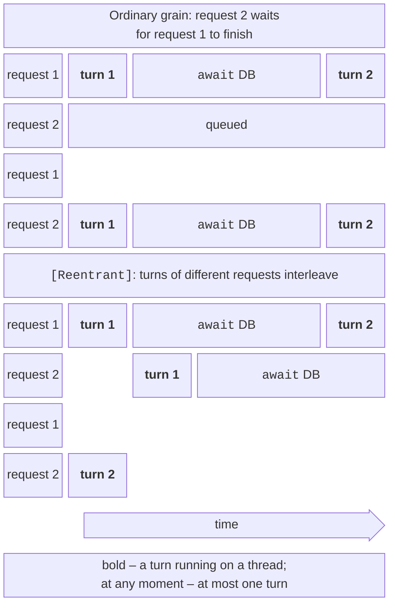

# Grain execution and state

## The execution model: turns and reentrancy

A grain activation is **single-threaded**: at any moment, at most one fragment of its code is executing. Such a fragment between two `await`s is called a **turn**. By default, a grain is **not reentrant**: the next request starts only after the previous one has **completely** finished, even if it is waiting on an `await` of a database (Fig. 16.6). Therefore state can be read and modified without locks, even across `await`.



Figure 16.6. Turns of an ordinary and a reentrant grain {.caption}

Ways to allow requests to interleave (<https://learn.microsoft.com/dotnet/orleans/grains/request-scheduling>):

- `[Reentrant]` on the grain class: any requests interleave their turns;
- `[AlwaysInterleave]` on an interface method: this method interleaves with any others;
- `[ReadOnly]` on an interface method: “read-only” methods run concurrently with each other;
- `[MayInterleave(nameof(Predicate))]`: a decision for each request made by a static method;
- `RequestContext.AllowCallChainReentrancy()`: allow re-entry into the grain only within the current call chain.

A special case is `[StatelessWorker]`: a stateless grain for which Orleans creates **several** activations on each silo (up to the number of cores by default) and always executes them locally. This is used for validation, transformation, and request routing (the `MatchmakerGrain` grain in the “Game lobby” example).

### Testing it in practice

A program with two counter grains and a `PingGrain` grain (all in one process; the call timeout is reduced from the default 30 s to 2 s):

```cs
public class CounterGrain : Grain, ICounterGrain
{
    int value;

    public async Task Increment()
    {
        int seen = value;                  // read
        await Task.Delay(100);             // "a database query"
        value = seen + 1;                  // write
    }

    public Task<int> Get() => Task.FromResult(value);
}

[Reentrant]                                // call turns interleave
public class ReentrantCounterGrain : CounterGrain, IReentrantCounter;

public class PingGrain : Grain, IPingGrain
{
    public async Task CallOther(IPingGrain other, bool allow)
    {
        using IDisposable? scope = allow
            ? RequestContext.AllowCallChainReentrancy() : null;
        await other.CallBack(this.AsReference<IPingGrain>());
    }

    public Task CallBack(IPingGrain caller) => caller.Ping();

    public Task Ping() => Task.CompletedTask;
}
```

Ten simultaneous `Increment` calls for each counter and an A → B → A cycle without and with permission:

```
ordinary grain: 1132 ms, counter = 10
[Reentrant]: 96 ms, counter = 1
cycle A→B→A, allow=False: TimeoutException after 2560 ms
cycle A→B→A, allow=True: OK in 5 ms
```

The ordinary grain executed the requests one after another (10 × 100 ms) and did not lose a single one. The reentrant one finished in 0.1 s, but all ten turns read `value = 0` before `await`, so the result is 1: the race is back, even though the code still runs on a single thread. An A → B → A cycle in non-reentrant grains is a **deadlock** (Topic 3): A waits for B, B waits for A, and only the response timeout (`SiloMessagingOptions.ResponseTimeout`, 30 s by default) breaks the wait. `AllowCallChainReentrancy` allows re-entry only within that chain. The rule: enable reentrancy only where the state is not used across `await` or is re-checked.

## Grain state and persistence

While an activation is alive, the grain state lives in the silo’s memory, and reads do not go to the storage. **Persistent state** is described by a class with `[GenerateSerializer]` and obtained in the constructor as `IPersistentState<T>` with the attribute `[PersistentState("name", "provider")]` (<https://learn.microsoft.com/dotnet/orleans/grains/grain-persistence/>):

- `State` is the state object, which Orleans **reads from storage before activation**;
- `WriteStateAsync()` writes the state (the grain decides when: after every change or in batches);
- `ReadStateAsync()`, `ClearStateAsync()`, `RecordExists`, `Etag`.

Providers are registered in the silo by name: `AddMemoryGrainStorage("bank")` stores state in the silo’s memory (for development and tests: the state disappears together with the silo); `AddRedisGrainStorage` uses Redis; there are also ADO.NET (SQL Server, PostgreSQL, MySQL, Oracle), Azure Table and Blob, Cosmos DB, and DynamoDB.

### Redis in Docker

Redis is started from the official image (<https://hub.docker.com/_/redis>) with the *append-only file* enabled, so that data survives a container restart (<https://redis.io/docs/latest/operate/oss_and_stack/management/persistence/>); containers and Docker are covered in detail in Topic 17:

```powershell
docker run -d --name pro15-redis -p 6379:6379 redis:8.8 `
    redis-server --appendonly yes
```

The `Bank.Silo` silo with the `--redis` parameter writes state to Redis. A durability test: the client runs the demonstration, the silo is killed (`Stop-Process -Force`), started again, and the accounts are read with `dotnet run -c Release -- balance UA-002`:

```
UA-002: 1,250.00 UAH, operations 1001, silo S127.0.0.1:11111:148760006
UA-001:   750.00 UAH, operations 2, silo S127.0.0.1:11111:148760006
```

The new silo (a different epoch in the address) printed `[silo] activating UA-002, balance 1250.0`: the state was read from Redis. The provider stores each grain as a Redis hash with the key `default/state/account/UA-001/account` and the fields `data` (the state JSON) and `etag`:

```powershell
docker exec pro15-redis redis-cli `
    hgetall default/state/account/UA-001/account
```

### ETags and write conflicts

An **ETag** is the version of a record in the storage. `WriteStateAsync` writes the state only when the ETag in the storage matches the one the grain read (**optimistic concurrency**). Otherwise, an `InconsistentStateException` is thrown: someone else has modified the record (a second activation during a network partition, another application, manual editing). For a test, the `etag` field was changed with `redis-cli hset … etag changed-by-other-writer`, and the next deposit ended with an exception in the client:

```
Unhandled exception. InconsistentStateException: Version conflict
(WriteStateAsync): ServiceId=default ProviderName=bank
GrainType=account GrainId=account/UA-001 ETag=00cd5df0…
```

After such an exception, Orleans deactivates the grain, and the next call activates it again with the current state from the storage (in the test, UAH 750; the unsaved deposit was discarded).

### The cost of a write

Each `Deposit` call waits for a write to Redis, and the calls of one grain run one after another. The author measured 1000 simultaneous deposits distributed across 1, 10, and 100 accounts (the median of five measurements after warmup, the silo and client on one PC, Table 16.1).

Table 16.1. Time of 1000 deposits depending on the number of grains {.caption}

| **Storage** | **1 account, ms** | **10 accounts, ms** | **100 accounts, ms** |
| --- | --- | --- | --- |
| silo memory | ≈ 60 | ≈ 8 | ≈ 8 |
| Redis in Docker | ≈ 420 | ≈ 50 | ≈ 10 |

A single grain is a bottleneck: 1000 sequential writes to Redis at ≈ 0.4 ms each. When the same operations are distributed among a hundred grains, they run in parallel, and the storage barely slows the work down. The design takeaway: make grains fine-grained (an account, a player, a sensor) rather than a single “bank” grain.
