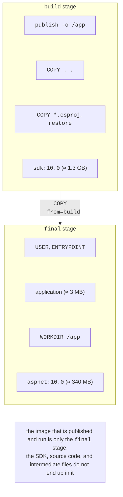
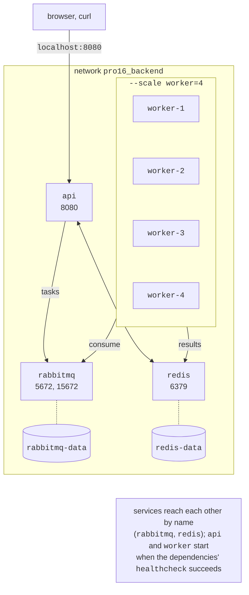

# .NET images and Docker Compose

## .NET images

### A multi-stage Dockerfile

An image is described by a text file, the `Dockerfile` (<https://docs.docker.com/reference/dockerfile/>). For .NET, a **multi-stage build** is used (<https://docs.docker.com/build/building/multi-stage/>): the first stage compiles the application in an image with the full SDK, and the second copies only the publish output into a small runtime image (Fig. 17.3). Microsoft publishes .NET images in the `mcr.microsoft.com/dotnet/` registry (<https://learn.microsoft.com/dotnet/core/docker/container-images>): `sdk` (building), `aspnet` (web applications), `runtime` (console applications and services), and `runtime-deps` (self-contained applications and Native AOT).

```dockerfile
# The base image of the final stage can be changed:
# docker build --build-arg BASE=aspnet:10.0-noble-chiseled ...
ARG BASE=aspnet:10.0

# Stage 1: build in an image with the full SDK.
FROM mcr.microsoft.com/dotnet/sdk:10.0 AS build
WORKDIR /src
COPY Primes.Api.csproj .
RUN dotnet restore
COPY . .
RUN dotnet publish -c Release -o /app --no-restore

# Stage 2: only the runtime and the published application.
FROM mcr.microsoft.com/dotnet/${BASE} AS final
ARG VERSION=1.0
ENV APP_VERSION=$VERSION
WORKDIR /app
COPY --from=build /app .
USER $APP_UID
EXPOSE 8080
ENTRYPOINT ["dotnet", "Primes.Api.dll"]
```



Figure 17.3. A multi-stage build of a .NET image {.caption}

An explanation of the instructions:

- `FROM image AS name` starts a stage; an `ARG` before the first `FROM` defines a parameter available in `FROM` lines (here, the base image of the final stage), and an `ARG` inside a stage is a build parameter of that stage (the version, which `ENV` turns into the `APP_VERSION` environment variable);
- `COPY Primes.Api.csproj .` and `RUN dotnet restore` come **before** copying the rest of the code: the layer with restored NuGet packages depends only on the `.csproj`, so after a code change it is taken from the cache;
- `COPY --from=build /app .` copies from the previous stage; the SDK, source code, and intermediate files do not end up in the final image;
- `USER $APP_UID` runs as the unprivileged user `app` (UID 1654), which the official .NET 8 and later images contain; a process in a container should not have root privileges;
- `EXPOSE 8080` documents the port: since .NET 8, ASP.NET Core in a container listens on 8080 (`ASPNETCORE_HTTP_PORTS=8080`), not 80;
- `ENTRYPOINT` is the startup command in JSON array form: the `dotnet` process gets PID 1 and receives the `SIGTERM` signal itself.

A `.dockerignore` file next to the `Dockerfile` excludes unnecessary files from the **build context**, in particular the Windows `bin/` and `obj/` folders, which would otherwise end up in the image and break `dotnet publish`:

```
bin/
obj/
*.user
Dockerfile*
.dockerignore
```

Building and checking (<https://learn.microsoft.com/dotnet/core/docker/build-container>):

```powershell
docker build -t pro16/api:1.0 .
docker run -d --name pro16-api -p 8080:8080 pro16/api:1.0
curl.exe http://localhost:8080/health/live
```

A fragment of the `docker build --progress=plain` output (Fig. 17.4):

```
#10 [build 3/6] COPY Primes.Api.csproj .
#11 [build 4/6] RUN dotnet restore
#11 DONE 3.8s
#12 [build 5/6] COPY . .
#13 [build 6/6] RUN dotnet publish -c Release -o /app --no-restore
#13 DONE 3.1s
#14 [final 3/3] COPY --from=build /app .
#15 naming to docker.io/pro16/api:1.0 done
```

The first build (with the base images already downloaded) took ≈ 10.6 s. After changing only `Program.cs`, the `COPY Primes.Api.csproj` and `RUN dotnet restore` steps were marked `CACHED`, and the build took 4.9 s. The rule: place instructions that change rarely higher up, and those that change often lower down.

::: info Screenshot
Windows Terminal: `docker build -t pro16/api:1.0 .` in the Primes.Api folder (stages [build 1/6]…[final 3/3], restore step CACHED on the second build), then `docker images pro16/api` with DISK USAGE and CONTENT SIZE
:::

Figure 17.4. Building a .NET image {.caption}

### Image size and the choice of base image

The same application was built on different final images (the `--build-arg BASE=…` parameter) and, for comparison, with a single-stage `Dockerfile` on `sdk:10.0`. Docker Desktop 4.91 with the built-in containerd image store shows two values: **DISK USAGE**, the size of the unpacked layers on disk, and **CONTENT SIZE**, the compressed size transferred by the registry (Table 17.1).

Table 17.1. Image sizes of the Primes application {.caption}

| **Final image** | **On disk** | **Compressed** |
| --- | --- | --- |
| single-stage on `sdk:10.0` | 1.36 GB | 372 MB |
| `aspnet:10.0` (Ubuntu 24.04) | 344 MB | 97.1 MB |
| `aspnet:10.0-noble-chiseled` | 184 MB | 56.4 MB |
| `aspnet:10.0-alpine` | 181 MB | 55.5 MB |
| `runtime:10.0-noble-chiseled` (worker) | 147 MB | 44.3 MB |

- The single-stage image is four times larger and contains the compiler, the SDK, and the source code; do not do this.
- The default `10.0` images are based on Ubuntu 24.04 and have a shell and a package manager (convenient for debugging, but more vulnerabilities to patch).
- **Chiseled** images (Ubuntu “Chiselled”) contain only the files .NET needs: no shell, no package manager, and the `app` user by default. The command `docker exec pro16-worker-1 sh` fails for them with the error `exec: "sh": executable file not found in $PATH`, so such containers are debugged with logs and metrics. The `-extra` variant adds the ICU libraries and time zones for globalization.
- **Alpine** is a distribution based on the musl library; the image is just as small, but it has a shell.

The published application takes only 3 MB (`docker image history` shows a `COPY /app .` layer of 3.01 MB); the rest is the .NET runtime. Even smaller images can be obtained with self-contained publishing with trimming and with Native AOT on `runtime-deps`, but they require checking library compatibility.

### Publishing a container without a Dockerfile

The .NET SDK can build images without a `Dockerfile` and even without Docker (<https://learn.microsoft.com/dotnet/core/containers/sdk-publish>):

```powershell
dotnet publish --os linux --arch x64 /t:PublishContainer `
    -p ContainerRepository=pro16/api -p ContainerImageTag=1.0-sdk
```

```
Building image 'pro16/api' with tags '1.0-sdk' on top of base image
'mcr.microsoft.com/dotnet/aspnet:10.0'.
Pushed image 'pro16/api:1.0-sdk' to local registry via 'docker'.
```

The SDK itself chose the base image `aspnet:10.0` (a `Microsoft.NET.Sdk.Web` project), the user `APP_UID=1654`, port 8080, and the entry point `dotnet /app/Primes.Api.dll`; the size matched the image built from the `Dockerfile` (344 MB). The property `ContainerFamily=noble-chiseled` produced an image based on `aspnet:10.0-noble-chiseled-extra` (241 MB): the SDK added `-extra` because invariant globalization is not enabled in the project. Other properties (`ContainerRegistry`, `ContainerBaseImage`, `ContainerImageTags`, `ContainerPort`, `ContainerEnvironmentVariable`) are described at <https://learn.microsoft.com/dotnet/core/containers/publish-configuration>. The `ContainerArchiveOutputPath` parameter saves the image to a `.tar.gz` archive, and `ContainerRegistry` pushes it directly to a registry without Docker. Aspire (the “Deployment with Aspire” section) builds project images exactly this way.

## Docker Compose

Starting five containers with separate `docker run` commands is inconvenient. **Docker Compose** (<https://docs.docker.com/compose/>) describes the entire environment in a `compose.yaml` file: services, their images or `Dockerfile`, ports, environment variables, volumes, networks, and dependencies (Fig. 17.5). The file lives in the solution folder next to the project folders:

```yaml
name: pro16                  # prefix for container and network names

services:
  rabbitmq:
    image: rabbitmq:4-management
    environment:             # guest works only from localhost
      RABBITMQ_DEFAULT_USER: primes
      RABBITMQ_DEFAULT_PASS: ${RABBIT_PASSWORD:-change-me}
    ports: ["15672:15672"]   # management web console
    volumes: [rabbitmq-data:/var/lib/rabbitmq]
    networks: [backend]
    healthcheck:
      test: ["CMD", "rabbitmq-diagnostics", "-q", "ping"]
      interval: 5s
      timeout: 5s
      retries: 12

  redis:
    image: redis:8.8
    command: ["redis-server", "--appendonly", "yes"]
    volumes: [redis-data:/data]
    networks: [backend]
    healthcheck:
      test: ["CMD", "redis-cli", "ping"]
      interval: 5s
      retries: 12

  api:
    build: ./Primes.Api
    image: pro16/api:1.0
    ports: ["8080:8080"]
    environment: &connections
      ConnectionStrings__rabbitmq: >-
        amqp://primes:${RABBIT_PASSWORD:-change-me}@rabbitmq:5672
      ConnectionStrings__redis: redis:6379
    depends_on:
      rabbitmq: { condition: service_healthy }
      redis: { condition: service_healthy }
    networks: [backend]

  worker:
    build: ./Primes.Worker
    image: pro16/worker:1.0
    environment: *connections
    depends_on:
      rabbitmq: { condition: service_healthy }
      redis: { condition: service_healthy }
    networks: [backend]
    stop_grace_period: 30s   # time to finish after SIGTERM

networks:
  backend: {}

volumes:
  rabbitmq-data: {}
  redis-data: {}
```



Figure 17.5. The Compose environment of the Primes application {.caption}

Key elements (<https://docs.docker.com/reference/compose-file/services/>):

- `build` is the folder with the `Dockerfile`; `image` is the name of the built image (or of a ready-made one if there is no `build`). The worker's `Dockerfile` differs only in the final image, `runtime:10.0-noble-chiseled`;
- `environment` sets environment variables; `${RABBIT_PASSWORD:-change-me}` substitutes a variable from the shell or the `.env` file, or the default value if it is not set; the YAML anchor `&connections` and the alias `*connections` give the worker the same connection strings;
- in the `backend` network, services find each other **by service name** (`rabbitmq`, `redis`): the command `getent hosts rabbitmq` in the API container returned `172.18.0.2`;
- ports are published only for the API and the web console; Redis and the broker's AMQP port are not accessible from outside;
- `healthcheck` periodically runs a command in the container, and `depends_on` with the `service_healthy` condition starts the API and workers only after the broker and Redis have become `healthy` (<https://docs.docker.com/compose/how-tos/startup-order/>). Without the condition, Compose would wait only for the container to start, while RabbitMQ needs a few more seconds after startup to become ready;
- the `guest` user in RabbitMQ can connect only from `localhost`, so a `primes` user is created for the other containers.

Compose commands are run in the folder containing `compose.yaml`:

```powershell
docker compose up -d --build   # build the images and start
docker compose up -d --scale worker=4   # four workers
docker compose ps              # service status
docker compose logs -f worker  # logs of all workers
docker compose down        # stop and remove (volumes remain)
docker compose down -v         # together with volumes
```

The scaling result (Fig. 17.6):

```
NAME               IMAGE                   STATUS
pro16-api-1        pro16/api:1.0           Up Less than a second
pro16-rabbitmq-1   rabbitmq:4-management   Up 7 seconds (healthy)
pro16-redis-1      redis:8.8               Up 7 seconds (healthy)
pro16-worker-1     pro16/worker:1.0        Up Less than a second
pro16-worker-2     pro16/worker:1.0        Up Less than a second
pro16-worker-3     pro16/worker:1.0        Up Less than a second
pro16-worker-4     pro16/worker:1.0        Up Less than a second
```

The `PORTS` column (not shown here) contains `0.0.0.0:8080->8080/tcp` for the API and `0.0.0.0:15672->15672/tcp` for the broker.

::: info Screenshot
Windows Terminal in the solution folder: `docker compose up -d --scale worker=4` output (Healthy lines, worker-1…4 Started), then `docker compose ps` with rabbitmq and redis (healthy) and four workers
:::

Figure 17.6. Scaling a service in Compose {.caption}

Jobs are submitted through the API, for example, in PowerShell:

```powershell
$job = Invoke-RestMethod -Method Post `
    "http://localhost:8080/jobs?to=20000000&chunks=40"
Invoke-RestMethod "http://localhost:8080/jobs/$($job.id)"
```

```
id       : bbea7a38
to       : 20000000
chunks   : 40
done     : 40
primes   : 1270607
seconds  : 4.9
```

The number of primes below $2 \cdot 10^{7}$ is 1,270,607, which matches the known value of $\pi (2 \cdot 10^{7})$. After `docker compose down` and another `up`, the same request returned the same result: the job hashes are stored in the `redis-data` volume.

### Scaling the workers

The computation time for $N = 5 \cdot 10^{7}$ (100 chunks, 3,001,134 primes) was measured for different numbers of workers: after a warm-up job, the median of five jobs (Table 17.2; the Kubernetes column shows the same application in a kind cluster, with each worker limited to one core).

Table 17.2. Time to count the primes below $5 \cdot 10^{7}$ depending on the number of workers {.caption}

| **Workers** | **Compose, s** | **Speedup** | **kind, s** | **Speedup** |
| --- | --- | --- | --- | --- |
| 1 | 17.48 | 1.00 | 18.07 | 1.00 |
| 2 | 9.19 | 1.90 | 9.52 | 1.90 |
| 4 | 5.15 | 3.39 | 5.48 | 3.30 |
| 8 | 3.42 | 5.11 | 3.43 | 5.27 |
| 16 | 2.42 | 7.22 | – | – |

The synchronous request `GET /primes?to=50000000` in a single container took 17.3 s, which means the broker and Redis add almost no overhead. The speedup up to 8 workers is close to the number of physical cores (8), while 16 workers on 16 logical processors give only 7.2 (hyper-threading, Topic 1). The kind cluster on the same PC runs almost as fast as Compose: the containers of both are run by the same engine in the WSL 2 VM.
