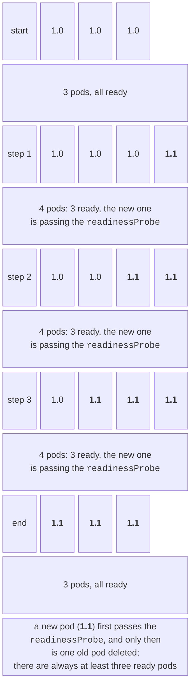
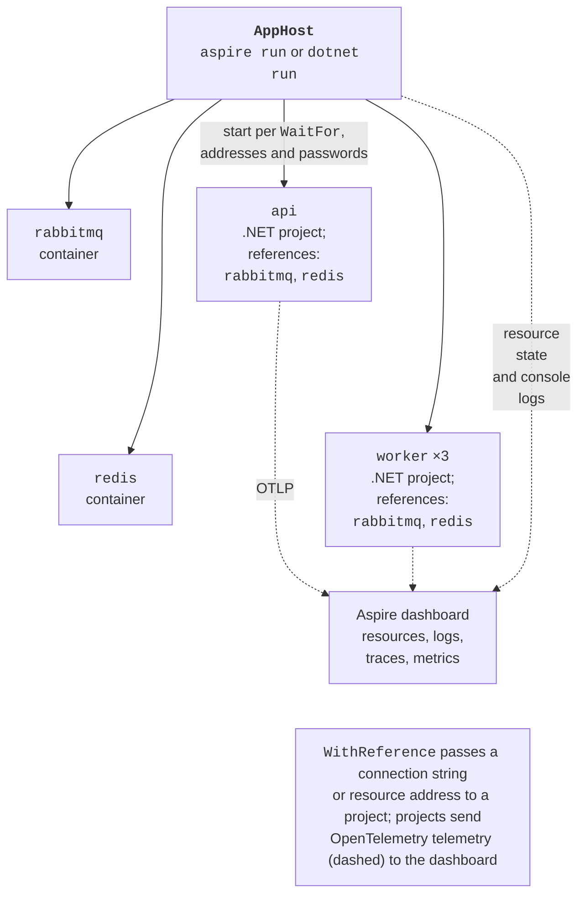

# Scaling and .NET Aspire

## Scaling, updates, and fault tolerance

### Scaling and self-healing

The number of replicas is changed in the manifest (followed by another `kubectl apply`) or with the command `kubectl -n pro16 scale deploy/worker --replicas=8`. The measurements in Table 17.2 show that 8 worker pods speed up the computation by a factor of 5.3.

The ReplicaSet controller constantly compares the number of pods with the specified one. After `kubectl -n pro16 delete pod -l app=worker`, two new pods were already running a second later, while the old ones were terminating:

```
NAME                      READY   STATUS      RESTARTS   AGE
worker-7787d686df-mrjgl   1/1     Running     0          1s
worker-7787d686df-pjlxw   0/1     Completed   0          52s
worker-7787d686df-vpz5c   0/1     Completed   0          53s
worker-7787d686df-vqrml   1/1     Running     0          1s
```

The `Completed` state (rather than `Error`) means that the workers handled `SIGTERM` correctly and exited with code 0.

### Rolling updates and rollbacks

Changing the pod template (image, variables, resources) starts a **rolling update** (Fig. 17.11): the Deployment creates a new ReplicaSet and moves the pods to it one at a time. The strategy parameters are `maxSurge`, how many pods can be created above `replicas`, and `maxUnavailable`, how many can be unavailable. With `maxSurge: 1` and `maxUnavailable: 0`, an old pod is deleted only after the new one has passed its `readinessProbe`.



Figure 17.11. A rolling update with maxSurge 1 and maxUnavailable 0 {.caption}

Version 1.1 was built with the parameter `--build-arg VERSION=1.1` and pushed to the registry. The update:

```powershell
kubectl -n pro16 set image deploy/api `
    api=localhost:5001/primes-api:1.1
kubectl -n pro16 rollout status deploy/api   # wait for completion
kubectl -n pro16 rollout history deploy/api  # revisions
kubectl -n pro16 rollout undo deploy/api     # revert to the previous one
```

During the update, a client program requested `GET /` every 50 ms and counted the responses of each version. The update took 9 s; at first only version 1.0 responded, then both alternately, and then only 1.1. **Without** `preStop`, one run produced 10 errors out of 960 requests (broken connections and timeouts): the pod received `SIGTERM` and closed its port before all nodes had removed it from the service's list. The delay `preStop: sleep: { seconds: 5 }` (<https://kubernetes.io/docs/concepts/containers/container-lifecycle-hooks/>) gives the service time to exclude the pod, and the next three updates went through without a single error (`{'1.0': 98, '1.1': 462}` and so on).

A faulty update is safe: after `set image … primes-api:9.9` (no such tag exists), the new pod had the state `ErrImagePull`, `rollout status` did not finish, and the three old pods continued to serve requests because `maxUnavailable: 0`. The `rollout undo` command restored the working version (Fig. 17.12).

::: info Screenshot
Windows Terminal: `kubectl apply -f k8s/`, `kubectl -n pro16 get deploy,pods,svc`, then `kubectl -n pro16 set image deploy/api api=localhost:5001/primes-api:1.1` and `kubectl -n pro16 rollout status deploy/api` with the «1 out of 3 new replicas…» lines and «successfully rolled out»
:::

Figure 17.12. Deploying and updating in Kubernetes {.caption}

::: tip Image tags
By default, Kubernetes does not pull an image again if a tag other than `latest` is already present on the node (`imagePullPolicy: IfNotPresent`). Therefore, each build is marked with a new tag (a version, a build number, a commit hash), and `1.0` is never overwritten with different content.
:::

### Probes and resources

**Probes** (<https://kubernetes.io/docs/tasks/configure-pod-container/configure-liveness-readiness-startup-probes/>) are run periodically by the `kubelet` (Table 17.3). The check methods are `httpGet` (success means a code of 200–399), `tcpSocket` (the port accepts connections), `exec` (a command in the container exits with code 0), and `grpc`.

Table 17.3. Kubernetes probes {.caption}

| **Probe** | **Question** | **Consequence of failure** |
| --- | --- | --- |
| `startupProbe` | has a slow startup finished? | other probes are not run; after the limit, the container is restarted |
| `readinessProbe` | is the pod ready to accept requests (are dependencies available)? | the pod is excluded from the service but not restarted |
| `livenessProbe` | is the process not hung? | the container is restarted |

The rules: a `livenessProbe` must not check dependencies (otherwise a Redis failure would restart all API pods, which would not help), while a `readinessProbe` must. That is why the API has two different endpoints.

While the cluster was being set up, RabbitMQ restarted in a loop (`CrashLoopBackOff`) with the error `Error when reading /var/lib/rabbitmq/.erlang.cookie: eacces`. The cause was the probe `exec: rabbitmq-diagnostics -q ping`: it runs as root and, on the first start, created the Erlang cookie file with root permissions before the server, which runs as the `rabbitmq` user. A `tcpSocket` probe on port 5672 solved the problem. Probes must not change the state of the container.

**Resources**: `requests` is how many resources are guaranteed to the pod (the scheduler chooses a node based on them, and HPA calculates percentages from them), and `limits` is the ceiling: when the CPU limit is exceeded, the container is throttled, and when the memory limit is exceeded, it is terminated with the reason `OOMKilled`. Units: `100m` is 0.1 of a core, and `128Mi` is 128 MiB. The .NET server garbage collector takes the container's memory and CPU limits into account.

### Autoscaling and batch jobs

A **HorizontalPodAutoscaler** (HPA, <https://kubernetes.io/docs/tasks/run-application/horizontal-pod-autoscale/>) changes the number of replicas of a Deployment based on metrics. CPU metrics require the metrics-server component (<https://github.com/kubernetes-sigs/metrics-server>); in kind, it is installed from the official manifest with the `--kubelet-insecure-tls` parameter added, because kubelet certificates in kind are self-signed. A target such as `averageUtilization: 60` means an average CPU utilization of 60% of `requests`. In a test, a load-generating client with 8 tasks increased the number of pods of a compute service from 1 to 8 within 50 s, and the throughput grew from 30 to ≈ 175 requests per second (the full example is Lab 17, Example 2).

A **Job** (<https://kubernetes.io/docs/concepts/workloads/controllers/job/>) runs pods until they complete successfully rather than keeping them running: `completions` is how many successful completions are needed, `parallelism` is how many pods run at the same time, and with `completionMode: Indexed`, each pod receives its chunk number in the `JOB_COMPLETION_INDEX` variable. This is how computational tasks are distributed without a broker: 8 chunks of a Monte Carlo computation of $\pi$ with `parallelism: 8` completed in 9.9 s versus 65 s sequentially (Lab 17, Example 1). A `CronJob` runs a Job on a schedule.

## .NET Aspire

Compose and Kubernetes describe deployment, but during development it is more convenient to run projects directly from the IDE with debugging. **Aspire** (<https://aspire.dev/>) is a Microsoft tool for describing, running, and observing a distributed application. Before version 13, the product was called **.NET Aspire**; since version 13.0, it is called Aspire and has the aspire.dev website, because it also supports applications in JavaScript, Python, and other languages. The current version is **Aspire 13.5.4**; it requires the .NET 10 SDK.

Its components:

- **AppHost** is a project (or a single-file program `apphost.cs`) in which the **application model** is described in C# code: resources (projects, containers, executables, cloud services) and the relationships between them (<https://aspire.dev/get-started/app-host/>, Fig. 17.13);
- **ServiceDefaults** is a shared library with the `AddServiceDefaults` method, which adds OpenTelemetry, health checks, service discovery, and HTTP client resilience to each service (<https://aspire.dev/fundamentals/service-defaults/>);
- **integrations** are NuGet packages: **hosting** integrations (`Aspire.Hosting.RabbitMQ`, `Aspire.Hosting.Redis`, PostgreSQL, Kafka, Orleans…) add resources to the AppHost, and **client** integrations (`Aspire.RabbitMQ.Client`, `Aspire.StackExchange.Redis`…) register clients in services together with health checks and telemetry;
- the **dashboard** is a web application with resources, logs, traces, and metrics (<https://aspire.dev/dashboard/overview/>);
- the `aspire` **CLI** creates, runs, and deploys applications and lets you view telemetry.



Figure 17.13. The Aspire application model {.caption}

Install the CLI (<https://aspire.dev/get-started/install-cli/>) in one of these ways: `irm https://aspire.dev/install.ps1 | iex`, `winget install Microsoft.Aspire`, or `dotnet tool install -g Aspire.Cli`; check with `aspire --version`. Container resources require Docker Desktop or Podman. `aspire new aspire-starter` creates a new solution (an API, a web frontend, an AppHost, and ServiceDefaults), and `aspire new aspire-empty` creates only an AppHost; `aspire init` adds Aspire to an existing solution, and `aspire add rabbitmq` adds an integration.

### The AppHost of the Primes application

The projects `Primes.AppHost` (the `Aspire.AppHost.Sdk/13.5.4` SDK, the `Aspire.Hosting.RabbitMQ` and `Aspire.Hosting.Redis` packages, and references to the API and worker projects) and `Primes.ServiceDefaults` were added to the `Primes` solution:

```cs
// The distributed application model: resources and their relationships.
IDistributedApplicationBuilder builder =
    DistributedApplication.CreateBuilder(args);

// Infrastructure containers (Aspire runs them in Docker).
var rabbitmq = builder.AddRabbitMQ("rabbitmq")
    .WithManagementPlugin()                  // web console
    .WithContainerName("pro16-rabbitmq");
var redis = builder.AddRedis("redis")
    .WithContainerName("pro16-redis");

// .NET projects: WithReference passes the connection strings.
var api = builder.AddProject<Projects.Primes_Api>("api")
    .WithReference(rabbitmq).WaitFor(rabbitmq)
    .WithReference(redis).WaitFor(redis)
    .WithHttpHealthCheck("/health/ready", endpointName: "http")
    .WithExternalHttpEndpoints();

builder.AddProject<Projects.Primes_Worker>("worker")
    .WithReference(rabbitmq).WaitFor(rabbitmq)
    .WithReference(redis).WaitFor(redis)
    .WithReplicas(3);                        // three processes

builder.Build().Run();
```

- `AddRabbitMQ` and `AddRedis` are container resources; the password is generated automatically and stored in the AppHost's user secrets; `WithContainerName` sets a persistent container name (optional);
- `AddProject<Projects.Primes_Api>` is a .NET project; the `Projects.Primes_Api` class is generated from the project reference;
- `WithReference(rabbitmq)` passes a connection string to the project: the API's environment gets `ConnectionStrings__rabbitmq=amqp://guest:…@localhost:59551` and `ConnectionStrings__redis=localhost:59550,password=…`, the same keys the code already reads;
- `WaitFor` starts the project only after the resource has become healthy (like `service_healthy` in Compose); `WithHttpHealthCheck` checks the health of the API itself;
- `WithReplicas(3)` starts three instances of the worker.

A reference to `Primes.ServiceDefaults` and one or two lines were added to the API and worker projects:

```cs
builder.AddServiceDefaults();   // OpenTelemetry, health checks
// …
app.MapDefaultEndpoints();   // /health, /alive (in Development)
```

In the `ConfigureOpenTelemetry` method of the ServiceDefaults library, the RabbitMQ client's activity source was added: `tracing.AddSource(builder.Environment.ApplicationName).AddSource("RabbitMQ.Client.*")`. The rest of the code did not change: the same application runs in Compose, in Kubernetes, and under Aspire.

To run it, use `aspire run` (interactive) or `aspire start` (in the background) in the solution folder, or simply run the AppHost project in Rider or Visual Studio. The result of `aspire start` and `aspire describe`:

```
     AppHost:  Primes.AppHost\Primes.AppHost.csproj
   Dashboard:  http://localhost:15261/login?t=9850dbc991ce98c9…
✅ AppHost started successfully.

Name             Type       State    Health   URLs
api              Project    Running  Healthy  http://localhost:5043
rabbitmq         Container  Running  Healthy  http://localhost:59552
redis            Container  Running  Healthy  redis://localhost:59550
worker-euvtpmpg  Project    Running  Healthy  -
worker-nqzwxwga  Project    Running  Healthy  -
worker-ugmdxbyv  Project    Running  Healthy  -
```

Aspire started the `pro16-rabbitmq` (image `rabbitmq:4.3-management`) and `pro16-redis` (`redis:8.6`) containers, waited for them to become ready, and then started the API and three worker processes. The link with the token opens the dashboard (Fig. 17.14): a table of resources, their addresses, environment variables, and the console logs of each process. The commands `aspire logs worker-euvtpmpg`, `aspire describe`, and `aspire stop` do the same from the terminal.

::: info Screenshot
Browser, Aspire dashboard → Resources: table with api, rabbitmq, redis and three worker replicas, all Running / Healthy, source column and URLs; light theme
:::

Figure 17.14. Resources in the Aspire dashboard {.caption}

### Service discovery

For HTTP dependencies, `WithReference(calc)` passes the address of another project in variables such as `services__calc__http__0=http://localhost:5090`, and the `Microsoft.Extensions.ServiceDiscovery` library (added by `AddServiceDefaults`) lets you use a logical name in code (<https://aspire.dev/fundamentals/service-discovery/>):

```cs
builder.Services.AddHttpClient("calc",
    c => c.BaseAddress = new Uri("https+http://calc"));
```

The `https+http` scheme means “HTTPS if available, otherwise HTTP”. After deployment to Kubernetes, the same name `calc` is resolved by the cluster DNS. A full example with a Redis cache is Lab 17, Example 3.

::: tip Developer certificate
The `https` profile of the AppHost and projects requires a trusted ASP.NET Core developer certificate. If it is not trusted, the AppHost shows the API as `Unhealthy`, and `aspire otel` cannot connect to the dashboard. The solution: run `aspire certs trust` (or `dotnet dev-certs https --trust`) once and confirm the certificate installation, or use the `http` launch profile, as in the lecture examples.
:::
