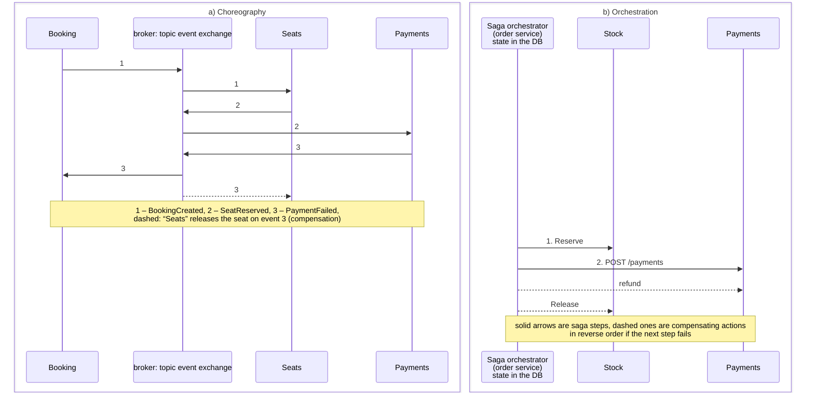
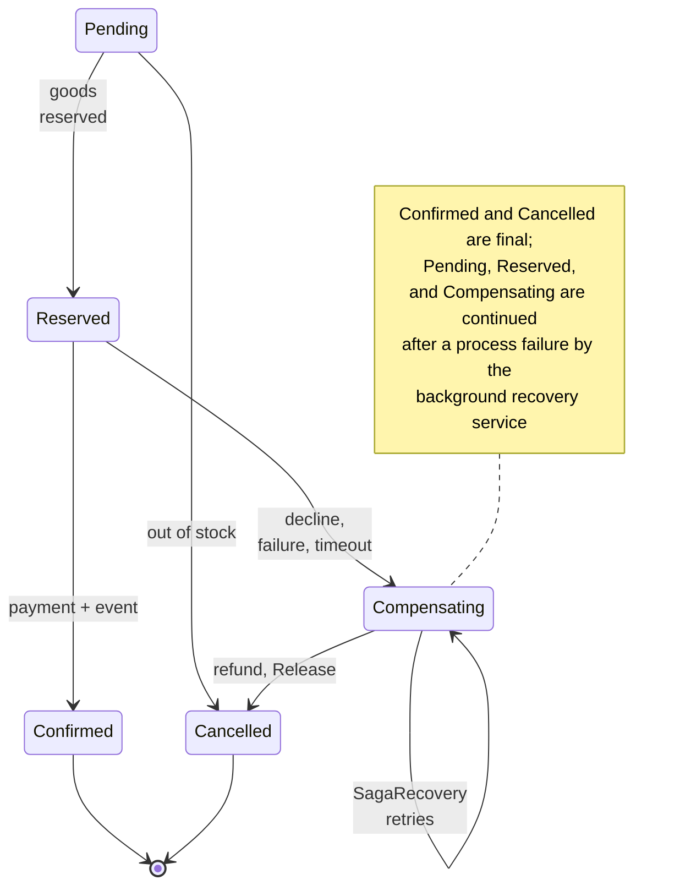

# Data and the Saga pattern

## Data in microservices

**Database per service**: each service owns its data, and only it reads and changes that data; others get the data through an API or events (<https://learn.microsoft.com/dotnet/architecture/microservices/architect-microservice-container-applications/distributed-data-management>). A shared database for several services is the most common mistake: changing the schema of one table breaks other services, and the services cannot be deployed independently. Each service can choose a convenient store: a relational DB, a document DB, Redis, or a search engine (*polyglot persistence*).

The catalog service with EF Core and PostgreSQL:

```cs
using Microsoft.EntityFrameworkCore;

// The catalog service: its own catalogdb database, read-only products.
WebApplicationBuilder builder = WebApplication.CreateBuilder(args);
builder.AddServiceDefaults();
builder.AddNpgsqlDbContext<CatalogDb>("catalogdb");
WebApplication app = builder.Build();
app.MapDefaultEndpoints();

await using (AsyncServiceScope scope =
    app.Services.CreateAsyncScope())
{
    CatalogDb db = scope.ServiceProvider
        .GetRequiredService<CatalogDb>();
    if (await db.Database.EnsureCreatedAsync())   // first start
    {
        db.Products.AddRange(
            new Product { Id = 1, Name = "Laptop", Price = 32000m },
            new Product { Id = 2, Name = "Mouse", Price = 650m },
            new Product { Id = 3, Name = "USB-C cable",
                Price = 250m });
        await db.SaveChangesAsync();
    }
}

app.MapGet("/products", (CatalogDb db) =>
    db.Products.AsNoTracking().OrderBy(p => p.Id).ToListAsync());
app.MapGet("/products/{id:int}", async (int id, CatalogDb db) =>
    await db.Products.FindAsync(id) is Product p
        ? Results.Ok(p) : Results.NotFound());

app.Run();

public class Product
{
    public int Id { get; set; }
    public required string Name { get; set; }
    public decimal Price { get; set; }
}

public class CatalogDb(DbContextOptions<CatalogDb> options)
    : DbContext(options)
{
    public DbSet<Product> Products => Set<Product>();
}
```

`AddNpgsqlDbContext<CatalogDb>("catalogdb")` from the Aspire client integration registers an EF Core context with the `catalogdb` connection string, a health check, tracing of database queries, and **retries after transient connection errors** (the `NpgsqlRetryingExecutionStrategy` execution strategy, <https://learn.microsoft.com/ef/core/miscellaneous/connection-resiliency>). For the learning example, the schema is created with `EnsureCreatedAsync()`; a real project uses EF Core migrations.

EF Core retries are incompatible with your own transaction: the first version of the stock service with `BeginTransactionAsync()` failed with the exception `The configured execution strategy 'NpgsqlRetryingExecutionStrategy' does not support user-initiated transactions`. The correct way is to execute the entire transaction block through the strategy, so that on a connection failure the **whole** block is retried (`Shop.Stock/Services/InventoryService.cs`):

```cs
using Grpc.Core;
using Microsoft.EntityFrameworkCore;

namespace Shop.Stock;

public class InventoryService(StockDb db,
    ILogger<InventoryService> log) : Inventory.InventoryBase
{
    public override async Task<ReserveReply> Reserve(
        ReserveRequest request, ServerCallContext context)
    {
        Guid order = Guid.Parse(request.OrderId);
        // Idempotency: a repeated call for the same order
        // does not reserve the goods a second time.
        if (await db.Reservations.AnyAsync(r => r.OrderId == order))
            return new ReserveReply { Ok = true };
        // Aspire enables EF Core retries after connection failures, so
        // our own transaction is executed through the execution strategy.
        return await db.Database.CreateExecutionStrategy()
            .ExecuteAsync(() => ReserveAsync(order, request.Lines));
    }

    async Task<ReserveReply> ReserveAsync(Guid order,
        IEnumerable<Line> lines)
    {
        db.ChangeTracker.Clear();
        await using var tx =
            await db.Database.BeginTransactionAsync();
        foreach (Line line in lines)
        {
            // Atomically: UPDATE … SET available = available - q
            // WHERE available >= q.
            int updated = await db.Items
                .Where(i => i.ProductId == line.ProductId
                    && i.Available >= line.Quantity)
                .ExecuteUpdateAsync(s => s.SetProperty(
                    i => i.Available,
                    i => i.Available - line.Quantity));
            if (updated == 0)
            {
                await tx.RollbackAsync();
                log.LogInformation(
                    "Order {Order}: not enough of product {Id}",
                    order, line.ProductId);
                return new ReserveReply { Ok = false,
                    Reason = $"not enough of product {line.ProductId}" };
            }
            db.Reservations.Add(new Reservation { OrderId = order,
                ProductId = line.ProductId,
                Quantity = line.Quantity });
        }
        await db.SaveChangesAsync();
        await tx.CommitAsync();
        log.LogInformation("Order {Order}: goods reserved",
            order);
        return new ReserveReply { Ok = true };
    }

    // Compensation: return the reserved goods (idempotently).
    public override Task<ReleaseReply> Release(
        ReleaseRequest request, ServerCallContext context) =>
        db.Database.CreateExecutionStrategy().ExecuteAsync(
            () => ReleaseAsync(Guid.Parse(request.OrderId)));

    async Task<ReleaseReply> ReleaseAsync(Guid order)
    {
        db.ChangeTracker.Clear();
        await using var tx =
            await db.Database.BeginTransactionAsync();
        List<Reservation> list = await db.Reservations
            .Where(r => r.OrderId == order && !r.Released)
            .ToListAsync();
        foreach (Reservation r in list)
        {
            await db.Items.Where(i => i.ProductId == r.ProductId)
                .ExecuteUpdateAsync(s => s.SetProperty(
                    i => i.Available, i => i.Available + r.Quantity));
            r.Released = true;
        }
        await db.SaveChangesAsync();
        await tx.CommitAsync();
        log.LogInformation(
            "Order {Order}: reservation released ({Count})", order,
            list.Count);
        return new ReleaseReply { Released = list.Count };
    }
}
```

The reservation is **atomic**: `ExecuteUpdateAsync` executes a single statement `UPDATE … SET "Available" = "Available" - q WHERE "Available" >= q`, so two concurrent orders will not sell the last unit twice (compare with the race condition in Topic 3). Both operations are **idempotent**: a repeated `Reserve` for the same order changes nothing, and `Release` returns only a reservation that has not yet been released.

**Eventual consistency**: when the data of different services is related, it becomes consistent not instantly but some time after the events are processed. For example, a shipment in `shipping` appears ≈ 0.5 s after the order is confirmed. The user interface must take this into account (a “processing” status).

**Data duplication** is normal practice: `orders` stores the price at the time of the order rather than a reference to the price in the catalog (it may change). A service can keep a **local copy** of other services' data (for example, product names) that is updated by events; then it does not depend on the availability of the data owner.

**CQRS** (*Command Query Responsibility Segregation*, <https://learn.microsoft.com/azure/architecture/patterns/cqrs>) is the separation of the models for writing (commands that change state) and reading (queries). The read model is a **projection** that is built from the events of several services and optimized for a specific screen (for example, “my orders with product names and delivery status”). **Event sourcing** is often mentioned together with CQRS (<https://learn.microsoft.com/azure/architecture/patterns/event-sourcing>): the state of an entity is stored as a sequence of events rather than as the current row of a table. Both patterns add complexity and are needed by far from every service.

## Distributed transactions: the Saga pattern

Placing an order changes the data of three services: the warehouse reservation, the payment, and the order status. In a monolith, this is one ACID transaction. Between services with separate databases, there is no such transaction.

**Two-phase commit** (2PC): a coordinator asks all participants “are you ready?” and then orders all of them to commit or all of them to roll back. 2PC is unsuitable for microservices: participants lock data until the coordinator decides, a coordinator failure leaves them in an undefined state, and message brokers and many stores (RabbitMQ, Redis, most NoSQL databases) do not participate in it. The CAP theorem (Topic 16) reminds us that during a network partition you have to choose between consistency and availability, and microservices usually choose availability.

A **saga** (<https://learn.microsoft.com/azure/architecture/patterns/saga>) is a sequence of **local transactions** in different services. Each step commits the changes in its own database and triggers the next one. If a step fails, **compensating transactions** (<https://learn.microsoft.com/azure/architecture/patterns/compensating-transaction>) are executed for the already completed steps in reverse order: release the reservation, refund the money. Compensation is not a rollback but a new business operation whose result is visible (the client may see the refund).

Two styles (Fig. 18.7):

- **choreography**: services react to each other's events. There is no central point of failure, but the process is “smeared” across the services, it is hard to trace, and cyclic event dependencies are easy to create without noticing. It is suitable for 2–4 steps (an example is Lab 18, Example 1);
- **orchestration**: the orchestrator stores the saga state, sends commands, and decides what comes next. The process is visible in one place and is easy to change and test; the orchestrator must not turn into a “god service” with other services' logic.



Figure 18.7. A saga: choreography and orchestration {.caption}

Features of sagas that must be taken into account:

- **there is no isolation** (the I in ACID): other requests see the intermediate state (“the goods are reserved but not paid for”). **Semantic locks** (the `Pending` and `Reserved` statuses), ordering of steps (the step that fails most often comes first), and rereading before a change are used;
- steps and compensations must be **idempotent**: because of timeouts and retries, any command can arrive twice;
- **an unknown result**: after a timeout, it is not known whether the service performed the operation. Therefore, compensation after a payment failure calls `refund` even when the payment may not have gone through;
- **the saga state is persisted**: after the orchestrator restarts, the saga is continued from the last step.

### The orchestrated saga in Shop

The order service model and the outbox (`Shop.Orders/OrdersDb.cs`):

```cs
using System.Diagnostics;
using System.Text.Json;
using Microsoft.EntityFrameworkCore;
using Shop.Contracts;

namespace Shop.Orders;

public enum OrderStatus { Pending, Reserved, Confirmed, Compensating,
    Cancelled }

public class Order
{
    public Guid Id { get; set; }
    public string? IdempotencyKey { get; set; }
    public required string Customer { get; set; }
    public List<OrderLine> Lines { get; set; } = [];
    public decimal Total { get; set; }
    public OrderStatus Status { get; set; }
    public string? Reason { get; set; }
    public DateTime UpdatedAt { get; set; }
}

// An outbox row: an event that still has to be published.
public class OutboxMessage
{
    public Guid Id { get; set; } = Guid.CreateVersion7();
    public required string Type { get; set; }   // routing key
    public required string Payload { get; set; } // event JSON
    public string? TraceParent { get; set; }    // W3C traceparent
    public DateTime CreatedAt { get; set; } = DateTime.UtcNow;
    public DateTime? SentAt { get; set; }

    public static OutboxMessage From<T>(string type, T message) =>
        new()
    {
        Type = type,
        Payload = JsonSerializer.Serialize(message),
        TraceParent = Activity.Current?.Id,
    };
}

public class OrdersDb(DbContextOptions<OrdersDb> options)
    : DbContext(options)
{
    public DbSet<Order> Orders => Set<Order>();
    public DbSet<OutboxMessage> Outbox => Set<OutboxMessage>();

    protected override void OnModelCreating(ModelBuilder b)
    {
        b.Entity<Order>().Property(o => o.Status)
            .HasConversion<string>();
        b.Entity<Order>().HasIndex(o => o.IdempotencyKey).IsUnique();
        b.Entity<Order>().ComplexCollection(o => o.Lines,
            l => l.ToJson());                       // jsonb column
        b.Entity<OutboxMessage>().HasIndex(m => m.SentAt);
    }
}
```

The order lines are stored in a `jsonb` column (an EF Core 10 *complex collection*, the `ComplexCollection(…).ToJson()` method), the status as a string, and the idempotency key has a unique index. The orchestrator (`Shop.Orders/OrderSaga.cs`):

```cs
using System.Diagnostics;
using System.Net;
using Shop.Contracts;
using Shop.Stock;

namespace Shop.Orders;

// The orchestrator of the checkout saga:
// reserve goods (gRPC) → payment (HTTP) → confirmation.
// The saga state is the order status in the database, so the saga
// can be continued after a process failure (SagaRecovery).
public class OrderSaga(OrdersDb db, Inventory.InventoryClient stock,
    IHttpClientFactory http, OrderMetrics metrics,
    ILogger<OrderSaga> log)
{
    static readonly ActivitySource Source = new("Shop.Orders");

    public async Task RunAsync(Order order)
    {
        using Activity? saga = Source.StartActivity("order saga");
        saga?.SetTag("order.id", order.Id);
        long start = Stopwatch.GetTimestamp();
        if (order.Status == OrderStatus.Compensating)  // recovery
            await CompensateAsync(order, order.Reason!, refund: true);
        try
        {
            if (order.Status == OrderStatus.Pending)
            {
                ReserveRequest req = new()
                    { OrderId = order.Id.ToString() };
                req.Lines.AddRange(order.Lines.Select(l => new Line
                {
                    ProductId = l.ProductId, Quantity = l.Quantity,
                }));
                ReserveReply r = await stock.ReserveAsync(req);
                if (r.Ok)
                    await SetStatusAsync(order, OrderStatus.Reserved);
                else
                    await CancelAsync(order, $"stock: {r.Reason}");
            }
            if (order.Status == OrderStatus.Reserved)
            {
                HttpResponseMessage pay = await http
                    .CreateClient("payments").PostAsJsonAsync(
                        "/payments", new { orderId = order.Id,
                            order.Customer, amount = order.Total });
                if (pay.StatusCode == HttpStatusCode.PaymentRequired)
                    await CompensateAsync(order, "payment declined",
                        refund: false);
                else
                    await ConfirmAsync(order, pay);
            }
        }
        catch (Exception ex) when (order.Status is OrderStatus.Pending
            or OrderStatus.Reserved)
        {
            // Stock or payments are unavailable, or the result is
            // unknown: undo everything that might have been done.
            log.LogWarning("Order {Id}: {Error}", order.Id,
                ex.Message);
            await CompensateAsync(order,
                $"service unavailable: {ex.GetType().Name}",
                refund: order.Status == OrderStatus.Reserved);
        }
        metrics.Finished(order.Status,
            Stopwatch.GetElapsedTime(start).TotalMilliseconds);
    }

    // Compensating actions in reverse order: refund the money,
    // release the reservation. Both operations are idempotent.
    async Task CompensateAsync(Order order, string reason,
        bool refund)
    {
        order.Reason = reason;
        await SetStatusAsync(order, OrderStatus.Compensating);
        try
        {
            if (refund)
                (await http.CreateClient("payments").PostAsync(
                    $"/payments/{order.Id}/refund", null))
                    .EnsureSuccessStatusCode();
            await stock.ReleaseAsync(new ReleaseRequest
                { OrderId = order.Id.ToString() });
            await CancelAsync(order, reason);
        }
        catch (Exception ex)
        {
            // Stays Compensating: SagaRecovery will retry later.
            log.LogWarning("Compensation {Id} postponed: {Error}",
                order.Id, ex.Message);
        }
    }

    async Task ConfirmAsync(Order order, HttpResponseMessage pay)
    {
        pay.EnsureSuccessStatusCode();  // 5xx after retries: exception
        // The confirmation and the event are in one DB transaction.
        order.Status = OrderStatus.Confirmed;
        order.UpdatedAt = DateTime.UtcNow;
        db.Outbox.Add(OutboxMessage.From(Events.Confirmed,
            new OrderConfirmed(order.Id, order.Customer, order.Total,
                [.. order.Lines])));
        await db.SaveChangesAsync();
        log.LogInformation("Order {Id} confirmed", order.Id);
    }

    async Task CancelAsync(Order order, string reason)
    {
        order.Status = OrderStatus.Cancelled;
        order.Reason = reason;
        order.UpdatedAt = DateTime.UtcNow;
        db.Outbox.Add(OutboxMessage.From(Events.Cancelled,
            new OrderCancelled(order.Id, reason)));
        await db.SaveChangesAsync();
        log.LogInformation("Order {Id} cancelled: {Reason}",
            order.Id, reason);
    }

    async Task SetStatusAsync(Order order, OrderStatus status)
    {
        order.Status = status;
        order.UpdatedAt = DateTime.UtcNow;
        await db.SaveChangesAsync();
    }
}
```

The order states form a finite state machine (Fig. 18.8). Each transition is saved in the database **before** the next step, so after a process crash you can see at which step the saga stopped:

- `Pending` → reserve the goods (gRPC `Reserve`) → `Reserved`, or `Cancelled` if the goods are not available (nothing to compensate);
- `Reserved` → payment (`POST /payments`) → `Confirmed` together with the `order.confirmed` event; a `402 Payment Required` response (declined by the bank) → compensation without a refund;
- an exception (a service is unavailable, a timeout, an open circuit breaker) → compensation: a refund (if the payment might have gone through) and releasing the reservation; if the compensation also fails, the order remains in the `Compensating` state.



Figure 18.8. Order states in the saga {.caption}

“Stuck” sagas are continued by a background service (`Shop.Orders/SagaRecovery.cs`):

```cs
using Microsoft.EntityFrameworkCore;

namespace Shop.Orders;

// Continues sagas that got "stuck" (the process crashed in the middle
// of a saga, or compensation failed because a service was unavailable).
public class SagaRecovery(IServiceScopeFactory scopes,
    ILogger<SagaRecovery> log) : BackgroundService
{
    protected override async Task ExecuteAsync(CancellationToken stop)
    {
        while (!stop.IsCancellationRequested)
        {
            await Task.Delay(TimeSpan.FromSeconds(10), stop);
            try
            {
                await using var scope = scopes.CreateAsyncScope();
                var sp = scope.ServiceProvider;
                var db = sp.GetRequiredService<OrdersDb>();
                var saga = sp.GetRequiredService<OrderSaga>();
                DateTime old = DateTime.UtcNow.AddSeconds(-30);
                List<Order> stuck = await db.Orders
                    .Where(o => o.UpdatedAt < old &&
                        (o.Status == OrderStatus.Pending ||
                         o.Status == OrderStatus.Reserved ||
                         o.Status == OrderStatus.Compensating))
                    .ToListAsync(stop);
                foreach (Order o in stuck)
                {
                    log.LogInformation(
                        "Recovering saga {Id} ({Status})", o.Id,
                        o.Status);
                    await saga.RunAsync(o);
                }
            }
            catch (Exception ex) when (!stop.IsCancellationRequested)
            {
                log.LogWarning("Recovery: {Error}", ex.Message);
            }
        }
    }
}
```

The steps are safe to repeat because the payment service and the warehouse are idempotent by order number. The payment service (`Shop.Payments/Program.cs`):

```cs
using Microsoft.EntityFrameworkCore;

// The payment service: its own paymentsdb database; operations are
// idempotent by order number (the OrderId primary key).
WebApplicationBuilder builder = WebApplication.CreateBuilder(args);
builder.AddServiceDefaults();
builder.AddNpgsqlDbContext<PaymentsDb>("paymentsdb");
WebApplication app = builder.Build();
app.MapDefaultEndpoints();
decimal limit = app.Configuration.GetValue("Payments:Limit", 50000m);
double failureRate =
    app.Configuration.GetValue("Payments:FailureRate", 0.0);

await using (AsyncServiceScope scope =
    app.Services.CreateAsyncScope())
    await scope.ServiceProvider.GetRequiredService<PaymentsDb>()
        .Database.EnsureCreatedAsync();

app.MapPost("/payments", async (PaymentRequest req, PaymentsDb db,
    ILogger<Program> log) =>
{
    // Simulated infrastructure failure (for testing retries).
    if (Random.Shared.NextDouble() < failureRate)
        return Results.StatusCode(503);
    // A repeated request returns the saved result.
    Payment? p = await db.Payments.FindAsync(req.OrderId);
    if (p is null)
    {
        p = new Payment { OrderId = req.OrderId, Amount = req.Amount,
            Status = req.Amount <= limit ? "Charged" : "Declined" };
        db.Payments.Add(p);
        await db.SaveChangesAsync();
        log.LogInformation("Payment {Order}: {Amount} UAH, {Status}",
            p.OrderId, p.Amount, p.Status);
    }
    return p.Status == "Declined"
        ? Results.Json(p, statusCode: 402)   // Payment Required
        : Results.Ok(p);
});

// Compensation: refund the money (idempotently).
app.MapPost("/payments/{orderId:guid}/refund", async (Guid orderId,
    PaymentsDb db, ILogger<Program> log) =>
{
    Payment? p = await db.Payments.FindAsync(orderId);
    if (p is { Status: "Charged" })
    {
        p.Status = "Refunded";
        await db.SaveChangesAsync();
        log.LogInformation("Payment {Order}: refunded", orderId);
    }
    return Results.Ok(new { orderId, status = p?.Status ?? "None" });
});

app.Run();

public record PaymentRequest(Guid OrderId, string Customer,
    decimal Amount);

public class Payment
{
    public Guid OrderId { get; set; }
    public decimal Amount { get; set; }
    public required string Status { get; set; }
}

public class PaymentsDb(DbContextOptions<PaymentsDb> options)
    : DbContext(options)
{
    public DbSet<Payment> Payments => Set<Payment>();

    protected override void OnModelCreating(ModelBuilder b) =>
        b.Entity<Payment>().HasKey(p => p.OrderId);
}
```

The `Payments:FailureRate` parameter simulates infrastructure failures (a 503 response) for testing retries. Concurrent duplicate requests may both fail to find the payment and try to insert a row; the second one gets a primary key error (a 500 response) and, after a retry, returns the already saved result.

The order service (`Shop.Orders/Program.cs`) registers the dependency clients, the saga, the metrics, and the background services:

```cs
using System.Text.Json.Serialization;
using Microsoft.EntityFrameworkCore;
using Shop.Contracts;
using Shop.Orders;
using Shop.Stock;

WebApplicationBuilder builder = WebApplication.CreateBuilder(args);
builder.AddServiceDefaults();
builder.AddNpgsqlDbContext<OrdersDb>("ordersdb");
builder.AddRabbitMQClient("rabbitmq");        // IConnection

// Synchronous dependencies: service discovery resolves the addresses.
builder.Services.AddHttpClient("catalog",
    c => c.BaseAddress = new Uri("http://catalog"));
builder.Services.AddGrpcClient<Inventory.InventoryClient>(
    o => o.Address = new Uri("http://stock"));
// For payments, custom resilience parameters instead of the defaults.
#pragma warning disable EXTEXP0001  // the API is still experimental
builder.Services.AddHttpClient("payments",
        c => c.BaseAddress = new Uri("http://payments"))
    .RemoveAllResilienceHandlers()
    .AddStandardResilienceHandler(PaymentsPolicy.Configure);
#pragma warning restore EXTEXP0001

builder.Services.ConfigureHttpJsonOptions(o => o.SerializerOptions
    .Converters.Add(new JsonStringEnumConverter())); // "Confirmed"
builder.Services.AddScoped<OrderSaga>();
builder.Services.AddSingleton<OrderMetrics>();
builder.Services.AddOpenTelemetry()
    .WithMetrics(m => m.AddMeter(OrderMetrics.Name));
builder.Services.AddHostedService<OutboxRelay>();
builder.Services.AddHostedService<SagaRecovery>();
WebApplication app = builder.Build();
app.MapDefaultEndpoints();

await using (AsyncServiceScope scope =
    app.Services.CreateAsyncScope())
    await scope.ServiceProvider.GetRequiredService<OrdersDb>()
        .Database.EnsureCreatedAsync();

app.MapPost("/orders", async (NewOrder req, HttpRequest http,
    OrdersDb db, OrderSaga saga, IHttpClientFactory clients) =>
{
    if (req.Lines is not { Length: > 0 }
        || req.Lines.Any(l => l.Quantity <= 0))
        return Results.BadRequest("lines with quantity > 0 are required");
    // Idempotency key: a repeated request does not create a duplicate.
    string? key = http.Headers["Idempotency-Key"];
    if (key is not null && await db.Orders.AsNoTracking()
            .FirstOrDefaultAsync(o => o.IdempotencyKey == key)
        is Order existing)
        return Results.Ok(existing);

    // Prices come from the catalog service (a synchronous call).
    HttpClient catalog = clients.CreateClient("catalog");
    decimal total = 0;
    foreach (OrderLine line in req.Lines)
    {
        Product? p = await catalog.GetFromJsonAsync<Product>(
            $"/products/{line.ProductId}");
        total += p!.Price * line.Quantity;
    }
    Order order = new()
    {
        Id = Guid.CreateVersion7(), IdempotencyKey = key,
        Customer = req.Customer, Lines = [.. req.Lines],
        Total = total,
        Status = OrderStatus.Pending, UpdatedAt = DateTime.UtcNow,
    };
    db.Orders.Add(order);
    await db.SaveChangesAsync();
    await saga.RunAsync(order);                // saga orchestration
    return Results.Created($"/orders/{order.Id}", order);
});

app.MapGet("/orders/{id:guid}", async (Guid id, OrdersDb db) =>
    await db.Orders.FindAsync(id) is Order o
        ? Results.Ok(o) : Results.NotFound());

app.MapGet("/orders", (OrdersDb db) => db.Orders.AsNoTracking()
    .GroupBy(o => o.Status)
    .Select(g => new { status = g.Key.ToString(), count = g.Count() })
    .ToListAsync());

app.Run();

record NewOrder(string Customer, OrderLine[] Lines);
record Product(int Id, string Name, decimal Price);
```

**An idempotency key**: a client that did not receive a response (a timeout, a dropped connection) repeats the request with the same `Idempotency-Key` header, and the service returns the already created order instead of a new one. A check: two identical requests with the key `7f3c-olena-001` returned the same order (codes 201 and 200), and a single payment appeared in `paymentsdb`.

The results of the saga check are shown above (`orders.ps1`); the contents of the databases after it: in `stockdb`, 9 laptops and 3 mice remain, and the reservations table has three rows, of which the reservation of the declined order `petro` is marked `Released = true`; in `paymentsdb`, the payment of `olena` has the status `Charged`, and the payment of `petro` is `Declined`.

::: tip Libraries for sagas
In .NET, sagas, Outbox, and Inbox are implemented by the libraries MassTransit (commercially licensed since version 9), NServiceBus (commercial), Wolverine, and Rebus, as well as by “durable” orchestrators such as Dapr Workflow, Temporal, and Azure Durable Functions. They store the saga state, retry steps, and deduplicate messages. In the lecture, everything is implemented manually so that the mechanism is visible.
:::
