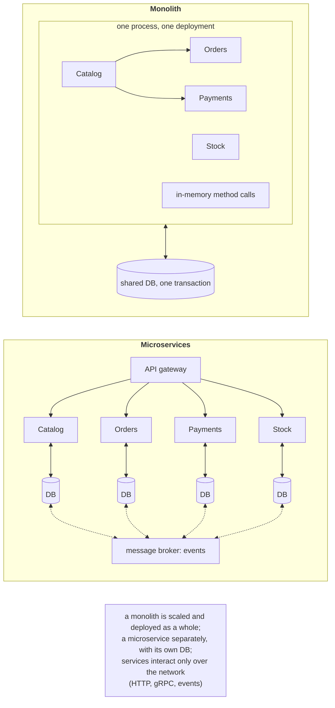
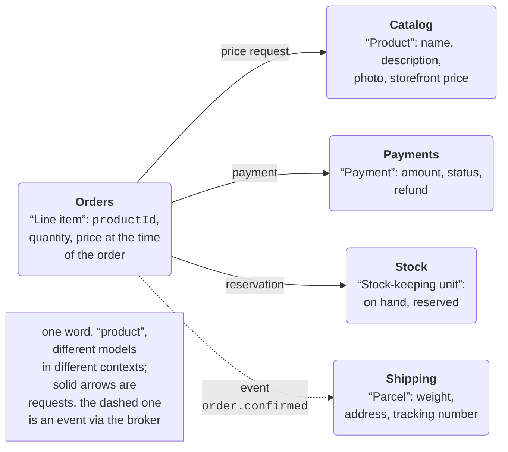
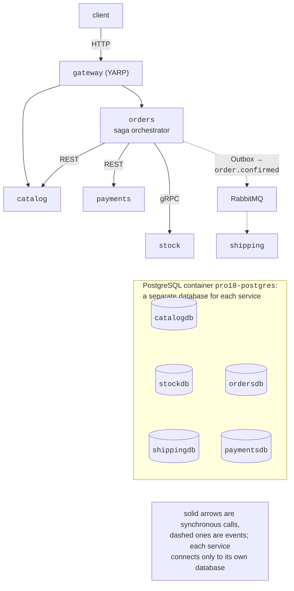

# Monoliths and decomposition into services

## Monoliths, modular monoliths, and microservices

Topics 14–17 covered the individual “building blocks” of distributed systems: remote calls (gRPC), messaging (RabbitMQ), actors and fault tolerance (Orleans, retries, circuit breakers), and containers and orchestration (Docker, Kubernetes, Aspire). This topic combines them into the **architecture** of an application made of several independent services and considers problems that do not exist within a single process: data consistency across services, partial failures, and finding the cause of an error in a chain of calls.

A **monolith** is an application that is built and deployed as a single unit: one process (or several identical copies), one codebase, and usually one database (Fig. 18.1). Modules call each other with ordinary methods, and changes to several tables are protected by one transaction. A monolith is simple to develop, debug, test, and deploy, which is why most systems start with one.

The problems of a large monolith:

- any change requires building and deploying the entire application, and an error in one module can bring down all of them;
- only the entire application can be scaled, even if the load is created by a single feature;
- the boundaries between modules blur over time (any code can access any table), and large teams get in each other's way;
- the whole system is tied to one technology and one version of the platform.

A **modular monolith** is an intermediate option: one process and one deployment, but the code is divided into modules with explicit boundaries (separate projects, internal classes, separate database schemas, interaction only through the modules' public interfaces). It provides most of the benefits of clear boundaries without the cost of distribution and makes it easier to extract modules into separate services later.

**Microservices** are an architectural style in which an application consists of small autonomous services (<https://learn.microsoft.com/azure/architecture/guide/architecture-styles/microservices>):

- each service implements one business capability and owns its data, which other services do not access directly;
- services interact only over the network: through synchronous calls (REST, gRPC) or through events via a message broker;
- each service is built, tested, deployed, and scaled independently, and its team can choose its own technology.



Figure 18.1. A monolith and microservices {.caption}

Table 18.1 compares the three approaches.

Table 18.1. Monoliths, modular monoliths, and microservices {.caption}

| **Property** | **Monolith** | **Modular monolith** | **Microservices** |
| --- | --- | --- | --- |
| deployment | everything together | everything together | each service separately |
| scaling | the entire application | the entire application | individual services |
| data | shared DB | shared DB, separate schemas | database per service |
| consistency | ACID transactions | ACID transactions | eventual, sagas |
| calls | in-memory methods | module interfaces | network: latency, failures |
| debugging | one process | one process | distributed tracing |
| infrastructure | minimal | minimal | gateway, broker, orchestrator, telemetry |

**The cost of distribution.** Any call between services can take longer, fail, or time out with an unknown result; the data of different services cannot be changed in one transaction; and you need a gateway, a broker, service discovery, centralized logs and tracing, and automated deployment. The fallacies of distributed computing (Topic 14), such as “the network is reliable” and “latency is zero”, stop being theoretical in microservices.

::: tip When microservices are not needed
For a small team (up to 5–10 developers), a new product with unstable requirements, or a system without separate heavily loaded parts, microservices usually bring more costs than benefits. The typical recommendation is to start with a well-structured modular monolith and extract services when a concrete reason appears: a separate team, different scaling or reliability requirements, or a different technology. For gradual extraction, the **strangler fig** pattern is used (<https://learn.microsoft.com/azure/architecture/patterns/strangler-fig>): a gateway in front of the monolith switches routes to new services one by one.
:::

## Decomposing a system into services

The hardest decision in a microservice architecture is **where to draw the boundaries** of services. Bad boundaries produce services that cannot work without each other, always change together, and constantly exchange small synchronous calls.

**Decomposition by business capabilities**: a service corresponds to what the business **does**: it maintains a catalog, accepts orders, accepts payments, keeps goods in a warehouse, and delivers. A technical split (“a database service”, “a validation service”, “a reporting service for everyone”) almost always produces tightly coupled services.

A **bounded context** is a concept of domain-driven design (DDD): a part of the domain within which terms have one precise meaning and one model (<https://learn.microsoft.com/azure/architecture/microservices/model/domain-analysis>). The same word means different things in different contexts (Fig. 18.2): a “product” in the catalog is a name, a description, and a photo; in an order, it is a line with a quantity and the price at the time of purchase; in the warehouse, it is a stock-keeping unit with a quantity on hand and a reservation; in delivery, it is a parcel with a weight. An attempt to create one “universal” product model for all services creates a monolith again, only a distributed one. A good starting point is **one bounded context – one or more services**, but not the other way around (<https://learn.microsoft.com/azure/architecture/microservices/model/microservice-boundaries>).



Figure 18.2. Bounded contexts of an online store {.caption}

Signs of good boundaries:

- a service can be changed and deployed without changing others (changes within one business function affect one service);
- a service handles most requests with its own data; dependencies on other services are few and mostly asynchronous;
- a service has a clear owner, a single team.

The **size of a service** is determined not by lines of code but by responsibility: a service should be small enough for one team to maintain it and to rewrite it in a few weeks, and large enough not to require distributed transactions for every operation. Services that are too fine-grained (*nanoservices*) multiply network calls and sagas.

**Conway's law**: an organization creates systems whose structure mirrors the organization's communication structure. Therefore, service boundaries are aligned with the team structure, and sometimes the team structure is changed to fit the desired architecture (the “inverse Conway maneuver”).

To connect with a foreign or legacy model (for example, a monolith), an **anti-corruption layer** is used (<https://learn.microsoft.com/azure/architecture/patterns/anti-corruption-layer>): an adapter translates foreign concepts into the context's own model so that they do not “leak” into the new service.

## A sample application: the Shop online store

The lecture examples use one microservice application, `Shop` (Fig. 18.3):

- `gateway` is an API gateway on YARP, the single entry point for clients;
- `catalog` is the product catalog (REST), with the `catalogdb` database;
- `stock` is the warehouse: reserving goods for an order (gRPC, Topic 14), with the `stockdb` database;
- `payments` handles payments and refunds (REST), with the `paymentsdb` database; payments above the card limit (50,000 UAH) are declined;
- `orders` handles orders (REST), with the `ordersdb` database; it is the **orchestrator of the checkout saga** and the source of the `order.confirmed`/`order.cancelled` events;
- `shipping` is delivery: a service without HTTP that receives `order.confirmed` events via RabbitMQ (Topic 15) and creates shipments in the `shippingdb` database.



Figure 18.3. The architecture of the Shop application {.caption}

The solution consists of the `Shop.AppHost` and `Shop.ServiceDefaults` projects (Aspire, Topic 17), six services, a contracts library `Shop.Contracts`, and a test project `Shop.Tests` (Fig. 18.4). The AppHost starts the infrastructure (PostgreSQL and RabbitMQ in Docker containers) and all the projects:

```cs
// The model of the Shop microservice application.
IDistributedApplicationBuilder builder =
    DistributedApplication.CreateBuilder(args);

// One PostgreSQL container, but a separate database for each service.
var postgres = builder.AddPostgres("postgres")
    .WithContainerName("pro18-postgres");
var catalogDb = postgres.AddDatabase("catalogdb");
var stockDb = postgres.AddDatabase("stockdb");
var paymentsDb = postgres.AddDatabase("paymentsdb");
var ordersDb = postgres.AddDatabase("ordersdb");
var shippingDb = postgres.AddDatabase("shippingdb");
var rabbitmq = builder.AddRabbitMQ("rabbitmq")
    .WithManagementPlugin()
    .WithContainerName("pro18-rabbitmq");

var catalog = builder.AddProject<Projects.Shop_Catalog>("catalog")
    .WithReference(catalogDb).WaitFor(catalogDb);
var stock = builder.AddProject<Projects.Shop_Stock>("stock")
    .WithReference(stockDb).WaitFor(stockDb);
var payments = builder.AddProject<Projects.Shop_Payments>("payments")
    .WithReference(paymentsDb).WaitFor(paymentsDb)
    .WithEnvironment("Payments__Limit", "50000");

var orders = builder.AddProject<Projects.Shop_Orders>("orders")
    .WithReference(ordersDb).WaitFor(ordersDb)
    .WithReference(rabbitmq).WaitFor(rabbitmq)
    .WithReference(catalog).WithReference(stock)
    .WithReference(payments);

builder.AddProject<Projects.Shop_Shipping>("shipping")
    .WithReference(shippingDb).WaitFor(shippingDb)
    .WithReference(rabbitmq).WaitFor(rabbitmq);

builder.AddProject<Projects.Shop_Gateway>("gateway")
    .WithReference(catalog).WithReference(orders)
    .WithExternalHttpEndpoints();

builder.Build().Run();
```

- `AddPostgres` starts **one** PostgreSQL container (the `postgres:18.3` image), and `AddDatabase` creates a separate database in it for each service (<https://aspire.dev/integrations/databases/postgres/postgres-get-started/>). This is a compromise for development: logically, the databases are independent (a service receives a connection string only to its own), and in production they can be placed on different servers without code changes;
- `WithReference(catalog)` passes the catalog's address to the `orders` service for service discovery;
- `WithEnvironment` sets a configuration parameter (`Payments:Limit`);
- `WithContainerName` gives the containers the persistent names `pro18-postgres` and `pro18-rabbitmq` so that they can be accessed with `docker` commands during experiments.

A reference to `Shop.ServiceDefaults` and a call to `builder.AddServiceDefaults()` (OpenTelemetry, health checks, service discovery, HTTP client resilience) were added to each service, and in the `launchSettings.json` files only the `http` profile with fixed ports 5100–5104 was kept (as in Topic 17, the `https` profile requires a trusted developer certificate). Packages: `Yarp.ReverseProxy` 2.3.0 and `Microsoft.Extensions.ServiceDiscovery.Yarp` 10.10.0 (gateway), `Aspire.Npgsql.EntityFrameworkCore.PostgreSQL` 13.5.4 (EF Core 10 for PostgreSQL), `Aspire.RabbitMQ.Client` 13.5.4 (`RabbitMQ.Client` 7), and `Grpc.AspNetCore` 2.83.0 and `Grpc.Net.ClientFactory` 2.83.0.

::: info Screenshot
Rider → Solution Explorer: Shop.AppHost, Shop.ServiceDefaults, Shop.Contracts, Shop.Gateway, Shop.Catalog, Shop.Stock, Shop.Payments, Shop.Orders, Shop.Shipping, Shop.Tests; AppHost.cs open in the editor
:::

Figure 18.4. The Shop solution in JetBrains Rider {.caption}

Run `aspire start` (or the `Shop.AppHost` project from the IDE) in the solution folder and check with `aspire describe` (a fragment; the dashboard link is removed, and `http://localhost` addresses are shortened):

```
Name       Type                      State    Health   URLs
catalog    Project                   Running  Healthy  :5101
catalogdb  PostgresDatabaseResource  Running  Healthy  -
gateway    Project                   Running  Healthy  :5100
orders     Project                   Running  Healthy  :5104
ordersdb   PostgresDatabaseResource  Running  Healthy  -
payments   Project                   Running  Healthy  :5103
postgres   Container                 Running  Healthy  tcp://…:55766
rabbitmq   Container                 Running  Healthy  http://…:55765
shipping   Project                   Running  Healthy  -
stock      Project                   Running  Healthy  :5102
…
```

It takes 15–25 s from `aspire start` until the gateway is ready (with the images already downloaded): Aspire first waits until PostgreSQL and RabbitMQ become healthy (`WaitFor`) and then starts the projects. The resources, their states, logs, and environment variables are visible in the dashboard (Fig. 18.5).

::: info Screenshot
Browser, Aspire dashboard → Resources (table view, light theme): gateway, catalog, stock, payments, orders, shipping (Project), postgres, rabbitmq (Container) and the five databases, all Running / Healthy, with URLs 5100–5104
:::

Figure 18.5. Resources of the Shop application in the Aspire dashboard {.caption}

A check with three orders through the gateway (the `orders.ps1` script):

```powershell
# Three orders through the gateway: success, payment declined, out of stock.
$gw = "http://localhost:5100/api/orders"
$orders = @(
    @{ customer = "olena"
       lines = @(@{ productId = 1; quantity = 1 },
                 @{ productId = 2; quantity = 2 }) },
    @{ customer = "petro"
       lines = @(@{ productId = 1; quantity = 2 }) },
    @{ customer = "ivan"
       lines = @(@{ productId = 2; quantity = 50 }) }
)
foreach ($o in $orders) {
    $r = Invoke-RestMethod -Method Post $gw `
        -ContentType "application/json" `
        -Body ($o | ConvertTo-Json -Depth 3)
    "{0,-6} {1,7} UAH  {2,-9} {3}" -f $r.customer, $r.total,
        $r.status, $r.reason
}
```

```
olena    33300 UAH  Confirmed
petro    64000 UAH  Cancelled payment declined
ivan     32500 UAH  Cancelled stock: not enough of product 2
```

The first order went through all the steps, the second exceeded the card limit (the payment was declined and the goods reservation was released), and the third stopped already at the warehouse (there are only 5 mice). How exactly the services agreed on this result without a shared transaction is covered in the sections on the saga and the Outbox.
