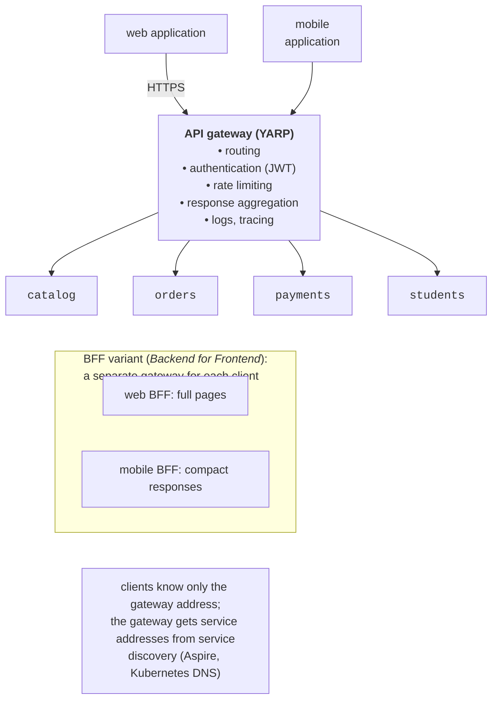

# Service interaction and the API gateway

## Service interaction

**Synchronous interaction** (*request–response*): a client sends a request and waits for a response, via REST (HTTP + JSON) or gRPC (HTTP/2 + Protocol Buffers, Topic 14). It is simple and clear, and the response arrives immediately, but the client depends on the availability and speed of the server. In Shop, `orders` synchronously gets prices from the catalog, reserves goods in `stock`, and processes the payment.

**Asynchronous interaction** (*event-driven*): a service publishes an **event**, a fact that has already happened (“the order has been confirmed”), to a broker, and interested services process it when they can (Topic 15). The publisher does not know its consumers and does not wait for them; a consumer can be temporarily unavailable. The cost is **eventual consistency** and more complex debugging. A distinction is made between **events** (“X happened”, one publisher, many consumers) and **commands** (“do Y”, one specific recipient).

**The availability of a chain of synchronous calls.** If a request passes through $n$ services, each of which is available with probability $p$, then the whole request succeeds with probability $p^{n}$. For $p = 0.99$ and $n = 5$, we get $0.99^{5} \approx 0.95$: five “reliable” services produce 5% failed requests. Latencies also add up. Therefore, long chains of synchronous calls are a sign of poor decomposition; whatever the client does not need immediately is passed through events.

**Choreography and orchestration** are two ways to coordinate a multistep process across different services (details in the section on sagas):

- **choreography**: each service reacts to the events of others and publishes its own; there is no central coordinator;
- **orchestration**: a separate component (an orchestrator) sends commands to services and decides what to do next.

**Contracts.** Services agree on the format of requests and events, not on internal classes. In Shop, the shared library `Shop.Contracts` contains **only** event records and routing key constants:

```cs
namespace Shop.Contracts;

// Contracts of the events that services exchange through RabbitMQ.
// The shared library contains only contracts, no logic.
public record OrderLine(int ProductId, int Quantity);

public record OrderConfirmed(Guid OrderId, string Customer,
    decimal Total, OrderLine[] Lines);

public record OrderCancelled(Guid OrderId, string Reason);

public static class Events
{
    public const string Exchange = "shop.events";     // topic
    public const string Confirmed = "order.confirmed"; // keys
    public const string Cancelled = "order.cancelled";
}
```

Shared libraries with business logic or database entities create tight coupling: a change in the library requires updating all services at the same time. An alternative to a shared library is a contract description (`.proto`, OpenAPI, JSON Schema) from which each service generates its own classes. This is how it is done for gRPC: the `stock.proto` file lives in the `Shop.Stock` project, and `Shop.Orders` includes it with the attribute `GrpcServices="Client"`:

```proto
syntax = "proto3";
option csharp_namespace = "Shop.Stock";
package stock;

// Reserving goods in the warehouse (idempotent by order_id).
service Inventory {
  rpc Reserve (ReserveRequest) returns (ReserveReply);
  rpc Release (ReleaseRequest) returns (ReleaseReply);
}

message Line {
  int32 product_id = 1;
  int32 quantity = 2;
}
message ReserveRequest {
  string order_id = 1;
  repeated Line lines = 2;
}
message ReserveReply {
  bool ok = 1;
  string reason = 2;
}
message ReleaseRequest {
  string order_id = 1;
}
message ReleaseReply {
  int32 released = 1;
}
```

## API gateways and BFF

If clients (a web app, a mobile app, other systems) call services directly, they must know the addresses of all services, each service checks authentication and limits the request rate itself, and any change to the service boundaries breaks the clients. An **API gateway** is a single entry point that accepts all external requests and passes them on to services (<https://learn.microsoft.com/azure/architecture/microservices/design/gateway>, Fig. 18.6). Typical gateway functions:

- **routing** (*gateway routing*): `/api/orders/…` → the `orders` service, `/api/products/…` → `catalog`;
- **authentication and authorization**: checking the JWT token once at the entrance;
- **rate limiting** and quotas;
- **aggregation** (*gateway aggregation*): one client request → several requests to services → one response;
- **offloading** of shared tasks: TLS, compression, caching, logging, tracing.



Figure 18.6. An API gateway and the BFF variant {.caption}

**BFF** (*Backend for Frontend*, <https://learn.microsoft.com/azure/architecture/patterns/backends-for-frontends>) is a separate gateway for each type of client. A mobile app needs compact responses and few requests, while a web app needs complete page data; a single universal gateway quickly becomes a “new monolith” with the logic of all clients.

### YARP

**YARP** (*Yet Another Reverse Proxy*, <https://learn.microsoft.com/aspnet/core/fundamentals/servers/yarp/yarp-overview>) is a reverse proxy library from Microsoft built on ASP.NET Core (the `Yarp.ReverseProxy` package, version 2.3.0). The gateway is an ordinary web application, so the entire ASP.NET Core pipeline (authentication, rate limiting, custom code) and debugging in the IDE are available in it. The Shop gateway (`Program.cs`):

```cs
using System.Threading.RateLimiting;

// API gateway: the single entry point for clients.
WebApplicationBuilder builder = WebApplication.CreateBuilder(args);
builder.AddServiceDefaults();
builder.Services.AddReverseProxy()
    .LoadFromConfig(builder.Configuration.GetSection("ReverseProxy"))
    .AddServiceDiscoveryDestinationResolver(); // http://orders

// Rate limiting: 10 requests per second from one IP address.
builder.Services.AddRateLimiter(o =>
{
    o.RejectionStatusCode = StatusCodes.Status429TooManyRequests;
    o.AddPolicy("per-ip", ctx => RateLimitPartition
        .GetFixedWindowLimiter(
        ctx.Connection.RemoteIpAddress?.ToString() ?? "unknown",
        _ => new FixedWindowRateLimiterOptions
        {
            PermitLimit = 10,
            Window = TimeSpan.FromSeconds(1),
        }));
});

WebApplication app = builder.Build();
app.MapDefaultEndpoints();
app.UseRateLimiter();
app.MapReverseProxy();
app.Run();
```

Routes and clusters are described in `appsettings.json` (<https://learn.microsoft.com/aspnet/core/fundamentals/servers/yarp/config-files>):

```json
{
  "Logging": {
    "LogLevel": {
      "Default": "Information",
      "Microsoft.AspNetCore": "Warning",
      "Yarp": "Warning",
      "Microsoft.EntityFrameworkCore": "Warning"
    }
  },
  "AllowedHosts": "*",
  "ReverseProxy": {
    "Routes": {
      "catalog": {
        "ClusterId": "catalog",
        "Match": {
          "Path": "/api/products/{**rest}"
        },
        "Transforms": [
          {
            "PathPattern": "/products/{**rest}"
          }
        ]
      },
      "orders": {
        "ClusterId": "orders",
        "RateLimiterPolicy": "per-ip",
        "Match": {
          "Path": "/api/orders/{**rest}"
        },
        "Transforms": [
          {
            "PathPattern": "/orders/{**rest}"
          }
        ]
      }
    },
    "Clusters": {
      "catalog": {
        "Destinations": {
          "d1": {
            "Address": "http://catalog"
          }
        }
      },
      "orders": {
        "Destinations": {
          "d1": {
            "Address": "http://orders"
          }
        }
      }
    }
  }
}
```

- a **route** defines which requests to handle (`Match.Path`), where to pass them (`ClusterId`), and how to change them (`Transforms`): `PathPattern` turns `/api/orders/…` into `/orders/…`; it also sets the `AuthorizationPolicy` and `RateLimiterPolicy` policies;
- a **cluster** is a group of destination addresses (*destinations*) of one service; if there are several addresses, YARP balances between them and can check their health;
- the address `http://orders` is a logical name: `AddServiceDiscoveryDestinationResolver()` from the `Microsoft.Extensions.ServiceDiscovery.Yarp` package turns it into the real address from the variable `services__orders__http__0=http://localhost:5104`, which the AppHost passed in.

A rate limiting check: 60 orders with eight parallel tasks (the `OrderLoad` program, which sends POST requests and groups the responses):

```
Result               count  avg, ms   max, ms
Confirmed               10       201       271
HTTP 429                50         0         2
Total 60 in 0.3 s
```

The gateway let through 10 requests per 1 s window and rejected the rest within fractions of a millisecond with the code `429 Too Many Requests`, without loading the order service. In a test with a 120 ms pause between requests (≈ 8 requests per second), there were no rejections. The partition key here is the IP address; for authenticated clients, it is taken from the token (Lab 18, Example 2).

How much does the extra “hop” through the gateway cost? 300 `GET /products/2` requests through the gateway and directly to `catalog`, three series: a median of 3.4–3.8 ms through the gateway versus 3.2–3.5 ms directly, which means YARP added ≈ 0.3 ms. For an order (≈ 28 ms for the whole saga), the difference is not noticeable.

::: tip YARP in Aspire
Aspire also has a YARP hosting integration (`aspire add yarp`, <https://aspire.dev/integrations/reverse-proxies/yarp/>): `builder.AddYarp("gateway")` starts a ready-made YARP container, and routes are defined in C# code in the AppHost (`.WithConfiguration(y => y.AddRoute("/api/{**catch-all}", orders))`). This is convenient when the gateway needs only routing. A custom project on `Yarp.ReverseProxy`, as in Shop, is needed for authentication, rate limiting, aggregation, and other code.
:::

The gateway must not retry POST requests on behalf of the client: YARP uses its own `HttpMessageInvoker` rather than `IHttpClientFactory`, so the resilience pipeline from ServiceDefaults is not applied to proxied requests (YARP timeouts are set in the routes, <https://learn.microsoft.com/aspnet/core/fundamentals/servers/yarp/timeouts>).

## Service discovery and configuration

Services start and stop dynamically, so their addresses are not hard-coded. **Service discovery** turns a logical name (`catalog`) into an address (<https://learn.microsoft.com/dotnet/core/extensions/service-discovery>):

- during development, **Aspire** passes addresses in environment variables. For `orders`, these are `services__catalog__http__0=http://localhost:5101`, `services__stock__http__0=…`, and `services__payments__http__0=…`, as well as the connection strings `ConnectionStrings__ordersdb` and `ConnectionStrings__rabbitmq` (<https://aspire.dev/fundamentals/service-discovery/>);
- the `Microsoft.Extensions.ServiceDiscovery` library (added by `AddServiceDefaults`) reads these values from the configuration, so `new Uri("http://catalog")` is enough in the code; the gRPC client works the same way;
- in **Kubernetes** (Topic 17), the name `catalog` is resolved by the cluster DNS: the `catalog` Service in the same namespace. The service code does not change.

A service's **configuration** consists of `appsettings.json` files, environment variables (in containers, ConfigMaps and Secrets), and user secrets during development; environment variables have higher priority, and a double underscore replaces the colon (`Payments__Limit` → `Payments:Limit`). The AppHost generates the database and broker passwords itself and stores them in user secrets, so they are not in the code or in the repository. Each service also has **health checks**: `AddServiceDefaults` adds `/health` and `/alive` (in the `Development` environment), and the Aspire client integrations add PostgreSQL and RabbitMQ checks (<https://aspire.dev/fundamentals/health-checks/>). The `Healthy` state in the `aspire describe` table comes from them.
