# Observability, versioning, and deployment

## Observability

In a monolithic system, an error is looked for in the log of a single process. In microservices, a request passes through the gateway, several services, a database, and a broker, and only **observability** makes it possible to answer what happened and where. The three OpenTelemetry signals (Topic 17, <https://opentelemetry.io/docs/languages/dotnet/>):

- **logs** are structured `ILogger` records with a trace ID in each record, so the logs of all services for one request can be filtered together;
- **metrics** are quantitative indicators: requests per second, latencies, errors (the RED model: *rate, errors, duration*), and custom business metrics;
- **distributed tracing** (<https://learn.microsoft.com/dotnet/core/diagnostics/distributed-tracing>) is a tree of spans for one request across all services.

**Request correlation.** The trace context is passed between processes (<https://opentelemetry.io/docs/concepts/context-propagation/>): in the HTTP `traceparent` header according to the W3C Trace Context standard (<https://www.w3.org/TR/trace-context/>) (`00-2ff068e1840b42399cec561d7108b3e2-6fe610d0a3150b72-01`: the version, the trace ID, the parent span ID, and flags), in gRPC metadata (which are also HTTP/2 headers), and in RabbitMQ message headers. The ASP.NET Core, `HttpClient`, Npgsql, and `RabbitMQ.Client` instrumentation adds and reads these headers automatically.

A difficulty arises where there is a “gap” between a request and a message, as in the Outbox: the event is published by a background service half a second later, and without extra steps it would start a **new** trace. Therefore, `OutboxMessage.From` stores `Activity.Current?.Id` (the `traceparent` value) in the `TraceParent` column, and the relay creates an `outbox relay` span with this parent context. The publication and processing of the event become part of the same trace.

The trace of one order (a warmed-up application, data from `aspire otel traces gateway --format Json`, time since the start of the request):

```
   0.0 ms  41 ms gateway   POST /api/orders/{**rest}
   0.8 ms  40 ms orders    POST /orders
   6.7 ms   3 ms orders    GET (catalog client)
   7.1 ms   2 ms catalog   GET /products/{id:int}
   7.5 ms   1 ms catalog   postgresql
  16.5 ms  25 ms orders    order saga
  16.6 ms  10 ms orders    POST (gRPC client)
  17.1 ms   9 ms stock     POST /stock.Inventory/Reserve
  30.9 ms   5 ms payments  POST /payments
  37.2 ms   1 ms orders    postgresql (status + Outbox)
 490.4 ms  11 ms orders    outbox relay
 490.4 ms   0 ms orders    publish order.confirmed
 497.2 ms   8 ms shipping  deliver order.confirmed
 499.6 ms   1 ms shipping  postgresql (Inbox + Shipments)
…
```

One trace contains **31 spans** in six services: HTTP requests, a gRPC call, 16 SQL queries in five databases, a publication to RabbitMQ, and the processing of the event (Fig. 18.13). You can see that the client received a response after 41 ms, the saga itself took 25 ms, and the event reached shipping after ≈ 0.5 s, which is the polling interval of the `Outbox` table. The *Traces* page of the Aspire dashboard presents the same information as a Gantt chart (Fig. 18.14), and the trace of a declined order is marked as failed (the client span received a 402 response).

```mermaid
gantt
  title trace id 2ff068e1… – shared by all spans. Time since the start of the request, ms. The HTTP response is ready after 41 ms, and the event is published after ≈ 0.5 s (the Outbox polling interval)
  dateFormat x
  axisFormat %-L
  tickInterval 50millisecond
  section synchronous part
    gateway – POST /api/orders : 0, 41
    ↳ orders – POST /orders : 1, 41
    ↳↳ catalog – GET ×2 : 7, 12
    ↳↳ orders – order saga : 16, 41
    ↳↳↳ stock – Reserve (gRPC) : 17, 26
    ↳↳↳ payments – POST /payments : 31, 36
  section asynchronous part
    ↳ orders – outbox relay : 490, 501
    ↳↳ orders – publish : 490, 491
    ↳↳ shipping – deliver : 497, 505
```



Figure 18.13. A distributed trace of placing an order {.caption}

::: info Screenshot
Aspire dashboard → Traces → trace `gateway: POST /api/orders/{**rest}` (31 spans) opened: waterfall with gateway, orders (order saga, outbox relay, publish order.confirmed), catalog, stock (POST /stock.Inventory/Reserve), payments and shipping (deliver order.confirmed) spans; resource colours legend visible
:::

Figure 18.14. The trace of the checkout saga in the Aspire dashboard {.caption}

**Custom metrics.** The `OrderMetrics` class publishes a counter of completed sagas `shop.sagas` with a `status` tag, a duration histogram `shop.saga.duration`, and a gauge `shop.outbox.pending` (the number of unpublished events, a useful alert signal: if it grows, the relay cannot keep up or the broker is unavailable):

```cs
using System.Diagnostics.Metrics;

namespace Shop.Orders;

// Custom metrics of the order service (the Shop.Orders meter).
public class OrderMetrics
{
    public const string Name = "Shop.Orders";
    readonly Counter<long> sagas;
    readonly Histogram<double> duration;
    public int OutboxPending;          // updated by OutboxRelay

    public OrderMetrics(IMeterFactory factory)
    {
        Meter meter = factory.Create(Name);
        sagas = meter.CreateCounter<long>("shop.sagas",
            description: "Completed sagas by result");
        duration = meter.CreateHistogram<double>("shop.saga.duration",
            unit: "ms", description: "Saga duration");
        meter.CreateObservableGauge("shop.outbox.pending",
            () => OutboxPending, description: "Unpublished events");
    }

    public void Finished(OrderStatus status, double ms)
    {
        KeyValuePair<string, object?> tag = new("status",
            status.ToString());
        sagas.Add(1, tag);
        duration.Record(ms, tag);
    }
}
```

The metrics are visible on the *Metrics* page of the dashboard or with the `dotnet-counters` utility (<https://learn.microsoft.com/dotnet/core/diagnostics/dotnet-counters>): `dotnet-counters collect -n Shop.Orders --counters Shop.Orders --format csv`. Over 20 s (31 confirmed and 2 cancelled orders), the following was obtained:

```
shop.sagas (Count / 5 sec)[status=Confirmed]              23
shop.sagas (Count / 5 sec)[status=Cancelled]               2
shop.saga.duration (ms)[status=Confirmed;Percentile=50]   21.1
shop.saga.duration (ms)[status=Confirmed;Percentile=95]   28.5
shop.outbox.pending                                        0
```

**Observability practices:** a single trace ID in logs and in error responses; structured logs without personal data; RED metrics for each service and queue; alerts based on user-facing symptoms (error rate, latency) rather than on every exception; and health checks that distinguish “live” from “ready” (Topic 17). In production, telemetry is sent not to the Aspire dashboard but to an observability system (Azure Monitor, Grafana with Prometheus, Loki, and Tempo, Jaeger, Elastic).

## API versioning and testing

### Versioning APIs and contracts

Services are deployed independently, so old and new versions run at the same time. The rules of **backward compatibility** (<https://learn.microsoft.com/azure/architecture/best-practices/api-design>):

- fields can be added (old clients ignore them), but they cannot be removed, renamed, or have their type changed without a new version;
- new required fields in requests break old clients; new fields have default values;
- incompatible changes are made as a **new version** of the API: in the path (`/api/v2/orders`), in a header, or in a query parameter (the `Asp.Versioning` library, <https://github.com/dotnet/aspnet-api-versioning>); the old version is supported as long as clients use it;
- in Protocol Buffers, field numbers are not changed, and the numbers of removed fields are not reused (`reserved`).

For **events**, the rules are even stricter: messages can sit in a queue for hours, and events stored in an Outbox or a log will be read even a year later. A consumer must be a **tolerant reader**: ignore unknown fields and have default values for missing ones. An incompatible change is published as a new event type (`order.confirmed.v2`), and for some time the publisher sends both versions.

### Contract and integration tests

- **Unit tests** check the logic of a service without the network (for example, saga state transitions with fake clients).
- **Contract tests** (*consumer-driven contracts*) check that an API provider meets the expectations of each consumer: the consumer records the expected requests and responses in a **contract**, and the provider's build pipeline verifies itself against all contracts. The best-known tool is Pact (<https://docs.pact.io/>), and PactNet for .NET. This way, an incompatible change is detected before deployment, without running the whole system.
- **Integration tests** run real services with real dependencies. The `Aspire.Hosting.Testing` package (<https://aspire.dev/testing/overview/>) starts the entire AppHost together with the PostgreSQL and RabbitMQ containers from a test project (the `aspire-xunit` template, with a reference to the AppHost project).

The Shop tests (xUnit, `Shop.Tests`; the `Npgsql` package for checking the shipping database):

```cs
using Aspire.Hosting;

namespace Shop.Tests;

// One application run (containers and services) per test class.
public class ShopFixture : IAsyncLifetime
{
    public DistributedApplication App { get; private set; } = null!;

    public async Task InitializeAsync()
    {
        var host = await DistributedApplicationTestingBuilder
            .CreateAsync<Projects.Shop_AppHost>();
        App = await host.BuildAsync();
        await App.StartAsync();
        using CancellationTokenSource cts =
            new(TimeSpan.FromMinutes(3));
        string[] resources = ["gateway", "orders", "shipping"];
        foreach (string r in resources)
            await App.ResourceNotifications
                .WaitForResourceHealthyAsync(r, cts.Token);
    }

    public async Task DisposeAsync() => await App.DisposeAsync();
}
```

```cs
using System.Net.Http.Json;
using System.Text.Json;
using Npgsql;

namespace Shop.Tests;

public class OrderTests(ShopFixture shop) : IClassFixture<ShopFixture>
{
    [Fact]
    public async Task ConfirmedOrderCreatesShipment()
    {
        HttpClient gateway = shop.App.CreateHttpClient("gateway");
        var resp = await gateway.PostAsJsonAsync("/api/orders", new
        {
            customer = "test",
            lines = new[] { new { productId = 2, quantity = 1 } },
        });
        Assert.Equal(HttpStatusCode.Created, resp.StatusCode);
        JsonElement order = await resp.Content
            .ReadFromJsonAsync<JsonElement>();
        Assert.Equal("Confirmed",
            order.GetProperty("status").GetString());

        // The event goes through the Outbox and RabbitMQ: wait up to 15 s.
        string? cs =
            await shop.App.GetConnectionStringAsync("shippingdb");
        await using var db = new NpgsqlConnection(cs);
        await db.OpenAsync();
        await using var cmd = new NpgsqlCommand(
            """
            select count(*) from "Shipments" where "OrderId" = @id
            """,
            db);
        cmd.Parameters.AddWithValue("id",
            order.GetProperty("id").GetGuid());
        long count = 0;
        for (int i = 0; i < 30 && count == 0; i++)
        {
            await Task.Delay(500);
            count = (long)(await cmd.ExecuteScalarAsync())!;
        }
        Assert.Equal(1, count);
    }

    [Fact]
    public async Task DeclinedPaymentCancelsOrder()
    {
        HttpClient gateway = shop.App.CreateHttpClient("gateway");
        var resp = await gateway.PostAsJsonAsync("/api/orders", new
        {
            customer = "test",       // 2 × 32,000 UAH > the 50,000 limit
            lines = new[] { new { productId = 1, quantity = 2 } },
        });
        JsonElement order = await resp.Content
            .ReadFromJsonAsync<JsonElement>();
        Assert.Equal("Cancelled",
            order.GetProperty("status").GetString());
        Assert.Equal("payment declined",
            order.GetProperty("reason").GetString());
    }
}
```

- `DistributedApplicationTestingBuilder.CreateAsync<Projects.Shop_AppHost>()` builds the same application model as `aspire start`; the fixture starts it once for the test class;
- `CreateHttpClient("gateway")` returns a client with the resource's address, and `GetConnectionStringAsync` returns the connection string to a database with the test password;
- an asynchronous result (a shipment via the Outbox and RabbitMQ) is checked by polling with a time limit rather than with a fixed pause.

Running `dotnet test`:

```
Passed!  - Failed:     0, Passed:     2, Skipped:     0, Total:     2,
Duration: 4 s - Shop.Tests.dll (net10.0)
```

Including the startup of the containers and services, the tests took 22 s (with the images already downloaded). During startup, the log shows transient errors `connection.start was never received` from the RabbitMQ clients: the broker was not yet accepting connections, and the automatic retries of the Aspire integration overcame them.

## Deploying microservices

Each service is a separate container image with its own build and test cycle (Topic 17): `dotnet publish /t:PublishContainer` or a `Dockerfile`, an image registry, a Deployment and a Service in Kubernetes for each service, ConfigMaps and Secrets for configuration, readiness and liveness probes, and HPA for heavily loaded services. In production, the broker and databases are usually managed (cloud services) or deployed separately with persistent volumes. The Shop AppHost can be published with the same commands as in Topic 17: `aspire publish` to Docker Compose files or a Helm chart (<https://aspire.dev/deployment/docker-compose/>).

Independent deployment requires strategies in which a new version of a service does not stop the system:

- a **rolling update**: pods of the new version replace the old ones one at a time (Topic 17);
- **blue–green**: the new version (“green”) is deployed next to the old one (“blue”) and receives traffic only after it has been checked; switching and rolling back are an instant route change in the gateway or Service;
- **canary**: the new version first receives a small share of the traffic (1–5%); if the error and latency metrics are normal, the share is increased. Traffic is split by the gateway (YARP supports routing by headers and weights, <https://learn.microsoft.com/aspnet/core/fundamentals/servers/yarp/ab-testing>), a service mesh, or an ingress controller;
- **feature flags**: the code of a new feature is deployed disabled and is enabled by configuration.

All strategies require compatible contracts (the previous section) and database migrations that are compatible with both versions of the code (first add a column, then switch to it, and only then remove the old one).

## Common mistakes

Table 18.3. Common mistakes in microservice architecture {.caption}

| **Problem** | **Cause and fix** |
| --- | --- |
| a **distributed monolith**: services can only be deployed together | boundaries along technical layers, shared libraries with logic, synchronous chains; boundaries along business capabilities, events, contracts instead of shared code |
| a **shared database** for several services | a schema change breaks other services; a database per service, other services' data through an API or events |
| a long chain of synchronous calls: slow and often failing | availability $p^{n}$; asynchronous events, local copies of data, aggregation in the gateway |
| an event is lost or published for a change that did not happen | a dual write to the DB and the broker; Transactional Outbox |
| duplicate processing (two deliveries, two payments) | “at least once” delivery; Inbox, idempotency keys, unique indexes |
| a saga “hangs” after a process crash | the saga state is only in memory; save the status after each step, a recovery service |
| compensation failed because a service is unavailable | retry compensations until they succeed (`Compensating` + `SagaRecovery`), idempotent steps |
| `does not support user-initiated transactions` | EF Core retries with Aspire; execute your own transaction through `CreateExecutionStrategy()` |
| the Outbox relay is “stuck” with `312 NO_ROUTE` | `mandatory: true` for an event without subscribers; publish with `mandatory: false` |
| a request “hangs” for tens of seconds when a service is stopped | no timeouts, or the default 30 s; attempt and call timeouts, a circuit breaker |
| `…-standard` settings do not affect the client | the default pipeline from ServiceDefaults has a shared name; `RemoveAllResilienceHandlers()` and a custom pipeline for the client |
| after `RemoveAllResilienceHandlers()`, the client waits forever | the standard handler disables `HttpClient.Timeout`; set `Timeout` explicitly (Lab 18, Example 3) |
| a chain of events in the Outbox starts a new trace | store `traceparent` in the Outbox row and restore the parent context |
| hundreds of traces with a single SQL polling query | background polling of a table; `SuppressInstrumentationScope` or a lower frequency |
| a new version of a service breaks consumers | an incompatible contract change; only add fields, version APIs and events, contract tests |
