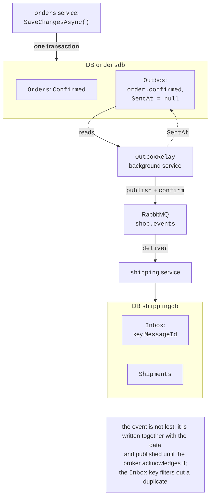
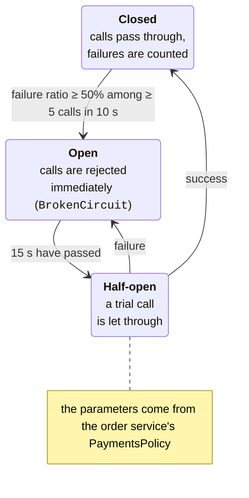

# Outbox, Inbox, and resilience

## Transactional Outbox and Inbox

After confirming an order, the service has to do two things: change the status in its database and publish an event to RabbitMQ. This is a **dual write**: no transaction covers both the database and the broker. If you write to the database first and the process crashes before publishing, the event is lost and delivery never starts. If you publish first and the database write fails, the event describes something that did not happen.

**Transactional Outbox** (<https://learn.microsoft.com/azure/architecture/best-practices/transactional-outbox-cosmos>) solves the problem as follows (Fig. 18.9):

1. the event is written to an `Outbox` table **in the same database** and **in the same transaction** as the data change (in `OrderSaga.ConfirmAsync`, one `SaveChangesAsync()` saves both the status and the `Outbox` row);
2. a separate **relay** process reads unpublished rows, publishes them to the broker, and marks them as sent only after the broker's acknowledgment (publisher confirms, Topic 15).



Figure 18.9. The Transactional Outbox and Inbox pattern {.caption}

The relay (`Shop.Orders/OutboxRelay.cs`):

```cs
using System.Diagnostics;
using System.Text;
using Microsoft.EntityFrameworkCore;
using OpenTelemetry;
using RabbitMQ.Client;
using Shop.Contracts;

namespace Shop.Orders;

// The outbox relay: reads unpublished events from the Outbox table,
// publishes them to RabbitMQ with broker confirmation, and only
// then marks them as sent.
public class OutboxRelay(IServiceScopeFactory scopes,
    IConnection rabbit, OrderMetrics metrics, IConfiguration config,
    ILogger<OutboxRelay> log) : BackgroundService
{
    static readonly ActivitySource Source = new("Shop.Orders");
    bool failOnce = config.GetValue("Outbox:FailAfterPublish", false);

    protected override async Task ExecuteAsync(CancellationToken stop)
    {
        IChannel? ch = null;
        while (!stop.IsCancellationRequested)
        {
            try
            {
                ch ??= await OpenChannelAsync(stop);
                if (await PublishBatchAsync(ch, stop) == 0)
                    await Task.Delay(500, stop); // no new events
            }
            catch (Exception ex) when (!stop.IsCancellationRequested)
            {
                // The broker is unavailable: the events stay in the table.
                log.LogWarning("Outbox: {Error}", ex.Message);
                ch?.Dispose();
                ch = null;
                await Task.Delay(2000, stop);
            }
        }
    }

    async Task<IChannel> OpenChannelAsync(CancellationToken stop)
    {
        IChannel ch = await rabbit.CreateChannelAsync(
            new CreateChannelOptions(
                publisherConfirmationsEnabled: true,
                publisherConfirmationTrackingEnabled: true),
            stop);
        await ch.ExchangeDeclareAsync(Events.Exchange,
            ExchangeType.Topic, durable: true,
            cancellationToken: stop);
        return ch;
    }

    async Task<int> PublishBatchAsync(IChannel ch,
        CancellationToken stop)
    {
        await using var scope = scopes.CreateAsyncScope();
        var db = scope.ServiceProvider.GetRequiredService<OrdersDb>();
        List<OutboxMessage> batch;
        // Do not trace polling: otherwise 2 traces per second.
        using (SuppressInstrumentationScope.Begin())
            batch = await db.Outbox.Where(m => m.SentAt == null)
                .OrderBy(m => m.CreatedAt).Take(50).ToListAsync(stop);
        metrics.OutboxPending = batch.Count;
        foreach (OutboxMessage m in batch)
        {
            // Continue the trace of the request that created the event.
            ActivityContext.TryParse(m.TraceParent, null,
                out ActivityContext parent);
            using Activity? a = Source.StartActivity("outbox relay",
                ActivityKind.Internal, parent);
            BasicProperties props = new()
            {
                MessageId = m.Id.ToString(),   // for the consumer's Inbox
                Type = m.Type,
                ContentType = "application/json",
                Persistent = true,
            };
            // In 7.x, await completes after the broker's confirmation.
            await ch.BasicPublishAsync(Events.Exchange, m.Type, false,
                props, Encoding.UTF8.GetBytes(m.Payload), stop);
            if (failOnce)
            {
                // Simulated failure between publishing and marking SentAt.
                failOnce = false;
                throw new InvalidOperationException(
                    "failure after publishing");
            }
            m.SentAt = DateTime.UtcNow;
            await db.SaveChangesAsync(stop);
            log.LogInformation("Outbox: {Type} {Id} published",
                m.Type, m.Id);
        }
        return batch.Count;
    }
}
```

- in `RabbitMQ.Client` 7, a channel with `publisherConfirmationTrackingEnabled` makes `BasicPublishAsync` complete only after the broker's acknowledgment; if the broker is unavailable, an exception is thrown, and the row remains unpublished;
- the relay guarantees **at least once** delivery: if the process crashes between publishing and writing `SentAt`, the event will be published a second time. The `Outbox:FailAfterPublish` parameter simulates exactly this kind of failure;
- the message's `MessageId` is the ID of the `Outbox` row; the consumer uses it to filter out duplicates;
- several instances of the service with relays would publish the same rows; in that case, the rows are locked with a `SELECT … FOR UPDATE SKIP LOCKED` query, or the relaying is assigned to a single instance; an alternative to polling is reading the database's change log (*change data capture*, Debezium);
- `SuppressInstrumentationScope` disables tracing of the polling query: without it, a new trace with a single SQL query appeared in the dashboard every 0.5 s.

The first version of the relay published with `mandatory: true` and got “stuck” on the first `order.cancelled` event: no queue is bound to this key, the broker returned the message with the error `312 NO_ROUTE`, `RabbitMQ.Client` 7 turned this into an exception, and the relay kept retrying the same event. An event that no one is listening to yet is a normal situation for publish–subscribe, hence `mandatory: false`.

**Inbox** is the mirror pattern on the consumer side: the IDs of processed messages are stored in an `Inbox` table **in the same transaction** as the result of the processing. A redelivery finds its ID and is only acknowledged. This is the **idempotent consumer** from Topic 15, but with durable storage. The consumer of the shipping service (`Shop.Shipping/OrderConfirmedConsumer.cs`):

```cs
using System.Text.Json;
using Microsoft.EntityFrameworkCore;
using RabbitMQ.Client;
using RabbitMQ.Client.Events;
using Shop.Contracts;

namespace Shop.Shipping;

// An idempotent consumer of order.confirmed events with an Inbox.
public class OrderConfirmedConsumer(IConnection rabbit,
    IServiceScopeFactory scopes,
    ILogger<OrderConfirmedConsumer> log) : BackgroundService
{
    const string Queue = "shipping.order-confirmed";

    protected override async Task ExecuteAsync(CancellationToken stop)
    {
        IChannel ch = await rabbit.CreateChannelAsync(
            cancellationToken: stop);
        await ch.ExchangeDeclareAsync(Events.Exchange,
            ExchangeType.Topic, durable: true,
            cancellationToken: stop);
        await ch.QueueDeclareAsync(Queue, durable: true,
            exclusive: false, autoDelete: false,
            arguments: new Dictionary<string, object?>
                { ["x-queue-type"] = "quorum" },
            cancellationToken: stop);
        await ch.QueueBindAsync(Queue, Events.Exchange,
            Events.Confirmed, cancellationToken: stop);
        await ch.BasicQosAsync(0, 10, false, stop);

        AsyncEventingBasicConsumer consumer = new(ch);
        consumer.ReceivedAsync += async (_, ea) =>
        {
            try
            {
                await HandleAsync(ea, stop);
                await ch.BasicAckAsync(ea.DeliveryTag, false, stop);
            }
            catch (Exception ex) when (!stop.IsCancellationRequested)
            {
                // A DB error or the like: return the message to the queue.
                log.LogWarning("Error: {Error}", ex.Message);
                await Task.Delay(1000, stop);
                await ch.BasicNackAsync(ea.DeliveryTag, false, true,
                    stop);
            }
        };
        await ch.BasicConsumeAsync(Queue, autoAck: false, consumer,
            stop);
        await Task.Delay(Timeout.Infinite, stop);
    }

    async Task HandleAsync(BasicDeliverEventArgs ea,
        CancellationToken stop)
    {
        Guid id = Guid.Parse(ea.BasicProperties.MessageId!);
        var e = JsonSerializer.Deserialize<OrderConfirmed>(
            ea.Body.Span)!;
        await using var scope = scopes.CreateAsyncScope();
        var db = scope.ServiceProvider
            .GetRequiredService<ShippingDb>();
        if (await db.Inbox.AnyAsync(m => m.MessageId == id, stop))
        {
            log.LogWarning("Duplicate {Id} skipped", id);
            return;
        }
        // The Inbox record and the action are in one transaction (SaveChanges).
        db.Inbox.Add(new InboxMessage { MessageId = id,
            ProcessedAt = DateTime.UtcNow });
        db.Shipments.Add(new Shipment { OrderId = e.OrderId,
            Customer = e.Customer, CreatedAt = DateTime.UtcNow });
        await db.SaveChangesAsync(stop);
        log.LogInformation("Shipment {Order} created", e.OrderId);
    }
}
```

The `Inbox` table has the primary key `MessageId`, so even two concurrent handlers of the same message will not create two shipments: the second `SaveChangesAsync` will fail with a key error, and the message will return to the queue and be recognized as a duplicate.

### A check: broker failure and duplicates

**Broker failure.** The RabbitMQ container was stopped with the command `docker stop pro18-rabbitmq`, after which 5 orders were placed through the gateway:

```
02:14:14 outbox:  0 |  40 | shipping:  40 |  40
02:14:17 broker stopped
Confirmed    5 orders, avg 133 ms
02:14:19 outbox:  5 |  45 | shipping:  40 |  40
02:14:35 outbox:  5 |  45 | shipping:  40 |  40
02:14:36 broker started
02:14:39 outbox:  5 |  45 | shipping:  40 |  40
02:14:43 outbox:  0 |  45 | shipping:  45 |  45
```

(columns: unpublished and total `Outbox` rows; shipments and `Inbox` rows). The orders were confirmed even without the broker: the events waited in the table, and the relay reported `Outbox: Already closed: … AMQP close-reason … code=320` every 2 s. After `docker start`, the broker started within a few seconds, `RabbitMQ.Client` automatically restored the connection, and all 5 events were delivered within 7 s: 45 confirmed orders and 45 shipments, with no losses and no duplicates. The durable quorum queue `shipping.order-confirmed` survived the container restart together with its binding to the exchange.

**Duplicates.** The order service was started with `Outbox__FailAfterPublish=true` (the first event is published, but `SentAt` is not written). The service logs:

```
[orders]   Outbox: failure after publishing
…
[shipping] Duplicate 01a0b6cc-3159-7666-863d-e03753fde685 skipped
```

The same event was received twice, but after 40 orders there are 40 shipments and 40 `Inbox` rows in `shippingdb`. Without the Inbox, one order would have received two deliveries.

Fig. 18.10 shows the application's queues and exchange in the RabbitMQ web console (the `rabbitmq` link in the Aspire dashboard; the user name and password are in the parameters of the `rabbitmq` resource).

::: info Screenshot
RabbitMQ management (link of the rabbitmq resource in the Aspire dashboard) → Queues and Streams: quorum queue shipping.order-confirmed with 1 consumer and message rates while OrderLoad sends orders; optionally Exchanges → shop.events (topic) with the binding order.confirmed
:::

Figure 18.10. The shipping service's event queue in RabbitMQ {.caption}

## Resilience of service interaction

Any synchronous call to another service can hang, fail, or fail temporarily. **Resilience** strategies (Topic 16):

- a **timeout**: a limit on the time of one attempt and of the whole call with retries. Without it, a thread waits for a response from a “silent” service for minutes, and the failure of one dependency spreads along the chain of calls (*cascading failure*);
- a **retry** (<https://learn.microsoft.com/azure/architecture/patterns/retry>) of transient errors only (5xx, 408, 429, a dropped connection, a timeout) with exponential backoff and jitter; only idempotent operations can be retried;
- a **circuit breaker** (<https://learn.microsoft.com/azure/architecture/patterns/circuit-breaker>, Fig. 18.11): after a series of failures, calls are rejected immediately without loading the unhealthy service; after a given time, a trial call checks whether the service has recovered;
- **resource isolation** (*bulkhead*, <https://learn.microsoft.com/azure/architecture/patterns/bulkhead>): separate limits on parallel calls for each dependency so that a slow service does not take up all threads or connections (in the standard pipeline, a concurrency limiter);
- **graceful degradation** (*fallback*): instead of an error, a fallback response: data from a cache, a simplified result, or a disabled optional feature (Lab 18, Example 3).



Figure 18.11. Circuit breaker states {.caption}

The `Microsoft.Extensions.Http.Resilience` package (10.10.0, based on Polly 8, <https://learn.microsoft.com/dotnet/core/resilience/http-resilience>) adds the **standard resilience handler** `AddStandardResilienceHandler()`. `AddServiceDefaults` enables it for all `IHttpClientFactory` clients (and for gRPC clients). The strategies are executed from the outside in (Table 18.2).

Table 18.2. The standard HTTP client resilience handler {.caption}

| **No.** | **Strategy** | **Default parameters** | **Payments in Shop** |
| --- | --- | --- | --- |
| 1 | concurrency limiter | 1000 requests, no queue | default |
| 2 | total request timeout | 30 s | 5 s |
| 3 | retries | 3, exponential from 2 s, jitter | 2, from 200 ms |
| 4 | circuit breaker | 10% failures among ≥ 100 calls in 30 s; open for 5 s | 50% among ≥ 5 in 10 s; 15 s |
| 5 | attempt timeout | 10 s | 1 s |

The default parameters are designed for heavily loaded services: the circuit breaker will not trip until there are 100 calls within 30 s. For Shop payments, they were changed (`Shop.Orders/PaymentsPolicy.cs`):

```cs
using Microsoft.Extensions.Http.Resilience;

namespace Shop.Orders;

// The standard pipeline: rate limiting → total request timeout
// → retries → circuit breaker → attempt timeout.
public static class PaymentsPolicy
{
    public static void Configure(HttpStandardResilienceOptions o)
    {
        o.TotalRequestTimeout.Timeout = TimeSpan.FromSeconds(5);
        o.Retry.MaxRetryAttempts = 2;              // 3 attempts in total
        o.Retry.Delay = TimeSpan.FromMilliseconds(200);
        o.CircuitBreaker.FailureRatio = 0.5;     // half failed
        o.CircuitBreaker.MinimumThroughput = 5;  // among ≥ 5 calls
        o.CircuitBreaker.SamplingDuration = TimeSpan.FromSeconds(10);
        o.CircuitBreaker.BreakDuration = TimeSpan.FromSeconds(15);
        o.AttemptTimeout.Timeout = TimeSpan.FromSeconds(1);
    }
}
```

For the settings to take effect, the default handler from ServiceDefaults is first removed for the `payments` client with `RemoveAllResilienceHandlers()` (see the order service's `Program.cs`); otherwise, the two pipelines would run one inside the other. The first attempt, configuring named options with `Configure<HttpStandardResilienceOptions>("payments-standard", …)`, did not work: the Polly log showed `Source: '-standard//Standard-TotalRequestTimeout'` and a 30 s timeout, which means the default pipeline from `ConfigureHttpClientDefaults` has the shared name `-standard`, not the client's name. The `RemoveAllResilienceHandlers` method is still marked as experimental (the `EXTEXP0001` warning).

::: tip Retries and non-idempotent requests
The standard handler retries **all** methods, including POST. For operations that are not idempotent, retries are disabled (`options.Retry.DisableForUnsafeHttpMethods()`), or the operations are made idempotent with a key, like `POST /payments` in Shop.
:::

### A check: failures and a stopped service

**Transient failures.** The payment service was started with `Payments__FailureRate=0.3` (30% of the responses are 503). The result of 40 orders, one at a time with a 100 ms pause, in two runs (the maximum column is removed):

```
Result                                      count   avg, ms
Confirmed                                      40       152
---
Cancelled service unavailable: HttpRequest…     1       656
Confirmed                                      39       132
```

Retries were performed 19 and 17 times (Polly events with `Handled: 'True'` in the log), that is, on every third payment call, but the clients barely noticed the failures. Once (a probability of $0.3^{3} \approx 2.7$%), all three attempts received 503, and the saga cancelled the order with a refund and the reservation released.

**A stopped service.** The command `aspire resource payments stop` stopped the payment service, after which 20 orders were sent with a 200 ms pause (Fig. 18.12; the exception names in the output are shortened):

```
Result                                           count   avg, ms
Compensating service unavailable: BrokenCircuit…    19        23
Compensating service unavailable: TimeoutRejec…      1      6193
Total 20 in 10.8 s
```

- The first order waited 6.2 s: connecting to the stopped service through the Aspire proxy did not fail but “hung”, so the attempt timeouts (1 s) and the total request timeout (5 s) kicked in. Without timeouts, the request would have waited for a response for 100 s (the default `HttpClient.Timeout`) or even longer;
- after five failed attempts, the circuit breaker opened, and the remaining 19 orders were rejected within 23 ms without loading the network or occupying threads;
- compensation also needs the payment service (`refund`), so all 20 orders remained in the `Compensating` state with the goods reserved.

After `aspire resource payments start`, the `SagaRecovery` service completed the compensation of all 20 sagas within 30–40 s:

```
02:12:30 [Compensating: 20, Confirmed: 42, Cancelled: 4]
02:12:56 [Compensating: 8, Confirmed: 42, Cancelled: 16]
02:13:06 [Confirmed: 42, Cancelled: 24]
```

The stock of product 3 in the warehouse became 99,960: $100 \, 000$ minus 40 confirmed orders; the reservations of the 20 cancelled orders were returned.

::: info Screenshot
Windows Terminal, two panes: left – `aspire resource payments stop`, then `dotnet run -c Release -- http://localhost:5100/api/orders 20 1 200` (OrderLoad) with the table «Compensating … BrokenCircuitException 19 / TimeoutRejectedException 1»; right – `aspire logs orders` with Polly «Circuit breaker opened» and «Compensation … postponed» lines, then after `aspire resource payments start` the «Recovering saga …» lines
:::

Figure 18.12. A resilience check while the payment service is stopped {.caption}
