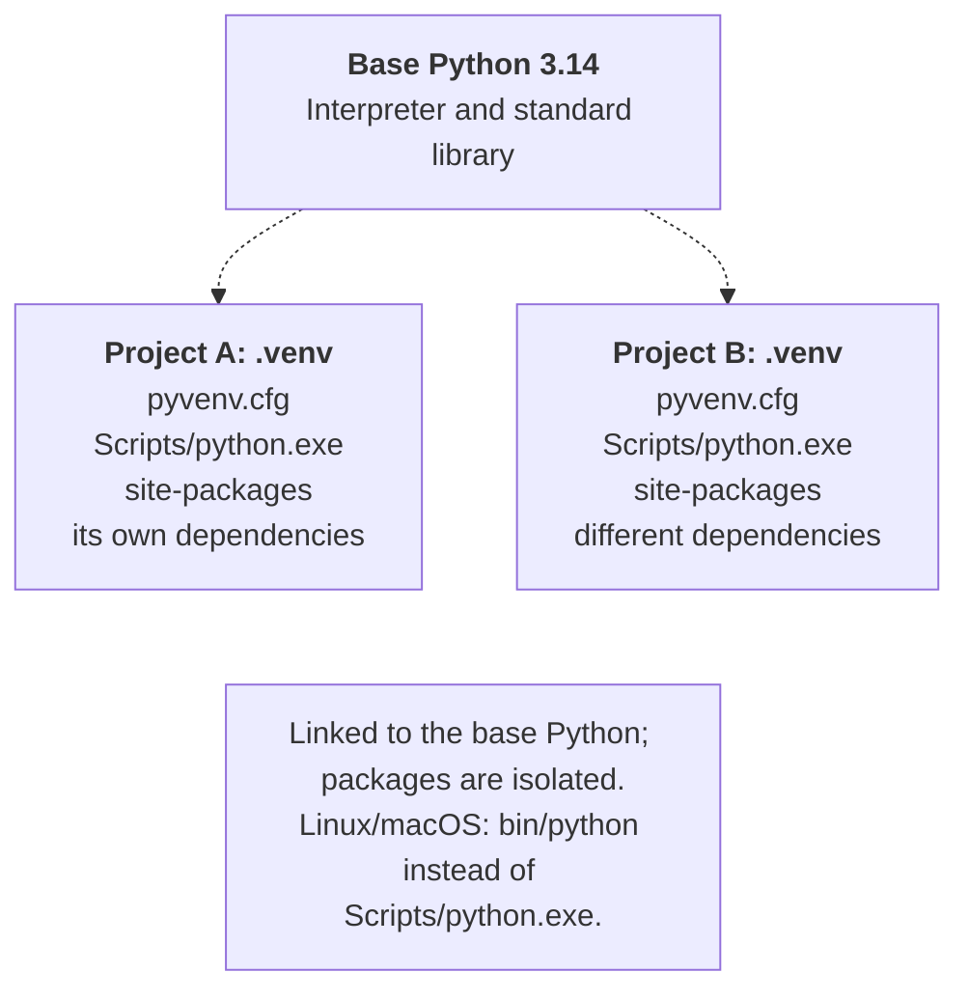
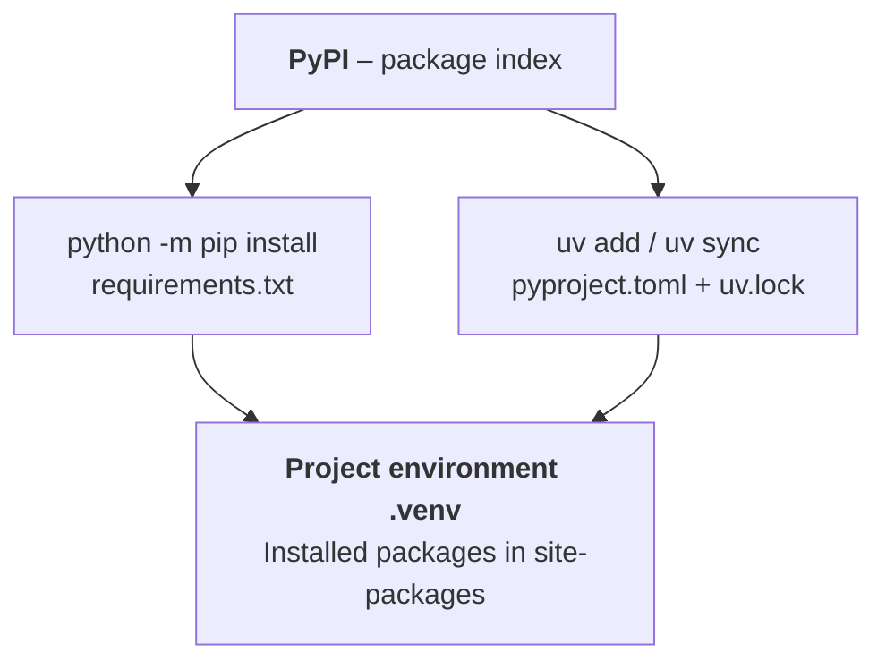

# Virtual environments and packages

## Virtual environments

A **virtual environment** is a separate set of an interpreter or links to it and installed packages for a project. It is neither a virtual machine nor a container: it does not isolate the program from user files or the network. Its purpose is to avoid dependency conflicts between projects (Fig. 1.12).

PyCharm can create an environment using virtualenv. In the terminal, the standard `venv` module demonstrates the same learning principle: <https://docs.python.org/3.14/library/venv.html>. Do not create a second environment on top of one the IDE has already prepared.

::: info Screenshot
Settings &gt; Python &gt; Interpreter: .venv Python 3.14 and packages
:::

Figure 1.11. Selecting the project interpreter {.caption}



Figure 1.12. The base interpreter and independent environments {.caption}

In a new project directory on Windows, run:

```powershell
py -V:3.14 -m venv .venv
.\.venv\Scripts\python.exe --version
.\.venv\Scripts\Activate.ps1
python -m pip --version
```

Activation adds the environment's directory to the beginning of the current shell's `PATH`. It is convenient but optional: you can always call `.\.venv\Scripts\python.exe main.py`. This is also reliable when organizational policy prevents PowerShell from running `Activate.ps1`. You do not need to weaken the execution policy to run Python.

In cmd, activation is `.venv\Scripts\activate.bat`; in bash, it is `source .venv/bin/activate`. The `deactivate` command ends activation but does not delete the environment. Selecting Python in PyCharm and activating it in the terminal are separate settings; check both.

### Example: environment information

```py
"""Diagnose the selected interpreter."""
import platform
import sys

print("Python:", platform.python_version())
print("System:", platform.system())
print("Interpreter:", sys.executable)
print("Environment:", sys.prefix != sys.base_prefix)
```

Save this as `environment.py` and run it in the project. The last line should be `Environment: True`. The version and absolute path depend on the computer. `sys.prefix` points to the current environment, and `sys.base_prefix` to the base installation. Do not identify an environment solely by `(.venv)` in the prompt.

After moving the project to another computer, recreate `.venv`. Absolute paths inside the environment may make a copy unusable. Store the dependency specification in Git, rather than the directory of installed packages itself.

## Packages, pip, and requirements.txt

The **standard library** ships with Python: examples include `sys`, `math`, `datetime`, and `platform`. Third-party packages are installed separately. **PyPI** is an index of these packages: <https://pypi.org/>. A package's installation name may differ from its module's import name; check the documentation.

`pip` manages installed distributions. The `python -m pip` form reduces the risk of installing a package into the wrong Python. Before installing, check the path with `python -m pip --version`. Run the following commands in the activated environment:

```powershell
python -m pip install rich
python -m pip list
python -m pip show rich
python -m pip freeze > requirements.txt
```

::: info Screenshot
PowerShell: venv; activation; python -m pip install rich; freeze
:::

Figure 1.13. Installing a package in the project environment {.caption}

`requirements.txt` contains package specifications; `freeze` usually records installed versions, including transitive dependencies. This is a snapshot of a particular environment, rather than a complete description of the operating system or a universal lock file. Restore packages in a clean environment as follows:

```powershell
python -m pip install -r requirements.txt
python -m pip check
```

Do not generate the file from a shared environment with dozens of unrelated libraries installed. If a package is no longer needed, `python -m pip uninstall rich` removes that package specifically; review and update the dependency list as well. Documentation: <https://pip.pypa.io/en/stable/user_guide/>.



Figure 1.14. Two ways to manage project dependencies {.caption}

### Example: a table with Rich

After installing `rich`, save the program as `table_demo.py`. The external package is used here to format the table, rather than to perform the calculations themselves.

```py
"""A table of squares."""
from rich import box
from rich.console import Console
from rich.table import Table

table = Table(box=box.ASCII)
table.add_column("n", justify="right")
table.add_column("n^2", justify="right")
for number in (2, 3, 4):
    table.add_row(str(number), str(number ** 2))
Console(color_system=None).print(table)
```

Output:

```
+---------+
| n | n^2 |
|---+-----|
| 2 |   4 |
| 3 |   9 |
| 4 |  16 |
+---------+
```

`Table` creates a table object, `add_column` describes columns, and `add_row` adds a row. The loop repeats the same action for three values; loops will be studied in detail in the next topic. Disabled colors and an ASCII border make the output suitable for printing. API: <https://rich.readthedocs.io/en/stable/tables.html>.

## uv: the next step in project management

**uv** combines management of Python versions, environments, and dependencies. In this assignment, it is an optional path after `venv` and `pip`; do not mix ways of managing one environment without a clear need. Installation: <https://docs.astral.sh/uv/getting-started/installation/>. On Windows, `winget install --id=astral-sh.uv -e` is available. After installation, open a new terminal and check `uv --version`.

```powershell
uv init --python 3.14 weather
cd weather
uv add rich
uv run main.py
uv sync --locked
```

::: info Screenshot
uv init –python 3.14 weather; uv add rich; uv run main.py
:::

Figure 1.15. Creating a uv project {.caption}

`pyproject.toml` describes the project and its direct dependencies; `uv.lock` records the resolved dependencies. Keep both files in Git. `.python-version` specifies the selected Python version. `uv run` prepares the environment and runs the command, so manual activation is unnecessary. `uv sync --locked` checks that the lock file agrees with the project specification instead of silently updating the lock.

For example, a `pyproject.toml` fragment might look like this:

```toml
[project]
name = "weather"
version = "0.1.0"
requires-python = ">=3.14"
dependencies = ["rich"]
```

This is a simplified fragment for explanation; `uv add` may write a version constraint. Add development dependencies with `uv add --dev pytest`, and view available Python versions with `uv python list`. Tests will become mandatory later. Guide: <https://docs.astral.sh/uv/guides/projects/>.

In PyCharm, you can select a *uv* environment or open an existing project directory and specify its `.venv`. For a regular pip project, the *Python Packages* window lets you search for a package, read its description, and install it into the selected environment. Check the interpreter again before clicking *Install*.

::: info Screenshot
View &gt; Tool Windows &gt; Python Packages; rich; package details
:::

Figure 1.16. Packages of the selected interpreter in PyCharm {.caption}
