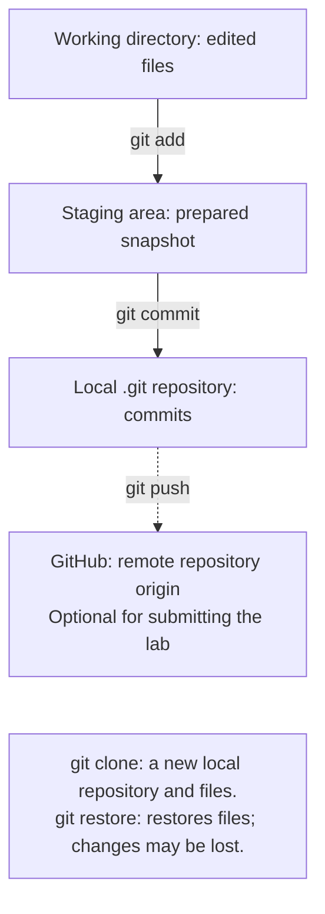

# Git version control

## Git version control

**Git** stores a history of project snapshots. **GitHub** is a repository hosting service; Git works without it and without a network connection. Download Git: <https://git-scm.com/downloads>. Check it with `git --version`. A local repository is enough for this lab.

Distinguish between the working directory, staging area, and repository (Fig. 1.17). After editing, changes are not yet in the staging area. `git add` stages the file's current state, and `git commit` saves the staged snapshot. If you edit the file again after `add`, you must stage the new changes again.



Figure 1.17. Git areas and movement of changes {.caption}

Create `.gitignore` in the project directory:

```
.venv/
__pycache__/
*.py[cod]
.idea/
.env
```

For the first assignment, do not share individual IDE settings. Team projects sometimes keep parts of `.idea` by agreement. `.gitignore` does not hide files that are already tracked or remove secrets from history. Commit `.gitignore` itself, source code, the README, and the dependency specification.

```powershell
git init -b main
git config user.name "Student Name"
git config user.email "student@example.org"
git status
git add main.py .gitignore
git commit -m "Add first Python program"
git log --oneline
```

Replace the example name and address with your own details. Without `--global`, these settings apply to the current repository, which is convenient on a shared classroom computer. On a personal device, you can set them globally. For future repositories, use `git config --global init.defaultBranch main`; the `init -b main` command above already explicitly sets the branch name for this project.

::: info Screenshot
git init; status; add; commit; log –oneline; no .venv tracked
:::

Figure 1.18. The first local commit {.caption}

`git diff` shows changes between working files and the staging area, while `git diff --staged` shows staged changes relative to the latest commit. `git status` explains the current state. Before restoring a file with `git restore`, save any edits you need: uncommitted changes may be lost. For a beginner, learning to read a diff is more useful than memorizing undo commands.

Make three meaningful commits: a working script; dependencies and their specification; instructions for running and checking the project. Do not create empty commits just to meet a count. Guide: <https://git-scm.com/book/en/v2>.

### Git in PyCharm and optional publishing

If no repository exists yet, use *VCS → Create Git Repository* or the command for enabling version control available in your interface. The *Commit* window shows files and their diffs; the message should explain the change. In the default keymap, **Alt+0** opens *Commit*, and **Alt+9** opens *Git*. The *Log* tab shows the history (Fig. 1.20).

::: info Screenshot
Commit: selected files, message, diff; no credentials
:::

Figure 1.19. Preparing a commit in PyCharm {.caption}

::: info Screenshot
Git &gt; Log: main branch, three meaningful commits
:::

Figure 1.20. Project change history {.caption}

GitHub is an optional way to submit your work. First check that the repository contains no passwords, tokens, or personal files. *Share Project on GitHub* creates a remote repository; `push` sends commits, and `clone` creates a local copy of the history and working files. A public repository is accessible to other users. Local submission does not require a GitHub account.

## Reproducing a project and common problems

For this assignment, a project is reproducible if another student can create a new environment, install the specified dependencies, and obtain the expected result. The README must include the Python version, how to create the environment, the launch command, an example of arguments, and a reference result. A screenshot demonstrates only one run and does not replace source code.

Table 1.3. Diagnosing the development environment {.caption}

| **Symptom** | **Check and action** |
| --- | --- |
| `python` is not found | New terminal; `where.exe python`; Python manager |
| Activation does not run | Call `.venv/Scripts/python.exe` directly |
| A package is “not found” | `sys.executable`; `python -m pip --version` |
| IDE and terminal produce different results | Compare interpreters and working directories |
| Encoding error in an old console | UTF-8; if needed, `python -X utf8 main.py` |
| Git shows `.venv` | Check `.gitignore` before the first `git add` |

In Python 3.14, do not assume that every redirected stream has the same encoding across all operating systems. Save code in UTF-8 and check the terminal mode. `PYTHONUTF8=1` or `-X utf8` enables UTF-8 mode for the process, but does not fix missing font glyphs. Do not replace Ukrainian strings with garbled text to conceal a display problem.

::: tip Tip
The initial goal is to explain which Python executes the file, where it gets its packages, and which files went into the commit. Clicking buttons quickly does not replace understanding these three relationships.
:::
