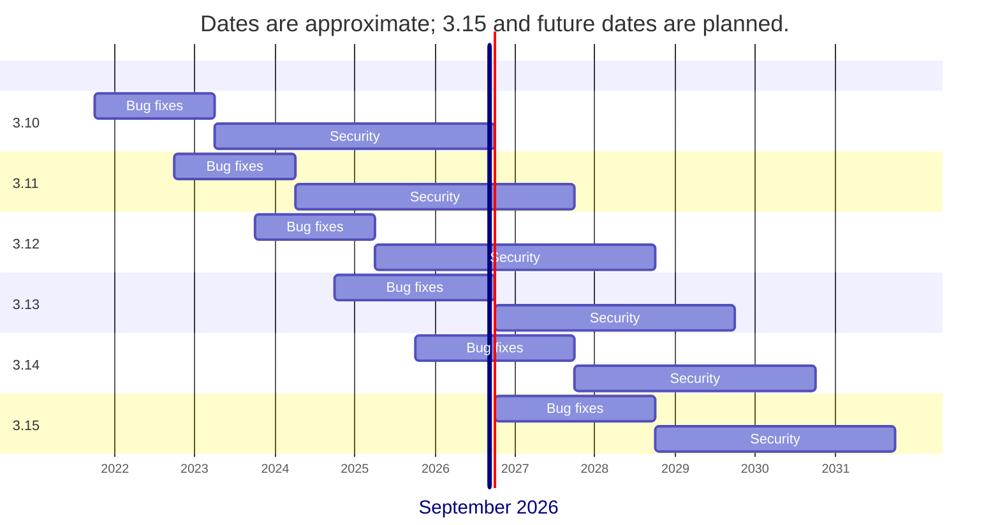
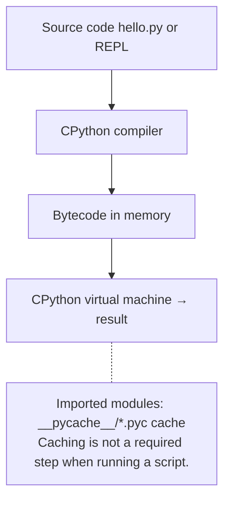

# Python and CPython

## Python and its versions

**Python** is a general-purpose programming language. Guido van Rossum created it; its first public release appeared in 1991. Python 3.0 was released in 2008. The language is suitable for automation, data processing, web applications, and scientific computing. In this course, it is a tool for studying object-oriented programming: you gradually move from a single script to a project with classes and tests. Official tutorial: <https://docs.python.org/3.14/tutorial/>.

Do not confuse the language with the program that executes its instructions. **CPython** is the main implementation of Python, written primarily in C. **PyPy** is another implementation, known for JIT compilation. Library compatibility and supported versions differ between implementations. For the labs, we use a regular CPython 3.14 build, rather than a prerelease of the next version or a special free-threaded build.

Python's philosophy emphasizes readability, explicit actions, and simplicity. PEP 20 summarizes it: <https://peps.python.org/pep-0020/>. The `import this` command displays this text in the interpreter. In practice, this means clear names, short functions, and no hidden dependencies on computer settings.

New language versions are released annually. Bugs are fixed during the first few years, followed by security fixes only. For versions before 3.13, the first phase lasted approximately 18 months; starting with 3.13, it lasts approximately two years. Total support lasts about five years; exact dates are determined by each release's schedule (Fig. 1.1).



Figure 1.1. Approximate Python version support lifecycle {.caption}

Table 1.1. Python branch status when this material was prepared {.caption}

| **Version** | **Status in September 2026** | **End of support** |
| --- | --- | --- |
| 3.10 | Security | 10.2026 |
| 3.11 | Security | 10.2027 |
| 3.12 | Security | 10.2028 |
| 3.13 | Bug fixes | 10.2029 |
| 3.14 | Bug fixes | 10.2030 |
| 3.15 | Prerelease | 10.2031, planned |

Source for the table and planned dates: <https://devguide.python.org/versions/>. When installing, choose the current maintenance release of the 3.14 branch, such as `3.14.x`, rather than simply the newest prerelease. The last digit denotes a maintenance release; it may change after this material was prepared.

Python 3.14 introduced template t-strings, deferred evaluation of annotations, and official support for free-threaded mode. A t-string creates a template object, rather than a finished `str`. Annotations by themselves do not check the types of input data. Free-threaded mode does not automatically make every program faster. We will study these features after the fundamentals; a regular interpreter and `print` are enough for the first assignment. Overview: <https://docs.python.org/3.14/whatsnew/3.14.html>.

## How CPython executes a program

The `hello.py` file contains the program's text in UTF-8 encoding. CPython checks its syntax and compiles it into **bytecode**, instructions for its virtual machine. The interpreter then executes these instructions (Fig. 1.2). Thus, saying “Python executes text line by line without compilation” is an oversimplification.



Figure 1.2. Simplified CPython program execution model {.caption}

When importing a module, Python may save bytecode in `__pycache__`, for example `helper.cpython-314.pyc`. This is a cache for loading modules faster, rather than a standalone application. Such a cache is usually not written for the main script passed to `python hello.py`. The absence of a `.pyc` file does not indicate an error. Cache creation also depends on write permissions and startup options. Learn more: <https://docs.python.org/3.14/tutorial/modules.html>.

**REPL** (*Read–Eval–Print Loop*) is an interactive mode: read an expression, evaluate it, display the result, and wait for the next one. Run `python` without a filename. The `>>>` prompt belongs to the interpreter; do not enter it in your program.

```py
>>> 2 ** 100
1267650600228229401496703205376
>>> import sys
>>> sys.version_info[:2]
(3, 14)
>>> exit()
```

The modern REPL provides highlighting and convenient multiline editing; its appearance depends on the terminal. The REPL is useful for experiments, but save lab work in a `.py` file: closing an interactive session does not create a file containing your program. The `python -m module` command runs a module by name; for example, `python -m pip --version` invokes pip for the selected interpreter.
