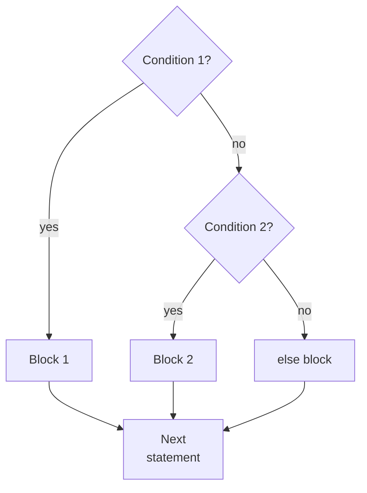

# Branching and pattern matching

## Branching with if, elif, else

The condition after `if` is converted to a Boolean value. A colon begins a block, and indentation defines its boundaries. In an `if`/`elif` chain, only the first branch with a true condition runs. `else` runs if none of the preceding conditions matched (Fig. 2.4).



Figure 2.4. Checking if and elif conditions in sequence {.caption}

Several independent `if` statements may execute several blocks. This is appropriate for independent properties: a number may be both positive and even. Mutually exclusive categories need a single chain. Order thresholds consistently: if you first check `score >= 60`, a later `elif score >= 90` branch will never run for an excellent score.

The conditional expression `a if condition else b` returns a value: `label = "even" if n % 2 == 0 else "odd"`. It is suitable for a short choice, but nested conditional expressions are hard to read. `pass` is an empty statement for a temporary block; it does not end a loop.

### Example. A quadratic equation

Enter finite numeric coefficients `a`, `b`, and `c`. If `a` is zero, the equation is linear or degenerate. Otherwise, calculate the discriminant and real roots. Entering text instead of a number is not handled here.

```py
import math

a = float(input("a: "))
b = float(input("b: "))
c = float(input("c: "))
if not (math.isfinite(a) and math.isfinite(b)
        and math.isfinite(c)):
    print("Coefficients must be finite")
elif a == 0:
    if b != 0:
        print(f"Linear: x = {-c / b:.3f}")
    elif c == 0:
        print("Infinitely many solutions")
    else:
        print("No solutions")
else:
    d = b * b - 4 * a * c
    if not math.isfinite(d):
        print("Coefficients are too large")
    elif d < 0:
        print("No real roots")
    elif d == 0:
        print(f"x = {-b / (2 * a):.3f}")
    else:
        root = math.sqrt(d)
        print(f"x1 = {(-b - root) / (2 * a):.3f}")
        print(f"x2 = {(-b + root) / (2 * a):.3f}")
```

For input `1`, `-3`, `2`, the program prints `x1 = 1.000` and `x2 = 2.000`. Separately test `1, 2, 1`, `1, 0, 1`, `0, 2, -4`, `0, 0, 0`, and `0, 0, 1`. These data sets cover different branches.

Comparing an entered coefficient exactly to zero is a deliberate choice here. For arbitrary measured coefficients, a discriminant near zero requires a justified tolerance. The direct formula may also lose precision when subtracting close numbers. This is a learning algorithm for moderate coefficients, rather than a universal numerical solver.


Figure 2.5. Entering coefficients and viewing roots in the Run window {.caption}

## Structural pattern matching with match

`match` evaluates a value and checks `case` patterns from top to bottom. The first matching block runs. There is no automatic fall-through to the next block, so `break` is not needed between branches. A vertical bar `|` combines alternative patterns; `_` matches any value without storing it in a variable.

A bare name in a pattern is a **capture** (*capture*), rather than a comparison with a previously created variable. Thus, `case command:` accepts any value. A text command needs quotes: `case "sum":`. A *guard* after `if` is checked after the pattern matches. If it is false, matching continues. Introduction: <https://peps.python.org/pep-0636/>.

### Example. A calculator menu

The commands `+`, `add`, `/`, and `div` specify an operation; `0` or `exit` ends the program. Operands are entered on separate lines in numeric format. The user should know this contract before starting the loop.

```py
import math

while True:
    command = input("Operation (+, /, 0): ").strip()
    if command == "0" or command == "exit":
        break
    if command not in ("+", "add", "/", "div"):
        print("Unknown command")
        continue
    a = float(input("a: "))
    b = float(input("b: "))
    if not (math.isfinite(a) and math.isfinite(b)):
        print("Finite numbers are required")
        continue
    match command:
        case "+" | "add":
            print(f"Result: {a + b:.2f}")
        case "/" | "div" if b != 0:
            print(f"Result: {a / b:.2f}")
        case _:
            print("Division by zero is not allowed")
```

A session with command `add`, numbers `2` and `3`, and then command `0` includes `Result: 5.00`. The `div` command with `2` and `0` produces a division-by-zero message and returns to the menu. The tuple in the `not in` check is used here only as a compact list of commands; collections will be studied in detail later.
