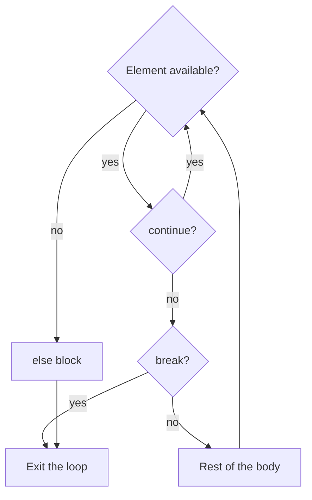

# Loops and common algorithms

## while and for loops

`while` repeats a block while its condition is true. The condition is checked before each iteration, so the body may never run. You must ensure a state change that leads to termination. If a counter is not incremented, the condition may remain true forever.

`for` iterates over the elements of a sequence. For an integer range, use `range(start, stop, step)`. The `stop` endpoint is excluded. The step cannot be zero. `range(5)` specifies 0, 1, 2, 3, 4, while `range(5, 0, -2)` specifies 5, 3, 1. The `range` object itself does not create a list of all these numbers in memory.

```py
total = 0
for number in range(1, 6):
    total += number
print("Sum:", total)

number = 5
while number > 0:
    print(number, end=" ")
    number -= 2
print()
```

The output is `Sum: 15` and the line `5 3 1`. Notice the final `print()`: it ends the line after several calls with `end=" "`. A nested loop completes an entire inner pass for each iteration of the outer loop.

### break, continue, and loop else

`break` ends the nearest loop, while `continue` moves to the next iteration. In a `while` loop, you often need to update the counter before `continue`; otherwise, the program will repeat the same check. In a `for` loop, the loop itself retrieves the next element.

A loop's `else` block runs after a `for` loop normally exhausts its elements or a `while` condition becomes false. It is skipped after `break`. This does not mean “the loop ran at least once”: `else` also runs for an empty range. Exiting through an exception or `return` does not run this block either. Figure 2.6 shows an ordinary `for` loop.



Figure 2.6. Execution paths through a loop, continue, break, and else {.caption}

### Example. Guess the number

The computer chooses an integer from 1 to 20. The user has five attempts; an invalid format or an out-of-range number does not use an attempt. For automated checking, you can replace the selection below with `secret = 7`.

```py
import random

secret = random.randint(1, 20)
attempts = 0
while attempts < 5:
    text = input("Number 1..20: ").strip()
    if not (1 <= len(text) <= 2 and text.isascii()
            and text.isdecimal()):
        print("Enter one or two digits")
        continue
    guess = int(text)
    if not 1 <= guess <= 20:
        print("Number out of range")
        continue
    attempts += 1
    if guess == secret:
        print(f"Guessed on attempt {attempts}")
        break
    print("Higher" if guess < secret else "Lower")
else:
    print(f"No attempts left. Number: {secret}")
```

For the reference secret 7 and inputs `5`, `10`, `7`, the messages are `Higher`, `Lower`, and `Guessed on attempt 3`. Five unsuccessful valid attempts execute `else`. During a normal game, the specific number and sequence of hints may differ.

## Common loop algorithms

An **accumulator** starts with an identity element: 0 for a sum, 1 for a product. A **counter** increases only when the required condition holds. A **flag** stores a yes/no answer, such as whether a violation was found. Variable names should reflect these roles.

Do not initialize a minimum to zero without justification: all entered numbers may be positive. Use the first value or `None`. The complete example below reads three correctly formatted integers without storing the entire series in a collection.

```py
minimum = None
total = 0
positive_count = 0
for index in range(3):
    value = int(input(f"Number {index + 1}: "))
    total += value
    if minimum is None or value < minimum:
        minimum = value
    if value > 0:
        positive_count += 1
print("Minimum:", minimum)
print("Mean:", total / 3)
print("Positive:", positive_count)
```

For `4`, `-2`, `7`, the minimum is -2, the mean is 3.0, and there are two positive numbers. In the minimum check, short-circuit evaluation of `or` prevents comparing a number with `None` on the first iteration.

### Euclid's algorithm

For nonnegative integers `a` and `b`, the GCD does not change when the pair is replaced with `b` and `a % b`. The second component decreases until it reaches zero. Multiple assignment first evaluates the right side using the old values, then binds the names to the new ones.

```py
a = 84
b = 30
while b != 0:
    a, b = b, a % b
print("GCD:", a)
```

The output is `GCD: 6`. The sequence of pairs is `(84, 30)`, `(30, 24)`, `(24, 6)`, `(6, 0)`. For negative inputs, first take `abs`. If the LCM is needed, for nonzero numbers it is convenient to calculate `abs(a // gcd * b)`. Handle the zero case separately before division.

### Prime numbers and nested loops

A prime number is an integer greater than 1 with exactly two positive divisors. The number 1 is not prime. To test a number `n`, it is enough to look for a divisor up to and including its square root: a larger divisor would have a smaller paired divisor. `math.isqrt(n)` returns the exact integer square root for a nonnegative integer, avoiding `float` errors.

In nested loops, `break` exits only the inner loop. This lets you stop checking one composite number while continuing to iterate over the entire range. A complete example is given in the lab. Control flow description: <https://docs.python.org/3.14/tutorial/controlflow.html>.

## Checking a program and common mistakes

Checking means comparing the actual result with the expected one. `Process finished with exit code 0` means normal termination, but does not prove that a formula is correct. For each branch, choose an example that executes it. For a loop, test zero, one, and several iterations, as well as exiting through `break` and completing with `else`.

In PyCharm, **Ctrl+Alt+L** formats code. Inspections highlight suspicious code and style violations; **Alt+Enter** opens suggested actions. Do not apply fixes mechanically: read which construct they change. An inspection does not replace running the program with data.

::: info Screenshot
Editor: MyVar=5 and if MyVar==1 : followed by an indented print. Show inspection tooltip and Problems.
:::

Figure 2.7. Spacing and naming suggestions in PyCharm {.caption}

Table 2.2. Errors and ways to check them {.caption}

| **Problem** | **How to fix it** |
| --- | --- |
| Getting `55` instead of 10 | Convert the result of `input` to a number before adding |
| A branch never runs | Check the order of thresholds and the difference between `if` and `elif` |
| A loop does not terminate | Check that the counter changes before `continue` |
| The last number is missing | Account for the exclusive endpoint of `range` |
| Incorrect minimum | Initialize with the first value or `None` |
| Equal numbers give `False` | Distinguish `is`, `==`, and approximate comparison |
| Indentation error | Four spaces, with statements in a block at the same level |

Before the defense, make an “input – expected – actual result” table. Check both sides of rate and grade boundaries, zero values, and impossible geometric data. Test random programs using a reference state or a fixed secret, then restore normal mode. Do not include random object addresses or machine-dependent identifiers in tests.
