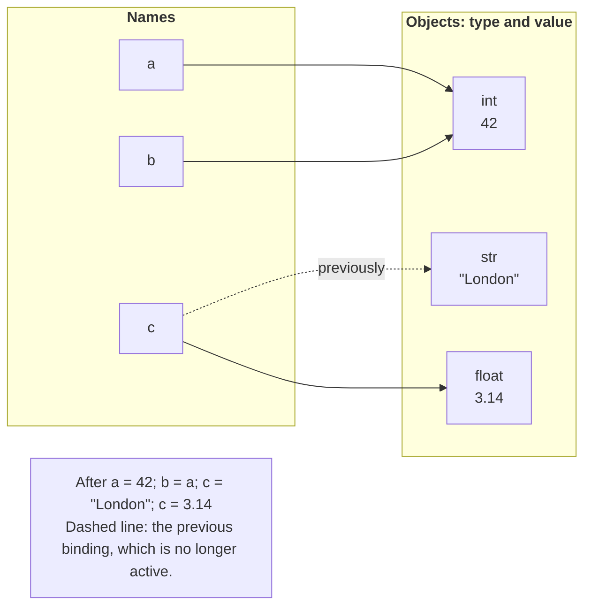
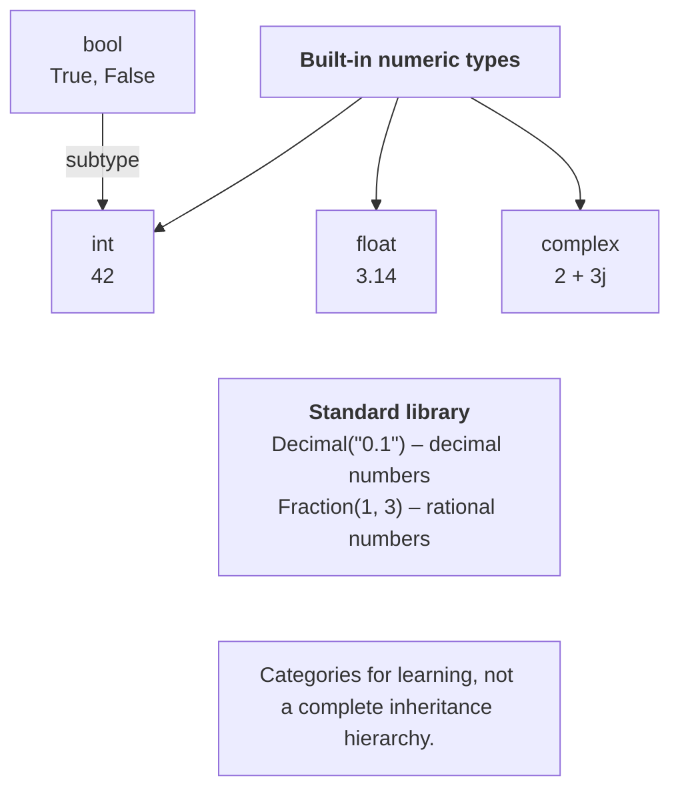

# Objects, names, and data types

## Objects, names, and dynamic typing

A program processes **objects** (*objects*). Each object has a type, a value, and an identity. The type determines the permitted operations: numbers can be added, and strings can be concatenated. A **name** (*name*) is bound to an object during assignment. `count = 5` does not declare a storage cell that permanently has type `int`: it binds the name `count` to an integer.

**Dynamic typing** means that object types are checked at runtime. In a later assignment, the same name may refer to a string. The language permits this, but it often makes the program harder to understand. A variable representing the number of students should remain an integer throughout the algorithm.

```py
a = 42
b = a
c = "London"
c = 3.14
print(type(a).__name__, type(c).__name__)
print(a == b, a is b)
```

The output is `int float`, followed by `True True` on the next line. The assignment `b = a` created another binding to the same object (Fig. 2.1). It does not copy the object. After `a = 43`, the name `b` will still refer to 42: integers are immutable, and assignment only changes a name's binding.



Figure 2.1. Names and objects after reassignment {.caption}

The `type(x)` function returns an object's type, while `id(x)` returns an integer identifying the object during its lifetime. An `id` is not a variable's sequence number and should not be part of a test's expected result. It may change between runs; after an object is deleted, its identifier may be reused.

The `==` operator compares values, while `is` compares object identities. For numbers and text, you usually need `==`. Do not test `score is 100`: possible object reuse by the interpreter is not a rule of your algorithm. For the special value `None`, the convention is `x is None`.

Python does not automatically add a string to a number: `"5" + 2` raises `TypeError`. Choose the meaning explicitly: `int("5") + 2` gives 7, whereas `"5" + str(2)` gives the string `"52"`. This absence of arbitrary implicit conversions is what is meant by calling Python strongly typed.

### Names and style

An identifier cannot start with a digit, contain spaces, or be a keyword. Case matters: `total` and `Total` are different names. Use English names such as `student_count`, `unit_price`, and `is_ready`. By convention, constants are written as `MAX_ATTEMPTS`; this is a style rule, rather than a prohibition on changing the value. Do not name variables `str`, `sum`, or `input`, to avoid shadowing useful built-in functions.

The `keyword` module contains `kwlist` and `softkwlist`. The words `match` and `case` are soft keywords: they have a special meaning in particular contexts. Advice on naming and four-space indentation: <https://peps.python.org/pep-0008/>.

## Numeric types and precision

The built-in numeric types are `int`, `float`, and `complex`; `bool` is a subtype of `int`. Figure 2.2 shows a teaching classification, rather than the abstract class hierarchy in the `numbers` module. In particular, `Decimal` should not be incorrectly drawn as a subclass of `float`.



Figure 2.2. Built-in and additional numeric types {.caption}

`int` stores arbitrary-precision integers within available memory. `2 ** 100` is calculated exactly. Underscores are allowed for readability: `1_000_000`. The literals `0b1010`, `0o12`, and `0xA` represent the same decimal number 10 in different numeral systems.

In a regular CPython build, `float` uses double-precision binary representation. The number `0.5` is represented exactly, but decimal `0.1` is approximate. Not every large integer can be stored in a `float` without loss. For an exact counter or identifier, use `int`, not `float`.

```py
import math

value = 0.1 + 0.2
print(value)
print(value == 0.3)
print(math.isclose(value, 0.3))
print(math.isclose(1e-12, 0.0, abs_tol=1e-9))
```

Output:

```
0.30000000000000004
False
True
True
```

`math.isclose` checks closeness using relative and absolute tolerances. Near zero, a positive `abs_tol` is usually needed. Choose the tolerance based on the problem and measurement units, rather than copying an arbitrary constant. Formatting with `.2f` hides extra digits when printing, but does not change how the number is stored.

The values `float("inf")` and `float("nan")` are also permitted. For physical quantities, check `math.isfinite(x)`. `nan` is not equal even to itself, so a single `x <= 0` check will not reject every unsuitable value.

`complex` has real and imaginary parts: `z = 2 + 3j`, `z.real`, `z.imag`. Arithmetic and equality are defined for complex numbers, but ordering with `<` or `>` is not. You can calculate the square root of a negative number with `cmath.sqrt`; `math.sqrt` works with real numbers and rejects a negative argument.

`bool` has two values: `True` and `False`. In a numeric context, they behave like 1 and 0. However, a flag such as `is_valid` should be used as a logical value, rather than an unexplained hidden counter.

### Decimal and Fraction

For money, you can store integer kopiykas or use `Decimal`. Create decimal numbers from strings: `Decimal("0.1")`. The constructor `Decimal(0.1)` carries over the existing binary approximation. Decimal operations also depend on the context's precision; a repeating fraction does not become exact simply by changing its type.

`Fraction(1, 3)` from the `fractions` module stores a rational number as a fraction. It is useful for exact ratios of integers. Both types belong to the standard library, so there is no need to install them with pip. Type descriptions: <https://docs.python.org/3.14/library/stdtypes.html>.

## Strings, None, and conversions

`str` is an immutable sequence of Unicode characters. The quotes in `'London'` and `"London"` are equivalent. The string `"\n"` contains a newline character, and `"\\"` represents a single backslash. There is no separate character type: `"A"` is also a string. Strings will be covered in detail in Topic 6.

`None` represents the absence of a result. It differs from zero and an empty string. For example, the minimum of a series that has not yet been entered can initially be marked `None`; zero could be an actual result.

Table 2.1. Examples of explicit conversions {.caption}

| **Expression** | **Result** | **Explanation** |
| --- | --- | --- |
| `int("12")` | `12` | The string contains an integer |
| `int(-3.9)` | `-3` | Truncating the fractional part toward zero |
| `float("12.5")` | `12.5` | A decimal point, not a comma |
| `str(12)` | `"12"` | Text representation |
| `bool(0)` | `False` | Zero is falsy |
| `bool("False")` | `True` | A nonempty string is truthy |

`int("12.5")` will not convert a decimal string into an integer. Do not silently use `int(float(text))` when the task specifically requires an integer: this can hide invalid input. First define the valid input format, then perform the appropriate conversion.

**Truthiness** (*truthiness*) allows values to be used in conditions. `None`, `False`, numeric zeros, and empty strings and collections are falsy. The strings `"0"`, `"False"`, and `" "` are truthy. To check for the answer “yes”, compare the text, for example `answer.strip().lower() == "yes"`.
