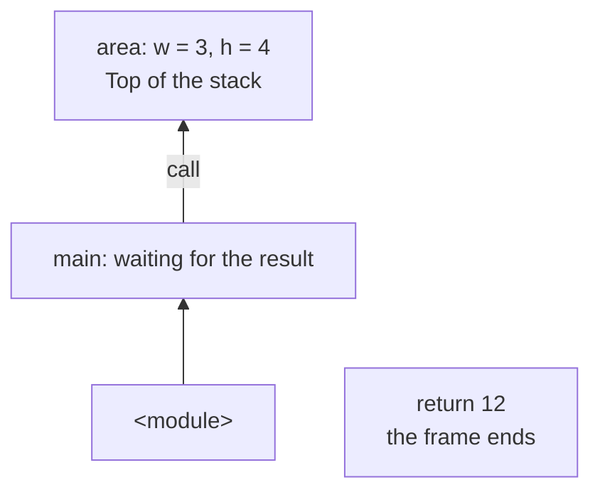

# Function definitions and arguments

## Definition, call, and result

The `def` statement creates a function object and binds it to a name. The indented body runs during a **call** (*call*), rather than during definition. Names in the header are called **parameters** (*parameters*); the specific values in a call are **arguments** (*arguments*). Official introduction: <https://docs.python.org/3.14/tutorial/controlflow.html#defining-functions>.

```py
def area(width: float, height: float) -> float:
    """Return the area of a rectangle."""
    return width * height


result = area(3.0, 4.0)
print(f"Area: {result:.1f}")
print(area(2.5, 2.0))
```

```
Area: 12.0
5.0
```

`: float` describes the expected parameter type, while `-> float` describes the result type; annotations are covered in more detail below. They do not change multiplication. `return` immediately ends the current call and passes a value back to the expression that called it. Lines after an executed `return` do not run on that path.

In Fig. 3.1, the function frame contains its local names. After the area is returned, execution continues at the call site. A new call receives its own local name bindings.



Figure 3.1. Nested call frames {.caption}

### `return`, `print`, and `None`

`print` displays text, while `return` returns an object. These actions can be combined, but they are not the same. A function without `return`, or with `return` without an expression, returns `None`. This is a distinct value meaning “no result”, rather than zero or an empty string.

```py
def show_total(total: int) -> None:
    print("Total:", total)


answer = show_total(12)
print(answer)
```

```
Total: 12
None
```

If the sum must later be compared or written to a report, the calculation function should return it. Leave output to the call site. Do not check for a missing numeric result with `if not result`: a valid zero would also be treated as missing. For the sentinel value, use `result is None`.

### Multiple results and collection basics

A **tuple** (*tuple*) contains ordered elements. `return low, high` actually returns one tuple. It can be unpacked into two variables: the variable count must match the element count. A **list** (*list*) is also ordered, but its contents can change. `items[0]` reads the first element, `len(items)` gives the count, and `append` adds an element. A **dictionary** (*dict*) maps a key to a value: `{"tea": 25.0}`. Detailed collection operations are covered in Topic 5.

```py
def bounds(a: int, b: int) -> tuple[int, int]:
    return min(a, b), max(a, b)


low, high = bounds(9, 2)
print(low, high)
prices: dict[str, float] = {"tea": 25.0}
values: list[int] = [low, high]
values.append(12)
print(prices["tea"], values)
```

```
2 9
25.0 [2, 9, 12]
```

### Contracts and docstrings

A **contract** describes valid input, the result, and side effects. An `int` annotation does not say whether negative numbers are allowed, so describe the range in words. The first statement in the body, if it is a string literal, becomes the **documentation string** (*docstring*). It is available through `function.__doc__`, `help(function)`, and IDE hints. Recommendations: <https://peps.python.org/pep-0257/>.

A short sentence is enough for a single operation. For a more complex function, add units, limits, precision, and how a missing result is represented. Do not restate every statement in the documentation: explain what the function promises its user.

## Positional, keyword, and optional arguments

A positional argument matches a parameter by position, while a keyword argument matches by name. A keyword call explains what numbers mean without requiring you to read the body. A default value applies only when the argument is omitted. Passing `None` does not automatically replace it with the default.

```py
def format_price(amount: float, currency: str = "UAH",
                 *, precision: int = 2) -> str:
    """Format an amount; precision is from 0 to 4."""
    return f"{amount:.{precision}f} {currency}"


print(format_price(12.5))
print(format_price(currency="EUR", amount=7, precision=1))
```

```
12.50 UAH
7.0 EUR
```

The `precision` parameter follows `*`, so it must be passed by name. A call with a third positional argument raises `TypeError`. Supplying two values for one parameter, an unknown name, or omitting a required argument is also an error. Positional arguments in an ordinary call come before keyword arguments.

### Default values are evaluated once

A default-value expression runs during `def`. If it is a list, all calls omitting that argument receive the same list. The mistake in the example below is intentional.

```py
def remember(value: int, items: list[int] = []) -> list[int]:
    items.append(value)
    return items


print(remember(4))
print(remember(7))
```

```
[4]
[4, 7]
```

For a new list on every call, use `None` to indicate an omitted argument. The union `list[int] | None` explicitly describes both possibilities. If a caller supplies a list, this contract deliberately allows modifying it.

```py
def remember(value: int,
             items: list[int] | None = None) -> list[int]:
    if items is None:
        items = []
    items.append(value)
    return items


print(remember(4))
print(remember(7))
```

```
[4]
[7]
```

Do not replace the check with `if not items`: an empty list explicitly passed by the caller is also falsy, but it is a different object that this contract requires you to extend.
