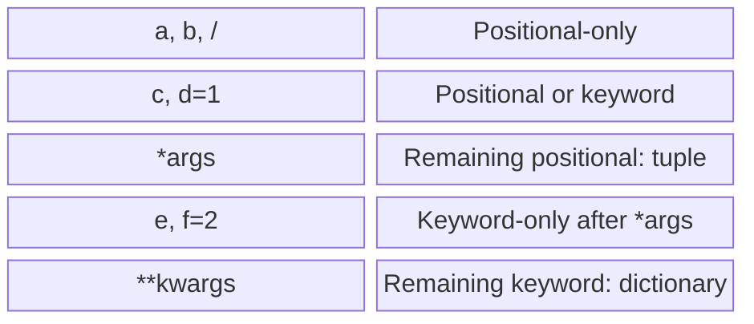

# Parameter kinds and passing objects

## Parameter kinds and unpacking

The `/` marker means that parameters to its left are positional-only. The `*` marker means that parameters to its right are keyword-only. `*args` collects additional positional arguments into a tuple, and `**kwargs` collects additional keyword arguments into a dictionary. The names `args` and `kwargs` are conventions; the asterisks carry the special meaning.



Figure 3.2. Order of parameter groups in a function header {.caption}

In Fig. 3.2, the groups together form the header `def f(a, b, /, c, d=1, *args, e, f=2, **kwargs)`. Among positional parameters, required ones come before those with defaults. Keyword-only parameters do not have this restriction. A bare `*` can replace `*args` if extra positional values do not need to be collected.

```py
def describe(code: str, /, count: int = 1,
             *, unit: str = "pcs") -> str:
    return f"{code}: {count} {unit}"


def total(**prices: float) -> float:
    return sum(prices.values())


position = ("A17", 3)
options = {"unit": "kg"}
print(describe(*position, **options))
print(total(tea=25.0, bread=30.0))
```

```
A17: 3 kg
55.0
```

In a definition, asterisks **collect**; in a call, they **unpack**. Dictionary keys for `**options` must be strings. You cannot pass `unit` twice, for example directly and through a dictionary. Unrestricted `**kwargs` is convenient for a set of products, but for fixed settings, declare exact parameters: the IDE can then catch a typo.

### Example 1. Grade statistics

Find the mean and number of grades, optionally removing one lowest grade. Accept finite grades from 0 to 100 and precision from 0 to 4; an empty set after removal means no result. Keyword-only parameters make the call readable.

```py
from math import isfinite


def grade_stats(*grades: float, precision: int = 2,
                drop_lowest: bool = False
                ) -> tuple[float, int] | None:
    """Mean and count; None for an invalid set."""
    if not grades or not 0 <= precision <= 4:
        return None
    values = list(grades)
    for grade in values:
        if not isfinite(grade) or not 0 <= grade <= 100:
            return None
    if drop_lowest:
        values.remove(min(values))
    if not values:
        return None
    return round(sum(values) / len(values), precision), len(values)


print(grade_stats(60, 80, 100))
print(grade_stats(60, 80, 100, drop_lowest=True))
print(grade_stats(60, drop_lowest=True))
```

```
(80.0, 3)
(90.0, 2)
None
```

`list(grades)` creates a separate list; `remove` removes only the first occurrence of the minimum. Thus, when two lowest grades are equal, only one is removed. Rounding changes the result, rather than the number of printed decimal places. You can separately display `80.0` as `80.00` using formatting.

## Passing objects and pure functions

A parameter becomes a local name for the passed object. Python does not automatically copy an entire list. Reassigning a parameter changes its local binding, while changing an element of a shared list is visible outside. Thus, “numbers are passed by value, lists by reference” is imprecise: the binding rule is the same; mutability differs.

```py
def change(number: int, values: list[int]) -> None:
    number = number + 1
    values.append(number)
    values = [99]


n = 4
items = [1]
change(n, items)
print(n, items)
```

```
4 [1, 5]
```

A **side effect** (*side effect*) is an externally visible action other than returning a result: modifying a list, printing, reading input, or changing global state. A **pure function** returns the same result for the same data and has no side effects. Such a function is easy to test without a keyboard and reuse in another interface.

When decomposing a program, separate reading, validation, calculation, and formatting. You do not need a function for every statement. A good boundary is a complete rule with a short contract, such as “convert meters to kilometers” or “find an index in a sorted list”. A name such as `process` without qualification usually hides too many different responsibilities.
