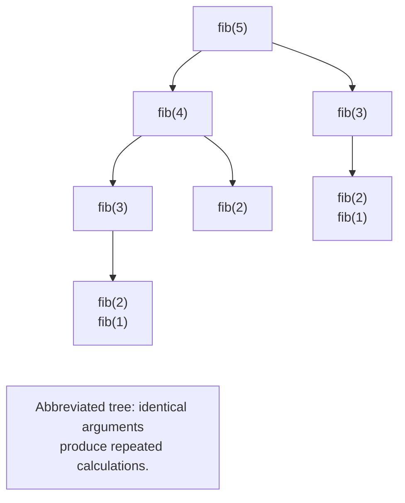

# Recursion and the call stack

## Recursion and the call stack

**Recursion** (*recursion*) is a function calling itself directly or through other functions. It requires a base case without a recursive call and a step that brings the argument closer to it. For factorial, the base is `0! = 1`, and the step `n! = n · (n − 1)!` is defined for nonnegative integers. Checking only `n == 0` does not protect against `n = -1`.

```py
def factorial(n: int) -> int | None:
    """Factorial for 0 <= n <= 100; otherwise None."""
    if not 0 <= n <= 100:
        return None
    if n == 0:
        return 1
    previous = factorial(n - 1)
    if previous is None:
        return None
    return n * previous


print(factorial(0), factorial(5), factorial(-1))
```

```
1 120 None
```

For `factorial(3)`, calls with arguments 3, 2, 1, 0 first accumulate. Results then return in reverse order: 1, 1, 2, 6. Each frame remembers its own `n` and unfinished multiplication. This requires memory proportional to the depth.

`sys.getrecursionlimit()` returns the current interpreter stack depth limit. Do not treat its value as a universal constant. Excessive call depth raises `RecursionError`; increasing the limit does not fix an algorithm without a base case. Python does not guarantee tail-call optimization. Choose a loop for a long linear traversal. Reference: <https://docs.python.org/3.14/library/sys.html#sys.getrecursionlimit>.

::: info Screenshot
PyCharm Run. Intentionally broken factorial(-1); capture actual traceback.
:::

Figure 3.4. Diagnosing unbounded recursion {.caption}

### GCD and binary search

Euclid's algorithm replaces the pair `(a, b)` with `(b, a % b)` until the second number is zero. For nonnegative arguments, the remainder is smaller than the divisor, so this moves toward the base case. Binary search instead halves a sorted interval; its precondition is nondecreasing order.

```py
def gcd(a: int, b: int) -> int:
    a, b = abs(a), abs(b)
    if b == 0:
        return a
    return gcd(b, a % b)


def search(items: list[int], target: int,
           left: int, right: int) -> int | None:
    """Search the half-open interval [left, right)."""
    if left >= right:
        return None
    middle = (left + right) // 2
    if items[middle] == target:
        return middle
    if items[middle] < target:
        return search(items, target, middle + 1, right)
    return search(items, target, left, middle)


values = [2, 5, 8, 11, 14]
print(gcd(84, 30))
print(search(values, 11, 0, len(values)))
print(search(values, 9, 0, len(values)))
```

```
6
3
None
```

The search excludes the right endpoint. The discarded middle element must not remain in the next search, or the length might not decrease. For repeated values, this algorithm returns any index it finds, not necessarily the first. Here, `gcd(0, 0)` is 0 by programming convention.

### Example 3. Towers of Hanoi

You can move `n` disks from rod A to C using B in three steps: move `n − 1` disks to B, move the largest to C, and move the smaller tower from B to C. A larger disk cannot be placed on a smaller one. Zero disks require no moves.

```py
def hanoi(n: int, source: str, target: str,
          spare: str, depth: int = 0) -> tuple[int, int]:
    """For 0 <= n <= 10: print moves and return their count."""
    if n == 0:
        return 0, depth
    left, d1 = hanoi(n - 1, source, spare, target, depth + 1)
    print(f"{source} -> {target}: {n}")
    right, d2 = hanoi(n - 1, spare, target, source, depth + 1)
    return left + 1 + right, max(d1, d2)


moves, depth = hanoi(2, "A", "C", "B")
print("Moves:", moves, "Depth:", depth)
```

```
A -> B: 1
A -> C: 2
B -> C: 1
Moves: 3 Depth: 2
```

We measure depth as the number of recursive transitions from the initial call, so it equals `n`. This is not the process's total frame count. The number of moves `2 ** n - 1` grows rapidly: depth is small, but the output can already be enormous. The contract limits `n` to 10; an input interface must check the bounds before calling. The function has a deliberate side effect: printing moves.

## Recursion, iteration, and repeated calculations

Fibonacci numbers are defined by the bases `F(0) = 0`, `F(1) = 1`, and the sum of the two preceding numbers. A direct translation of the formula recomputes identical subproblems (Fig. 3.5). The call count grows much faster than the argument.



Figure 3.5. Repeated subproblems in direct recursion {.caption}

**Memoization** (*memoization*) stores results by arguments. Add the ready-made `functools.cache` with `@cache` before the definition. Decorators are covered in Topic 7; for now, this is a tool you can use directly. Cache keys must be hashable: an ordinary list is unsuitable. The cache is unbounded and retains data until cleared. <https://docs.python.org/3.14/library/functools.html#functools.cache>.

```py
from functools import cache


@cache
def fib(n: int) -> int:
    """Fibonacci number for an integer 0 <= n <= 100."""
    if n < 2:
        return n
    return fib(n - 1) + fib(n - 2)


def fib_loop(n: int) -> int:
    a, b = 0, 1
    for _ in range(n):
        a, b = b, a + b
    return a


print(fib(10), fib_loop(10))
print(fib.cache_info().misses)
fib.cache_clear()
```

```
55 55
11
```

Eleven different arguments, from 0 to 10, were calculated once each. Caching does not eliminate recursion depth. Iteration stores only two neighboring numbers and spends no memory on call frames. For a learning comparison, count calls; a single timing measurement depends on the environment and a warmed cache and does not establish algorithmic complexity.

### Example 4. Fast exponentiation

For a nonnegative integer exponent, it is enough to calculate the half power once. For even `n`, the result is the square of that half power; for odd `n`, multiply by the base as well. The function returns the value and call count, including the base call.

```py
def fast_power(base: int, exponent: int) -> tuple[int, int]:
    """Power for 0 <= exponent <= 10000 and the call count."""
    if exponent == 0:
        return 1, 1
    half, calls = fast_power(base, exponent // 2)
    result = half * half
    if exponent % 2:
        result *= base
    return result, calls + 1


value, calls = fast_power(3, 13)
print(value, calls)
print(value == 3 ** 13)
print(fast_power(0, 0))
```

```
1594323 5
True
(1, 1)
```

The exponents follow 13, 6, 3, 1, 0. Two independent calls for the half power would destroy the algorithm's advantage: store `half` and use it twice. By a convention consistent with Python, the zeroth power, including `0 ** 0`, equals 1. A negative exponent is outside the contract; it requires different handling and a different result type. Large integers have arbitrary precision, but multiplying large numbers is not a constant-time operation.
