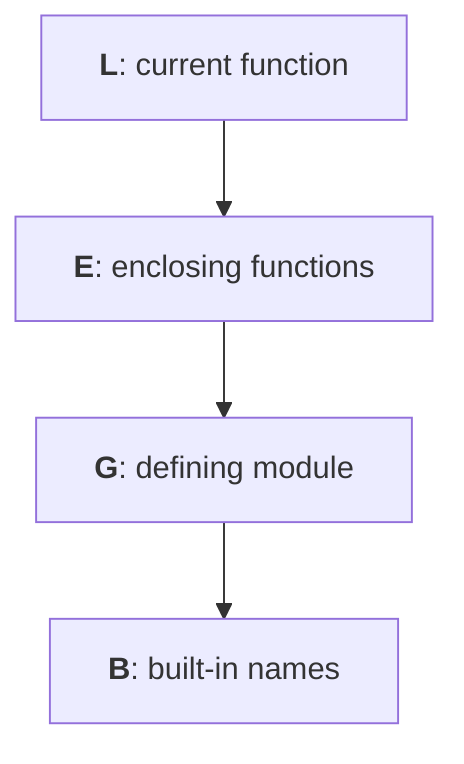

# Functions as values and scope

## Functions as values and scope

A function name without parentheses refers to an object; with parentheses, it makes a call. You can assign the object to a variable, pass it to another function, or return it. The annotation `Callable[[int], int]` describes a function with one integer argument and an integer result. In this topic, we use ordinary named functions; lambda expressions are covered in Topic 7.

```py
from collections.abc import Callable


def square(value: int) -> int:
    return value * value


def apply_twice(action: Callable[[int], int], value: int) -> int:
    return action(action(value))


operation = square
print(operation(3))
print(apply_twice(square, 2))
```

```
9
16
```

Passing `square(2)` instead of `square` would pass the number 4, which cannot be called. The contract of a function argument matters: not every function with one argument is suitable for repeated application. Its result must be valid input for the next call.

### The LEGB rule

For an ordinary name lookup inside a function, Python searches the local scope (**Local**), then enclosing functions (**Enclosing**), the module where it is defined (**Global**), and built-in names (**Built-in**). Figure 3.3 shows the order. A `for` loop or `if` branch does not create a separate local scope. Execution rules: <https://docs.python.org/3.14/reference/executionmodel.html>.



Figure 3.3. Name lookup from the local scope outward {.caption}

If a name is assigned in the body, it is usually local throughout that body. Reading it before the first local assignment raises `UnboundLocalError`, even if a name with the same spelling exists in the module. This rule is determined by the function's structure, rather than whether a particular `if` branch ran.

```py
limit = 10


def local_limit() -> int:
    limit = 3
    return limit


print(local_limit(), limit)
```

```
3 10
```

`global name` specifies that assignment changes the name in the module. `nonlocal name` refers to an existing name in the nearest appropriate enclosing function. It does not create a new global variable. These declarations are not needed to read an outer value. Mutable global state makes isolated testing harder; it is usually simpler to pass a value as a parameter and return a new one.

### Example 2. A visit counter

A **closure** (*closure*) is a function that retains access to names in an enclosing function after that function's call has ended. Let's create two independent counters. The inner function changes `count`, so `nonlocal` is needed. The initial value may be any integer.

```py
from collections.abc import Callable


def make_counter(start: int = 0) -> Callable[[], int]:
    count = start

    def visit() -> int:
        nonlocal count
        count += 1
        return count

    return visit


museum = make_counter()
library = make_counter(10)
print(museum(), museum(), library(), museum())
print(museum.__closure__ is not None)
```

```
1 2 11 3
True
```

Each factory call creates a separate `count` cell. The `__closure__` object lets you inspect these cells, but application code should not modify them manually. A closure retains a connection to a cell, rather than automatically taking an immutable snapshot of its value. This explains the unexpected behavior of functions created in a loop with a shared variable; a simple solution is to call a factory separately for each required state.
