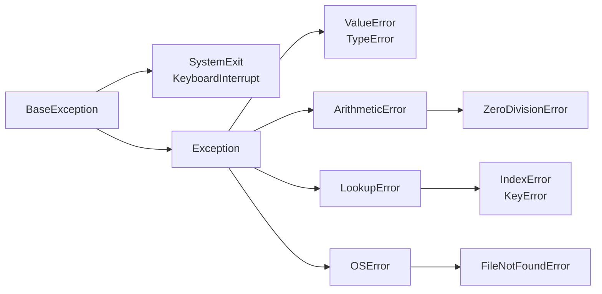

# Error types and the exception hierarchy

## Error types and diagnostic reports

A **syntax error** (*syntax error*) violates the language's grammar. If a colon is missing after `if`, the interpreter cannot execute the file. A **runtime error** (*runtime error*) occurs during a syntactically valid operation, such as `int("abc")`. A **logic error** (*logic error*) does not necessarily raise an exception: dividing the sum of grades by the wrong student count produces an ordinary number.

An **exception** (*exception*) is an object describing an abnormal end to an operation. If there is no suitable handler, execution stops and the interpreter prints a **traceback**, the call path to the error. Start reading at the last line: the exception type and message. Then find the last frame belonging to your program and inspect the operand values. Description and examples: <https://docs.python.org/3.14/tutorial/errors.html>.

The following program deliberately fails. Its purpose is to provide a small reproducible diagnostic example, rather than hide the problem.

```py
def parse(text: str) -> int:
    return int(text)


def process(text: str) -> int:
    return parse(text)


def main() -> None:
    print(process("abc"))


main()
```

The last line of the report:

```
ValueError: invalid literal for int() with base 10: 'abc'
```

Above it are frames for the module, `main`, `process`, and `parse`. A **frame** (*frame*) contains the context of a particular call: the current line, arguments, and local variables. Underlining in modern tracebacks helps locate part of an expression. A *Did you mean* hint sometimes suggests a similar name, but does not prove the replacement correct. Since Python 3.13, tracebacks may use colors in compatible terminals; color depends on the environment and does not change the error's meaning.

::: info Screenshot
Run parse/process/main; mark the frame, line, and cause.
:::

Figure 4.1. Call frames and the error cause in the Run window. {.caption}

A syntax error in the file itself usually occurs before its `try` executes, so wrapping the invalid statement in this block will not help. A logic error cannot be fixed by `except` either: you need a reference result, state observation, and a change to the algorithm.

## The built-in exception hierarchy

Exception types form a hierarchy (Fig. 4.2). A handler for a base type also accepts its subclasses. The root is `BaseException`. Ordinary application errors derive from `Exception`; `SystemExit` and `KeyboardInterrupt` belong to another branch. Thus, `except Exception` does not intercept normal termination through `sys.exit` or a user's request to stop the program with Ctrl+C.



Figure 4.2. Part of the hierarchy: arrows lead from a base type to a subclass. {.caption}

`ValueError` means an unsuitable value of an acceptable type, such as a nonnumeric string for `int`. `TypeError` means incompatible types or an incorrect argument count. `ZeroDivisionError` is a subclass of `ArithmeticError`. `IndexError` and `KeyError` belong to `LookupError`: the first concerns a sequence index, and the second a missing key. `FileNotFoundError` specializes `OSError`: a file or path component was not found. Complete hierarchy: <https://docs.python.org/3.14/library/exceptions.html>.

One handler can catch several types. In this course, the main notation follows Python 3.14: `except ValueError, TypeError:`. The unparenthesized list contains **types**, not variable names. If you need the error object itself, write `except (ValueError, TypeError) as error:`. A single type needs no parentheses: `except ValueError as error:`. The traditional `except (ValueError, TypeError):` is also valid and works in older versions. The rule was approved in <https://peps.python.org/pep-0758/>.

```py
for text in ("12", "abc", None):
    try:
        print(int(text))
    except ValueError, TypeError:
        print("Cannot convert to an integer")
```

```
12
Cannot convert to an integer
Cannot convert to an integer
```

The tuple in this example simply holds three test values, and the loop passes each to `int` in turn. `None` means no value; a function annotation does not automatically convert it into a number.
