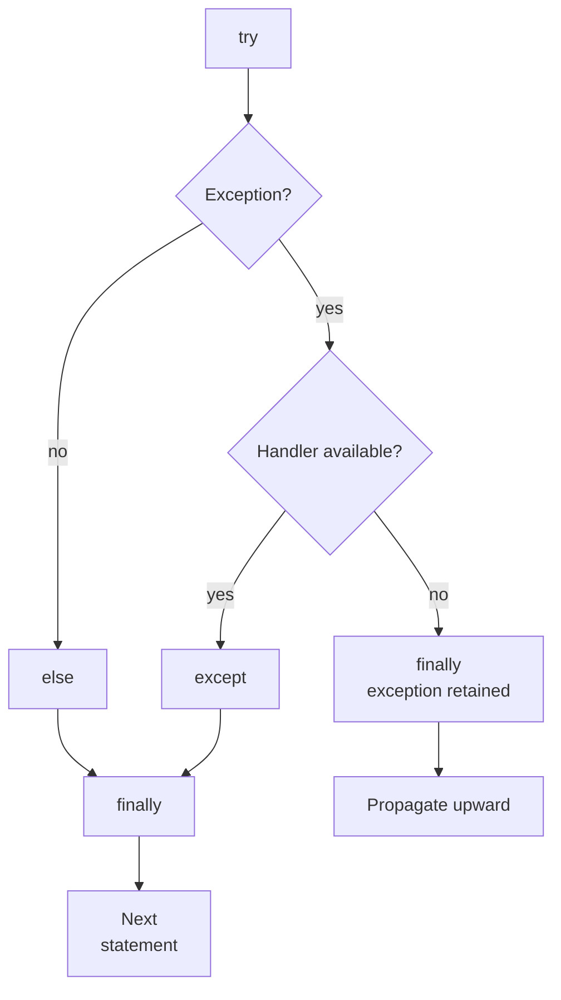
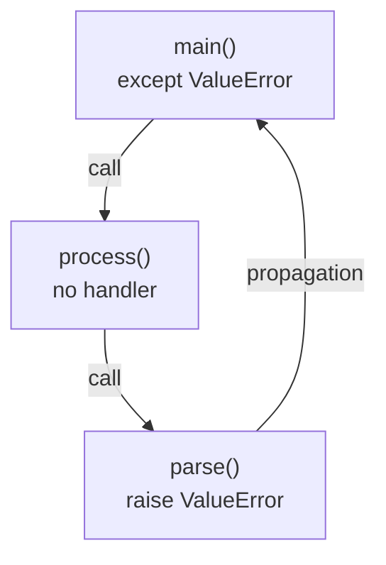

# Handling and raising exceptions

## Execution order of try, except, else, and finally

Place an operation that may raise an expected exception in `try`. When an exception occurs, the rest of that block is skipped. Handlers are checked from top to bottom: only the first matching `except` runs. Put specific types first, then general ones. If `except Exception` comes first, a later `ValueError` handler will never receive an ordinary `ValueError`.

`else` runs after `try` completes normally, without an exception or exit through `return`, `break`, or `continue`. `finally` runs when leaving the construct, including before an unhandled exception propagates. It is a place for cleanup, rather than evidence that an operation succeeded. A process crash or power loss provides no guarantee that cleanup will run.



Figure 4.3. Main try paths when no new errors occur in the supporting blocks. {.caption}

Exceptions raised inside `except` or `else` do not reach sibling handlers in the same construct. `finally` runs, and the search for a handler continues outside. This is why a short `try` helps you understand which operation you have allowed to be retried.

```py
def show_ratio(text: str) -> None:
    try:
        denominator = int(text)
        result = 12 / denominator
    except ValueError as error:
        print("Format:", error.args[0])
    except ZeroDivisionError:
        print("Denominator is zero")
    else:
        print("Quotient:", result)
    finally:
        print("Attempt finished")


show_ratio("3")
show_ratio("0")
```

```
Quotient: 4.0
Attempt finished
Denominator is zero
Attempt finished
```

The `args` attribute is a tuple of arguments passed to the exception constructor; here its first element contains the message. Do not treat message text as a stable error code: it may change between versions. Check the type to choose an action, and define custom codes explicitly. The name after `as` is cleared after the handler; save the necessary data separately if you need it later.

### Example 1. Safe numeric input

Read a participant count from 1 to 30. Invalid input causes another prompt. The `parse_count` function separates the domain rule from the dialogue, making it easy to test without a keyboard. The annotations `str` and `int` describe the contract but do not replace runtime checks.

```py
def parse_count(text: str) -> int:
    value = int(text)
    if not 1 <= value <= 30:
        raise ValueError("count must be from 1 to 30")
    return value


def read_count() -> int:
    while True:
        text = input("Participant count: ")
        try:
            value = parse_count(text)
        except ValueError as error:
            print("Error:", error)
        else:
            return value


print("Accepted:", read_count())
```

For consecutive inputs `0`, `12`:

```
Participant count: 0
Error: count must be from 1 to 30
Participant count: 12
Accepted: 12
```

Also test `abc`, the boundaries `1` and `30`, and `31`. A format error originates in `int`, while a range error originates in our `raise`. Both are handled at the dialogue level. `EOFError` is not caught: the end of input is not another invalid number. In a batch run with no new data, retrying forever would be a bug.

## Raising and propagating exceptions

The `raise` statement makes the current operation terminate exceptionally. `raise ValueError("...")` passes an object with a message. If the function has no suitable handler, the exception moves to its caller. Frames leave the stack in sequence; execution does not return to the line after the failed conversion (Fig. 4.4).



Figure 4.4. The handler in main receives an error raised in parse. {.caption}

A bare `raise` inside a handler propagates the current exception again, preserving its traceback. This is useful when an explanation or cleanup was added locally but a higher level must make the decision. `raise error` raises the same object again, but adds that statement's location to the traceback; prefer a bare `raise` to simply pass on the current error.

When converting a technical error into a domain error, use `raise NewError(...) from error`. The `__cause__` reference retains the explicit cause. If a new exception occurs while handling an old one without `from`, the old one is retained in `__context__`. `from None` hides the automatic context in the standard report, but does not remove it from the object. Hide details only when the end user truly does not need them.

Do not catch an exception merely to print “error” and return `0`. The call then appears successful, and zero may be a valid domain result. Either return a documented result or pass the error to someone who can handle it.
