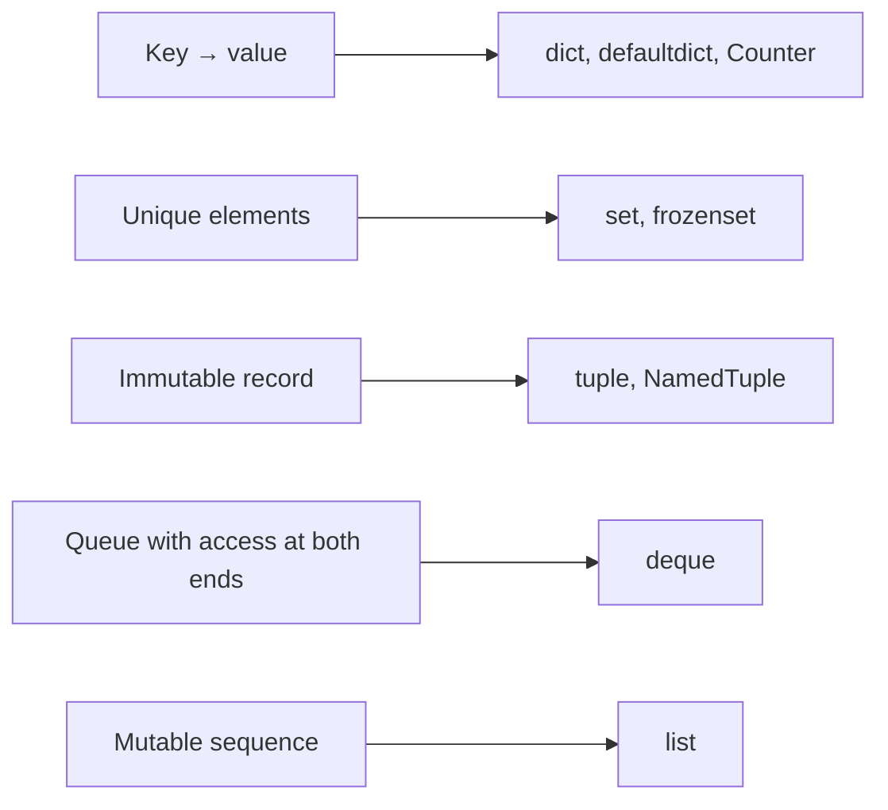

# The collections module and choosing a structure

## Specialized standard library collections

The `collections` module adds structures for recurring tasks: <https://docs.python.org/3.14/library/collections.html>. First, determine the operations and rules of the problem, then choose a specialization of ordinary `list` and `dict`.

### Counter and defaultdict

`Counter` counts occurrences of hashable elements. Indexing a missing key returns 0. `most_common(n)` gives the most frequent elements; equal frequencies preserve the order of first appearance. To break ties alphabetically, sort pairs by `(-count, name)`.

```py
from collections import Counter, defaultdict

counts = Counter(["pen", "book", "pen"])
print(counts.most_common(), counts["ruler"])
counts.subtract({"pen": 4})
print(counts["pen"], dict(+counts))
groups: defaultdict[str, list[str]] = defaultdict(list)
for name, group in [("Anna", "KI-1"), ("Oleh", "KI-1")]:
    groups[group].append(name)
print(dict(groups))
```

```text
[('pen', 2), ('book', 1)] 0
-2 {'book': 1}
{'KI-1': ['Anna', 'Oleh']}
```

`subtract` retains zero and negative counts. The arithmetic operations `+`, `-`, `&`, and `|` on two `Counter` objects retain only positive results; unary `+counts` removes nonpositive counts. Thus, `stock - sold` is unsuitable for finding negative balances: check for shortages before subtraction or use `subtract`.

`defaultdict(list)` calls the `list` factory when `d[key]` accesses a missing key and stores the new list. Pass the function `list`, not the result `list()`. Each new key gets its own list. `d.get(key)` does not call the factory or create a key.

### deque, OrderedDict, and ChainMap

`deque` is a **double-ended queue**. `append` and `pop` operate on the right, while `appendleft` and `popleft` operate on the left. Operations at the ends have approximately constant cost, unlike `list.pop(0)`. `rotate(1)` moves the last element to the beginning; a negative step rotates in the opposite direction. For an empty queue, `pop` and `popleft` raise `IndexError`.

```py
from collections import deque

recent: deque[int] = deque(maxlen=3)
for value in [10, 20, 30, 40]:
    recent.append(value)
print(list(recent))
recent.rotate(1)
recent.appendleft(99)
print(list(recent))
```

Output: `[20, 30, 40]` and `[99, 40, 20]`. With a `maxlen` limit, adding at one end automatically discards elements from the opposite end. This is useful for a history of recent measurements but unsuitable for an order queue where records must not be silently lost. Access to the middle of a `deque` lacks the advantages of an ordinary list.

`OrderedDict` is not needed merely to preserve order: ordinary `dict` already does that. It is useful for reordering with `move_to_end` and removing the oldest entry with `popitem(last=False)`. `ChainMap` combines several dictionaries for lookup without copying: keys are searched from left to right, while writes go to the first dictionary.

```py
from collections import ChainMap, OrderedDict

cache = OrderedDict([("A", 1), ("B", 2)])
cache.move_to_end("A")
print(cache.popitem(last=False))
defaults = {"color": "white", "size": "12"}
local: dict[str, str] = {}
options = ChainMap(local, defaults)
options["size"] = "14"
print(options["color"], local, defaults["size"])
```

Output: `('B', 2)` and `white {'size': '14'} 12`. Changes to an underlying dictionary are visible through `ChainMap` because it is not a snapshot. Do not confuse lookup order with the iteration order of the combined keys.

## Choosing a structure and operation costs

O(n) notation describes how work grows as the number of elements `n` increases, not time in seconds. In a list, indexed access is O(1), an `in` search is O(n), and insertion at the beginning is O(n). Appending is **amortized** O(1): memory expansion is sometimes needed, but the average cost over a long sequence of appends is constant. Copying a list and traversing it fully are O(n).

Lookup in `dict` and `set` is O(1) on average and O(n) in an unfavorable case. This assumes ordinary hashing and comparison costs; long keys also have their own cost. Sorting generally requires O(n log n). For small data sets, correctness and clarity matter more; for large streams, the structure determines performance. An overview for CPython: <https://wiki.python.org/moin/TimeComplexity>.



Figure 5.5. Collections by their primary operation {.caption}

### heapq and bisect

`heapq` maintains a **heap** in an ordinary list: the smallest element is at the beginning, but the entire list is not sorted. `heappush` adds an element, and `heappop` removes the smallest; both operations are O(log n). `heapify` turns an existing list into a heap in O(n). For equal priorities, add an arrival sequence number to preserve order and avoid comparing complex records. <https://docs.python.org/3.14/library/heapq.html>.

`bisect_left` finds an insertion position before equal values in a sorted list in O(log n). `insort` inserts an element while preserving order, but shifting the list costs O(n). A fast search for the position does not make the entire insertion logarithmic. <https://docs.python.org/3.14/library/bisect.html>.

```py
from bisect import bisect_left, insort

scores = [60, 75, 90]
print(bisect_left(scores, 75))
insort(scores, 80)
print(scores)
```

Output: `1` and `[60, 75, 80, 90]`. Do not use `bisect` on an unsorted list: the function does not check this condition and will return a position that lacks the required meaning.
