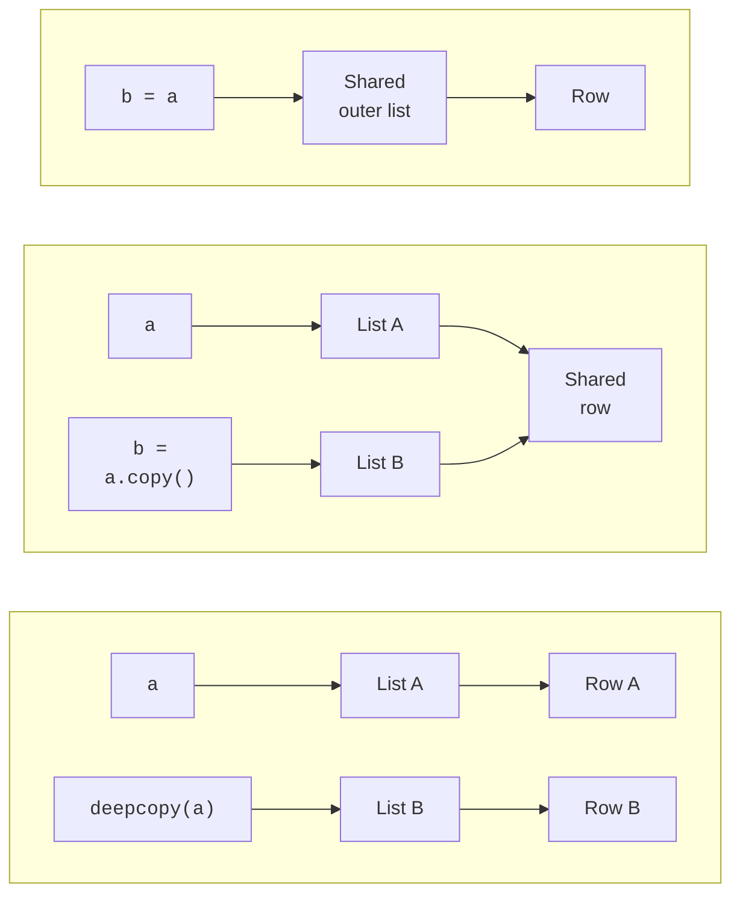

# Comprehensions and tuples

## Comprehensions and two-dimensional lists

A **list comprehension** concisely describes how to build a new list: `[expression for element in source if condition]`. First, an element is taken, then the condition is checked, and the expression is evaluated only for an accepted element. This is convenient for transforming and filtering, but not for hiding printing or data-writing operations.

```py
numbers = [-3, 0, 2, 5]
squares = [x * x for x in numbers if x > 0]
matrix = [[0 for _ in range(3)] for _ in range(2)]
matrix[0][1] = 7
flat = [value for row in matrix for value in row]
print(squares, matrix, flat)
```

Output: `[4, 25] [[0, 7, 0], [0, 0, 0]] [0, 7, 0, 0, 0, 0]`. The underscore `_` is a name for an unused variable here. Read nested `for` clauses from left to right: for each row, iterate over all its values. If a comprehension contains complex checks or more than two nesting levels, ordinary loops are often more readable.

A **two-dimensional list** is a list of rows, each of which is also a list. Python does not guarantee a rectangular shape: `[[1, 2], [3]]` is allowed. A matrix algorithm must check that rows have equal lengths. The expression `[[0] * 3] * 2` does not create two independent rows: the outer repetition copies a reference to the same row twice.

```py
bad = [[0] * 3] * 2
bad[0][1] = 7
print(bad)
print(bad[0] is bad[1])
```

Output: `[[0, 7, 0], [0, 7, 0]]` and `True`. To build a correct matrix, create a new row in each comprehension iteration. Repeating `[0] * 3` within an individual row is acceptable: the number 0 is immutable, and assigning an element changes only the corresponding reference.

### Assignment, shallow copies, and deep copies

`b = a` gives the same list a second name. `a.copy()` and `a[:]` create a **shallow copy**: a new outer list with references to the old elements. `copy.deepcopy(a)` recursively copies nested objects while keeping track of objects already copied (Fig. 5.3). Documentation: <https://docs.python.org/3.14/library/copy.html>.



Figure 5.3. Shared and independent nested objects when copying {.caption}

```py
from copy import deepcopy

a = [[1, 2], [3, 4]]
b = a.copy()
c = deepcopy(a)
b[0][0] = 9
c[1][1] = 8
print(a)
print(b)
print(c)
```

```text
[[9, 2], [3, 4]]
[[9, 2], [3, 4]]
[[1, 2], [3, 8]]
```

For a matrix of immutable numbers, `[row.copy() for row in a]` is sufficient. This is not a general solution for arbitrary nesting depths. Copying a dictionary with `copy()` is also shallow. An independent snapshot of a large state requires additional memory.

## Tuples and unpacking

A tuple is suitable for a record with a fixed set of fields: coordinates, an interval, or a function result. The comma creates the tuple, while parentheses group the expression. `(5,)` is a one-element tuple; `(5)` is a number. An empty tuple is written as `()`.

```py
def bounds(values: list[int]) -> tuple[int, int]:
    if not values:
        raise ValueError("Empty list")
    return min(values), max(values)


first, *middle, last = (2, 4, 6, 8)
low, high = bounds([7, 2, 9])
low, high = high, low
print(first, middle, last)
print(low, high, (5,))
```

Output: `2 [4, 6] 8` and `9 2 (5,)`. **Unpacking** binds elements to names. The star collects the remaining elements into a list, which may be empty. Without a star, the numbers of names and values must match. Returning “two values” actually returns one tuple, which the caller then unpacks.

For `record = ("A", [1, 2])`, calling `record[1].append(3)` is allowed, but `record[0] = "B"` raises `TypeError`. This tuple cannot be used as a dictionary key because the list inside is unhashable.

### Named fields

When `point[0]` is hard to distinguish from `point[1]`, field names make the record clearer. `collections.namedtuple` creates a tuple type with named fields. The `typing.NamedTuple` alternative also supports annotations. Below, `class` only describes the fields of a named record; custom methods and inheritance will be covered later.

```py
from collections import namedtuple
from typing import NamedTuple

Point = namedtuple("Point", "x y")


class Product(NamedTuple):
    name: str
    price: int


point = Point(3, 4)
product = Product("pen", 20)
print(point.x, product.name, product.price)
```

Output: `3 pen 20`. Annotations do not convert values automatically. If a field must be nonnegative, validate it before creating the record. Both approaches preserve tuple properties: indexing, unpacking, and the inability to reassign a field.
