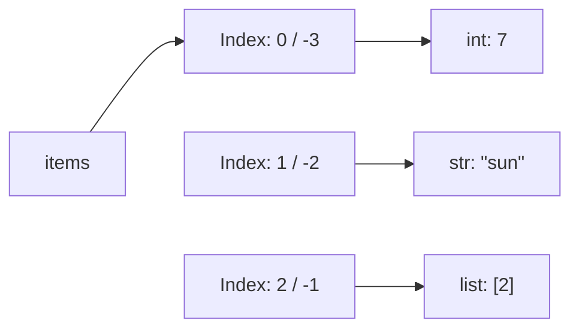
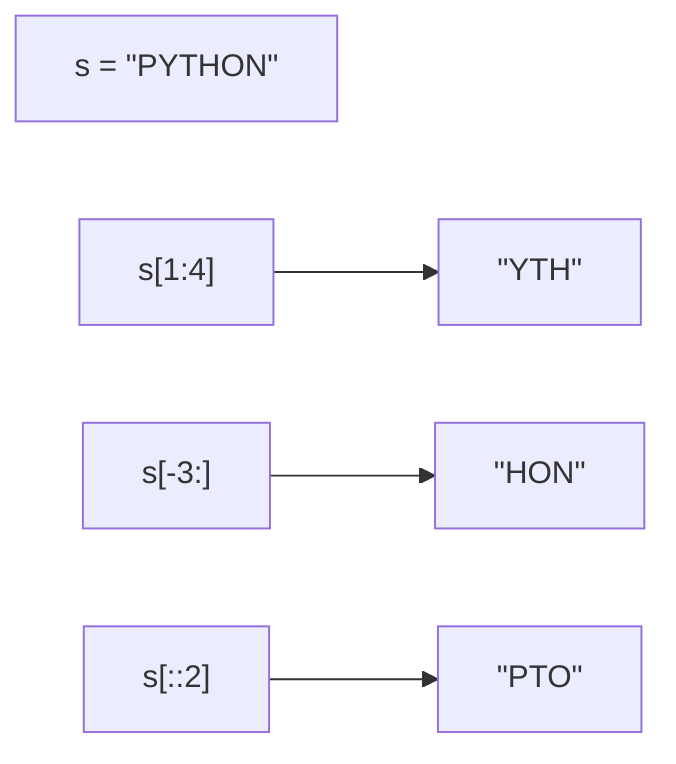

# Sequences and lists

## Why collections are useful

A single variable holding a grade is convenient while a student has only one grade. For ten grades, you should not create ten separate names: the program needs to iterate over them, find the lowest, and calculate the average. A **collection** stores a group of objects and determines how to access them. The choice depends on the operations the program needs.

A **list** is a mutable sequence. A **tuple** is an immutable sequence. A **set** stores unique hashable elements. A **dictionary** maps unique keys to values. For an overview with examples, see <https://docs.python.org/3.14/tutorial/datastructures.html>.

```py
scores: list[int] = [82, 95, 82]
point: tuple[int, int] = (3, 4)
tags: set[str] = {"python", "oop", "python"}
prices: dict[str, int] = {"pen": 20, "book": 150}
print(scores, point)
print(sorted(tags), prices["pen"])
```

Output: `[82, 95, 82] (3, 4)` and `['oop', 'python'] 20`. The list retained duplicates; the set removed the repeated tag. The set was sorted to produce reproducible output. The dictionary answered a query using a meaningful key rather than a position.

**Order** refers to whether a structure has a defined iteration order. Lists and tuples preserve positions; dictionaries preserve key insertion order. Sets do not promise an element order and do not support indexing. Insertion order does not mean sorting by keys.

**Mutability** concerns the object itself. A list allows adding and replacing elements. A tuple does not allow replacing an element, although an object inside a tuple may be mutable. The `list[int]` annotation tells the reader and analyzer that the intent is to store integers; the interpreter does not check it on every addition. Input validation remains the program's responsibility.

### A list contains references

A list stores references to objects (Fig. 5.1). Thus, a single list can technically contain a number, a string, and another list. In an application, a homogeneous `list[int]` is more convenient: every element can be processed in the same way. Assignment does not create copies of objects.



Figure 5.1. List positions and the objects they reference {.caption}

Two elements can reference the same mutable object. This explains unexpected changes in nested lists. Before choosing `copy()`, determine whether you need only a new outer container or independent nested objects as well.

## Sequences: indices and slices

A **sequence** supports access by index. The first index is zero. For a list of length `n`, the last positive index is `n - 1`, and the negative index `-1` denotes the last element. Negative indices do not provide circular access: an index that is too small also raises `IndexError`.

```py
values = [10, 20, 30, 40, 50]
print(values[0], values[-1], len(values))
print(values[1:4], values[-3:], values[::2])
print(values[::-1], values[9:20])
```

```text
10 50 5
[20, 30, 40] [30, 40, 50] [10, 30, 50]
[50, 40, 30, 20, 10] []
```

A **slice** `a[start:stop:step]` selects positions from `start` up to but not including `stop`, with a step of `step`. Omitted bounds depend on the direction of iteration: `a[::-1]` goes from the end to the beginning. A zero step is prohibited. Slice bounds beyond the length are clipped; unlike an individual index, this is not an error. The example in Fig. 5.2 applies the same rules to a string.



Figure 5.2. Slices with an exclusive right bound and different steps {.caption}

The operation `x in values` checks whether a value is present, `+` concatenates sequences of compatible types, and `*` repeats their elements. The functions `sum`, `min`, and `max` work with suitable values. The sum of an empty numeric list is 0, but `min([])` and `max([])` without a fallback value raise `ValueError`. For an empty selection, you can write `min(values, default=None)`. Always check the length before calculating an average.

Lists and tuples are compared lexicographically: the first pair of differing elements is compared first. `(2, 9) < (3, 0)` is true. Elements must support the required comparison: a mixture of numbers and strings does not automatically become sortable. Sequence rules: <https://docs.python.org/3.14/library/stdtypes.html#sequence-types-list-tuple-range>.

## Modifying lists and ordering

`append(x)` adds one object; `extend(iterable)` adds each element from the source. `append([3, 4])` adds one nested list, whereas `extend([3, 4])` adds two numbers. `insert(i, x)` inserts an object before position `i`. Inserting at the beginning of a long list requires shifting the remaining references and is unsuitable for heavy queue use.

```py
values = [1, 2]
values.append(3)
values.extend([4, 5])
values.insert(0, 0)
last = values.pop()
values.remove(2)
values[1:3] = [10, 20, 30]
del values[-1]
print(values, last)
print(values.index(20), values.count(10))
```

Output: `[0, 10, 20, 30] 5` and `2 1`. `pop()` removes and returns the last element, while `pop(i)` removes and returns the element at an index. `remove(x)` removes the first element equal to `x`; an absent value raises `ValueError`. `index(x)` also raises `ValueError` if there is no match. `count(x)` returns the number of matches, including zero.

Assignment to an ordinary slice can change the list's length. For an extended slice with a step other than 1, the number of new elements must equal the number of selected positions. `del` deletes an element or slice, and `clear()` empties the list. Deletion does not destroy an object if other references to it remain.

### sort and sorted

`values.sort()` modifies the existing list and returns `None`. `sorted(values)` returns a new list, leaving the source unchanged. `reverse()` reverses the order of elements but does not sort by value. The `reverse=True` argument selects descending order when sorting.

```py
words = ["pear", "fig", "apple", "plum"]
ordered = sorted(words, key=len)
print(ordered)
result = words.sort(reverse=True)
print(words, result)
```

```text
['fig', 'pear', 'plum', 'apple']
['plum', 'pear', 'fig', 'apple'] None
```

The `key` function computes a value for comparison. Sorting is **stable**: equal keys retain their original relative order. That is why `pear` remained before `plum`. For several criteria, the function returns a tuple: its first field is compared first, followed by the second if the first fields are equal. For a ranking with descending scores and ascending names, the key `(-score, name)` is convenient. A global `reverse=True` would reverse both criteria, which often does not match the requirement.
