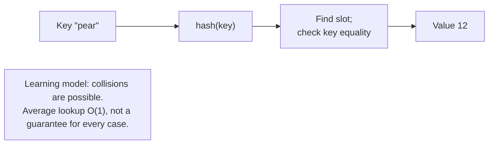

# Sets and dictionaries

## Sets and hashability

**Hashability** means that an object has a hash that stays unchanged throughout its lifetime and comparison behavior consistent with it: equal objects must have the same hash. This is required for dictionary keys and set elements. Numbers, strings, and tuples containing only hashable elements qualify; lists, dictionaries, and ordinary sets do not.

Create an empty set with `set()`: `{}` creates a dictionary. The `add` method adds an element; `discard` removes it if present and otherwise does nothing. `remove` raises `KeyError` if the element is absent. Do not use a set's `pop()` for random selection: it removes an arbitrary element but does not provide a uniform distribution.

```py
a = {"python", "music", "sport"}
b = {"python", "art"}
print(sorted(a & b))
print(sorted(a | b))
print(sorted(a - b))
print(sorted(a ^ b))
print({"python"} <= a, a.isdisjoint({"math"}))
```

```text
['python']
['art', 'music', 'python', 'sport']
['music', 'sport']
['art', 'music', 'sport']
True True
```

`&` forms the intersection, `|` the union, `-` the difference, and `^` the symmetric difference: elements in only one of the two sets. `a <= b` checks for a subset, including equality; `a < b` checks for a proper subset. `isdisjoint` checks that there are no common elements. Difference is not symmetric: `a - b` and `b - a` have different meanings.

The comprehension `{word.casefold() for word in words}` normalizes text and removes duplicates. It is suitable for case-insensitive tags, but not for data where case matters. `frozenset` is an immutable set. It can be a dictionary key, for example, for a pair of teams without a defined order. A set does not retain occurrence counts; use `Counter` for frequencies.

## Dictionaries: keys, values, and iteration

A key is unique: reassigning it replaces the value. In `dict[str, list[int]]`, the key is a string and the value is a list of integers. This is a natural model for a gradebook. A hash table helps find a key without scanning every pair sequentially (Fig. 5.4). Different keys can have identical hashes; the dictionary also checks equality.



Figure 5.4. A simplified model of dictionary lookup {.caption}

```py
scores: dict[str, list[int]] = {"Anna": [80, 90]}
scores.setdefault("Oleh", []).append(70)
print(scores.get("Ira", []))
print("Anna" in scores)
for name, marks in scores.items():
    print(name, marks)
```

```text
[]
True
Anna [80, 90]
Oleh [70]
```

`d[key]` raises `KeyError` if the key is absent. `get(key, default)` returns a fallback value without inserting anything. `setdefault` returns the existing value or inserts and returns the fallback. Its argument is evaluated on every call, even when the key already exists. Write `key in d` when you need to distinguish a missing key from `None`.

`keys()`, `values()`, and `items()` return **views** that reflect the dictionary's current state. They are not independent copies. `pop(key, default)` removes and returns the value, or returns the fallback. `update` modifies a dictionary, whereas `left | right` creates a new one: for a shared key, the right-hand value wins. This is a shallow merge; nested dictionaries are not merged recursively.

```py
settings = {"theme": "light", "size": 12}
merged = settings | {"size": 14}
settings.update({"theme": "dark"})
print(settings, merged)
lengths = {name: len(name) for name in ["Anna", "Oleh"]}
print(lengths)
```

Output: `{'theme': 'dark', 'size': 12}` and `{'theme': 'light', 'size': 14}` on the first line; `{'Anna': 4, 'Oleh': 4}` on the second. Updating a value does not move the key; deleting and reinserting it moves the key to the end. For a repeated key in a comprehension, the last value remains. For a reverse phone directory, first determine whether several people can share a number.

### Numbering, parallel iteration, and changes

`enumerate(values, start=1)` produces “number–element” pairs. `zip(a, b, strict=True)` combines corresponding elements and raises `ValueError` if the lengths differ. The check occurs during iteration: some pairs may already have been processed before the error. Without `strict=True`, iteration ends at the shortest source. `reversed(values)` iterates over a sequence in reverse order without creating a new list.

```py
names = ["Anna", "Oleh"]
marks = [90, 85]
for number, (name, mark) in enumerate(
    zip(names, marks, strict=True), start=1
):
    print(number, name, mark)
```

Output: `1 Anna 90` and `2 Oleh 85`. Unpacking the nested pair reflects the data structure created by the two functions. If the operation must be atomic, check the lengths or build all pairs first, and only then change the state.

Do not remove list elements while iterating forward over the list: after the shift, the next element may be skipped. Build a new list with `positive = [x for x in values if x > 0]`. Do not add or remove dictionary keys while iterating over its views. For removal, use a snapshot `list(d)` or collect the keys separately first. Changing values at existing keys does not change the dictionary's size, but it requires clear logic.
