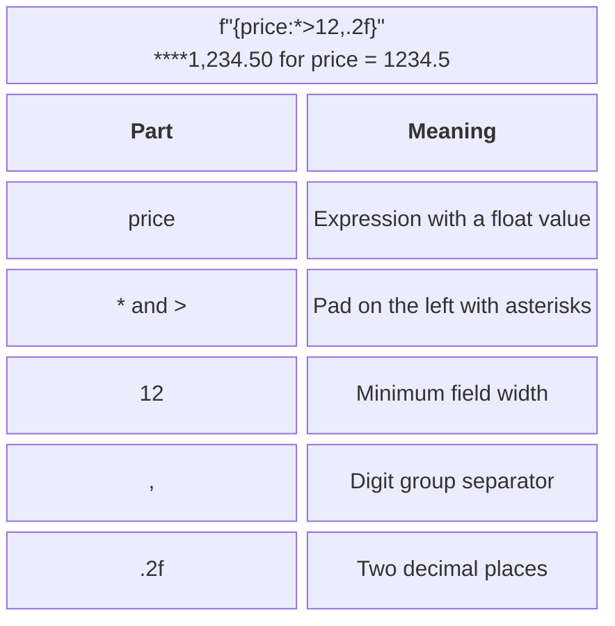
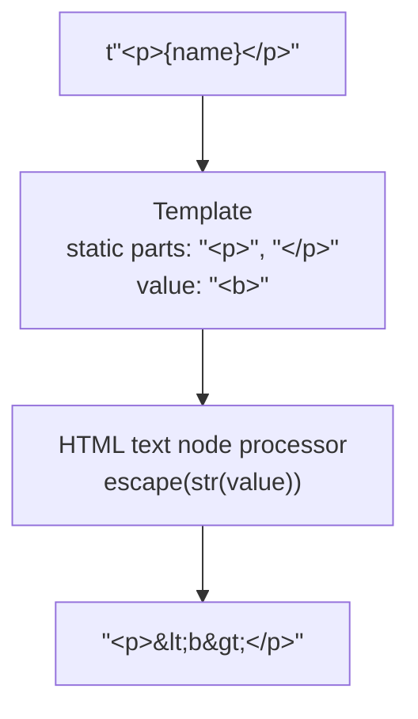

# f-strings and template strings

## Formatting with f-strings

A **formatted string literal**, or f-string, evaluates expressions in braces and immediately produces a `str`. `f"Total: {total:.2f}"` means to take `total` and display two decimal places. Double braces to include them in the resulting text: <code v-pre>&#123;&#123;</code> and `}}`. The format specification is described at <https://docs.python.org/3.14/library/string.html#format-specification-mini-language>.

### Width, alignment, and precision

The specification follows a colon. `<` aligns left, `>` right, and `^` centers. The preceding character specifies padding; width is a minimum, so longer text is not truncated. For the number `1234.5`, `f"{price:*>12,.2f}"` gives `****1,234.50` (Fig. 6.2). Do not add `!r` here: converting to a string before applying the numeric format `.2f` raises `ValueError`.



Figure 6.2. Parts of a numeric field's format specification {.caption}

```py
price = 1234.5
share = 0.125
width = 8
print(f"{price:*>12,.2f}")
print(f"{share:.1%}")
print(f"{255:08b} {255:04x}")
print(f"{'Code':^{width}}|")
```

Output:

```
****1,234.50
12.5%
11111111 00ff
  Code  |
```

The type `f` specifies a fixed number of decimal places, `e` specifies scientific notation, and `%` multiplies the value by 100 and adds a percent sign. The types `b` and `x` apply to integers. Commas and underscores group digits according to format rules, not the operating system's language. For Ukrainian display, you can define a separate rule replacing the decimal point with a comma. Do not make this replacement in a machine-readable file if its format requires a point.

Width fields can contain expressions, such as `{width}` in the example. However, width is not counted in pixels: emoji, combining characters, and some writing systems disrupt simple alignment in terminal tables. In these learning tables, we use short, ordinary names.

### Conversions and expressions

`!s` calls `str`, `!r` calls `repr`, and `!a` produces an ASCII representation through `ascii`. The notation `{value=}` adds the expression's text along with its value, which is useful for debugging. This does not replace structured logging: before printing, check whether the value contains a password or other data that should not be displayed.

```py
from datetime import date

word = " string\n"
amount = 7
print(f"{word!r}")
print(f"{amount=}")
print(f"{date(2026, 9, 17):%d.%m.%Y}")
item = {"name": "Notebook"}
print(f"Product: {item["name"]}")
```

Output: `' string\n'`, `amount=7`, `17.09.2026`, `Product: Notebook`. Reusing the same quote characters inside an expression is permitted by modern f-string syntax (PEP 701, starting with Python 3.12). For readability, it is better to move a complex calculation before the f-string, even when the grammar allows it inside a field.

The `str.format` method substitutes supplied arguments into template fields; the `%` operator appears in older code. The new examples in this topic use f-strings. Distinguish formatting a value from validating it: `.2f` does not check a range or eliminate binary arithmetic errors.

## Python 3.14 template strings

A **template string literal**, or t-string, has the prefix `t`. It creates a `string.templatelib.Template` object rather than a finished `str`. Description and examples: <https://docs.python.org/3.14/library/string.templatelib.html>. Its purpose is to preserve the boundary between the program's static text and values so that a separate processor can apply the required rules.

```py
name = "<b>Olia</b>"
template = t"Welcome, {name}!"
print(type(template).__name__)
print(template.strings)
field = template.interpolations[0]
print(field.value, field.expression)
print(field.conversion, repr(field.format_spec))
```

Output:

```
Template
('Welcome, ', '!')
<b>Olia</b> name
None ''
```

The `strings` tuple contains static fragments, while `interpolations` contains interpolation objects. There is one more static fragment than interpolation. `value` is evaluated when the t-string is created, so changing `name` later does not reevaluate the stored template. `expression` stores the expression text for diagnostics; it does not need to be executed with `eval`. The `conversion` and `format_spec` fields are data interpreted by the processor.

::: info Screenshot
Python 3.14 REPL: inspect template.strings and interpolations.
:::

Figure 6.3. Inspecting template string parts in the Python REPL {.caption}

### The processor's responsibilities

The `t` prefix alone does not guarantee escaping. The processor must define which static parts are allowed, where interpolations may appear, and which conversions are supported. In the HTML example below, interpolations are permitted only in element text, and markup is a trusted program literal (Fig. 6.4). URLs, JavaScript, CSS, and arbitrary attributes need different rules; a single `html.escape` is not universal protection for all these contexts.



Figure 6.4. Separating HTML structure from a text value {.caption}

The `string` module also contains a different `Template` class that uses `$name` placeholders. This is a long-established mechanism for substitution into an ordinary string; it is unrelated to the new `string.templatelib.Template` type. The `substitute` method reports a missing key, while `safe_substitute` leaves unresolved placeholders. “Safe” here does not mean HTML or SQL protection. Use an import alias to avoid confusing the classes.

```py
from string import Template as DollarTemplate

pattern = DollarTemplate("Welcome, $name! Price: $$10")
print(pattern.substitute(name="Olia"))
```

Output: `Welcome, Olia! Price: $10`.

### SQL parameters as a separate structure

Do not build SQL by inserting user values into an f-string. A learning t-string processor can return a “text with placeholders–values” pair. The program below does not execute anything in a database; it demonstrates a contract for a future driver call. For `sqlite3`, pass values as the second argument to `execute`. Table names, column names, and SQL operators are not such parameters.

```py
from string.templatelib import Template


def parameters(template: Template) -> tuple[str, list[object]]:
    values: list[object] = []
    pieces = [template.strings[0]]
    for index, field in enumerate(template.interpolations):
        if field.conversion or field.format_spec:
            raise ValueError("Formatting SQL values is prohibited")
        pieces.extend(("?", template.strings[index + 1]))
        values.append(field.value)
    return "".join(pieces), values


name = "O'Neil"
query, values = parameters(t"SELECT id FROM users WHERE name={name}")
print(query)
print(values)
```

Output: `SELECT id FROM users WHERE name=?`, followed by `["O'Neil"]`. In this narrow contract, an interpolation always occupies the position of one value and is not enclosed in SQL quotes; the program's author writes the static parts. The processor does not parse SQL, so it must not be applied to an arbitrary user-supplied template. Working with the driver will be covered in Topic 12.
