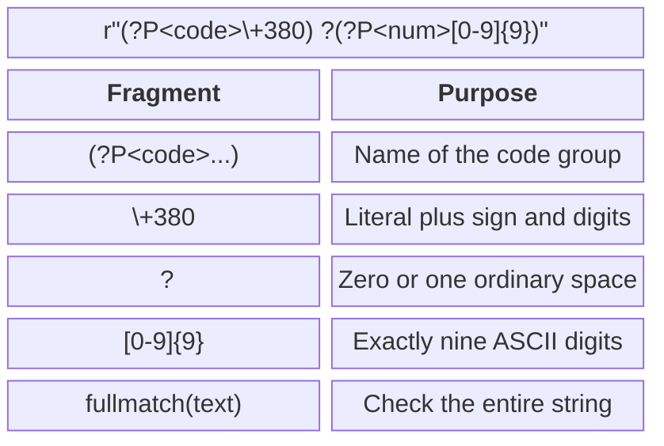

# Regular expressions

## Regular expression syntax

A **regular expression**, or regex, describes a set of strings by their structure. The `re` module is part of the standard library: <https://docs.python.org/3.14/library/re.html>. First, describe valid examples in words, then build the expression and test it on valid and invalid strings.

Ordinary letters match themselves. A dot matches any character except a newline by default; `\.` matches a literal dot. Square brackets specify one character from a set: `[0-9]`, `[ABC]`. The expression `[^0-9]` matches one character outside the set of ASCII digits. A hyphen inside a character class may specify a range, so escape a literal hyphen or place it at an edge.

### Classes, repetition, and alternatives

`\d` matches a Unicode decimal digit, `\w` a letter, digit, or underscore, and `\s` a whitespace character. These sets are broader than ASCII digits or an ordinary space. For a phone number written with digits 0–9, explicitly use `[0-9]`. For the Ukrainian alphabet, `[а-я]` is incomplete: “і”, “ї”, “є”, and “ґ” are also needed; the range also includes letters outside the Ukrainian alphabet. It is better to specify the exact alphabet explicitly or check against a set of allowed letters.

The quantifier `*` means zero or more repetitions, `+` one or more, `?` zero or one, and `{m,n}` from m to n inclusive. They apply to the preceding atom: a character, class, or group. `ab+` matches the letter `a` followed by one or more `b` characters; `(ab)+` repeats the pair. The alternative `cat|dog` selects one of two options.

The anchor `^` marks the start of the string, while `$` marks the end or the position before a final newline. For strict validation of the entire input, `fullmatch` is therefore more convenient than combining `match` with `$`. The word boundary `\b` is defined by the transition between `\w` and `\W`, not by a Ukrainian dictionary: an apostrophe may create a boundary within a word.

### Greedy and lazy repetition

Repetition is **greedy** by default: it tries to consume as much as possible while still allowing the rest of the expression to match. An additional `?` makes repetition lazy. Neither mode, however, turns regex into a complete parser for nested markup.

```py
import re

text = "<b>Olia</b><i>Ivan</i>"
print(re.findall(r"<.*>", text))
print(re.findall(r"<.*?>", text))
```

The first result is a list containing the entire string; the second is `['<b>', '</b>', '<i>', '</i>']`. Tags with quotes, nested elements, and malformed HTML require a specialized parser. This learning demonstration of quantifier differences is not an HTML converter.

## Groups, flags, and the Match object

Ordinary parentheses capture a fragment. A named group `(?P<name>...)` lets you access it by name; a noncapturing group `(?:...)` groups an expression without a separate result. Reuse previously matched text with a backreference such as `\1` or `(?P=name)`.

```py
import re

pattern = re.compile(r"(?P<code>\+380) ?(?P<num>[0-9]{9})")
match = pattern.fullmatch("+380 671234567")
if match is not None:
    print(match.group("code"), match.group("num"))
    print(match.span("num"))
print(pattern.fullmatch("+380 671234567\n") is None)
```

Output: `+380 671234567`, then `(5, 14)` and `True`. The `span` method returns a half-open interval: the start is included and the end excluded. `group(0)` contains the entire match, `groups()` a tuple of ordinary groups, and `groupdict()` a dictionary of named groups. Before accessing groups, check that the result is not `None`.



Figure 6.5. Components of an expression for a learning phone-number format {.caption}

### Lookahead and lookbehind

The assertions `(?=...)` and `(?!...)` require a fragment to be present or absent ahead without consuming it. For example, `(?=.*[0-9])` checks for a digit later on the same line. Similarly, `(?<=...)` and `(?<!...)` check preceding text. In the `re` module, a lookbehind pattern must have a fixed length: an arbitrary `(?<=a+)` is not allowed. For several validation rules, performing several clear checks and explaining each error is often more convenient than constructing one long expression.

`re.IGNORECASE` disables case sensitivity; `re.MULTILINE` changes `^` and `$` to mean line starts and ends. It does not let a dot match a newline; that requires `re.DOTALL`. `re.VERBOSE` lets you split an expression across lines and add comments; ordinary spaces outside character classes are then ignored. To require a space, use `[ ]` or escaping.

::: info Screenshot
Cursor in re.compile pattern, Alt+Enter, Check RegExp.
:::

Figure 6.6. Checking a learning regular expression in PyCharm {.caption}

## Searching, extracting, and transforming data

`re.match` checks the beginning of the text, `re.search` finds the first match anywhere, and `re.fullmatch` checks the entire text. `finditer` returns an iterator of `Match` objects, convenient for groups and positions. `findall` returns a list whose element shape depends on the number of capturing groups: the entire match, one group, or a tuple of groups.

```py
import re

text = "A12 B7 C305"
print(re.findall(r"[A-Z][0-9]+", text))
print(re.findall(r"([A-Z])([0-9]+)", text))
print(re.split(r"[;,]\s*", "one, two;three"))
```

Output:

```
['A12', 'B7', 'C305']
[('A', '12'), ('B', '7'), ('C', '305')]
['one', 'two', 'three']
```

If parentheses are needed only for an alternative, use `(?:...)` to avoid changing the `findall` result. In `re.split`, capturing groups add separators to the result, which is useful for a parser but may be surprising during simple text splitting.

### Replacing while preserving meaning

`re.sub` accepts a replacement string or a function that receives a `Match` and returns new text. A group reference in a Python replacement string takes the form `\g<name>` or `\g<1>`. Do not confuse it with the `$1` syntax in an editor's replacement dialog. A replacement function lets you convert a type, calculate a value, and check semantics.

```py
import re

def double(match: re.Match[str]) -> str:
    return str(int(match.group()) * 2)

print(re.sub(r"[0-9]+", double, "Cabinet 12, desk 3"))
print(re.sub(r"([A-Z])([0-9]+)", r"\g<2>-\g<1>", "A12"))
```

Output: `Cabinet 24, desk 6` and `12-A`. A date such as `31.02.2026` matches a simple digit pattern but does not exist in the calendar. After checking the form, call `datetime.date` and catch `ValueError`. Similarly, regex does not confirm that a mailbox exists or a phone number is available.

::: info Screenshot
Ctrl+R; enable Regex; search date groups; replacement `$3-$2-$1`.
:::

Figure 6.7. Previewing a date-format replacement in the editor {.caption}

In PyCharm, check one match first, then review all replacements, and only then apply them. The editor dialog may use a different regex engine from Python's `re`; the final program check is always performed by its interpreter. Help: <https://www.jetbrains.com/help/pycharm/regular-expressions.html>.
