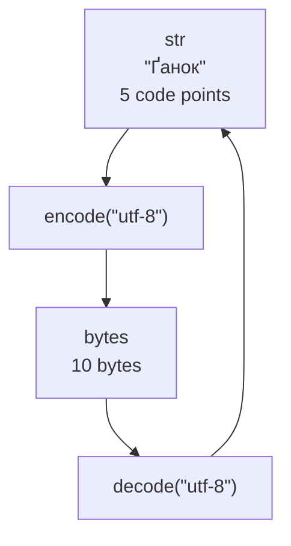

# Strings and Unicode

## Strings and Unicode code points

The `str` type represents a **string**: an immutable sequence of Unicode code points. A code point is a numeric designation of an element in the Unicode standard. It is not necessarily one visible character: a letter with a combining accent may consist of several code points. Consequently, `len(text)` does not measure screen width and does not always equal the number of visible characters.

The official description of string operations is at <https://docs.python.org/3.14/library/stdtypes.html#text-sequence-type-str>. Use single or double quotes for text. Triple quotes allow multiple lines; line breaks and indentation inside such a literal become part of its value.

```py
city = "Kryvyi Rih"
message = 'The word "Python" uses Latin letters.'
lines = "First line\nSecond line"
print(city[0], city[-1], len(city))
print(lines)
```

The program prints `K h 10`, followed by two separate lines. Indices start at zero; negative indices count from the end. Accessing `city[100]` raises `IndexError`. The slice `city[100:]` returns an empty string: slices allow bounds beyond the end of the sequence.

### Immutability and building a new string

Assignment such as `text[0] = "A"` is prohibited: strings are immutable. The methods `replace`, `upper`, and `strip` return a new value. If you need the result later, store it: `text = text.strip()`. Calling `text.strip()` without using the result does not clean the variable.

```py
text = "  Kyiv  "
clean = text.strip()
changed = "L" + clean[1:]
print(repr(text), repr(clean), changed)
parts = ["Python", "3.14", "and", "Unicode"]
print(" ".join(parts))
```

The first print produces `'  Kyiv  ' 'Kyiv' Lyiv`. The second joins the list elements into `Python 3.14 and Unicode`. Call `join` on the separator, with a sequence of strings as its argument. If the list contains a number, explicitly convert it using `str`. For many fragments, collecting them in a list and calling `join` once expresses the intent better than repeatedly adding to a string in a loop.

### Escape sequences and raw literals

The sequences `\n`, `\t`, and `\\` represent a newline, a tab, and a backslash. The `repr` function helps you see these characters as a literal rather than as terminal control characters. `ord("Ґ")` returns 1168, and `chr(1168)` returns the letter “Ґ”. `ord` accepts a string containing one code point.

A **raw string** with the `r` prefix is convenient for regular expressions: in `r"\d+"`, Python leaves the backslash for the `re` module. A raw literal cannot end with an odd number of backslashes before the closing quote. It also does not disable regular expression rules; it only changes how Python processes the literal itself.

## Text-processing methods

Start with the simplest operation that precisely meets the requirement. `startswith` is sufficient for a prefix, and `split(";")` for splitting on semicolons. A regular expression is useful when the structure includes repetition, alternatives, or several interrelated parts.

### Splitting and joining

`split()` without an argument groups runs of whitespace and leaves no empty elements at the beginning or end. In contrast, `split(" ")` handles each ordinary space separately. In a delimited table, an empty field may matter, so these calls are not interchangeable.

```py
print("  a   b\tc  ".split())
print("a;;c;".split(";"))
print("key=value=extra".split("=", maxsplit=1))
print("a\nb\n".splitlines())
```

Output:

```
['a', 'b', 'c']
['a', '', 'c', '']
['key', 'value=extra']
['a', 'b']
```

The `maxsplit` argument limits the number of splits. `rsplit` starts from the right, making it convenient for separating the last part. `partition("=")` always returns three strings: the part before the separator, the separator itself, and the remainder. If there is no separator, the last two strings are empty. This lets you check a format without accessing an unknown list index. `splitlines` recognizes line boundaries, including `\r\n`.

### Cleaning and replacing

`strip(chars)` removes any characters in the `chars` set from both ends, not a specified word. For example, `"abba".strip("ab")` produces an empty string. Use `removeprefix` for an exact prefix and `removesuffix` for a suffix. `lstrip` and `rstrip` operate on only one end; `replace(old, new, count)` replaces a substring.

```py
name = "report.txt"
print(name.removesuffix(".txt"))
key, separator, value = "mode = fast".partition("=")
if separator:
    print(key.strip(), value.strip())
text = "Kam'ianets, m’iata"
print(text.replace("'", "’"))
```

Output: `report`, then `mode fast`, then `Kam’ianets, m’iata`. Unifying apostrophes is a separate application rule. Unicode normalization is not required to convert a straight apostrophe to a typographic one. Do not unconditionally remove punctuation if it is meaningful in the data.

The methods `find` and `index` find a substring's position. Without a match, `find` returns −1, while `index` raises `ValueError`. The check `if text.find(word):` is incorrect: a match at position zero is false, while −1 is a true value. To check for presence, write `if word in text:`; for a position, compare the result with −1.

### Case and character properties

`upper`, `lower`, and `title` change case according to Unicode rules. `title` does not know the spelling rules for proper names: automatically processing full names this way may distort the expected spelling. Use `casefold` for case-insensitive comparison; it may change the number of code points: `"Straße".casefold()` produces `"strasse"`.

`isalpha` checks letters, `isdecimal` checks Unicode decimal digits, and `isdigit` covers a broader range of characters, including the superscript digit `²`. Thus, `"²".isdigit()` is true, but `int("²")` fails. None of these methods validates a complete negative or fractional number. Convert numeric input using `int` or `float`, catch the appropriate exceptions, and check the range.

To replace many individual characters, use `str.maketrans` and `translate`. The translation table maps code points, and a table value of `None` means deletion. This mechanism is convenient for a learning cipher or unifying punctuation; it does not replace context-dependent language rules for transliteration.

## Text, bytes, and normalization

The `bytes` type represents a sequence of bytes, not text. The method `encode("utf-8")` converts `str` to `bytes`, and `decode("utf-8")` performs the reverse conversion (Fig. 6.1). A byte has a value from 0 to 255; indexing `bytes` returns an integer. In UTF-8, a code point occupies one to four bytes.



Figure 6.1. Encoding text and decoding bytes {.caption}

```py
text = "Ґанок"
data = text.encode("utf-8")
print(len(text), len(data), data[0])
print(data.decode("utf-8"))
try:
    b"\xff".decode("utf-8")
except UnicodeDecodeError:
    print("The sequence is not valid UTF-8.")
```

Output: `5 10 210`, then `Ґанок` and the error message. The encoding must match the agreement between the source and recipient. `str(data)` shows a representation of the bytes object; it does not decode text. The modes `errors="ignore"` or `"replace"` may hide data loss; when validating an input document, it is better to keep strict mode and explain the error. Full description: <https://docs.python.org/3.14/howto/unicode.html>.

### Canonically equivalent forms

Text that looks identical may have different compositions. For example, “ї” can be represented by a precomposed code point or the letter “і” with a combining diacritical mark. The function `unicodedata.normalize` brings canonically equivalent forms to a common form: <https://docs.python.org/3.14/library/unicodedata.html>.

```py
import unicodedata

first = "ї"
second = "і\u0308"
print(first == second, len(first), len(second))
print(unicodedata.normalize("NFC", second) == first)
```

Output: `False 1 2` and `True`. NFC combines code points where a canonical composed form exists. Normalization does not turn Latin `a` into Cyrillic “а” or correct spelling. For a comparison key, you can apply `casefold` first and then NFC; preserve the original spelling separately for display to the user.
