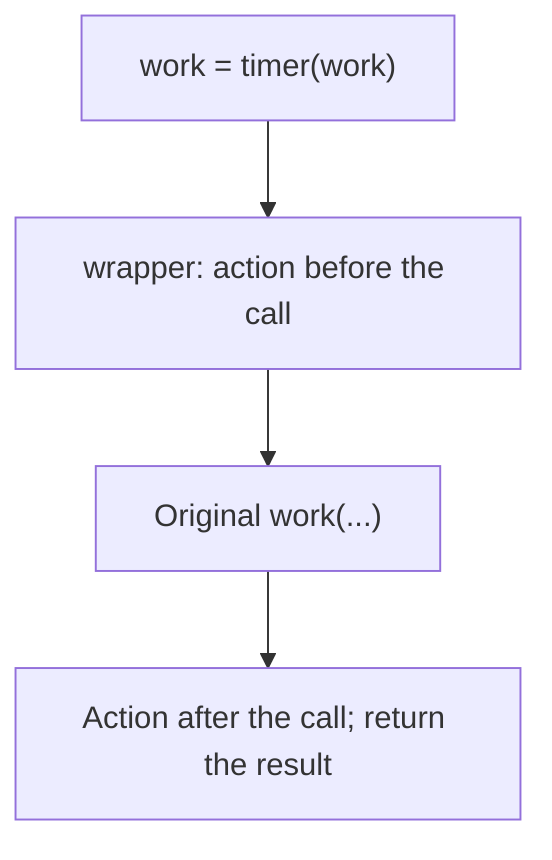

# Lambda expressions and decorators

## Lambda expressions and higher-order functions

`lambda parameters: expression` creates a function from a single expression. It is suitable for a short sorting key, but not for complex logic with many conditions. For repeated use, a named `def` with a docstring and annotations is better. Assigning a lambda to a variable usually makes diagnostics worse and conflicts with PEP 8 style: <https://peps.python.org/pep-0008/>.

`sorted(records, key=...)` calculates a key for each record. A tuple of keys defines the sequence of criteria. A minus sign before a numeric score lets you sort scores in descending order and names in ascending order. `itemgetter` returns a function that reads an item; similarly, `attrgetter` reads an object's attribute, which will become familiar after Topic 8. Reference: <https://docs.python.org/3.14/library/operator.html>.

### Example. Student ranking

```py
from functools import partial, reduce
from operator import add, itemgetter

students = [("Olena", 90), ("Ihor", 75), ("Anna", 90)]
ranked = sorted(students, key=lambda row: (-row[1], row[0]))
print(ranked)
scores = list(map(itemgetter(1), students))
passed = list(filter(lambda score: score >= 80, scores))
print(scores, passed)
print(reduce(add, scores, 0))
round_one = partial(round, ndigits=1)
print(list(map(round_one, [2.34, 5.67])))
```

```
[('Anna', 90), ('Olena', 90), ('Ihor', 75)]
[90, 75, 90] [90, 90]
255
[2.3, 5.7]
```

`map` and `filter` return lazy iterators. A comprehension is often easier to read: `[row[1] for row in students]` explicitly names the transformation. `reduce(add, scores, 0)` demonstrates a reduction, but `sum(scores)` is simpler for a sum. The initial value defines the result for an empty data set as well. `partial` fixes some arguments, creating a new callable object.

### Late binding in a loop

A closure reads a variable's value at call time rather than automatically copying it on each iteration. Thus, three functions referencing the same `i` may return the same final value. You can capture the current value with a default argument or a separate call to a function factory.

```py
wrong = [lambda: i for i in range(3)]
right = [lambda i=i: i for i in range(3)]
print([func() for func in wrong])
print([func() for func in right])
```

```
[2, 2, 2]
[0, 1, 2]
```

The first line deliberately demonstrates a mistake. Functions created with `def` in a loop can behave the same way: the cause is scope, not something uniquely “wrong” with lambdas.

## A decorator as a function wrapper

A **decorator** receives a function and returns an object that replaces it at the definition site. For an ordinary wrapper, this is another function. Writing `@timer` before `def work` corresponds to `work = timer(work)`. The decorator is applied once during definition, while the wrapper's body runs on every call (Fig. 7.5). <https://peps.python.org/pep-0318/>.



Figure 7.5. Replacing a function with a wrapper {.caption}

The wrapper must forward arguments, return the result, and avoid hiding unexpected errors. `functools.wraps` copies the name, documentation, and other metadata, while `__wrapped__` provides access to the original. Without this, logs and documentation may show `wrapper` for every distinct function.

For generic typing, we will use `ParamSpec`: it represents the original function's entire parameter list, while `TypeVar` represents the return type. This is a brief overview; detailed typing will be covered in Topic 16. The older factory-based syntax here explicitly shows the role of type parameters.

```py
from collections.abc import Callable
from functools import wraps
from typing import ParamSpec, TypeVar

P = ParamSpec("P")
R = TypeVar("R")


def announce(func: Callable[P, R]) -> Callable[P, R]:
    @wraps(func)
    def wrapper(*args: P.args, **kwargs: P.kwargs) -> R:
        print("Call:", func.__name__)
        return func(*args, **kwargs)
    return wrapper


@announce
def square(value: int) -> int:
    """The square of an integer."""
    return value * value


print(square(4), square.__name__)
```

```
Call: square
16 square
```

Metadata is not behavior: `wraps` does not check correct parameter forwarding. If the wrapper omits `return`, the caller receives `None`. If it calls `func` twice, the side effect doubles. In a test, check both the result and the number of actual calls.
