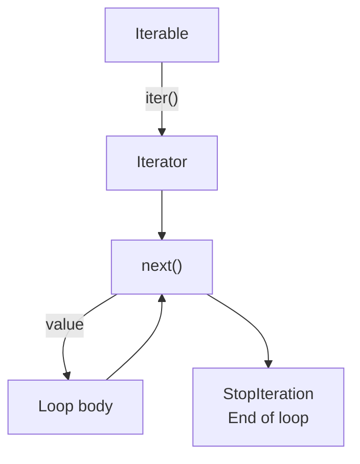
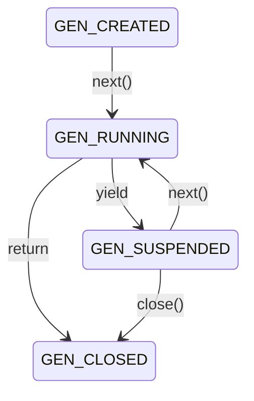

# Iterators and generator functions

## Iterables and iterators

An **iterable** can provide an iterator. An **iterator** remembers its traversal position and provides the next element. A list can be traversed again: each `iter(values)` creates a new traversal state. The iterator itself is usually single-use; `iter(iterator)` returns the iterator itself. Values may be created during traversal, so an iterator does not necessarily have a length or indexed access. <https://docs.python.org/3.14/glossary.html#term-iterator>.

```py
values = [10, 20]
iterator = iter(values)
print(next(iterator))
print(next(iterator))
print(next(iterator, "end"))
print(list(iterator))
print(list(values))
```

```
10
20
end
[]
[10, 20]
```

Without a second argument, the last `next` would raise `StopIteration`. This is the protocol's normal completion signal, not a data failure. A `for` loop obtains an iterator, repeatedly calls `next`, and ends at this signal (Fig. 7.1). Other exceptions are not hidden. We will implement a custom iterator class and the methods `__iter__` and `__next__` in Topic 10; for now, existing objects and generator functions are sufficient.



Figure 7.1. How a `for` loop obtains elements {.caption}

The form `iter(callable, sentinel)` calls a function without arguments until the result equals the sentinel value. The sentinel is not included in the sequence. For example, when reading lines, an empty string may indicate end-of-file. Choose a sentinel that cannot be confused with ordinary data. For manually ending console input, separately define whether an empty string is allowed as a value.

```py
source = iter(["12", "7", "STOP", "99"])
for text in iter(source.__next__, "STOP"):
    print(int(text) * 2)
print(next(source))
```

```
24
14
99
```

This is a finite demonstration of the sentinel form. If the source is exhausted before the sentinel, its `StopIteration` also ends traversal. This mechanism does not turn an arbitrary function into an infinite data source.

## Generator functions and `yield`

A function whose body contains `yield` is a **generator function**. Calling it creates a generator but does not yet execute the body. The first `next` starts execution; `yield` returns the next value and suspends the function. Local names and the resumption point are preserved until the next request. This differs fundamentally from returning a completed list.

```py
from collections.abc import Iterator
from inspect import getgeneratorstate


def countdown(start: int) -> Iterator[int]:
    if start < 0:
        raise ValueError("start must be nonnegative")
    while start > 0:
        yield start
        start -= 1


gen = countdown(2)
print(getgeneratorstate(gen))
print(next(gen))
print(getgeneratorstate(gen))
print(list(gen))
print(getgeneratorstate(gen))
```

```
GEN_CREATED
2
GEN_SUSPENDED
[1]
GEN_CLOSED
```

The annotation `Iterator[int]` describes a stream of integer values, not a list. An important detail: `start` is checked on first consumption. Merely creating `countdown(-1)` does not yet raise an exception. If validation must be immediate, an ordinary outer function validates the arguments and returns an inner generator.



Figure 7.2. Main generator states {.caption}

During execution, the state is `GEN_RUNNING`; external code usually observes a created, suspended, or closed generator. `return` in its body ends the sequence. Do not manually raise `StopIteration` in a generator: that exit becomes a `RuntimeError`. For normal completion, use `return` or reach the end of the body.

### An infinite generator: Fibonacci numbers

A generator may have no natural end. The consumer then becomes responsible for the limit: define an element count, time horizon, or stopping condition before running it. Do not convert an infinite generator to a list.

```py
from collections.abc import Iterator
from itertools import islice, takewhile


def fibonacci() -> Iterator[int]:
    a, b = 0, 1
    while True:
        yield a
        a, b = b, a + b


print(list(islice(fibonacci(), 8)))
print(list(takewhile(lambda x: x < 20, fibonacci())))
```

```
[0, 1, 1, 2, 3, 5, 8, 13]
[0, 1, 1, 2, 3, 5, 8, 13]
```

Both consumers receive separate generators. If they received the same object, the second would continue from its current position. `takewhile` also reads the first element that fails the condition but does not return it. Thus, after stopping, that element is no longer in the source. This matters if you need the rest of the stream afterward.

::: info Screenshot
Debug fibonacci consumed by islice; breakpoint at yield; show a,b and caller.
:::

Figure 7.3. Suspending a generator in the debugger {.caption}

### Delegation with `yield from`

`yield from source` passes values from another iterable to the consumer. This is a convenient way to combine several sources or recursively traverse nested data. For a simple stream, its effect corresponds to a loop with `yield`, but the full delegation protocol also passes `send`, `throw`, and `close` to the subgenerator.

```py
from collections.abc import Iterable, Iterator


def sections(groups: Iterable[Iterable[int]]) -> Iterator[int]:
    for group in groups:
        yield from group


print(list(sections([[1, 2], [], [3]])))
```

```
[1, 2, 3]
```

`send(value)` not only requests the next value but also passes a value as the result of the suspended `yield` expression. A new generator must first be started with `next` or `send(None)`. `close()` terminates the generator while executing `finally`; traversal cannot resume afterward. For ordinary stream processing, `next` and `for` are sufficient. Advanced coroutines are unnecessary where a simple loop clearly expresses the task.
