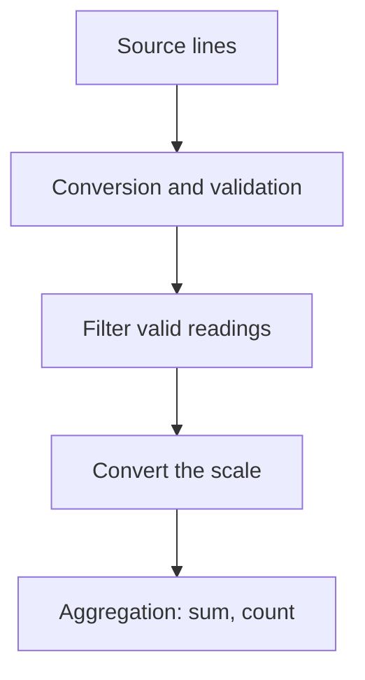

# Lazy evaluation and itertools

## Generator expressions and lazy evaluation

The expression `(transform(x) for x in data if condition(x))` creates a generator. A list comprehension with square brackets evaluates all elements immediately. Both forms have their purpose: a list supports repeated traversal and indexing, while a generator supports a single sequential pass without accumulating all results.

```py
values = [2, -1, 5, 0]
squares = (x * x for x in values if x > 0)
print(sum(squares))
print(sum(squares))
print(any(x < 0 for x in values))
print(all(x >= 0 for x in []))
print(max((x for x in values if x > 9), default=None))
```

```
29
0
True
True
None
```

The second sum is zero because the generator is already empty. It is not a cache of previous values. For two passes, create a new generator or explicitly materialize a list. `any` and `all` may stop before the end; the rest of the generator remains unread. `all` is true for an empty sequence, so checking that “all grades are valid” does not prove that any grades exist.

`sys.getsizeof` measures the size of a particular object, not all the memory of objects it references. A small generator size does not prove that the entire pipeline uses constant memory: it may retain a large original list, and `sorted` still accumulates data. Byte counts depend on the implementation and platform. A valid comparison accounts for the source, buffers, and materialization.

## Ready-made `itertools` building blocks

The `itertools` module provides iterators for common traversal patterns: <https://docs.python.org/3.14/library/itertools.html>. `count(start, step)` creates an arithmetic sequence, `cycle(values)` repeats values, and `repeat(value, times)` repeats one object. Without a count, `repeat` is infinite. `cycle` remembers the first traversal of the source, so it is not a memory-free tool for an infinite initial stream.

`islice` limits traversal; unlike a list slice, it consumes elements and does not support negative indices. `chain` joins sources sequentially, while `chain.from_iterable` accepts a stream of sources. `takewhile` takes an initial qualifying segment, and `dropwhile` skips an initial qualifying segment. After the first false condition, `dropwhile` stops checking it, so it is not a replacement for `filter`.

```py
from itertools import chain, count, cycle, dropwhile
from itertools import islice, repeat

print(list(islice(count(3, 2), 4)))
print(list(islice(cycle("AB"), 5)))
print(list(chain(repeat(0, 2), [1, 2])))
print(list(dropwhile(lambda x: x < 3, [1, 2, 4, 1])))
```

```
[3, 5, 7, 9]
['A', 'B', 'A', 'B', 'A']
[0, 0, 1, 2]
[4, 1]
```

### Neighbors, batches, and accumulation

`pairwise` forms adjacent pairs, so `n` elements produce `max(n - 1, 0)` pairs. This suits temperature changes, time intervals, and route segment lengths. `batched(data, n)` yields tuples of up to `n` elements; the last may be shorter. Python 3.14 supports `strict=True`: an incomplete final batch raises `ValueError` during consumption. The batch size must be positive.

```py
from itertools import accumulate, batched, pairwise

print(list(pairwise([4, 7, 6])))
print(list(batched(range(5), 2)))
print(list(accumulate([5, -2, 4], initial=10)))
```

```
[(4, 7), (7, 6)]
[(0, 1), (2, 3), (4,)]
[10, 15, 13, 17]
```

By default, `accumulate` yields running sums. The `initial` value is also included, making the result one element longer. A different function can calculate a running maximum or product. Do not confuse this with `reduce`, which returns only the final accumulated value.

### Grouping adjacent elements

`groupby` combines **adjacent** equal keys. To group by city regardless of input order, sort by city first. For runs of identical states, however, sorting would destroy chronological order, so group the original stream without sorting. Each group is an iterator sharing the outer source; process it before advancing to the next group or store the values you need.

```py
from itertools import groupby

words = ["A", "B", "A", "A"]
print([(key, len(list(group)))
       for key, group in groupby(words)])
print([(key, len(list(group)))
       for key, group in groupby(sorted(words))])
```

```
[('A', 1), ('B', 1), ('A', 2)]
[('A', 3), ('B', 1)]
```

### Combinatoric iterators

`product` corresponds to nested loops, `permutations` accounts for the order of selected positions, and `combinations` does not. Elements are considered distinct by position, so repeated input values may produce identical result tuples. For unique combinations of values, first define the rules for removing duplicates.

```py
from itertools import combinations, permutations, product

print(list(product("AB", repeat=2)))
print(list(permutations("AB", 2)))
print(list(combinations("ABC", 2)))
```

```
[('A', 'A'), ('A', 'B'), ('B', 'A'), ('B', 'B')]
[('A', 'B'), ('B', 'A')]
[('A', 'B'), ('A', 'C'), ('B', 'C')]
```

Lazy output does not make exponential enumeration cheap. Even without storing results, their number may be enormous. Before running, limit the alphabet, length, and number of displayed results; generating sample PINs in the lab must not access a real authentication system.

## A pipeline: temperature log

Data passes through reading, validation, filtering, transformation, and aggregation stages (Fig. 7.4). Each stage has its own contract: what value it receives, what it returns, and how it handles errors. Discarding invalid records without counting them may hide source corruption; in this example, a format error is explicit.



Figure 7.4. Stream processing one record at a time {.caption}

```py
from collections.abc import Iterable, Iterator
from itertools import groupby, pairwise
from math import isfinite
from operator import itemgetter


def parse(lines: Iterable[str]) -> Iterator[tuple[str, float]]:
    for line in lines:
        city, text = line.split(";")
        value = float(text)
        if not city or not isfinite(value):
            raise ValueError("Invalid reading")
        yield city, value


lines = ["Madrid;50", "London;32", "Madrid;68", "London;50"]
valid = ((city, f) for city, f in parse(lines) if -40 <= f <= 140)
celsius = ((city, (f - 32) * 5 / 9) for city, f in valid)
ordered = sorted(celsius, key=itemgetter(0))
for city, group in groupby(ordered, key=itemgetter(0)):
    values = [value for _, value in group]
    changes = [round(b - a, 1) for a, b in pairwise(values)]
    print(city, f"{sum(values) / len(values):.1f}", changes)
```

```
London 5.0 [10.0]
Madrid 15.0 [10.0]
```

The input numbers are degrees Fahrenheit, and the result is Celsius. Sorting is stable, so each city's measurement order is preserved. In this example, `sorted` deliberately materializes the entire data set: do not call the whole algorithm a constant-memory streaming algorithm. For a truly large source, you can require prior ordering or maintain a dictionary of accumulations whose memory depends on the number of cities.
