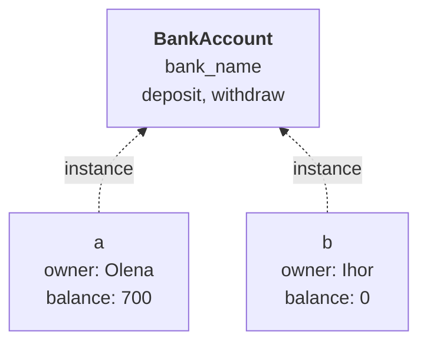
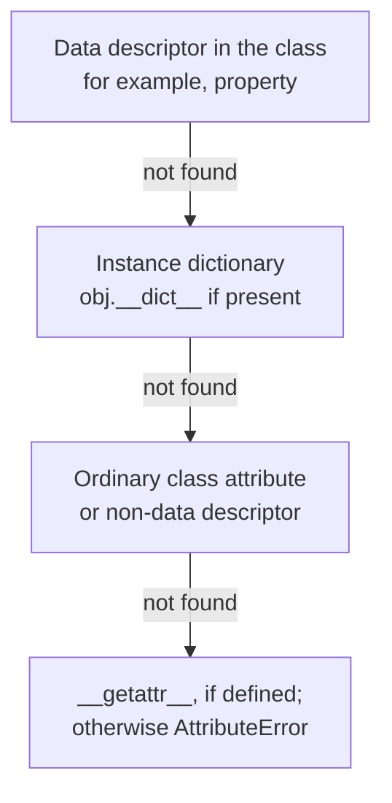

# Classes, initialization, and attributes

## Objects and classes

An **object** has identity, state, and available behavior. A **class** defines an object type and shared rules. An **instance** is a particular object of that class. Two accounts have the same methods but their own owners and balances (Fig. 8.1). In Python, the class itself is also an object: you can pass it to a function, store it in a collection, and inspect it at runtime. Numbers, strings, functions, and modules are also objects. <https://docs.python.org/3.14/tutorial/classes.html>.



Figure 8.1. One class and independent instances {.caption}

**State** is stored in attributes. A **method** is a function accessible through a class or instance. Not every attribute necessarily stores a ready-made value: a property may calculate its result when read. For a class user, the public contract matters, not the particular field storing the information.

An **invariant** is a condition that must hold for every valid state: a balance is nonnegative, a side length is positive, a temperature is not below absolute zero. Validate both the initial state and every modifying operation. If an operation is rejected, preserve the previous valid state whenever possible.

## Class definition and initialization

The `class` statement executes the body and creates a class object. Calling `Point(2, 3)` creates an instance. `__new__` handles creation, while `__init__` initializes the object already created. An ordinary introductory class does not need to override `__new__`. `__init__` must return `None`, not the instance itself.

```py
class Point:
    def __init__(self, x: float, y: float) -> None:
        self.x = x
        self.y = y

    def move(self, dx: float, dy: float) -> None:
        self.x += dx
        self.y += dy


point = Point(2.0, 3.0)
point.move(1.0, -2.0)
print(point.x, point.y)
Point.move(point, 2.0, 0.0)
print(point.x, point.y)
```

```
3.0 1.0
5.0 1.0
```

`self` is a parameter referencing a particular instance. The name is a convention, but you should follow it. In `point.move(...)`, Python passes the instance automatically, so the caller does not write it again. In `Point.move(point, ...)`, the same argument is explicit. `x = x` in a constructor would merely reassign the local parameter; you need `self.x = x`.

A method obtained through an instance is a **bound method**: it remembers both the function and the object. You can pass it to another function as a callback. However, this reference also keeps the instance alive; storing many such objects may extend the lifetime of their state.

### Annotations and initial state

An attribute annotation helps the reader and analyzer but does not create a value. Writing `name: str` without assignment does not guarantee that `obj.name` is accessible. Set all required attributes in the constructor. For a missing value, use an explicit type such as `str | None` if the contract allows it.

Do not call `input` in a model constructor. Otherwise, creating an object from a test or file would also require keyboard input. The interface reads data, passes it to the class, and catches expected errors. The model validates the meaning and raises `ValueError` with a clear explanation without deciding how to show it to the user.

## Class and instance attributes

Assignment in a class body creates a class attribute. Under ordinary behavior, assignment to `self.name` creates an instance attribute. For ordinary attributes without descriptors, the instance value shadows the class attribute but does not change it for other instances.

```py
class Sensor:
    unit = "C"

    def __init__(self, value: float) -> None:
        self.value = value


a = Sensor(12.0)
b = Sensor(15.0)
a.unit = "F"
print(a.unit, b.unit, Sensor.unit)
print(vars(a))
```

```
F C C
{'value': 12.0, 'unit': 'F'}
```

If a class attribute contains a mutable list, calling `append` changes the shared object itself. This differs from assigning a new value. Lists of items, grades, or events should usually be separate for each instance and created in `__init__`.

```py
class Team:
    def __init__(self, name: str) -> None:
        self.name = name
        self.players: list[str] = []


a = Team("A")
b = Team("B")
a.players.append("Olena")
print(a.players, b.players)
```

```
['Olena'] []
```

`__dict__` and `vars(obj)` show an ordinary instance's attribute dictionary. `getattr(obj, name, default)` reads an attribute by its string name; `setattr` writes, and `hasattr` checks availability. These tools use the ordinary access mechanism, so a property may run code. `hasattr` hides `AttributeError`, not every exception, and is not a universal side-effect-free check.

### The actual lookup order

The simplification “first the object's dictionary, then the class” applies only to ordinary attributes. Properties are **data descriptors** and take precedence over the instance dictionary. Figure 8.2 shows the main stages of standard access; lookup in base classes will be clarified in Topic 9. <https://docs.python.org/3.14/howto/descriptor.html>.



Figure 8.2. Priorities in standard attribute reading {.caption}

Similarly, `obj.x = value` does not always write directly to `__dict__`: it may call a property setter or slot descriptor. A class can override the access mechanism, but that is unnecessary for this topic. Start with ordinary attributes and `property` until there is a specific need for more complex behavior.

### Restricting attributes with `__slots__`

`__slots__` lets you specify a set of attributes and avoid creating an ordinary `__dict__` for a simple class. This may reduce memory use and catch accidental typos in names. However, it is neither a privacy mechanism nor automatic type checking. Inheritance with slots has additional rules.

```py
class Pixel:
    __slots__ = ("x", "y")

    def __init__(self, x: int, y: int) -> None:
        self.x = x
        self.y = y


pixel = Pixel(1, 2)
try:
    pixel.color = "black"
except AttributeError:
    print("Arbitrary attributes are prohibited")
print(hasattr(pixel, "__dict__"))
```

```
Arbitrary attributes are prohibited
False
```

Do not add slots to every introductory class without a need: an ordinary dictionary is clearer for learning state and properties. Data model reference: <https://docs.python.org/3.14/reference/datamodel.html>.
