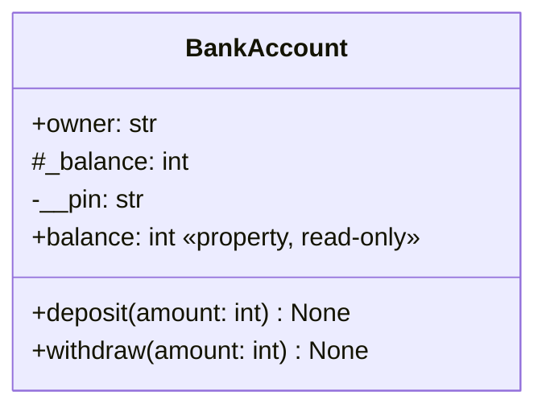

# Encapsulation and properties

## Encapsulation and the public interface

**Encapsulation** organizes access to state through consistent operations. In Python, a name without an underscore is usually public, while `_balance` denotes an internal detail by convention. A double leading underscore, as in `__pin`, triggers **name mangling**, producing a name such as `_BankAccount__pin`. This reduces accidental conflicts in subclasses but does not protect a secret from being read.

Do not confuse these names with special names such as `__init__` or `__repr__`, which have two underscores at both ends. There is no need to invent your own special names. Do not call `_x` a “protected field” in the sense of a language-enforced restriction: external code can technically change it, but doing so violates the agreed interface.

### Example 1. A sample account

The balance is stored in integer kopiykas. Deposits and withdrawals must be positive, and withdrawals must not exceed the balance. The PIN only demonstrates name mangling here; this is not an implementation of bank authentication. Do not store real secrets in learning code.

```py
class BankAccount:
    bank_name = "Sample bank"

    def __init__(self, owner: str, pin: str) -> None:
        if not owner.strip() or not (len(pin) == 4
                and pin.isascii() and pin.isdecimal()):
            raise ValueError("An owner and a 4-digit PIN are required")
        self.owner = owner.strip()
        self.__pin = pin
        self._balance = 0

    @property
    def balance(self) -> int:
        return self._balance

    def deposit(self, amount: int) -> None:
        if type(amount) is not int or amount <= 0:
            raise ValueError("The amount must be a positive integer")
        self._balance += amount

    def withdraw(self, amount: int) -> None:
        if type(amount) is not int or not 0 < amount <= self.balance:
            raise ValueError("Invalid withdrawal amount")
        self._balance -= amount

    def __repr__(self) -> str:
        return f"BankAccount({self.owner!r}, balance={self.balance})"


account = BankAccount("Olena", "1234")
account.deposit(1000)
account.withdraw(300)
print(account)
try:
    account.withdraw(800)
except ValueError:
    print("Rejected; balance:", account.balance)
```

```
BankAccount('Olena', balance=700)
Rejected; balance: 700
```

Validation occurs before the state changes. Here, `type(amount) is int` deliberately rejects `bool`, a subtype of `int`, because `True` should not represent a payment amount. This is a local requirement of the monetary contract, not a rule to use exact type checks everywhere. The balance is read through a property without a setter.



Figure 8.3. The contract of a sample account class {.caption}

In UML, the top compartment contains the class name, the middle contains attributes, and the bottom contains operations. The symbols `+`, `#`, and `-` in this learning diagram represent the public interface and Python's internal-access conventions, not additional interpreter checks. A UML class diagram is required for the lab report.

## Properties: reading, writing, and deleting

`@property` exposes a computation as an attribute: `obj.balance`, not `obj.balance()`. A setter defined with `@name.setter` validates a new value. Inside it, store data under a different name, such as `_celsius`. Assigning `self.celsius = value` in the `celsius` setter calls the same setter again and causes infinite recursion. <https://docs.python.org/3.14/library/functions.html#property>.

### Example 2. Thermometer

```py
from math import isfinite


class Thermometer:
    minimum = -273.15

    def __init__(self, celsius: float) -> None:
        self.celsius = celsius

    @property
    def celsius(self) -> float:
        return self._celsius

    @celsius.setter
    def celsius(self, value: float) -> None:
        if not isfinite(value) or value < self.minimum:
            raise ValueError("Temperature below the allowed minimum")
        self._celsius = value

    @property
    def fahrenheit(self) -> float:
        return self.celsius * 9 / 5 + 32


sensor = Thermometer(0.0)
print(sensor.fahrenheit)
sensor.celsius = 100.0
print(sensor.fahrenheit)
try:
    sensor.celsius = -300.0
except ValueError:
    print("Preserved:", sensor.celsius)
```

```
32.0
212.0
Preserved: 100.0
```

The constructor uses the same setter, avoiding two different validation rules. The computed scale is not stored separately, so it cannot fall out of sync with the primary value. An exception during a change does not destroy the last valid reading.

The decorator `@name.deleter` defines the behavior of `del obj.name`. It is needed only when deletion has a clear meaning, such as resetting an optional note. Deleting a balance or rectangle side would violate the invariant, so it is better not to allow it. A property may be read-only without making the entire object immutable.

### Cached properties

`functools.cached_property` calculates a value on the first read and stores it in the instance dictionary. Subsequent reads use the stored value. If the source data changes, the cache may become stale; deleting the attribute forces recalculation. An ordinary `property` calculates on every read.

```py
from functools import cached_property


class Sample:
    def __init__(self, values: tuple[int, ...]) -> None:
        if not values:
            raise ValueError("A nonempty sample is required")
        self._values = values

    @cached_property
    def total(self) -> int:
        print("Calculating")
        return sum(self._values)


sample = Sample((2, 3, 5))
print(sample.total)
print(sample.total)
del sample.total
print(sample.total)
```

```
Calculating
10
10
Calculating
10
```

This mechanism requires an accessible, mutable `__dict__`; it will not work with a simple slots-only class. Do not add caching to an inexpensive multiplication of two numbers: the complexity of maintaining valid state may outweigh the benefit.
